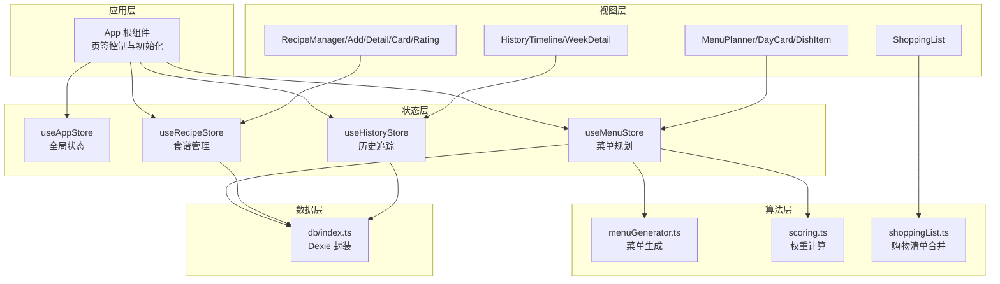
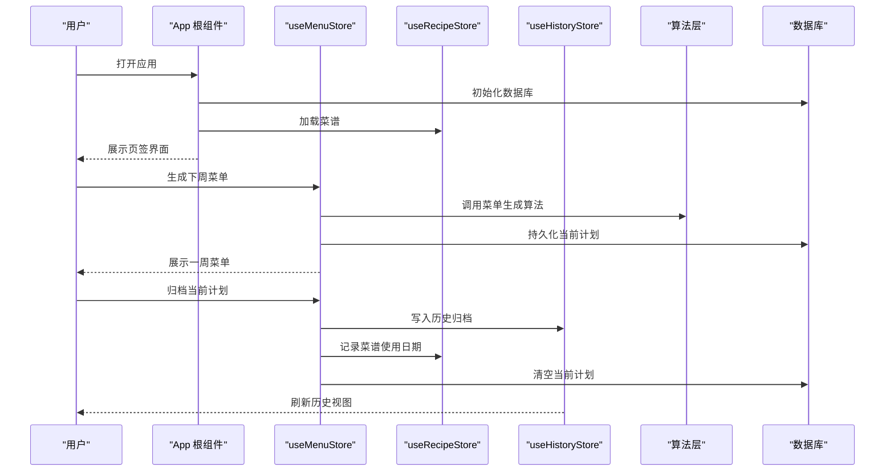
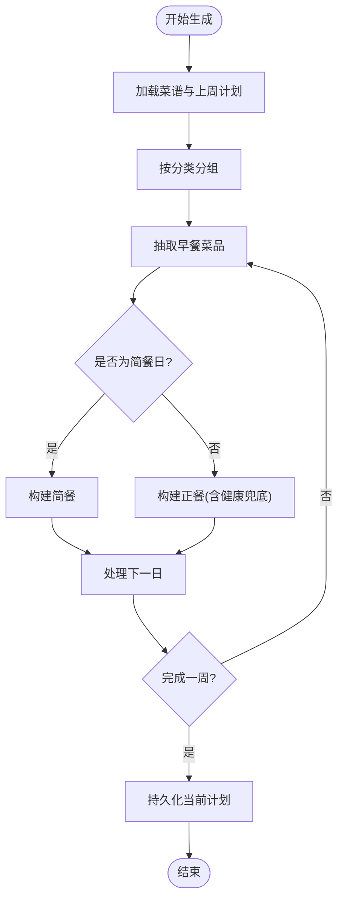
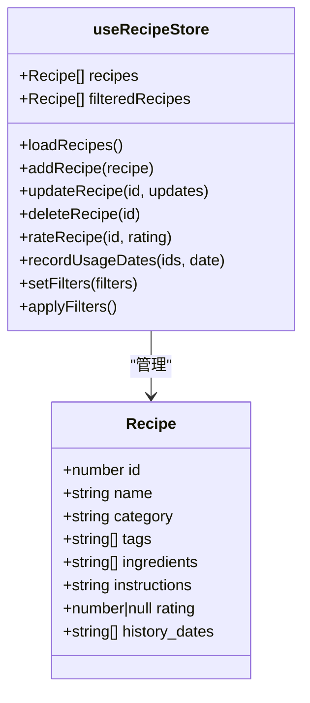
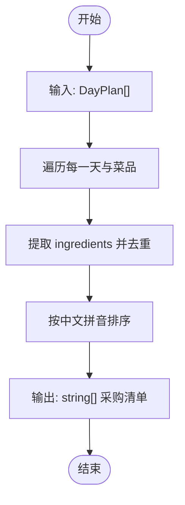
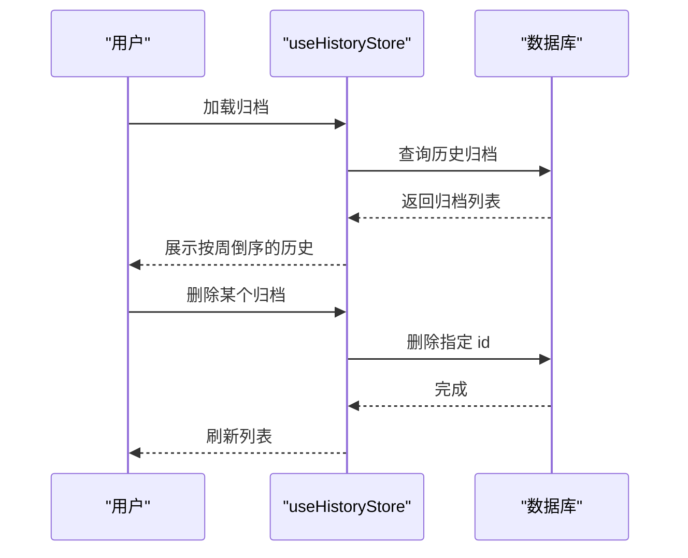

# 功能模块

<cite>
**本文引用的文件**
- [src/App.tsx](file://src/App.tsx)
- [src/main.tsx](file://src/main.tsx)
- [src/db/index.ts](file://src/db/index.ts)
- [src/config/constants.ts](file://src/config/constants.ts)
- [src/types/recipe.ts](file://src/types/recipe.ts)
- [src/types/menu.ts](file://src/types/menu.ts)
- [src/types/history.ts](file://src/types/history.ts)
- [src/store/useAppStore.ts](file://src/store/useAppStore.ts)
- [src/store/useRecipeStore.ts](file://src/store/useRecipeStore.ts)
- [src/store/useMenuStore.ts](file://src/store/useMenuStore.ts)
- [src/store/useHistoryStore.ts](file://src/store/useHistoryStore.ts)
- [src/algorithms/menuGenerator.ts](file://src/algorithms/menuGenerator.ts)
- [src/algorithms/scoring.ts](file://src/algorithms/scoring.ts)
- [src/algorithms/shoppingList.ts](file://src/algorithms/shoppingList.ts)
- [src/components/Menu/MenuPlanner.tsx](file://src/components/Menu/MenuPlanner.tsx)
- [src/components/Menu/DayCard.tsx](file://src/components/Menu/DayCard.tsx)
- [src/components/Menu/DishItem.tsx](file://src/components/Menu/DishItem.tsx)
- [src/components/Menu/SeasonToggle.tsx](file://src/components/Menu/SeasonToggle.tsx)
- [src/components/Recipe/RecipeManager.tsx](file://src/components/Recipe/RecipeManager.tsx)
- [src/components/Recipe/AddRecipeDialog.tsx](file://src/components/Recipe/AddRecipeDialog.tsx)
- [src/components/Recipe/RecipeDetailDialog.tsx](file://src/components/Recipe/RecipeDetailDialog.tsx)
- [src/components/Recipe/RecipeCard.tsx](file://src/components/Recipe/RecipeCard.tsx)
- [src/components/Recipe/RatingWidget.tsx](file://src/components/Recipe/RatingWidget.tsx)
- [src/components/Shopping/ShoppingList.tsx](file://src/components/Shopping/ShoppingList.tsx)
- [src/components/History/HistoryTimeline.tsx](file://src/components/History/HistoryTimeline.tsx)
- [src/components/History/WeekDetail.tsx](file://src/components/History/WeekDetail.tsx)
- [src/utils/date.ts](file://src/utils/date.ts)
</cite>

## 目录
1. [简介](#简介)
2. [项目结构](#项目结构)
3. [核心组件](#核心组件)
4. [架构总览](#架构总览)
5. [详细组件分析](#详细组件分析)
6. [依赖分析](#依赖分析)
7. [性能考虑](#性能考虑)
8. [故障排除指南](#故障排除指南)
9. [结论](#结论)
10. [附录](#附录)

## 简介
本文件面向 Memu 的核心功能模块，系统性梳理菜单规划系统、食谱管理系统、购物清单系统与历史追踪系统的实现。内容涵盖业务逻辑、用户交互流程、数据模型设计、状态管理策略、模块间集成关系、API 接口规范与扩展点，并提供使用示例、配置选项与故障排除建议。

## 项目结构
- 应用入口与路由：应用通过根组件组织四大功能页签（本周排餐、采购清单、菜谱管理、历史记录），并在启动时完成数据库初始化与菜谱加载。
- 状态管理：采用轻量状态库进行模块化状态管理，分别维护应用全局状态、菜单计划、食谱集合与历史归档。
- 数据层：基于 IndexedDB 的本地数据库封装，提供离线可用的数据持久化能力。
- 算法层：菜单生成、权重打分与购物清单合并等核心算法独立实现，确保可测试与可演进。
- 视图层：各模块组件负责用户交互与展示，通过状态容器暴露的动作完成业务操作。



图表来源
- [src/App.tsx:11-83](file://src/App.tsx#L11-L83)
- [src/store/useAppStore.ts](file://src/store/useAppStore.ts)
- [src/store/useMenuStore.ts:127-292](file://src/store/useMenuStore.ts#L127-L292)
- [src/store/useRecipeStore.ts:49-121](file://src/store/useRecipeStore.ts#L49-L121)
- [src/store/useHistoryStore.ts:17-46](file://src/store/useHistoryStore.ts#L17-L46)
- [src/algorithms/menuGenerator.ts:128-226](file://src/algorithms/menuGenerator.ts#L128-L226)
- [src/algorithms/scoring.ts:14-63](file://src/algorithms/scoring.ts#L14-L63)
- [src/algorithms/shoppingList.ts:11-31](file://src/algorithms/shoppingList.ts#L11-L31)
- [src/db/index.ts:7-34](file://src/db/index.ts#L7-L34)

章节来源
- [src/App.tsx:11-83](file://src/App.tsx#L11-L83)
- [src/main.tsx:1-11](file://src/main.tsx#L1-L11)

## 核心组件
- 菜单规划系统：负责生成与维护一周菜单，支持换菜、移除菜品、保存与归档；与算法层协作完成权重抽取与健康兜底。
- 食谱管理系统：提供菜谱增删改查、评分、使用日期记录与过滤搜索；与历史追踪联动更新使用历史。
- 购物清单系统：根据选中的天数合并提取食材并去重排序，输出采购清单。
- 历史追踪系统：归档上周菜单、查询最近归档、删除归档并刷新历史视图；与菜单归档流程协同更新菜谱使用日期。

章节来源
- [src/store/useMenuStore.ts:127-292](file://src/store/useMenuStore.ts#L127-L292)
- [src/store/useRecipeStore.ts:49-121](file://src/store/useRecipeStore.ts#L49-L121)
- [src/algorithms/shoppingList.ts:11-31](file://src/algorithms/shoppingList.ts#L11-L31)
- [src/store/useHistoryStore.ts:17-46](file://src/store/useHistoryStore.ts#L17-L46)

## 架构总览
- 初始化流程：应用启动时初始化数据库并加载菜谱，随后进入主界面。
- 交互流程：用户在菜单页签生成菜单，编辑后可保存或归档；在菜谱页签管理菜谱；在历史页签查看归档；在购物页签生成采购清单。
- 数据流：状态容器驱动 UI 更新，算法层提供决策依据，数据层负责持久化。



图表来源
- [src/App.tsx:15-22](file://src/App.tsx#L15-L22)
- [src/store/useMenuStore.ts:131-152](file://src/store/useMenuStore.ts#L131-L152)
- [src/store/useMenuStore.ts:250-290](file://src/store/useMenuStore.ts#L250-L290)
- [src/store/useRecipeStore.ts:92-107](file://src/store/useRecipeStore.ts#L92-L107)
- [src/store/useHistoryStore.ts:21-26](file://src/store/useHistoryStore.ts#L21-L26)

## 详细组件分析

### 菜单规划系统
- 业务逻辑
  - 生成算法：按周工作日拆分，早餐包含干食、成人稀食、儿童稀食；晚餐按“简餐”或“正餐”两类构建，遵循季节配置与标签约束。
  - 权重抽取：综合评分、新鲜度（跨周降权）、季节匹配与标签偏好，支持兜底放宽策略。
  - 健康兜底：若正餐缺少“适宜老人”标签，自动替换第一道荤菜。
  - 换菜与移除：按槽位或角色定位目标菜品，从候选池中均匀随机挑选未使用的菜品替换。
  - 归档流程：将当前计划写入历史归档，记录菜谱使用日期，清空当前计划并刷新历史视图。
- 用户交互
  - 生成按钮触发算法执行；每日卡片支持换菜与移除；归档按钮完成保存与清理。
- 数据模型
  - 菜谱、菜单计划、每日计划、菜品角色与类型、季节模式。
- 状态管理
  - 维护当前计划、生成状态；与应用全局状态（季节）与历史状态（上周计划）协作。



图表来源
- [src/algorithms/menuGenerator.ts:128-226](file://src/algorithms/menuGenerator.ts#L128-L226)
- [src/algorithms/menuGenerator.ts:232-336](file://src/algorithms/menuGenerator.ts#L232-L336)
- [src/algorithms/menuGenerator.ts:341-367](file://src/algorithms/menuGenerator.ts#L341-L367)
- [src/store/useMenuStore.ts:131-152](file://src/store/useMenuStore.ts#L131-L152)

章节来源
- [src/store/useMenuStore.ts:127-292](file://src/store/useMenuStore.ts#L127-L292)
- [src/algorithms/menuGenerator.ts:128-368](file://src/algorithms/menuGenerator.ts#L128-L368)
- [src/algorithms/scoring.ts:14-63](file://src/algorithms/scoring.ts#L14-L63)
- [src/types/menu.ts:1-45](file://src/types/menu.ts#L1-L45)
- [src/types/recipe.ts:1-21](file://src/types/recipe.ts#L1-L21)

### 食谱管理系统
- 业务逻辑
  - 增删改查：提供新增、更新、删除与加载接口。
  - 评分机制：仅当菜谱有使用历史时允许评分，评分写回并刷新视图。
  - 使用日期记录：批量事务更新菜谱的历史食用日期。
  - 过滤与搜索：支持分类、标签与关键词过滤。
- 用户交互
  - 在菜谱管理页签中添加、编辑、删除、评分与筛选菜谱。
- 数据模型
  - 菜谱实体包含名称、分类、标签、食材、做法、评分与历史日期数组。
- 状态管理
  - 维护菜谱列表、过滤器与过滤后的结果集。



图表来源
- [src/types/recipe.ts:11-21](file://src/types/recipe.ts#L11-L21)
- [src/store/useRecipeStore.ts:49-121](file://src/store/useRecipeStore.ts#L49-L121)

章节来源
- [src/store/useRecipeStore.ts:49-121](file://src/store/useRecipeStore.ts#L49-L121)
- [src/types/recipe.ts:1-21](file://src/types/recipe.ts#L1-L21)

### 购物清单系统
- 业务逻辑
  - 输入：选中的若干天计划。
  - 处理：收集每天所有菜品的食材，去重并按中文拼音排序。
  - 输出：可用于打印或移动设备的采购清单。
- 用户交互
  - 在菜单页签选择需要的天数，系统自动生成并展示购物清单。
- 数据模型
  - 依赖菜单计划与菜谱实体的食材字段。
- 状态管理
  - 通过算法层函数直接消费菜单计划数据，无需额外状态。



图表来源
- [src/algorithms/shoppingList.ts:11-31](file://src/algorithms/shoppingList.ts#L11-L31)
- [src/components/Shopping/ShoppingList.tsx](file://src/components/Shopping/ShoppingList.tsx)

章节来源
- [src/algorithms/shoppingList.ts:11-31](file://src/algorithms/shoppingList.ts#L11-L31)
- [src/components/Shopping/ShoppingList.tsx](file://src/components/Shopping/ShoppingList.tsx)

### 历史追踪系统
- 业务逻辑
  - 加载归档：按周起始日期倒序排列，供用户浏览。
  - 选择与删除：支持选中归档查看详情与删除。
  - 上周计划：提供获取最近一次归档作为下周生成的参考。
- 用户交互
  - 在历史页签查看归档列表，展开详情，支持删除。
- 数据模型
  - 历史归档包含周标识、起止日期、完整计划快照与归档时间。
- 状态管理
  - 维护归档列表、选中项与提供查询方法。



图表来源
- [src/store/useHistoryStore.ts:21-44](file://src/store/useHistoryStore.ts#L21-L44)
- [src/types/history.ts:3-11](file://src/types/history.ts#L3-L11)

章节来源
- [src/store/useHistoryStore.ts:17-46](file://src/store/useHistoryStore.ts#L17-L46)
- [src/types/history.ts:1-11](file://src/types/history.ts#L1-L11)

## 依赖分析
- 组件耦合
  - 菜单规划组件依赖菜单状态容器与算法层；与历史状态容器协作获取上周计划。
  - 菜谱管理组件依赖食谱状态容器与数据库；与历史状态容器协作记录使用日期。
  - 购物清单组件依赖算法层；与菜单状态容器协作获取选中天数。
  - 历史组件依赖历史状态容器与数据库。
- 外部依赖
  - 数据持久化：IndexedDB（Dexie）。
  - 状态管理：轻量状态库。
  - 图标与 UI 组件：Radix UI 与通用 UI 组件库。

```mermaid
graph LR
MenuPlanner["MenuPlanner"] --> useMenuStore
DayCard["DayCard"] --> useMenuStore
DishItem["DishItem"] --> useMenuStore
useMenuStore --> menuGenerator
useMenuStore --> scoring
useMenuStore --> db
RecipeManager["RecipeManager"] --> useRecipeStore
AddRecipeDialog["AddRecipeDialog"] --> useRecipeStore
RecipeDetailDialog["RecipeDetailDialog"] --> useRecipeStore
RatingWidget["RatingWidget"] --> useRecipeStore
useRecipeStore --> db
ShoppingList["ShoppingList"] --> shoppingList
ShoppingList --> useMenuStore
HistoryTimeline["HistoryTimeline"] --> useHistoryStore
WeekDetail["WeekDetail"] --> useHistoryStore
useHistoryStore --> db
```



图表来源
- [src/components/Menu/MenuPlanner.tsx:8-75](file://src/components/Menu/MenuPlanner.tsx#L8-L75)
- [src/store/useMenuStore.ts:127-292](file://src/store/useMenuStore.ts#L127-L292)
- [src/store/useRecipeStore.ts:49-121](file://src/store/useRecipeStore.ts#L49-L121)
- [src/store/useHistoryStore.ts:17-46](file://src/store/useHistoryStore.ts#L17-L46)
- [src/algorithms/menuGenerator.ts:128-226](file://src/algorithms/menuGenerator.ts#L128-L226)
- [src/algorithms/scoring.ts:14-63](file://src/algorithms/scoring.ts#L14-L63)
- [src/algorithms/shoppingList.ts:11-31](file://src/algorithms/shoppingList.ts#L11-L31)
- [src/db/index.ts:7-34](file://src/db/index.ts#L7-L34)

## 性能考虑
- 算法复杂度
  - 菜单生成：按天遍历与按分类检索，时间复杂度与菜谱数量线性相关；权重计算为常数时间。
  - 购物清单合并：食材去重与排序，整体复杂度与菜品总数与食材总数相关。
- 优化建议
  - 对菜谱按分类与标签建立索引，提升检索效率。
  - 在换菜时优先使用已加载的内存数据，减少数据库访问。
  - 批量事务更新菜谱使用日期，降低写放大。
- 运行时优化
  - 使用虚拟滚动展示历史列表，避免一次性渲染过多节点。
  - 将生成与归档操作置于后台任务，避免阻塞 UI。

## 故障排除指南
- 数据库未初始化
  - 现象：页面空白或加载失败。
  - 排查：确认初始化函数已调用且种子数据成功导入。
  - 参考路径：[src/db/index.ts:27-33](file://src/db/index.ts#L27-L33)
- 菜谱评分异常
  - 现象：提示“尚未使用过，无法评分”。
  - 排查：确认菜谱存在使用历史日期后再评分。
  - 参考路径：[src/store/useRecipeStore.ts:81-90](file://src/store/useRecipeStore.ts#L81-L90)
- 菜单生成无候选
  - 现象：某些槽位显示占位符。
  - 排查：检查拉黑标记、重复次数限制与标签过滤条件，必要时放宽约束。
  - 参考路径：[src/algorithms/menuGenerator.ts:79-111](file://src/algorithms/menuGenerator.ts#L79-L111)
- 历史归档缺失
  - 现象：无法获取上周计划。
  - 排查：确认历史表中存在最近归档，或手动归档当前计划。
  - 参考路径：[src/store/useHistoryStore.ts:39-44](file://src/store/useHistoryStore.ts#L39-L44)
- 购物清单为空
  - 现象：未生成任何食材。
  - 排查：确认已选择至少一天的菜单计划。
  - 参考路径：[src/algorithms/shoppingList.ts:11-31](file://src/algorithms/shoppingList.ts#L11-L31)

## 结论
Memu 通过清晰的模块划分与状态管理，实现了从菜谱管理到菜单生成、购物清单与历史追踪的完整闭环。算法层提供可解释的权重抽取与健康兜底策略，数据层保障离线可用与一致性。建议在后续迭代中引入更细粒度的缓存与增量更新策略，进一步提升性能与用户体验。

## 附录

### 数据模型设计
```mermaid
erDiagram
RECIPES {
int id PK
string name
string category
string[] tags
string[] ingredients
string instructions
int|float rating
string[] history_dates
}
MENU_PLANS {
int id PK
string weekStart
json days
string createdAt
string season
}
HISTORY_ARCHIVES {
int id PK
string weekId
string weekStart
string weekEnd
json planData
string archivedAt
}
RECIPES ||--o{ MENU_PLANS : "被使用"
RECIPES ||--o{ HISTORY_ARCHIVES : "被记录"
```

图表来源
- [src/types/recipe.ts:11-21](file://src/types/recipe.ts#L11-L21)
- [src/types/menu.ts:28-34](file://src/types/menu.ts#L28-L34)
- [src/types/history.ts:3-11](file://src/types/history.ts#L3-L11)

### API 接口规范（状态容器动作）
- 菜单规划
  - generateMenu(): 生成并持久化当前计划
  - loadCurrentPlan(): 加载最新计划
  - replaceDish(dayIndex, mealType, dishIndex, role?): 换菜
  - removeDish(dayIndex, mealType, dishIndex): 移除菜品
  - savePlan(): 保存当前计划
  - archivePlan(): 归档并清空当前计划
- 食谱管理
  - loadRecipes(): 加载菜谱
  - addRecipe(recipe): 新增菜谱
  - updateRecipe(id, updates): 更新菜谱
  - deleteRecipe(id): 删除菜谱
  - rateRecipe(id, rating): 评分
  - recordUsageDates(ids, date): 记录使用日期
  - setFilters(filters): 设置过滤器
  - applyFilters(): 应用过滤器
- 历史追踪
  - loadArchives(): 加载归档
  - selectArchive(archive): 选择归档
  - deleteArchive(id): 删除归档
  - getLastWeekPlan(): 获取上周计划

章节来源
- [src/store/useMenuStore.ts:21-37](file://src/store/useMenuStore.ts#L21-L37)
- [src/store/useRecipeStore.ts:11-25](file://src/store/useRecipeStore.ts#L11-L25)
- [src/store/useHistoryStore.ts:6-15](file://src/store/useHistoryStore.ts#L6-L15)

### 配置选项与扩展点
- 配置项
  - 强制牛奶燕麦日、粥类每周上限、简餐次数、正餐配置、跨周降权因子、五星菜重复上限、标签常量与分类映射。
- 扩展点
  - 新增标签与分类需同步更新算法与 UI。
  - 菜单生成策略可通过调整权重与约束参数进行定制。
  - 历史归档格式可扩展以支持更多统计维度。

章节来源
- [src/config/constants.ts:1-44](file://src/config/constants.ts#L1-L44)