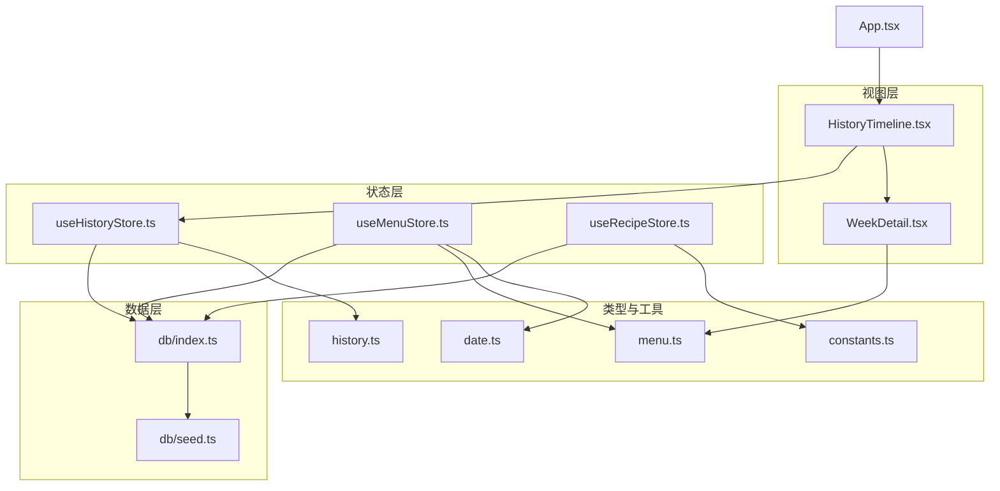
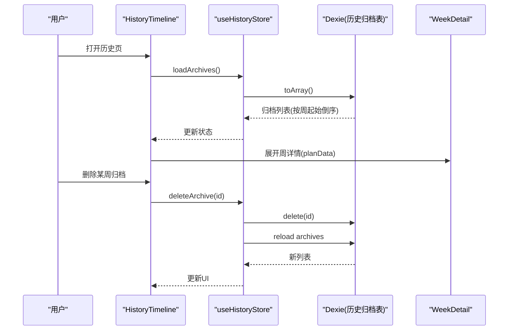
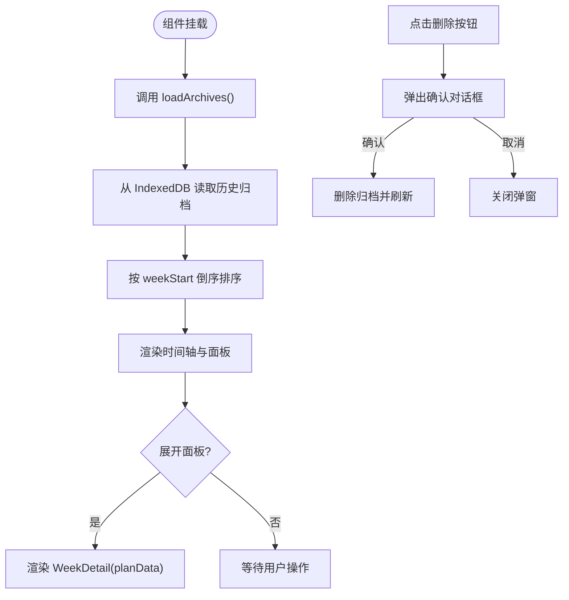
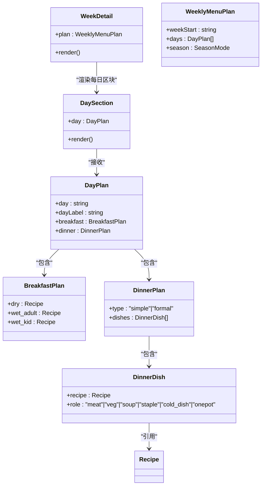
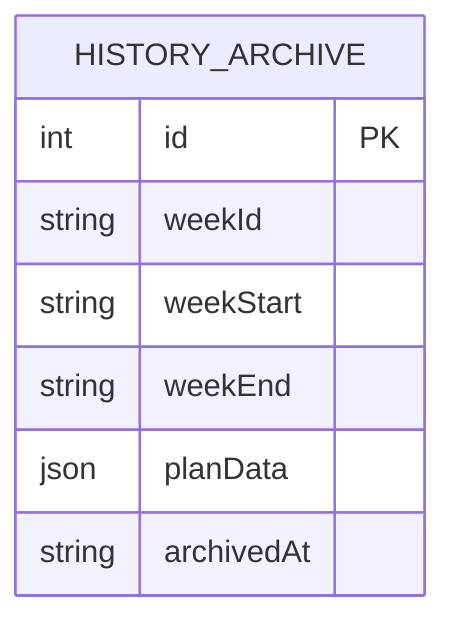
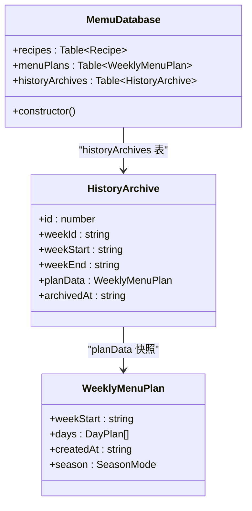
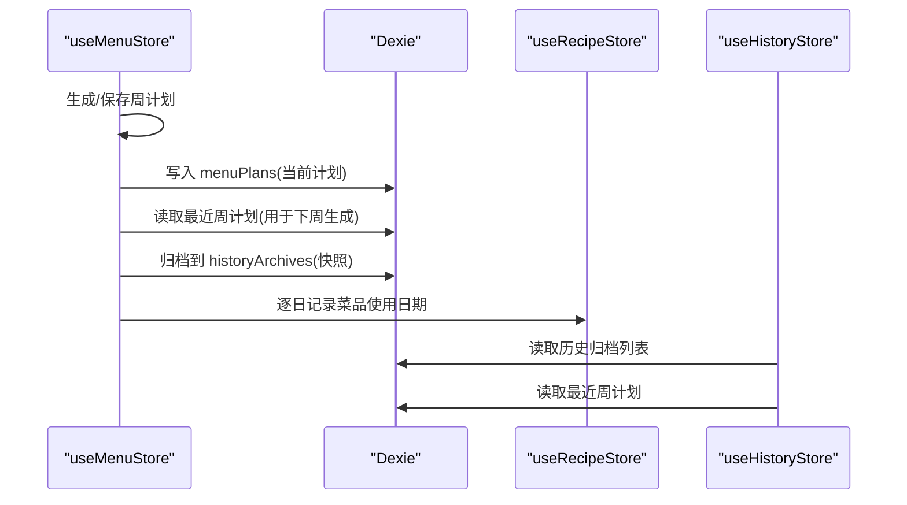
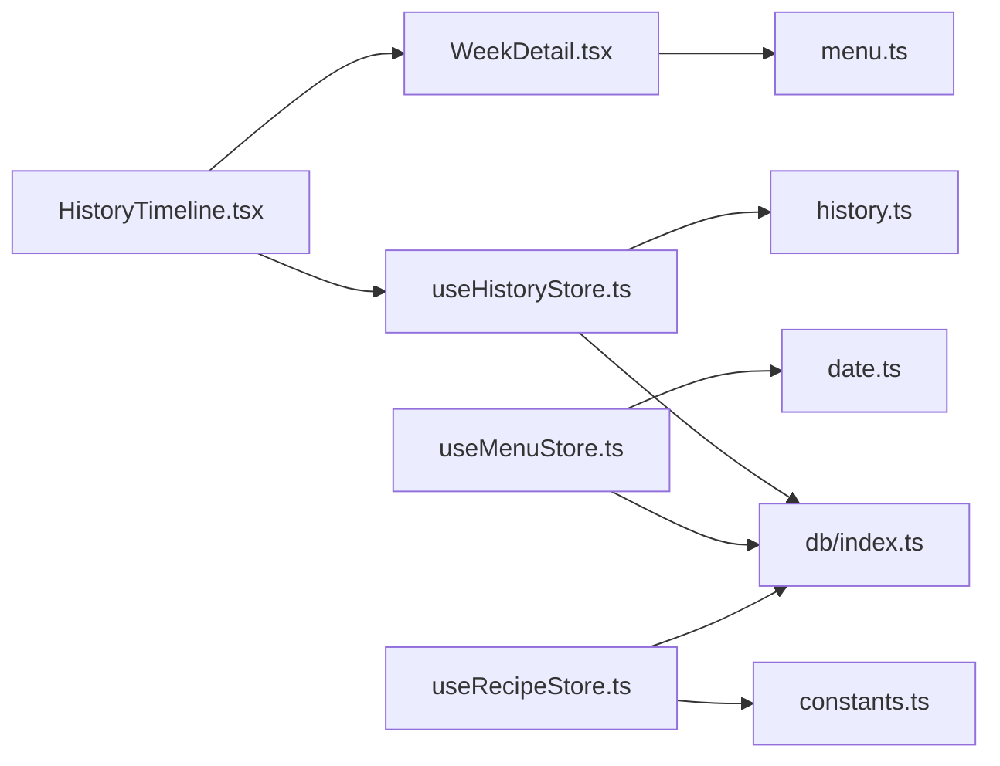

# 历史追踪系统

<cite>
**本文引用的文件**
- [HistoryTimeline.tsx](file://src/components/History/HistoryTimeline.tsx)
- [WeekDetail.tsx](file://src/components/History/WeekDetail.tsx)
- [history.ts](file://src/types/history.ts)
- [useHistoryStore.ts](file://src/store/useHistoryStore.ts)
- [index.ts](file://src/db/index.ts)
- [seed.ts](file://src/db/seed.ts)
- [menu.ts](file://src/types/menu.ts)
- [useMenuStore.ts](file://src/store/useMenuStore.ts)
- [date.ts](file://src/utils/date.ts)
- [App.tsx](file://src/App.tsx)
- [useRecipeStore.ts](file://src/store/useRecipeStore.ts)
- [recipe.ts](file://src/types/recipe.ts)
- [constants.ts](file://src/config/constants.ts)
</cite>

## 目录
1. [简介](#简介)
2. [项目结构](#项目结构)
3. [核心组件](#核心组件)
4. [架构总览](#架构总览)
5. [详细组件分析](#详细组件分析)
6. [依赖关系分析](#依赖关系分析)
7. [性能考量](#性能考量)
8. [故障排除指南](#故障排除指南)
9. [结论](#结论)
10. [附录](#附录)

## 简介
本文件面向“历史追踪系统”，围绕历史时间线组件、周详情视图与数据持久化机制展开，系统性阐述烹饪历史记录的数据模型、时间轴展示逻辑、周统计分析与趋势图表能力，并给出历史数据的存储策略、查询优化与数据迁移方案。同时提供最佳实践、性能优化建议与扩展点设计，解释与食谱管理系统的数据交互、API 接口规范与故障排除指南。

## 项目结构
历史追踪系统位于前端工程的 History 目录，采用 React + Zustand 状态管理 + Dexie IndexedDB 存储的轻量架构。核心模块包括：
- 视图层：历史时间线与周详情视图
- 类型定义：历史归档与周菜单计划的数据模型
- 状态层：历史归档的加载、选择、删除与最近周计划读取
- 数据层：IndexedDB（Dexie）表结构与种子数据迁移
- 工具层：日期计算与周标识生成
- 交互层：与菜单计划、食谱管理的联动

**图表来源**
- [HistoryTimeline.tsx:1-107](file://src/components/History/HistoryTimeline.tsx#L1-L107)
- [WeekDetail.tsx:1-56](file://src/components/History/WeekDetail.tsx#L1-L56)
- [useHistoryStore.ts:1-46](file://src/store/useHistoryStore.ts#L1-L46)
- [useMenuStore.ts:1-292](file://src/store/useMenuStore.ts#L1-L292)
- [useRecipeStore.ts:1-121](file://src/store/useRecipeStore.ts#L1-L121)
- [history.ts:1-11](file://src/types/history.ts#L1-L11)
- [menu.ts:1-45](file://src/types/menu.ts#L1-L45)
- [date.ts:1-49](file://src/utils/date.ts#L1-L49)
- [index.ts:1-68](file://src/db/index.ts#L1-L68)
- [seed.ts:1-709](file://src/db/seed.ts#L1-L709)
- [App.tsx:1-83](file://src/App.tsx#L1-L83)

**章节来源**
- [App.tsx:1-83](file://src/App.tsx#L1-L83)
- [index.ts:1-68](file://src/db/index.ts#L1-L68)

## 核心组件
- 历史时间线组件：负责渲染历史归档的时间轴，支持删除单个归档、展开查看周详情。
- 周详情视图：展示一周的早餐与晚餐构成，标注简餐模式与菜品标签。
- 历史状态管理：提供加载归档、选择归档、删除归档、读取最近周计划等动作。
- 数据持久化：通过 Dexie 在 IndexedDB 中维护历史归档表与种子数据迁移。

**章节来源**
- [HistoryTimeline.tsx:27-107](file://src/components/History/HistoryTimeline.tsx#L27-L107)
- [WeekDetail.tsx:44-56](file://src/components/History/WeekDetail.tsx#L44-L56)
- [useHistoryStore.ts:17-46](file://src/store/useHistoryStore.ts#L17-L46)

## 架构总览
历史追踪系统以“视图-状态-数据”三层解耦：
- 视图层：HistoryTimeline 展示时间轴，WeekDetail 展示周计划细节
- 状态层：useHistoryStore 管理历史归档集合与选中项；useMenuStore 提供归档入口与周计划生成；useRecipeStore 提供菜品使用日期记录
- 数据层：Dexie 定义 historyArchives 表，配合种子数据版本控制进行迁移

**图表来源**
- [HistoryTimeline.tsx:27-107](file://src/components/History/HistoryTimeline.tsx#L27-L107)
- [useHistoryStore.ts:21-37](file://src/store/useHistoryStore.ts#L21-L37)
- [index.ts:7-22](file://src/db/index.ts#L7-L22)

## 详细组件分析

### 历史时间线组件（HistoryTimeline）
职责与行为
- 初始化加载历史归档：组件挂载时触发加载，按周起始日期倒序排列
- 时间轴展示：垂直时间线样式，每个归档项为可折叠面板，面板标题包含周标识与日期范围
- 删除交互：点击删除按钮弹出确认对话框，确认后删除对应归档并刷新列表
- 周详情展开：展开面板后渲染 WeekDetail，传入归档中的 planData

展示逻辑
- 周标签格式化：将 weekId（如“2024-W41”）转换为“2024年第41周”，并拼接起止日期
- 垂直时间线：左侧绘制竖线与节点，节点位置与面板高度保持一致
- 删除流程：设置目标归档 -> 弹窗确认 -> 删除 -> 关闭弹窗 -> 刷新列表

**图表来源**
- [HistoryTimeline.tsx:15-107](file://src/components/History/HistoryTimeline.tsx#L15-L107)
- [useHistoryStore.ts:21-37](file://src/store/useHistoryStore.ts#L21-L37)

**章节来源**
- [HistoryTimeline.tsx:27-107](file://src/components/History/HistoryTimeline.tsx#L27-L107)

### 周详情视图（WeekDetail）
职责与行为
- 展示一周的每日早餐与晚餐构成
- 早餐分为干食（全家共享）、稀食（成人/老人）、稀食（儿童）
- 晚餐支持简餐与正餐两种模式，展示菜品及分类标签
- 显示季节模式（默认/夏季/冬季）

渲染要点
- 每日区块：标题为“周一/周二…”；早餐与晚餐分行展示
- 菜品标签：根据菜品分类动态渲染标签徽章
- 简餐提示：当晚餐类型为“简餐”时显示橙色提示

**图表来源**
- [WeekDetail.tsx:4-56](file://src/components/History/WeekDetail.tsx#L4-L56)
- [menu.ts:3-34](file://src/types/menu.ts#L3-L34)
- [recipe.ts:11-21](file://src/types/recipe.ts#L11-L21)

**章节来源**
- [WeekDetail.tsx:44-56](file://src/components/History/WeekDetail.tsx#L44-L56)

### 数据模型与持久化

#### 历史归档数据模型（HistoryArchive）
- 字段说明：自增 id、周标识 weekId、周起止日期、周计划快照 planData、归档时间 archivedAt
- 用途：作为历史记录的最小单位，保存周计划的快照以便回顾

**图表来源**
- [history.ts:3-10](file://src/types/history.ts#L3-L10)

**章节来源**
- [history.ts:1-11](file://src/types/history.ts#L1-L11)

#### IndexedDB 表结构与迁移
- 表定义：recipes、menuPlans、historyArchives
- 索引：recipes(name, category, rating)、menuPlans(weekStart)、historyArchives(weekId, weekStart)
- 种子数据版本：通过 localStorage 记录版本号，首次安装或版本升级时清空并重新导入种子数据

**图表来源**
- [index.ts:7-22](file://src/db/index.ts#L7-L22)
- [history.ts:3-10](file://src/types/history.ts#L3-L10)
- [menu.ts:28-34](file://src/types/menu.ts#L28-L34)

**章节来源**
- [index.ts:1-68](file://src/db/index.ts#L1-L68)
- [seed.ts:1-709](file://src/db/seed.ts#L1-L709)

#### 周统计分析与趋势图表（设计建议）
当前代码未直接实现统计与图表，但数据模型已具备分析基础：
- 周计划 planData 包含每日菜品信息，可据此统计菜品使用频次、分类分布、季节偏好
- 菜品使用日期 history_dates 可用于趋势分析（按周/月/季度统计使用频率）
- 建议扩展点：新增统计页面，基于 planData 与 recipe.history_dates 计算使用率、重复率、季节性分布等指标，并以柱状图/折线图呈现

[本节为概念性扩展说明，不直接分析具体源码文件]

### 与食谱管理系统的数据交互
- 归档流程：菜单计划完成并归档时，将当前周计划快照写入 historyArchives，并为每道菜的 history_dates 添加对应日期
- 最近周计划：历史状态管理提供读取最近周计划的能力，供菜单生成算法复用
- 菜品评分：仅当菜品有历史使用日期时才允许评分，防止误评

**图表来源**
- [useMenuStore.ts:250-290](file://src/store/useMenuStore.ts#L250-L290)
- [useRecipeStore.ts:92-107](file://src/store/useRecipeStore.ts#L92-L107)
- [useHistoryStore.ts:21-44](file://src/store/useHistoryStore.ts#L21-L44)

**章节来源**
- [useMenuStore.ts:127-292](file://src/store/useMenuStore.ts#L127-L292)
- [useRecipeStore.ts:92-107](file://src/store/useRecipeStore.ts#L92-L107)
- [useHistoryStore.ts:21-44](file://src/store/useHistoryStore.ts#L21-L44)

## 依赖关系分析
- 组件依赖：HistoryTimeline 依赖 useHistoryStore 与 WeekDetail；WeekDetail 依赖菜单类型定义
- 状态依赖：useHistoryStore 依赖 db.historyArchives；useMenuStore 依赖 db.menuPlans 与 db.historyArchives
- 数据依赖：Dexie 定义表结构；种子数据版本控制确保数据一致性
- 工具依赖：date 工具函数用于周标识与日期格式化

**图表来源**
- [HistoryTimeline.tsx:1-14](file://src/components/History/HistoryTimeline.tsx#L1-L14)
- [WeekDetail.tsx:1-6](file://src/components/History/WeekDetail.tsx#L1-L6)
- [useHistoryStore.ts:1-15](file://src/store/useHistoryStore.ts#L1-L15)
- [useMenuStore.ts:1-15](file://src/store/useMenuStore.ts#L1-L15)
- [useRecipeStore.ts:1-25](file://src/store/useRecipeStore.ts#L1-L25)
- [index.ts:1-22](file://src/db/index.ts#L1-L22)
- [date.ts:1-49](file://src/utils/date.ts#L1-L49)
- [constants.ts:1-44](file://src/config/constants.ts#L1-L44)
- [history.ts:1-11](file://src/types/history.ts#L1-L11)
- [menu.ts:1-45](file://src/types/menu.ts#L1-L45)

**章节来源**
- [useMenuStore.ts:1-292](file://src/store/useMenuStore.ts#L1-L292)
- [useHistoryStore.ts:1-46](file://src/store/useHistoryStore.ts#L1-L46)
- [index.ts:1-68](file://src/db/index.ts#L1-L68)

## 性能考量
- 查询优化
  - 历史归档列表按 weekStart 倒序：索引 weekStart 可提升排序效率
  - 菜品使用日期记录：批量去重与事务写入，避免重复写入与多次 IO
- 存储策略
  - 历史归档采用快照存储，便于离线查看与跨版本兼容
  - 种子数据版本控制：通过 localStorage 版本号与 Dexie 版本迁移，避免数据不一致
- 渲染优化
  - 历史时间线使用 Accordion 控件，按需展开面板，减少 DOM 负担
  - 周详情按日渲染，避免一次性渲染大量数据

[本节提供通用优化建议，不直接分析具体源码文件]

## 故障排除指南
常见问题与排查步骤
- 历史记录为空
  - 确认是否已完成至少一次菜单归档
  - 检查 IndexedDB 中 historyArchives 是否存在数据
- 删除历史记录无效
  - 确认删除确认对话框是否正确触发
  - 检查删除动作是否成功执行并刷新列表
- 菜品评分异常
  - 确认菜品是否已有历史使用日期（history_dates 非空）
  - 检查 useRecipeStore 的评分逻辑与错误提示
- 数据迁移失败
  - 检查 localStorage 中的种子版本号是否与当前版本一致
  - 确认 Dexie 版本迁移逻辑是否正常执行

**章节来源**
- [useRecipeStore.ts:81-90](file://src/store/useRecipeStore.ts#L81-L90)
- [index.ts:37-57](file://src/db/index.ts#L37-L57)

## 结论
历史追踪系统以简洁的组件与清晰的状态管理实现了历史时间线与周详情展示，并通过 IndexedDB 与种子数据版本控制保障了数据的可靠性与可迁移性。未来可在现有数据模型基础上扩展统计分析与趋势图表能力，进一步提升用户对历史数据的洞察力。

## 附录

### API 接口规范（基于现有实现）
- 加载历史归档
  - 方法：GET
  - 路径：/api/history/archives
  - 返回：历史归档数组（按 weekStart 倒序）
- 删除历史归档
  - 方法：DELETE
  - 路径：/api/history/archive/{id}
  - 返回：成功/失败状态
- 读取最近周计划
  - 方法：GET
  - 路径：/api/history/latest-week-plan
  - 返回：最近周计划快照（WeeklyMenuPlan）

[本节为接口规范建议，不直接分析具体源码文件]

### 最佳实践
- 归档时机：建议在每周菜单完成后立即归档，确保历史数据完整性
- 数据清理：定期清理过期历史归档，避免 IndexedDB 数据膨胀
- 用户引导：在历史页提供“如何查看周详情”的提示，降低使用门槛

[本节为通用建议，不直接分析具体源码文件]