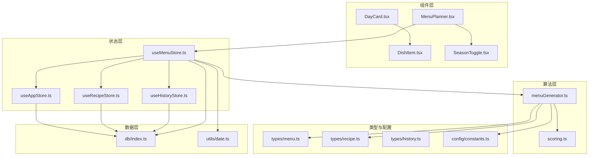
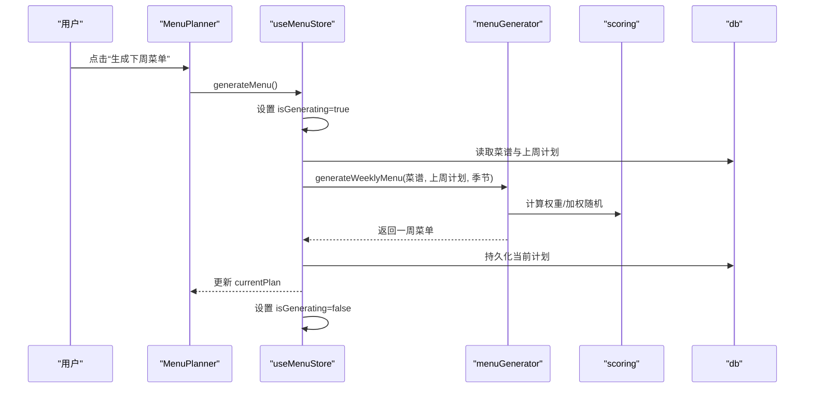
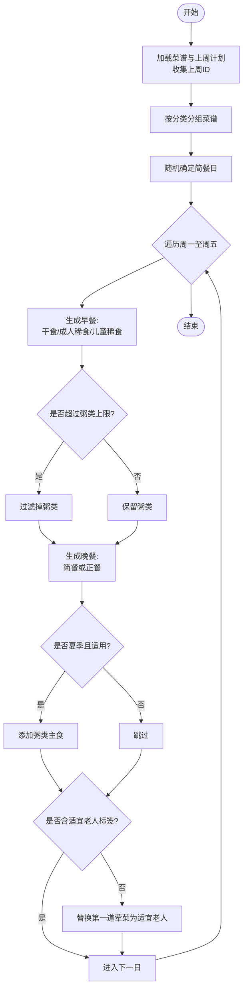
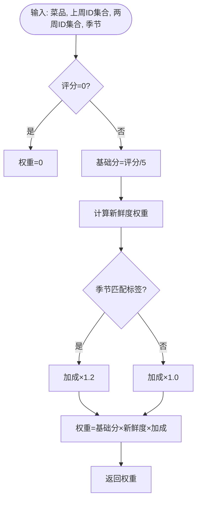
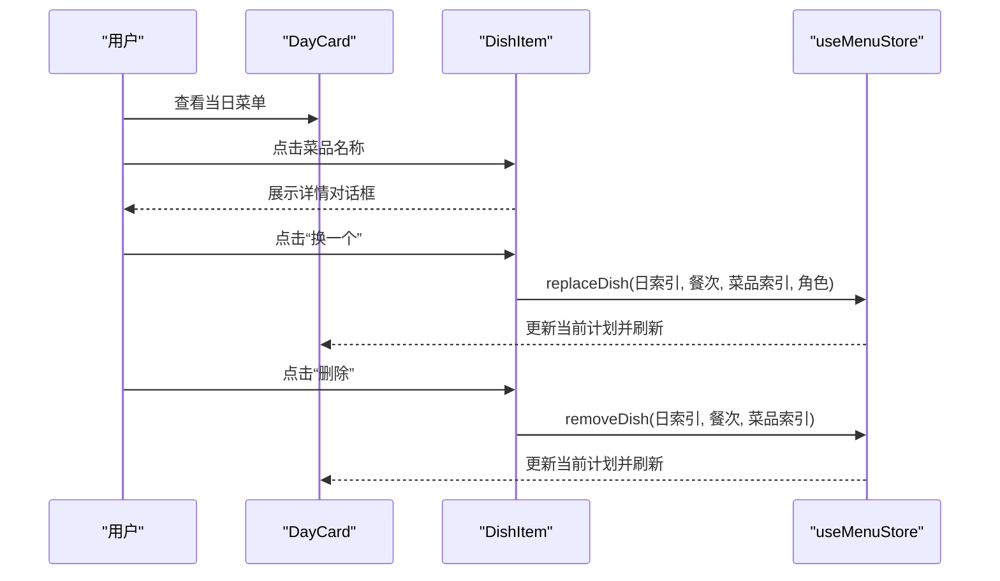
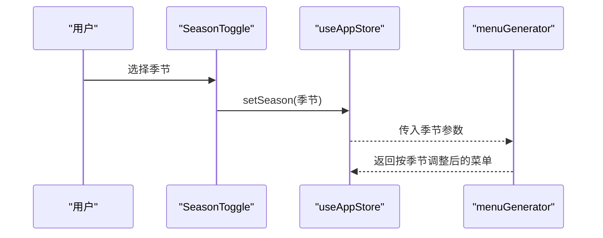
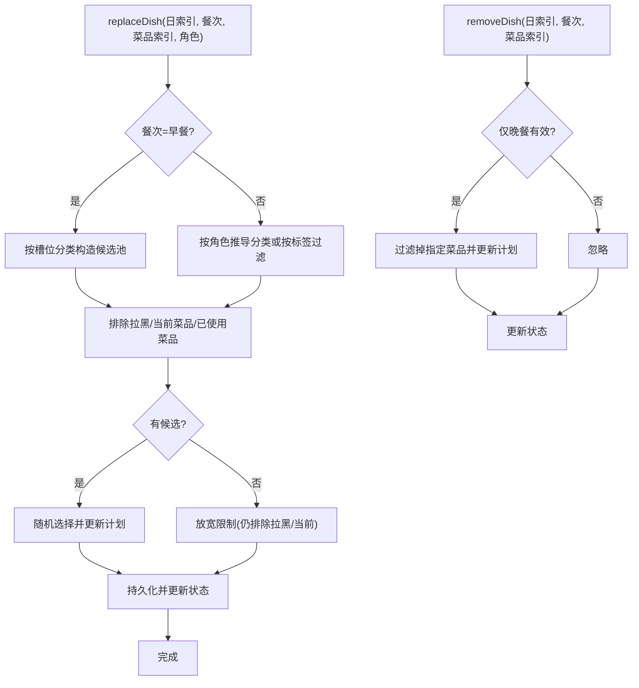
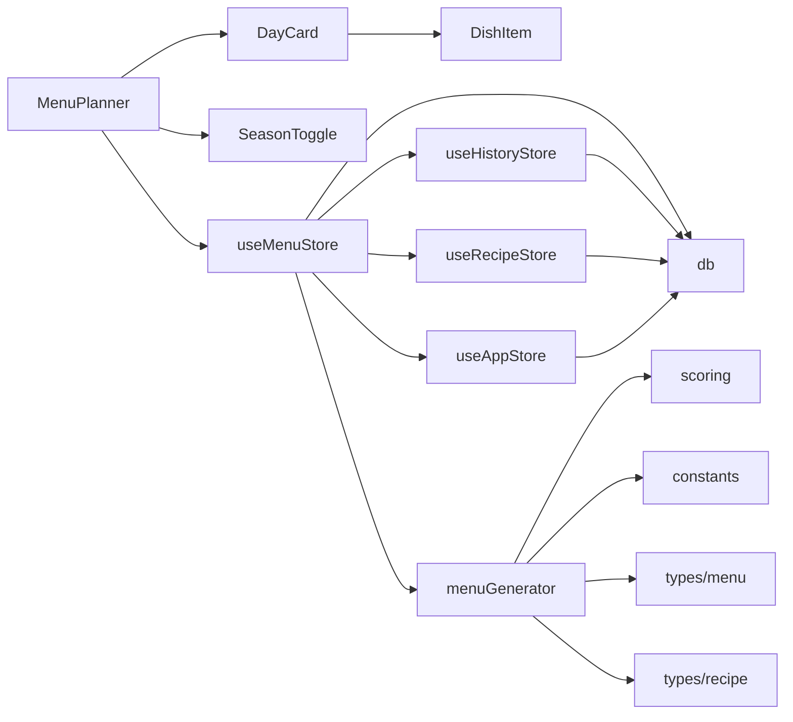

# 菜单规划系统

<cite>
**本文引用的文件**
- [src/algorithms/menuGenerator.ts](file://src/algorithms/menuGenerator.ts)
- [src/algorithms/scoring.ts](file://src/algorithms/scoring.ts)
- [src/components/Menu/MenuPlanner.tsx](file://src/components/Menu/MenuPlanner.tsx)
- [src/components/Menu/DayCard.tsx](file://src/components/Menu/DayCard.tsx)
- [src/components/Menu/DishItem.tsx](file://src/components/Menu/DishItem.tsx)
- [src/components/Menu/SeasonToggle.tsx](file://src/components/Menu/SeasonToggle.tsx)
- [src/store/useMenuStore.ts](file://src/store/useMenuStore.ts)
- [src/store/useAppStore.ts](file://src/store/useAppStore.ts)
- [src/store/useHistoryStore.ts](file://src/store/useHistoryStore.ts)
- [src/store/useRecipeStore.ts](file://src/store/useRecipeStore.ts)
- [src/types/menu.ts](file://src/types/menu.ts)
- [src/types/recipe.ts](file://src/types/recipe.ts)
- [src/types/history.ts](file://src/types/history.ts)
- [src/config/constants.ts](file://src/config/constants.ts)
- [src/db/index.ts](file://src/db/index.ts)
- [src/utils/date.ts](file://src/utils/date.ts)
</cite>

## 目录
1. [简介](#简介)
2. [项目结构](#项目结构)
3. [核心组件](#核心组件)
4. [架构总览](#架构总览)
5. [详细组件分析](#详细组件分析)
6. [依赖关系分析](#依赖关系分析)
7. [性能考虑](#性能考虑)
8. [故障排除指南](#故障排除指南)
9. [结论](#结论)
10. [附录](#附录)

## 简介
本系统围绕“菜单规划”构建，提供智能菜单生成、日卡片展示、菜品项管理与季节切换等能力。其核心包括：
- 智能菜单生成算法：基于加权随机抽选、跨周新鲜度降权、季节标签匹配与健康兜底策略，确保多样性和营养均衡。
- 日卡片组件设计：以“周一至周五”的周视图呈现，支持菜品详情弹窗、换菜与删除操作。
- 菜品项管理：支持替换菜品、移除菜品、评分与历史记录追踪。
- 季节切换功能：通过“默认/夏季/冬季”三种模式动态调整正餐配置与推荐标签。

系统采用前端状态管理（Zustand）与本地 IndexedDB（Dexie）存储，保证离线可用与数据持久化。

## 项目结构
系统采用按功能域划分的目录组织方式，核心模块如下：
- algorithms：菜单生成与打分算法
- components/Menu：菜单相关的 UI 组件
- store：状态管理（菜单、应用、历史、菜谱）
- types：类型定义（菜单、菜谱、历史）
- config：全局常量与配置
- db：数据库初始化与表结构
- utils：日期工具
- public/index.html：入口页面



图表来源
- [src/components/Menu/MenuPlanner.tsx:1-75](file://src/components/Menu/MenuPlanner.tsx#L1-L75)
- [src/store/useMenuStore.ts:1-292](file://src/store/useMenuStore.ts#L1-L292)
- [src/algorithms/menuGenerator.ts:1-368](file://src/algorithms/menuGenerator.ts#L1-L368)
- [src/algorithms/scoring.ts:1-64](file://src/algorithms/scoring.ts#L1-L64)
- [src/db/index.ts:1-34](file://src/db/index.ts#L1-L34)

章节来源
- [src/components/Menu/MenuPlanner.tsx:1-75](file://src/components/Menu/MenuPlanner.tsx#L1-L75)
- [src/store/useMenuStore.ts:1-292](file://src/store/useMenuStore.ts#L1-L292)
- [src/algorithms/menuGenerator.ts:1-368](file://src/algorithms/menuGenerator.ts#L1-L368)
- [src/db/index.ts:1-34](file://src/db/index.ts#L1-L34)

## 核心组件
- 菜单生成器：负责按周生成菜单，处理早餐与晚餐的组合、简餐与正餐策略、季节性调整与健康兜底。
- 打分与权重：根据评分、跨周使用情况与季节标签计算候选菜品权重，并进行加权随机抽选。
- 菜单状态管理：封装生成、加载、替换、移除、归档与保存等动作，协调算法与数据库。
- UI 组件：菜单面板、日卡片、菜品项、季节切换控件，提供用户交互入口。
- 数据与类型：定义 WeeklyMenuPlan、DayPlan、DinnerDish、Recipe 等核心数据结构与枚举。

章节来源
- [src/algorithms/menuGenerator.ts:128-226](file://src/algorithms/menuGenerator.ts#L128-L226)
- [src/algorithms/scoring.ts:14-63](file://src/algorithms/scoring.ts#L14-L63)
- [src/store/useMenuStore.ts:127-291](file://src/store/useMenuStore.ts#L127-L291)
- [src/types/menu.ts:1-45](file://src/types/menu.ts#L1-L45)
- [src/types/recipe.ts:1-21](file://src/types/recipe.ts#L1-L21)

## 架构总览
系统采用“算法-组件-状态-数据”四层架构：
- 算法层：菜单生成与权重计算
- 组件层：菜单面板、日卡片、菜品项、季节切换
- 状态层：菜单、应用、历史、菜谱状态管理
- 数据层：Dexie 本地数据库与日期工具



图表来源
- [src/components/Menu/MenuPlanner.tsx:27-34](file://src/components/Menu/MenuPlanner.tsx#L27-L34)
- [src/store/useMenuStore.ts:131-152](file://src/store/useMenuStore.ts#L131-L152)
- [src/algorithms/menuGenerator.ts:128-132](file://src/algorithms/menuGenerator.ts#L128-L132)
- [src/algorithms/scoring.ts:48-63](file://src/algorithms/scoring.ts#L48-L63)
- [src/db/index.ts:12-20](file://src/db/index.ts#L12-L20)

## 详细组件分析

### 菜单生成算法
- 输入输出
  - 输入：全部菜谱、上周计划（可空）、当前季节模式
  - 输出：一周（周一至周五）的日计划数组
- 关键流程
  - 收集上周使用过的菜品 ID，作为跨周新鲜度参考
  - 按分类分组菜谱，分别统计各类使用次数
  - 随机确定“简餐日”，其余为“正餐日”
  - 早餐：干食必选；成人稀食按强制与标签约束；儿童稀食独立挑选
  - 晚餐：简餐日优先“一锅出”，夏季模式下若适用则搭配“粥类”；正餐日按季节配置组合荤/素/汤/主食/凉菜
  - 健康兜底：若未含“适宜老人”标签，则替换第一道荤菜
- 冲突避免机制
  - 使用计数：普通菜每周仅限使用一次，5星菜最多两次
  - 拉黑过滤：评分=0 的菜品权重为0
  - 兜底策略：当严格筛选无候选时，放宽重复限制但排除拉黑
- 季节调整策略
  - 夏季：增加凉菜数量，优先选择“夏季推荐”汤品与“夏季推荐”主食；简餐日搭配“粥类”
  - 冬季：沿用默认配置（预留扩展）
- 参数与配置
  - 强制牛奶燕麦日：周一、三、五
  - 每周最多“粥类”出现天数
  - 正餐配置：不同季节的荤/素/汤/主食/凉菜数量
  - 跨周权重系数
  - 5星菜最大重复次数
  - 标签常量：适宜老人、夏季推荐、冬季推荐、凉菜、辣、粥类



图表来源
- [src/algorithms/menuGenerator.ts:128-226](file://src/algorithms/menuGenerator.ts#L128-L226)
- [src/algorithms/menuGenerator.ts:232-254](file://src/algorithms/menuGenerator.ts#L232-L254)
- [src/algorithms/menuGenerator.ts:260-336](file://src/algorithms/menuGenerator.ts#L260-L336)
- [src/algorithms/menuGenerator.ts:341-367](file://src/algorithms/menuGenerator.ts#L341-L367)
- [src/config/constants.ts:1-44](file://src/config/constants.ts#L1-L44)

章节来源
- [src/algorithms/menuGenerator.ts:128-226](file://src/algorithms/menuGenerator.ts#L128-L226)
- [src/algorithms/menuGenerator.ts:232-254](file://src/algorithms/menuGenerator.ts#L232-L254)
- [src/algorithms/menuGenerator.ts:260-336](file://src/algorithms/menuGenerator.ts#L260-L336)
- [src/algorithms/menuGenerator.ts:341-367](file://src/algorithms/menuGenerator.ts#L341-L367)
- [src/config/constants.ts:1-44](file://src/config/constants.ts#L1-L44)

### 打分与权重计算
- 权重构成
  - 基础分：评分为空视为3分，否则按评分/5归一化
  - 新鲜度权重：上周使用×系数、两周前使用×0.5、更早或未使用×1.0
  - 季节加成：与当前季节匹配的标签×1.2，否则×1.0
  - 拉黑：评分=0直接返回0
- 抽选策略
  - 总权重为0时退化为均匀随机
  - 否则按累计权重进行轮盘抽选



图表来源
- [src/algorithms/scoring.ts:14-42](file://src/algorithms/scoring.ts#L14-L42)
- [src/algorithms/scoring.ts:48-63](file://src/algorithms/scoring.ts#L48-L63)

章节来源
- [src/algorithms/scoring.ts:14-42](file://src/algorithms/scoring.ts#L14-L42)
- [src/algorithms/scoring.ts:48-63](file://src/algorithms/scoring.ts#L48-L63)

### 日卡片组件设计
- DayCard：展示单日早餐与晚餐，区分简餐/正餐，支持菜品详情弹窗与操作按钮
- DishItem：展示菜品名称、角色徽标、标签，提供换菜与删除入口
- 交互流程：点击菜品打开详情对话框；悬停显示换菜/删除按钮；换菜触发状态更新；删除仅支持晚餐菜品



图表来源
- [src/components/Menu/DayCard.tsx:13-77](file://src/components/Menu/DayCard.tsx#L13-L77)
- [src/components/Menu/DishItem.tsx:50-123](file://src/components/Menu/DishItem.tsx#L50-L123)
- [src/store/useMenuStore.ts:167-241](file://src/store/useMenuStore.ts#L167-L241)

章节来源
- [src/components/Menu/DayCard.tsx:13-77](file://src/components/Menu/DayCard.tsx#L13-L77)
- [src/components/Menu/DishItem.tsx:50-123](file://src/components/Menu/DishItem.tsx#L50-L123)
- [src/store/useMenuStore.ts:167-241](file://src/store/useMenuStore.ts#L167-L241)

### 季节切换功能
- SeasonToggle：提供“默认/夏季/冬季”选项，写入应用状态
- 菜单生成：根据当前季节调整正餐配置与推荐标签，影响权重与候选池



图表来源
- [src/components/Menu/SeasonToggle.tsx:11-26](file://src/components/Menu/SeasonToggle.tsx#L11-L26)
- [src/store/useAppStore.ts:17-25](file://src/store/useAppStore.ts#L17-L25)
- [src/algorithms/menuGenerator.ts:270-272](file://src/algorithms/menuGenerator.ts#L270-L272)

章节来源
- [src/components/Menu/SeasonToggle.tsx:11-26](file://src/components/Menu/SeasonToggle.tsx#L11-L26)
- [src/store/useAppStore.ts:17-25](file://src/store/useAppStore.ts#L17-L25)
- [src/algorithms/menuGenerator.ts:270-272](file://src/algorithms/menuGenerator.ts#L270-L272)

### 菜品项管理与状态策略
- 替换菜品：按餐次与角色定位候选池，排除拉黑与当前菜品，避免重复使用，必要时放宽限制
- 移除菜品：仅支持晚餐菜品，移除后重建日计划并持久化
- 归档计划：将当前计划转存为历史归档，记录周标识与日期范围，更新菜谱使用历史，并清空当前计划
- 数据持久化：统一通过 Dexie 表 menuPlans 与 historyArchives 存储



图表来源
- [src/store/useMenuStore.ts:167-241](file://src/store/useMenuStore.ts#L167-L241)
- [src/store/useMenuStore.ts:250-290](file://src/store/useMenuStore.ts#L250-L290)

章节来源
- [src/store/useMenuStore.ts:167-241](file://src/store/useMenuStore.ts#L167-L241)
- [src/store/useMenuStore.ts:250-290](file://src/store/useMenuStore.ts#L250-L290)

## 依赖关系分析
- 组件依赖
  - MenuPlanner 依赖 useMenuStore、SeasonToggle、DayCard
  - DayCard 依赖 DishItem
- 状态依赖
  - useMenuStore 依赖 useAppStore（季节）、useHistoryStore（上周计划）、useRecipeStore（评分记录）
  - useAppStore 提供全局状态（活动页签、季节）
  - useHistoryStore 提供历史归档与上周计划
  - useRecipeStore 提供菜谱 CRUD 与评分、使用历史记录
- 算法依赖
  - menuGenerator 依赖 scoring、constants、types、utils/date
- 数据依赖
  - db 定义三张表：recipes、menuPlans、historyArchives



图表来源
- [src/components/Menu/MenuPlanner.tsx:1-75](file://src/components/Menu/MenuPlanner.tsx#L1-L75)
- [src/store/useMenuStore.ts:1-292](file://src/store/useMenuStore.ts#L1-L292)
- [src/store/useAppStore.ts:1-26](file://src/store/useAppStore.ts#L1-L26)
- [src/store/useHistoryStore.ts:1-46](file://src/store/useHistoryStore.ts#L1-L46)
- [src/store/useRecipeStore.ts:1-121](file://src/store/useRecipeStore.ts#L1-L121)
- [src/algorithms/menuGenerator.ts:1-368](file://src/algorithms/menuGenerator.ts#L1-L368)
- [src/algorithms/scoring.ts:1-64](file://src/algorithms/scoring.ts#L1-L64)
- [src/db/index.ts:1-34](file://src/db/index.ts#L1-L34)

章节来源
- [src/components/Menu/MenuPlanner.tsx:1-75](file://src/components/Menu/MenuPlanner.tsx#L1-L75)
- [src/store/useMenuStore.ts:1-292](file://src/store/useMenuStore.ts#L1-L292)
- [src/store/useAppStore.ts:1-26](file://src/store/useAppStore.ts#L1-L26)
- [src/store/useHistoryStore.ts:1-46](file://src/store/useHistoryStore.ts#L1-L46)
- [src/store/useRecipeStore.ts:1-121](file://src/store/useRecipeStore.ts#L1-L121)
- [src/algorithms/menuGenerator.ts:1-368](file://src/algorithms/menuGenerator.ts#L1-L368)
- [src/algorithms/scoring.ts:1-64](file://src/algorithms/scoring.ts#L1-L64)
- [src/db/index.ts:1-34](file://src/db/index.ts#L1-L34)

## 性能考虑
- 算法复杂度
  - 生成一周菜单：对每个餐次遍历候选池，时间复杂度近似 O(D×C)，D 为天数（5），C 为分类平均候选数
  - 加权随机：单次抽选 O(N)（N 为候选数），整体受分类数量与池大小影响
- 优化建议
  - 候选池预过滤：在 pickRecipe 前先按标签与重复次数过滤，减少无效计算
  - 缓存使用计数：在单次生成过程中复用 Map，避免重复扫描
  - 批量持久化：归档时一次性写入，减少事务开销
  - UI 渲染优化：按需渲染日卡片，避免全量重绘
- 存储与查询
  - Dexie 索引：recipes(name, category, rating)，menuPlans(weekStart)，historyArchives(weekId, weekStart) 已建立复合索引，满足高频查询场景

章节来源
- [src/db/index.ts:14-18](file://src/db/index.ts#L14-L18)
- [src/algorithms/menuGenerator.ts:79-111](file://src/algorithms/menuGenerator.ts#L79-L111)
- [src/algorithms/scoring.ts:48-63](file://src/algorithms/scoring.ts#L48-L63)

## 故障排除指南
- 生成失败或无候选
  - 检查菜谱库是否为空或全部被拉黑（评分=0）
  - 确认“粥类”上限与强制牛奶燕麦日是否导致池过小
  - 查看兜底逻辑是否生效（放宽重复限制）
- 替换菜品无效
  - 确认当前计划存在且索引合法
  - 检查候选池是否排除了所有未使用的菜品
- 归档异常
  - 确认当前计划已持久化为快照
  - 检查菜谱使用历史记录是否成功写入
- 季节模式不生效
  - 确认 SeasonToggle 已正确设置季节值
  - 检查正餐配置与标签是否匹配

章节来源
- [src/store/useMenuStore.ts:131-152](file://src/store/useMenuStore.ts#L131-L152)
- [src/store/useMenuStore.ts:167-241](file://src/store/useMenuStore.ts#L167-L241)
- [src/store/useMenuStore.ts:250-290](file://src/store/useMenuStore.ts#L250-L290)
- [src/algorithms/menuGenerator.ts:79-111](file://src/algorithms/menuGenerator.ts#L79-L111)
- [src/components/Menu/SeasonToggle.tsx:11-26](file://src/components/Menu/SeasonToggle.tsx#L11-L26)

## 结论
本系统通过清晰的分层设计与可配置的算法策略，实现了智能化、可交互、可扩展的菜单规划能力。核心优势在于：
- 健壮的冲突避免与兜底机制，保障菜单质量
- 季节化与健康导向的组合策略，提升用户体验
- 完整的状态管理与数据持久化，支持离线使用与历史追溯

## 附录

### 数据模型设计
```mermaid
erDiagram
RECIPE {
int id PK
string name
string category
string[] tags
string[] ingredients
string instructions
int|nil rating
string[] history_dates
}
WEEKLY_MENU_PLAN {
int id PK
string weekStart
json days
string createdAt
string season
}
HISTORY_ARCHIVE {
int id PK
string weekId
string weekStart
string weekEnd
json planData
string archivedAt
}
WEEKLY_MENU_PLAN ||--o{ DAY_PLAN : "包含"
DAY_PLAN ||--o{ DINNER_DISH : "包含"
DINNER_DISH }o--|| RECIPE : "指向"
RECIPE ||--o{ HISTORY_ARCHIVE : "使用历史"
```

图表来源
- [src/types/recipe.ts:11-20](file://src/types/recipe.ts#L11-L20)
- [src/types/menu.ts:19-34](file://src/types/menu.ts#L19-L34)
- [src/types/history.ts:3-10](file://src/types/history.ts#L3-L10)

章节来源
- [src/types/recipe.ts:11-20](file://src/types/recipe.ts#L11-L20)
- [src/types/menu.ts:19-34](file://src/types/menu.ts#L19-L34)
- [src/types/history.ts:3-10](file://src/types/history.ts#L3-L10)

### 状态管理策略
- 菜单状态：currentPlan、isGenerating；提供生成、加载、替换、移除、保存、归档等动作
- 应用状态：activeTab、season、isInitialized
- 历史状态：archives、selectedArchive；提供加载、选择、删除、获取上周计划
- 菜谱状态：recipes、filteredRecipes、filters；提供 CRUD、评分、使用历史记录与过滤

章节来源
- [src/store/useMenuStore.ts:21-37](file://src/store/useMenuStore.ts#L21-L37)
- [src/store/useAppStore.ts:6-15](file://src/store/useAppStore.ts#L6-L15)
- [src/store/useHistoryStore.ts:6-15](file://src/store/useHistoryStore.ts#L6-L15)
- [src/store/useRecipeStore.ts:11-25](file://src/store/useRecipeStore.ts#L11-L25)

### API 接口规范（内部）
- 生成菜单
  - 方法：POST /api/generate-menu
  - 请求体：{ season: SeasonMode, lastWeekPlan: WeeklyMenuPlan | null }
  - 响应：WeeklyMenuPlan
- 替换菜品
  - 方法：PATCH /api/menu/:dayIndex/:mealType/:dishIndex
  - 查询参数：role（可选）
  - 响应：WeeklyMenuPlan
- 移除菜品
  - 方法：DELETE /api/menu/:dayIndex/:mealType/:dishIndex
  - 响应：WeeklyMenuPlan
- 归档计划
  - 方法：POST /api/archive
  - 响应：HistoryArchive

说明：以上为概念性接口规范，实际系统通过 Zustand 状态与 Dexie 数据库直接交互，无需网络请求。

### 最佳实践
- 在生成前确保菜谱库具备足够多样性与标签覆盖
- 合理设置“粥类”上限与强制牛奶燕麦日，平衡营养与趣味
- 使用“适宜老人”标签提升健康水平，必要时启用健康兜底
- 定期归档旧计划，清理当前计划，避免状态膨胀
- 对于大规模候选池，建议在 UI 层做分页或虚拟滚动优化

### 扩展点设计
- 季节模式扩展：新增模式时只需在配置中补充正餐配置与标签映射
- 菜品评分策略：支持按使用频率、时间窗口等维度调整权重
- 健康标签体系：引入更多标签（如低脂、高纤）并扩展兜底逻辑
- 个性化偏好：支持用户偏好权重与黑名单策略