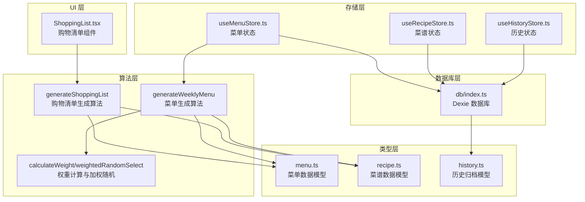
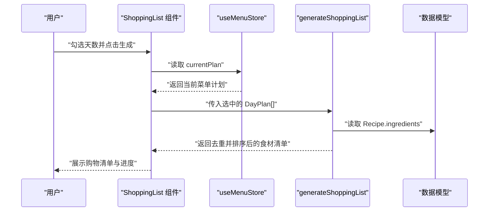
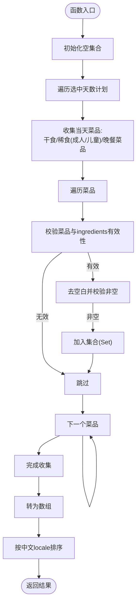
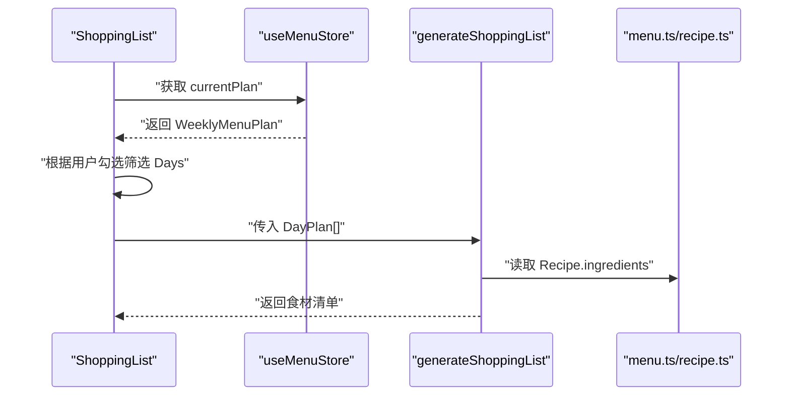
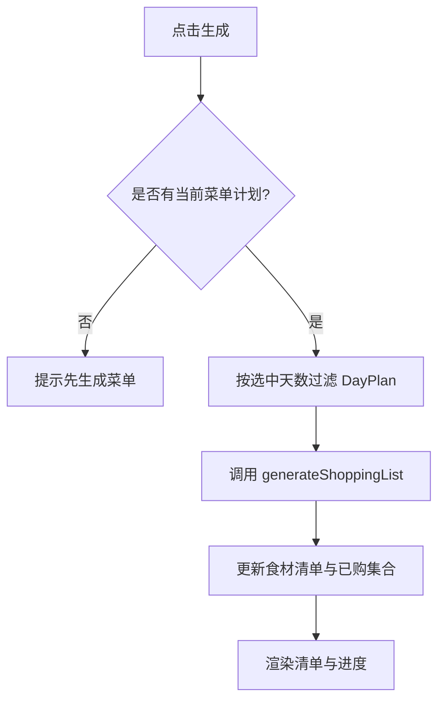
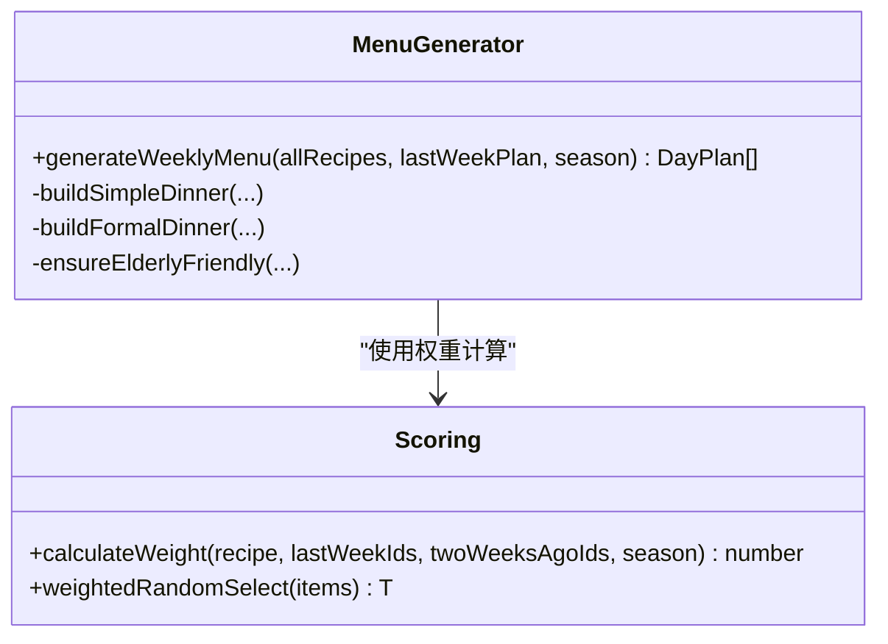
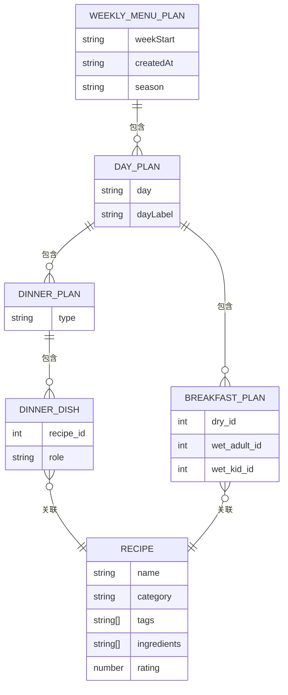
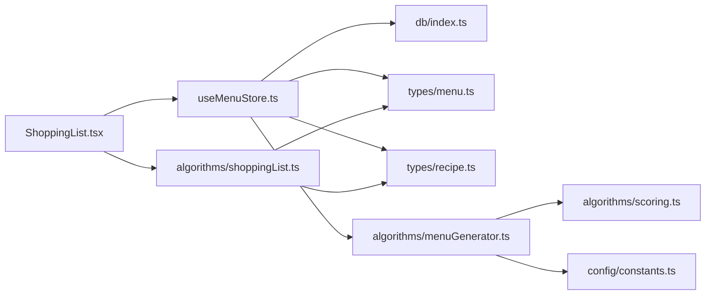

# 购物清单系统

<cite>
**本文引用的文件**
- [src/algorithms/shoppingList.ts](file://src/algorithms/shoppingList.ts)
- [src/components/Shopping/ShoppingList.tsx](file://src/components/Shopping/ShoppingList.tsx)
- [src/types/menu.ts](file://src/types/menu.ts)
- [src/types/recipe.ts](file://src/types/recipe.ts)
- [src/store/useMenuStore.ts](file://src/store/useMenuStore.ts)
- [src/store/useRecipeStore.ts](file://src/store/useRecipeStore.ts)
- [src/store/useHistoryStore.ts](file://src/store/useHistoryStore.ts)
- [src/db/index.ts](file://src/db/index.ts)
- [src/config/constants.ts](file://src/config/constants.ts)
- [src/algorithms/menuGenerator.ts](file://src/algorithms/menuGenerator.ts)
- [src/algorithms/scoring.ts](file://src/algorithms/scoring.ts)
- [src/utils/date.ts](file://src/utils/date.ts)
</cite>

## 目录
1. [简介](#简介)
2. [项目结构](#项目结构)
3. [核心组件](#核心组件)
4. [架构总览](#架构总览)
5. [详细组件分析](#详细组件分析)
6. [依赖关系分析](#依赖关系分析)
7. [性能考虑](#性能考虑)
8. [故障排除指南](#故障排除指南)
9. [结论](#结论)
10. [附录](#附录)

## 简介
本文件面向“购物清单系统”的完整技术文档，聚焦于从菜单到购物清单的数据转换流程、食材去重策略、分类与排序规则以及用户可定制选项。文档还涵盖购物清单数据模型、算法参数配置、状态管理策略，并提供最佳实践、性能优化建议与扩展点设计，帮助开发者与使用者高效理解与维护系统。

## 项目结构
购物清单系统位于前端应用中，采用模块化组织：算法层负责数据转换与权重计算；类型层定义数据模型；存储层通过 Zustand 管理菜单与历史；数据库层基于 Dexie 提供本地持久化；UI 层提供购物清单展示与交互。

图表来源
- [src/algorithms/shoppingList.ts:1-32](file://src/algorithms/shoppingList.ts#L1-L32)
- [src/components/Shopping/ShoppingList.tsx:1-130](file://src/components/Shopping/ShoppingList.tsx#L1-L130)
- [src/types/menu.ts:1-45](file://src/types/menu.ts#L1-L45)
- [src/types/recipe.ts:1-21](file://src/types/recipe.ts#L1-L21)
- [src/store/useMenuStore.ts:1-292](file://src/store/useMenuStore.ts#L1-L292)
- [src/store/useRecipeStore.ts:1-121](file://src/store/useRecipeStore.ts#L1-L121)
- [src/store/useHistoryStore.ts:1-46](file://src/store/useHistoryStore.ts#L1-L46)
- [src/db/index.ts:1-68](file://src/db/index.ts#L1-L68)
- [src/algorithms/menuGenerator.ts:1-374](file://src/algorithms/menuGenerator.ts#L1-L374)
- [src/algorithms/scoring.ts:1-64](file://src/algorithms/scoring.ts#L1-L64)

章节来源
- [src/components/Shopping/ShoppingList.tsx:1-130](file://src/components/Shopping/ShoppingList.tsx#L1-L130)
- [src/store/useMenuStore.ts:1-292](file://src/store/useMenuStore.ts#L1-L292)
- [src/db/index.ts:1-68](file://src/db/index.ts#L1-L68)

## 核心组件
- 购物清单生成算法：从已选中的“天数计划”中提取所有菜品的食材列表，执行字符串级去重与中文本地化排序，输出不重复的食材清单。
- 菜单到购物清单的数据转换：通过菜单计划（Daily Plan）聚合早餐与晚餐菜品，再汇总食材。
- 食材去重策略：使用集合结构进行字符串级去重，忽略前后空白，确保名称一致即视为同一食材。
- 排序规则：按中文简体（zh-Hans-CN）locale 进行比较排序，提升中文阅读体验。
- 用户交互：支持按“周一至周五”选择天数，一键生成购物清单，并勾选已购买项。

章节来源
- [src/algorithms/shoppingList.ts:11-31](file://src/algorithms/shoppingList.ts#L11-L31)
- [src/components/Shopping/ShoppingList.tsx:11-77](file://src/components/Shopping/ShoppingList.tsx#L11-L77)
- [src/types/menu.ts:19-34](file://src/types/menu.ts#L19-L34)

## 架构总览
购物清单系统围绕“菜单计划”展开：菜单计划由算法生成，存储于本地数据库，UI 组件读取当前计划并生成购物清单。算法层包含权重计算与加权随机选择，用于菜单生成；购物清单算法专注于食材提取与去重排序。

图表来源
- [src/components/Shopping/ShoppingList.tsx:21-27](file://src/components/Shopping/ShoppingList.tsx#L21-L27)
- [src/store/useMenuStore.ts:131-152](file://src/store/useMenuStore.ts#L131-L152)
- [src/algorithms/shoppingList.ts:11-31](file://src/algorithms/shoppingList.ts#L11-L31)

## 详细组件分析

### 购物清单生成算法
- 输入：DayPlan[]（选中的天数计划）
- 处理步骤：
  1) 聚合：遍历每个 DayPlan，收集早餐干食、稀食（成人/儿童）与晚餐菜品。
  2) 提取：从每个菜品的 ingredients 数组中提取字符串型食材名。
  3) 去重：使用 Set 结构进行字符串级去重，去除首尾空白后比较。
  4) 排序：按 zh-Hans-CN locale 进行稳定排序，便于查看。
- 输出：string[]（已去重、已排序的食材清单）

图表来源
- [src/algorithms/shoppingList.ts:11-31](file://src/algorithms/shoppingList.ts#L11-L31)

章节来源
- [src/algorithms/shoppingList.ts:11-31](file://src/algorithms/shoppingList.ts#L11-L31)

### 菜单到购物清单的数据转换
- 数据来源：当前周菜单计划（WeeklyMenuPlan），包含每天的早餐与晚餐计划。
- 转换路径：
  1) UI 读取 useMenuStore.currentPlan。
  2) UI 过滤选中的天数，调用 generateShoppingList。
  3) 算法从 DayPlan 中提取 Recipe.ingredients 并汇总。

图表来源
- [src/components/Shopping/ShoppingList.tsx:21-27](file://src/components/Shopping/ShoppingList.tsx#L21-L27)
- [src/store/useMenuStore.ts:131-152](file://src/store/useMenuStore.ts#L131-L152)
- [src/types/menu.ts:19-34](file://src/types/menu.ts#L19-L34)
- [src/types/recipe.ts:11-21](file://src/types/recipe.ts#L11-L21)

章节来源
- [src/components/Shopping/ShoppingList.tsx:11-77](file://src/components/Shopping/ShoppingList.tsx#L11-L77)
- [src/store/useMenuStore.ts:131-152](file://src/store/useMenuStore.ts#L131-L152)

### 食材去重与排序策略
- 去重策略：字符串级去重，使用 Set 结构，先 trim 再判空，确保名称一致即视为同一食材。
- 排序策略：localeCompare 使用 zh-Hans-CN，保证中文排序稳定且符合中文阅读习惯。
- 性能影响：去重与排序的时间复杂度约为 O(n log n)，n 为食材总数；空间复杂度 O(n)。

章节来源
- [src/algorithms/shoppingList.ts:11-31](file://src/algorithms/shoppingList.ts#L11-L31)

### 用户交互与状态管理
- 天数选择：组件内部维护 selectedDays 布尔数组，映射周一至周五。
- 生成按钮：disabled 逻辑基于 currentPlan 是否存在以及是否存在至少一个选中的天数。
- 已购统计：checkedItems 使用 Set 记录，实时显示已购数量/总数。
- 生成流程：handleGenerate -> 过滤 DayPlan -> 调用 generateShoppingList -> 更新状态。

图表来源
- [src/components/Shopping/ShoppingList.tsx:17-27](file://src/components/Shopping/ShoppingList.tsx#L17-L27)

章节来源
- [src/components/Shopping/ShoppingList.tsx:11-129](file://src/components/Shopping/ShoppingList.tsx#L11-L129)

### 菜单生成与权重计算（与购物清单的关系）
- 菜单生成：generateWeeklyMenu 基于权重计算与加权随机选择，结合季节模式与标签策略，生成一周菜单。
- 权重计算：calculateWeight 综合评分、新鲜度（跨周权重）、季节匹配与标签偏好，决定菜品抽取概率。
- 购物清单依赖：最终生成的菜单计划作为购物清单输入，确保食材来源与实际菜单一致。

图表来源
- [src/algorithms/menuGenerator.ts:134-232](file://src/algorithms/menuGenerator.ts#L134-L232)
- [src/algorithms/scoring.ts:14-63](file://src/algorithms/scoring.ts#L14-L63)

章节来源
- [src/algorithms/menuGenerator.ts:1-374](file://src/algorithms/menuGenerator.ts#L1-L374)
- [src/algorithms/scoring.ts:1-64](file://src/algorithms/scoring.ts#L1-L64)

### 数据模型与状态管理
- 菜单数据模型：WeeklyMenuPlan、DayPlan、BreakfastPlan、DinnerPlan、DinnerDish。
- 菜谱数据模型：Recipe 包含 ingredients、tags、category、rating 等字段。
- 状态管理：useMenuStore 管理 currentPlan、isGenerating、生成/保存/归档等操作；useRecipeStore 管理菜谱列表与过滤；useHistoryStore 管理历史归档与最近周计划。

图表来源
- [src/types/menu.ts:1-45](file://src/types/menu.ts#L1-L45)
- [src/types/recipe.ts:11-21](file://src/types/recipe.ts#L11-L21)

章节来源
- [src/types/menu.ts:1-45](file://src/types/menu.ts#L1-L45)
- [src/types/recipe.ts:1-21](file://src/types/recipe.ts#L1-L21)
- [src/store/useMenuStore.ts:1-292](file://src/store/useMenuStore.ts#L1-L292)
- [src/store/useRecipeStore.ts:1-121](file://src/store/useRecipeStore.ts#L1-L121)
- [src/store/useHistoryStore.ts:1-46](file://src/store/useHistoryStore.ts#L1-L46)

## 依赖关系分析
- 组件依赖：ShoppingList 依赖 useMenuStore 读取 currentPlan，依赖 generateShoppingList 执行算法。
- 类型依赖：算法依赖 menu.ts 与 recipe.ts 定义的数据结构。
- 存储依赖：useMenuStore 与 useRecipeStore、useHistoryStore 依赖 db/index.ts 提供的 Dexie 表。
- 算法依赖：菜单生成依赖权重计算与加权随机选择，与购物清单生成解耦但共享数据模型。

图表来源
- [src/components/Shopping/ShoppingList.tsx:1-10](file://src/components/Shopping/ShoppingList.tsx#L1-L10)
- [src/store/useMenuStore.ts:1-20](file://src/store/useMenuStore.ts#L1-L20)
- [src/db/index.ts:1-22](file://src/db/index.ts#L1-L22)
- [src/types/menu.ts:1-10](file://src/types/menu.ts#L1-L10)
- [src/types/recipe.ts:1-10](file://src/types/recipe.ts#L1-L10)
- [src/algorithms/shoppingList.ts:1-3](file://src/algorithms/shoppingList.ts#L1-L3)
- [src/algorithms/menuGenerator.ts:1-18](file://src/algorithms/menuGenerator.ts#L1-L18)
- [src/algorithms/scoring.ts:1-4](file://src/algorithms/scoring.ts#L1-L4)
- [src/config/constants.ts:1-44](file://src/config/constants.ts#L1-L44)

章节来源
- [src/components/Shopping/ShoppingList.tsx:1-10](file://src/components/Shopping/ShoppingList.tsx#L1-L10)
- [src/store/useMenuStore.ts:1-20](file://src/store/useMenuStore.ts#L1-L20)
- [src/db/index.ts:1-22](file://src/db/index.ts#L1-L22)

## 性能考虑
- 去重与排序：O(n log n)，n 为食材总数；可通过批量处理与虚拟滚动优化 UI 渲染。
- 集合操作：Set 查找与插入为均摊 O(1)，适合大规模去重场景。
- 数据库访问：Dexie 读写在主线程，建议在批量操作时合并请求，减少 UI 抖动。
- 菜单生成：权重计算与加权随机选择为线性扫描，建议缓存中间结果（如 lastWeekIds）以降低重复计算。
- 本地存储：IndexedDB 在移动端性能有限，建议控制一次性读取的数据量，必要时分页或懒加载。

## 故障排除指南
- 生成按钮不可用：
  - 检查 useMenuStore.currentPlan 是否存在；若为空，需先在“本周排餐”中生成菜单。
  - 确认至少勾选了一个工作日。
- 食材清单为空：
  - 确认选中的天数确实包含菜品；检查 DayPlan.breakfast 与 DinnerPlan.dishes 是否填充。
- 食材重复或排序异常：
  - 确保食材名在录入时统一格式（大小写、空格）；算法会按 zh-Hans-CN 排序。
- 菜单生成异常：
  - 检查数据库是否成功初始化；确认 SEED 数据已导入。
  - 检查评分与标签是否合理，避免权重计算异常导致候选池为空。
- 历史归档问题：
  - 归档后当前计划会被清空，需重新生成或从历史中恢复。

章节来源
- [src/components/Shopping/ShoppingList.tsx:78-81](file://src/components/Shopping/ShoppingList.tsx#L78-L81)
- [src/store/useMenuStore.ts:131-152](file://src/store/useMenuStore.ts#L131-L152)
- [src/db/index.ts:37-57](file://src/db/index.ts#L37-L57)

## 结论
购物清单系统以简洁高效的算法为核心，围绕菜单计划进行食材提取与去重排序，提供直观的用户交互与稳定的本地存储。通过明确的数据模型与状态管理，系统实现了从菜单到购物清单的可靠转换。未来可在 UI 渲染优化、算法缓存与标签体系扩展等方面进一步增强用户体验与可维护性。

## 附录

### 算法参数与配置
- 季节模式：default/summer/winter，影响汤品与主食选择策略。
- 标签常量：适宜老人、夏季推荐、凉菜、冬季推荐、粥类、辣等。
- 正餐配置：不同季节的荤/素/汤/主食/凉菜数量。
- 跨周权重因子：上周/两周前菜品抽取权重折扣。
- 五星级菜品周内重复上限：控制高分菜品重复频率。

章节来源
- [src/config/constants.ts:1-44](file://src/config/constants.ts#L1-L44)

### 与菜单规划系统的数据交互
- 菜单生成：generateWeeklyMenu 基于权重计算与加权随机选择生成一周菜单。
- 菜单持久化：useMenuStore.generateMenu 将生成的菜单保存至 IndexedDB。
- 历史归档：archivePlan 将当前菜单归档并记录菜谱使用日期。

章节来源
- [src/algorithms/menuGenerator.ts:134-232](file://src/algorithms/menuGenerator.ts#L134-L232)
- [src/store/useMenuStore.ts:131-152](file://src/store/useMenuStore.ts#L131-L152)
- [src/store/useMenuStore.ts:250-290](file://src/store/useMenuStore.ts#L250-L290)

### API 接口规范（概念说明）
- GET /api/menu/currentPlan
  - 功能：获取当前周菜单计划
  - 返回：WeeklyMenuPlan
- POST /api/menu/generate
  - 功能：生成新一周菜单
  - 返回：WeeklyMenuPlan
- POST /api/menu/archive
  - 功能：归档当前菜单并清空当前计划
  - 返回：void
- GET /api/history
  - 功能：获取历史归档列表
  - 返回：HistoryArchive[]
- POST /api/shopping-list
  - 功能：根据选中天数生成购物清单
  - 参数：selectedDays: boolean[]
  - 返回：string[]（食材清单）

[本节为概念性接口说明，不直接对应现有代码实现]