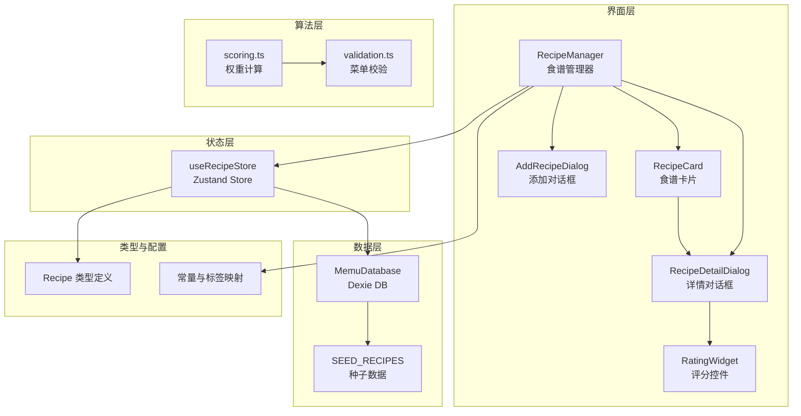
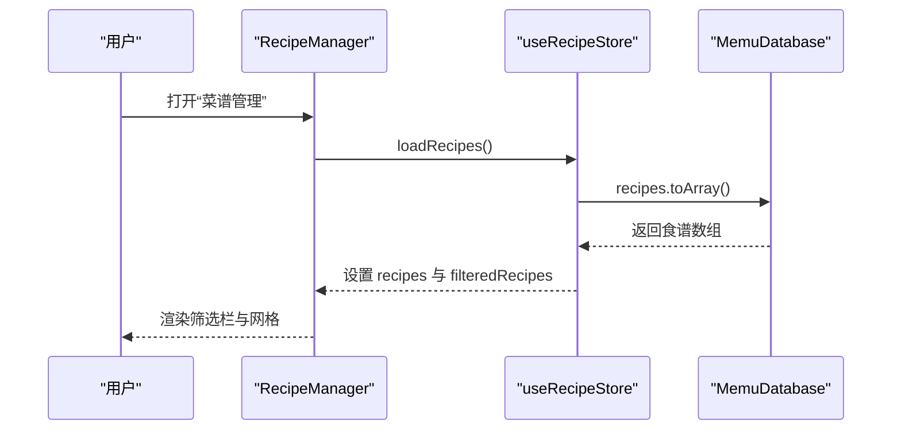
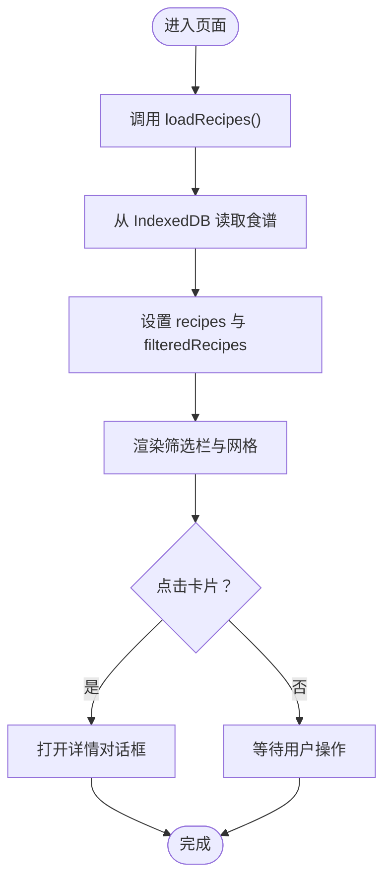
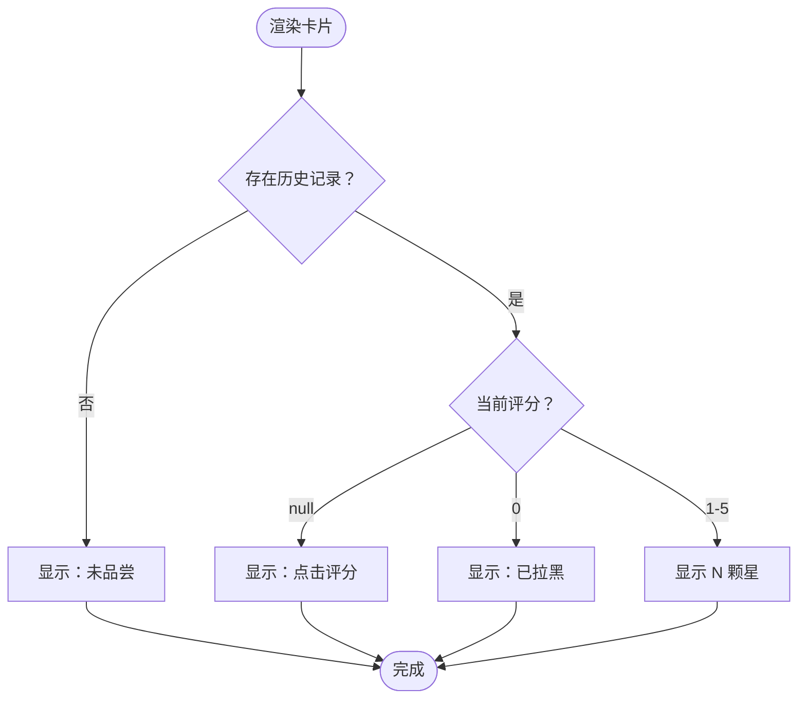
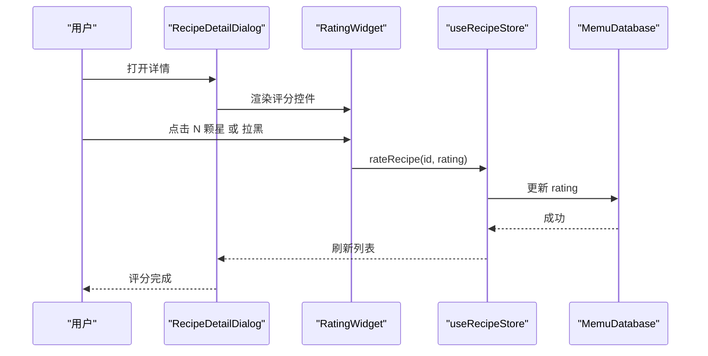
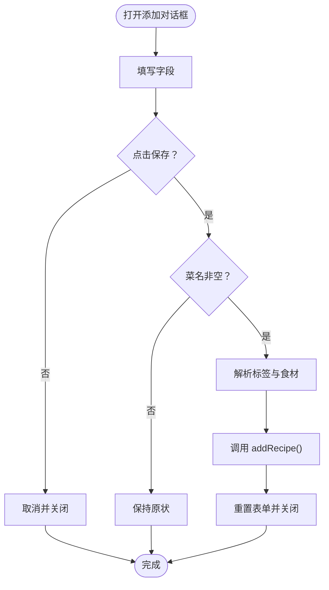
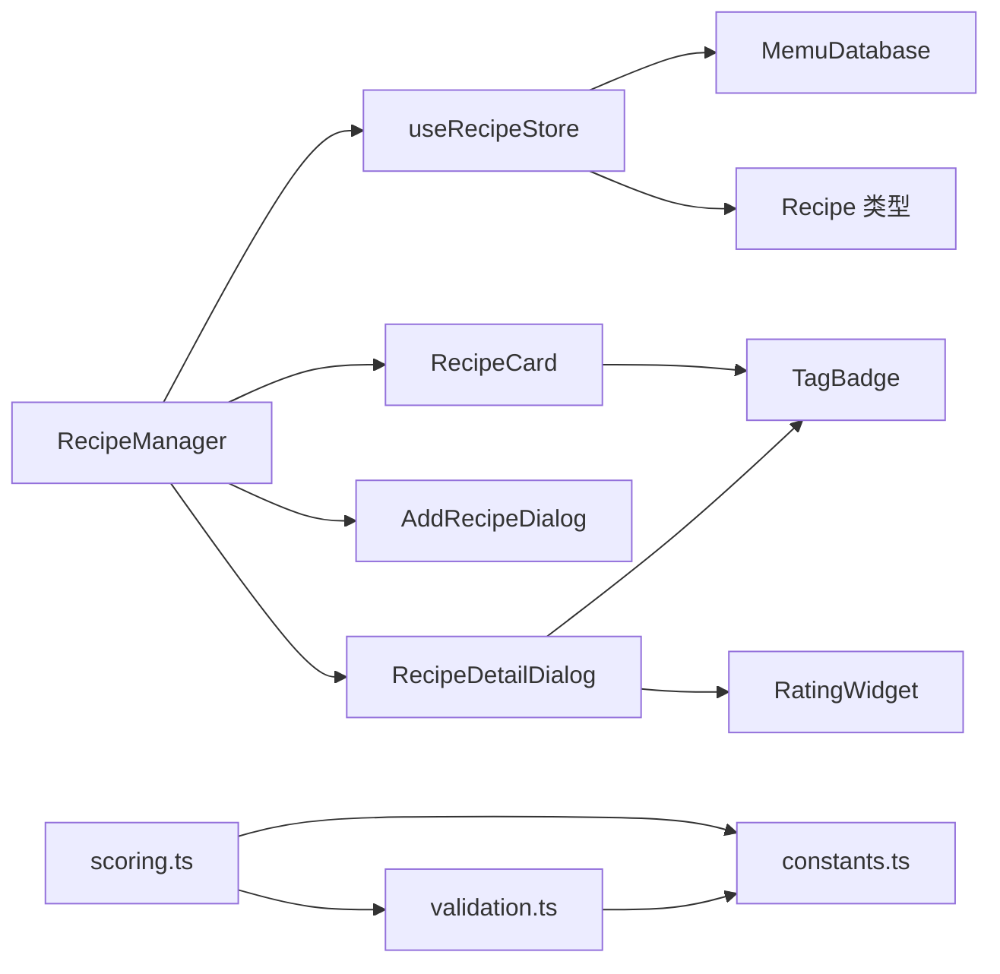

# 食谱管理系统

<cite>
**本文引用的文件**   
- [src/App.tsx](file://src/App.tsx)
- [src/components/Recipe/RecipeManager.tsx](file://src/components/Recipe/RecipeManager.tsx)
- [src/components/Recipe/RecipeCard.tsx](file://src/components/Recipe/RecipeCard.tsx)
- [src/components/Recipe/RecipeDetailDialog.tsx](file://src/components/Recipe/RecipeDetailDialog.tsx)
- [src/components/Recipe/AddRecipeDialog.tsx](file://src/components/Recipe/AddRecipeDialog.tsx)
- [src/components/Recipe/RatingWidget.tsx](file://src/components/Recipe/RatingWidget.tsx)
- [src/components/Common/TagBadge.tsx](file://src/components/Common/TagBadge.tsx)
- [src/store/useRecipeStore.ts](file://src/store/useRecipeStore.ts)
- [src/db/index.ts](file://src/db/index.ts)
- [src/db/seed.ts](file://src/db/seed.ts)
- [src/types/recipe.ts](file://src/types/recipe.ts)
- [src/config/constants.ts](file://src/config/constants.ts)
- [src/algorithms/scoring.ts](file://src/algorithms/scoring.ts)
- [src/algorithms/validation.ts](file://src/algorithms/validation.ts)
</cite>

## 目录
1. [简介](#简介)
2. [项目结构](#项目结构)
3. [核心组件](#核心组件)
4. [架构总览](#架构总览)
5. [详细组件分析](#详细组件分析)
6. [依赖分析](#依赖分析)
7. [性能考虑](#性能考虑)
8. [故障排除指南](#故障排除指南)
9. [结论](#结论)
10. [附录](#附录)

## 简介
本文件面向“食谱管理系统”的使用者与维护者，系统围绕“食谱管理器”展开，覆盖以下主题：
- 食谱管理器的完整实现：包括食谱网格展示、筛选与搜索、新增与详情交互。
- 食谱卡片组件设计：评分显示、标签呈现与视觉反馈。
- 食谱详情对话框与添加食谱对话框：评分、删除、历史记录与表单校验。
- 食谱 CRUD 操作、评分系统实现、搜索过滤功能与用户交互流程。
- 食谱数据模型、验证规则、状态管理策略与持久化机制。
- 与菜单规划系统的集成关系、API 接口规范与故障排除指南。

## 项目结构
系统采用前端单页应用架构，核心模块如下：
- 组件层：Recipe 管理相关 UI 组件（管理器、卡片、对话框、评分控件）。
- 状态层：Zustand store（useRecipeStore）集中管理食谱状态与动作。
- 数据层：Dexie IndexedDB 封装，提供本地持久化与种子数据初始化。
- 类型与配置：Recipe 数据模型、分类与标签常量、评分与菜单规则。
- 算法层：评分权重计算与菜单校验规则，支撑菜单规划系统。

图表来源
- [src/components/Recipe/RecipeManager.tsx:26-109](file://src/components/Recipe/RecipeManager.tsx#L26-L109)
- [src/components/Recipe/RecipeCard.tsx:45-99](file://src/components/Recipe/RecipeCard.tsx#L45-L99)
- [src/components/Recipe/RecipeDetailDialog.tsx:25-158](file://src/components/Recipe/RecipeDetailDialog.tsx#L25-L158)
- [src/components/Recipe/AddRecipeDialog.tsx:32-199](file://src/components/Recipe/AddRecipeDialog.tsx#L32-L199)
- [src/components/Recipe/RatingWidget.tsx:11-62](file://src/components/Recipe/RatingWidget.tsx#L11-L62)
- [src/store/useRecipeStore.ts:49-120](file://src/store/useRecipeStore.ts#L49-L120)
- [src/db/index.ts:7-67](file://src/db/index.ts#L7-L67)
- [src/db/seed.ts:8-708](file://src/db/seed.ts#L8-L708)
- [src/types/recipe.ts:11-20](file://src/types/recipe.ts#L11-L20)
- [src/config/constants.ts:33-43](file://src/config/constants.ts#L33-L43)
- [src/algorithms/scoring.ts:14-63](file://src/algorithms/scoring.ts#L14-L63)
- [src/algorithms/validation.ts:27-141](file://src/algorithms/validation.ts#L27-L141)

章节来源
- [src/App.tsx:11-82](file://src/App.tsx#L11-L82)
- [src/components/Recipe/RecipeManager.tsx:26-109](file://src/components/Recipe/RecipeManager.tsx#L26-L109)
- [src/store/useRecipeStore.ts:49-120](file://src/store/useRecipeStore.ts#L49-L120)
- [src/db/index.ts:7-67](file://src/db/index.ts#L7-L67)

## 核心组件
- 食谱管理器（RecipeManager）
  - 负责渲染头部、筛选栏（分类、关键词）、食谱网格与对话框容器。
  - 通过 useRecipeStore 获取过滤后的食谱列表，并在挂载时加载数据。
  - 点击卡片打开详情对话框。
- 食谱卡片（RecipeCard）
  - 展示名称、分类徽章、标签徽章与评分状态。
  - 评分状态根据历史记录与当前评分值动态呈现。
- 详情对话框（RecipeDetailDialog）
  - 展示食材、做法、历史足迹与评分控件。
  - 提供删除确认与删除动作。
- 添加对话框（AddRecipeDialog）
  - 表单收集菜名、分类、食材（支持多种分隔符）、做法与标签。
  - 校验必填项并提交到 store。
- 评分控件（RatingWidget）
  - 显示星级评分与“拉黑”按钮，依据是否有历史记录决定可用性。
- 标签徽章（TagBadge）
  - 基于分类映射生成不同样式的徽章。

章节来源
- [src/components/Recipe/RecipeManager.tsx:26-109](file://src/components/Recipe/RecipeManager.tsx#L26-L109)
- [src/components/Recipe/RecipeCard.tsx:45-99](file://src/components/Recipe/RecipeCard.tsx#L45-L99)
- [src/components/Recipe/RecipeDetailDialog.tsx:25-158](file://src/components/Recipe/RecipeDetailDialog.tsx#L25-L158)
- [src/components/Recipe/AddRecipeDialog.tsx:32-199](file://src/components/Recipe/AddRecipeDialog.tsx#L32-L199)
- [src/components/Recipe/RatingWidget.tsx:11-62](file://src/components/Recipe/RatingWidget.tsx#L11-L62)
- [src/components/Common/TagBadge.tsx:21-30](file://src/components/Common/TagBadge.tsx#L21-L30)

## 架构总览
系统采用“组件-状态-数据-算法”的分层架构：
- 组件层负责用户交互与视图渲染。
- 状态层（Zustand）统一管理食谱集合、过滤条件与过滤结果。
- 数据层（Dexie）提供 IndexedDB 访问与种子数据初始化。
- 算法层（scoring、validation）为菜单规划提供评分权重与规则校验。

图表来源
- [src/components/Recipe/RecipeManager.tsx:32-34](file://src/components/Recipe/RecipeManager.tsx#L32-L34)
- [src/store/useRecipeStore.ts:58-64](file://src/store/useRecipeStore.ts#L58-L64)
- [src/db/index.ts:7-22](file://src/db/index.ts#L7-L22)

## 详细组件分析

### 食谱管理器（RecipeManager）
职责与流程
- 初始化：组件挂载时调用 store 的 loadRecipes，从 IndexedDB 读取食谱并设置过滤结果。
- 交互：提供分类选择与关键词输入，通过 setFilters 动态更新过滤条件并即时刷新列表。
- 视图：无结果时提示“暂无菜谱”，有结果时以网格展示；点击卡片打开详情对话框。
- 对话框：同时渲染“添加”和“详情”对话框容器，分别用于新增与查看编辑。

图表来源
- [src/components/Recipe/RecipeManager.tsx:32-39](file://src/components/Recipe/RecipeManager.tsx#L32-L39)
- [src/store/useRecipeStore.ts:58-64](file://src/store/useRecipeStore.ts#L58-L64)

章节来源
- [src/components/Recipe/RecipeManager.tsx:26-109](file://src/components/Recipe/RecipeManager.tsx#L26-L109)

### 食谱卡片（RecipeCard）
设计要点
- 标签徽章：根据 tags 自动拼装徽章，支持“适宜老人”“夏季推荐”“凉菜”“辣”等。
- 评分显示：根据历史记录与评分值显示“未品尝”“点击评分”“已拉黑”或星级。
- 视觉反馈：当评分值为 0 时降低透明度并改变边框颜色，直观表达“拉黑”。

图表来源
- [src/components/Recipe/RecipeCard.tsx:13-43](file://src/components/Recipe/RecipeCard.tsx#L13-L43)

章节来源
- [src/components/Recipe/RecipeCard.tsx:45-99](file://src/components/Recipe/RecipeCard.tsx#L45-L99)

### 详情对话框（RecipeDetailDialog）
功能与交互
- 展示：分类徽章、标签徽章、食材列表、做法文本、历史足迹（按时间倒序）。
- 评分：委托 RatingWidget 完成评分与“拉黑”操作，评分前提条件为存在历史记录。
- 删除：通过 ConfirmDialog 确认删除，删除成功后关闭对话框并刷新列表。

图表来源
- [src/components/Recipe/RecipeDetailDialog.tsx:31-43](file://src/components/Recipe/RecipeDetailDialog.tsx#L31-L43)
- [src/components/Recipe/RatingWidget.tsx:11-62](file://src/components/Recipe/RatingWidget.tsx#L11-L62)
- [src/store/useRecipeStore.ts:81-90](file://src/store/useRecipeStore.ts#L81-L90)
- [src/db/index.ts:7-22](file://src/db/index.ts#L7-L22)

章节来源
- [src/components/Recipe/RecipeDetailDialog.tsx:25-158](file://src/components/Recipe/RecipeDetailDialog.tsx#L25-L158)

### 添加对话框（AddRecipeDialog）
表单与校验
- 字段：菜名（必填）、分类、食材（逗号/顿号/逗号分隔符）、做法、标签。
- 校验：菜名非空时才允许提交；提交过程中禁用按钮并显示“保存中…”。
- 提交：将标签与食材解析为数组，调用 store 的 addRecipe，成功后重置表单并关闭对话框。

图表来源
- [src/components/Recipe/AddRecipeDialog.tsx:56-86](file://src/components/Recipe/AddRecipeDialog.tsx#L56-L86)

章节来源
- [src/components/Recipe/AddRecipeDialog.tsx:32-199](file://src/components/Recipe/AddRecipeDialog.tsx#L32-L199)

### 评分控件（RatingWidget）
交互与可用性
- 可用性：仅当存在历史记录时允许评分；否则提示“需要先品尝才能评分”。
- 评分：支持 1-5 星点击评分；当前评分显示在右侧；支持“拉黑”按钮切换为 0 分。
- 视觉：根据当前评分填充星形图标颜色；拉黑状态下按钮变为破坏性样式。

章节来源
- [src/components/Recipe/RatingWidget.tsx:11-62](file://src/components/Recipe/RatingWidget.tsx#L11-L62)

### 食谱数据模型与过滤
数据模型（Recipe）
- 关键字段：id、name、category、tags、ingredients、instructions、rating、history_dates。
- rating 含义：null 表示未品尝，0 表示拉黑，1-5 表示星级评分。
- history_dates：历史食用日期数组，用于评分可用性判断与权重计算。

过滤逻辑（filterRecipes）
- 分类过滤：若选择“全部分类”则跳过；否则精确匹配。
- 标签过滤：要求食谱包含过滤器中的所有标签。
- 关键词过滤：在 name、ingredients、tags 的拼接字符串中进行包含匹配（忽略大小写）。

章节来源
- [src/types/recipe.ts:11-20](file://src/types/recipe.ts#L11-L20)
- [src/store/useRecipeStore.ts:27-47](file://src/store/useRecipeStore.ts#L27-L47)

### 状态管理策略（Zustand）
状态与动作
- 状态：recipes、filteredRecipes、filters（category、searchText、tags）。
- 动作：loadRecipes、addRecipe、updateRecipe、deleteRecipe、rateRecipe、recordUsageDates、setFilters、applyFilters。
- 过滤：setFilters 会同步更新 filteredRecipes；applyFilters 重新基于当前 recipes 与 filters 过滤。
- 事务：recordUsageDates 使用 Dexie 事务批量更新多个食谱的历史日期，避免重复写入。

章节来源
- [src/store/useRecipeStore.ts:49-120](file://src/store/useRecipeStore.ts#L49-L120)

### 持久化机制（IndexedDB/Dexie）
数据库设计
- 表：recipes、menuPlans、historyArchives。
- 索引：recipes 建有自增主键与 name、category、rating 索引。
- 种子数据：首次启动或版本升级时自动导入 SEED_RECIPES，并记录版本号。

初始化流程
- App 初始化时调用 initDatabase，随后 loadRecipes，确保页面渲染前数据就绪。

章节来源
- [src/db/index.ts:7-67](file://src/db/index.ts#L7-L67)
- [src/db/seed.ts:8-708](file://src/db/seed.ts#L8-L708)
- [src/App.tsx:15-22](file://src/App.tsx#L15-L22)

### 评分系统与菜单规划集成
评分权重计算
- 权重 = 基础分 × 新鲜度权重 × 季节加成
  - 基础分：rating 为 null 视为 3 星，否则 rating/5。
  - 新鲜度权重：上周 0.1、两周前 0.5、更早或从未 1.0。
  - 季节加成：夏季推荐且当前为 summer，或冬季推荐且当前为 winter，加成 1.2。
  - 拉黑直接返回 0。

菜单校验规则
- 早餐结构完整性、强制牛奶燕麦片日、粥类周上限、简餐天数、正餐配菜数量、健康兜底（至少一道适宜老人）、周内重复控制（5 星可放宽）。

章节来源
- [src/algorithms/scoring.ts:14-63](file://src/algorithms/scoring.ts#L14-L63)
- [src/algorithms/validation.ts:27-141](file://src/algorithms/validation.ts#L27-L141)
- [src/config/constants.ts:3-31](file://src/config/constants.ts#L3-L31)

## 依赖分析
- 组件间依赖
  - RecipeManager 依赖 useRecipeStore、RecipeCard、AddRecipeDialog、RecipeDetailDialog。
  - RecipeDetailDialog 依赖 RatingWidget、ConfirmDialog、TagBadge。
  - RecipeCard 依赖 TagBadge、Badge、Star 图标。
- 状态与数据依赖
  - useRecipeStore 依赖 db（Dexie），负责 CRUD 与过滤。
  - App 在初始化阶段调用 initDatabase 与 loadRecipes。
- 算法依赖
  - scoring 与 validation 依赖 constants 中的标签与配置。

图表来源
- [src/components/Recipe/RecipeManager.tsx:1-16](file://src/components/Recipe/RecipeManager.tsx#L1-L16)
- [src/components/Recipe/RecipeDetailDialog.tsx:1-17](file://src/components/Recipe/RecipeDetailDialog.tsx#L1-L17)
- [src/components/Recipe/AddRecipeDialog.tsx:1-21](file://src/components/Recipe/AddRecipeDialog.tsx#L1-L21)
- [src/components/Recipe/RecipeCard.tsx:1-6](file://src/components/Recipe/RecipeCard.tsx#L1-L6)
- [src/components/Recipe/RatingWidget.tsx:1-4](file://src/components/Recipe/RatingWidget.tsx#L1-L4)
- [src/components/Common/TagBadge.tsx:1-3](file://src/components/Common/TagBadge.tsx#L1-L3)
- [src/store/useRecipeStore.ts:1-4](file://src/store/useRecipeStore.ts#L1-L4)
- [src/db/index.ts:1-5](file://src/db/index.ts#L1-L5)
- [src/types/recipe.ts:1-20](file://src/types/recipe.ts#L1-L20)
- [src/config/constants.ts:1-44](file://src/config/constants.ts#L1-L44)
- [src/algorithms/scoring.ts:1-3](file://src/algorithms/scoring.ts#L1-L3)
- [src/algorithms/validation.ts:1-10](file://src/algorithms/validation.ts#L1-L10)

章节来源
- [src/store/useRecipeStore.ts:1-25](file://src/store/useRecipeStore.ts#L1-L25)
- [src/db/index.ts:1-22](file://src/db/index.ts#L1-L22)

## 性能考虑
- 过滤策略
  - 过滤函数对 keywords 进行一次 join 与 lowercase 操作，建议在数据量较大时考虑建立复合索引或预构建关键词索引。
- 评分权重
  - 权重计算为 O(n) 遍历，结合 fresh 和 season bonus 快速短路，整体开销可控。
- 批量更新
  - recordUsageDates 使用 Dexie 事务批量更新，避免多次 IO，减少 UI 阻塞。
- UI 渲染
  - 网格渲染使用响应式列数，建议在移动端启用虚拟滚动以提升长列表性能。

## 故障排除指南
常见问题与排查
- 无法看到任何食谱
  - 检查数据库初始化是否完成（App 初始化流程）。
  - 确认 loadRecipes 是否执行成功。
- 无法评分
  - 确认该食谱的 history_dates 是否为空；评分仅在存在历史记录时允许。
- 删除失败或未生效
  - 确认删除确认对话框是否触发；检查 store 的 deleteRecipe 与 loadRecipes 调用链。
- 过滤无效
  - 检查 setFilters 的调用与 applyFilters 的触发；确认过滤关键字是否正确（大小写不敏感）。
- 数据丢失或异常
  - 检查种子数据版本号与本地存储版本号；必要时调用 resetRecipesToSeed 重置。

章节来源
- [src/App.tsx:15-22](file://src/App.tsx#L15-L22)
- [src/store/useRecipeStore.ts:81-90](file://src/store/useRecipeStore.ts#L81-L90)
- [src/db/index.ts:37-67](file://src/db/index.ts#L37-L67)

## 结论
本系统以清晰的组件分层与轻量的状态管理实现了完整的食谱管理能力，配合本地 IndexedDB 持久化与种子数据初始化，保证了良好的用户体验与可维护性。评分权重与菜单校验算法为后续菜单规划提供了坚实的数据基础。建议在大规模数据场景下引入索引与虚拟滚动等优化手段，并持续完善错误边界与日志上报。

## 附录

### API 接口规范（Zustand Store 动作）
- loadRecipes(): Promise<void> —— 从 IndexedDB 读取食谱并设置状态。
- addRecipe(recipe: Omit<Recipe, 'id'>): Promise<void> —— 新增食谱并刷新列表。
- updateRecipe(id: number, updates: Partial<Recipe>): Promise<void> —— 更新食谱并刷新列表。
- deleteRecipe(id: number): Promise<void> —— 删除食谱并刷新列表。
- rateRecipe(id: number, rating: number): Promise<void> —— 评分或拉黑，前置条件为存在历史记录。
- recordUsageDates(recipeIds: number[], date: string): Promise<void> —— 为多个食谱追加历史日期，使用事务保证一致性。
- setFilters(partial: Partial<RecipeFilters>): void —— 更新过滤条件并同步刷新 filteredRecipes。
- applyFilters(): void —— 基于当前 filters 重新过滤已加载的 recipes。

章节来源
- [src/store/useRecipeStore.ts:16-25](file://src/store/useRecipeStore.ts#L16-L25)

### 评分系统接口（算法）
- calculateWeight(recipe, lastWeekRecipeIds, twoWeeksAgoIds, season): number —— 计算抽取权重。
- weightedRandomSelect(items: T[]): T —— 按权重随机选择，总权重为 0 时退化为均匀随机。

章节来源
- [src/algorithms/scoring.ts:14-63](file://src/algorithms/scoring.ts#L14-L63)