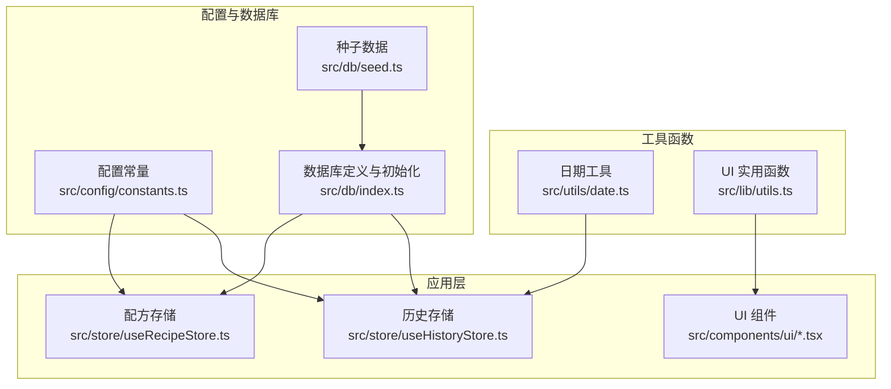
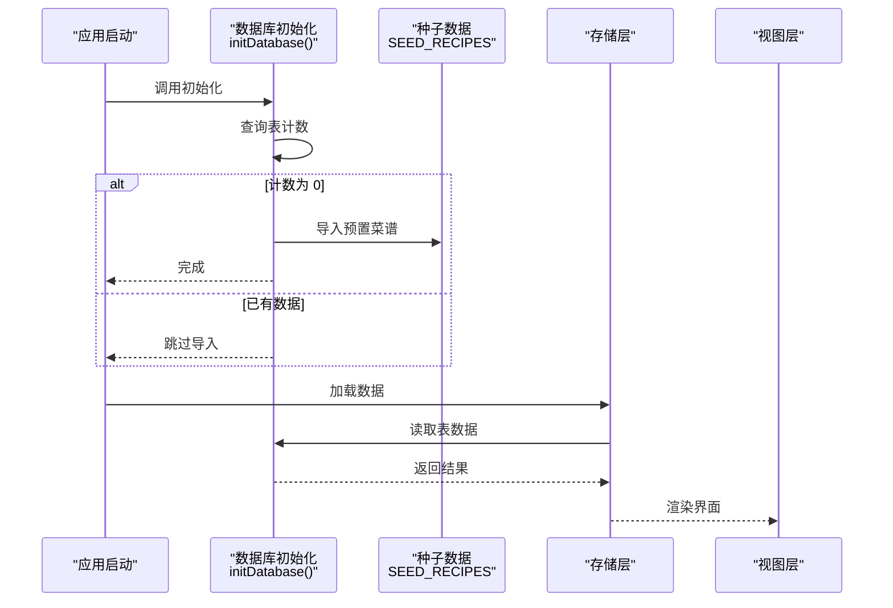
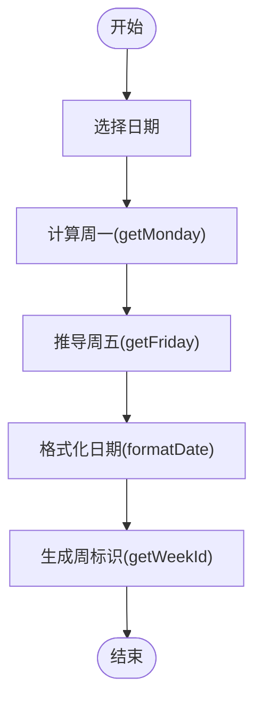
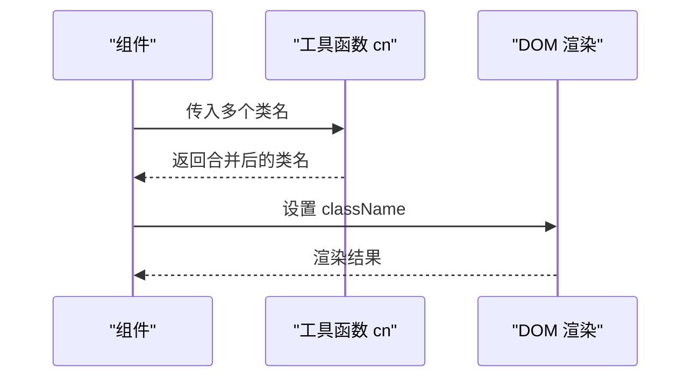
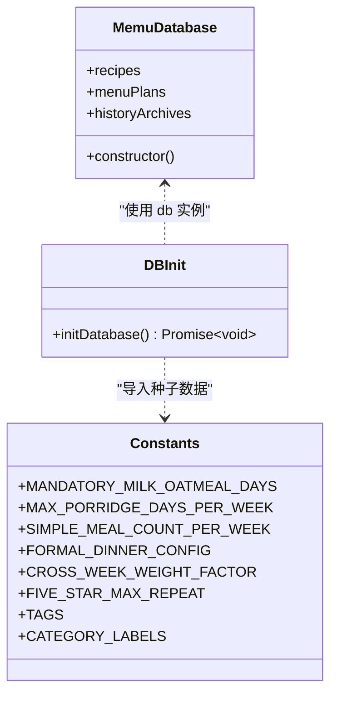
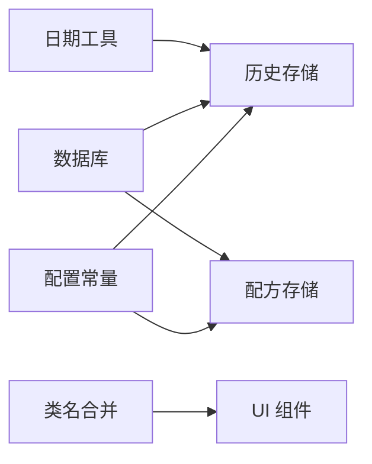

# 工具函数库

<cite>
**本文引用的文件**
- [src/utils/date.ts](file://src/utils/date.ts)
- [src/utils/index.ts](file://src/utils/index.ts)
- [src/lib/utils.ts](file://src/lib/utils.ts)
- [src/db/index.ts](file://src/db/index.ts)
- [src/db/seed.ts](file://src/db/seed.ts)
- [src/config/constants.ts](file://src/config/constants.ts)
- [src/config/index.ts](file://src/config/index.ts)
- [src/store/useRecipeStore.ts](file://src/store/useRecipeStore.ts)
- [src/store/useHistoryStore.ts](file://src/store/useHistoryStore.ts)
- [src/components/ui/button.tsx](file://src/components/ui/button.tsx)
- [src/components/ui/card.tsx](file://src/components/ui/card.tsx)
</cite>

## 目录
1. [简介](#简介)
2. [项目结构](#项目结构)
3. [核心组件](#核心组件)
4. [架构总览](#架构总览)
5. [详细组件分析](#详细组件分析)
6. [依赖分析](#依赖分析)
7. [性能考虑](#性能考虑)
8. [故障排查指南](#故障排查指南)
9. [结论](#结论)
10. [附录](#附录)

## 简介
本文件系统性梳理 Memu 工具函数库，覆盖以下主题：
- 日期处理工具：周起始计算、ISO 周标识生成、日期格式化、周边界推导
- 通用实用函数：Tailwind CSS 类名合并工具
- 数据库初始化与配置常量：Dexie 数据库定义、版本迁移、种子数据导入、业务规则常量

文档将逐项说明各工具函数的功能、参数规范、返回值类型、使用场景、组合使用模式、性能与错误处理策略，并给出最佳实践与扩展建议。

## 项目结构
工具函数库主要分布在如下位置：
- 日期工具：src/utils/date.ts，统一导出入口 src/utils/index.ts
- UI 实用函数：src/lib/utils.ts（类名合并）
- 数据库与种子数据：src/db/index.ts、src/db/seed.ts
- 配置常量：src/config/constants.ts，统一导出入口 src/config/index.ts
- 使用示例：多个组件与存储层通过上述工具完成日期格式化、类名合并、数据库读写与初始化

**图表来源**
- [src/utils/date.ts:1-49](file://src/utils/date.ts#L1-L49)
- [src/lib/utils.ts:1-7](file://src/lib/utils.ts#L1-L7)
- [src/db/index.ts:1-34](file://src/db/index.ts#L1-L34)
- [src/db/seed.ts:1-745](file://src/db/seed.ts#L1-L745)
- [src/config/constants.ts:1-44](file://src/config/constants.ts#L1-L44)
- [src/store/useRecipeStore.ts:58-90](file://src/store/useRecipeStore.ts#L58-L90)
- [src/store/useHistoryStore.ts:21-44](file://src/store/useHistoryStore.ts#L21-L44)
- [src/components/ui/button.tsx:1-36](file://src/components/ui/button.tsx#L1-L36)
- [src/components/ui/card.tsx:1-50](file://src/components/ui/card.tsx#L1-L50)

**章节来源**
- [src/utils/date.ts:1-49](file://src/utils/date.ts#L1-L49)
- [src/lib/utils.ts:1-7](file://src/lib/utils.ts#L1-L7)
- [src/db/index.ts:1-34](file://src/db/index.ts#L1-L34)
- [src/db/seed.ts:1-745](file://src/db/seed.ts#L1-L745)
- [src/config/constants.ts:1-44](file://src/config/constants.ts#L1-L44)
- [src/config/index.ts:1-2](file://src/config/index.ts#L1-L2)
- [src/utils/index.ts:1-2](file://src/utils/index.ts#L1-L2)

## 核心组件
- 日期处理工具集：提供周起始、ISO 周标识、日期格式化、周边界推导等能力
- UI 类名合并工具：对 Tailwind CSS 类进行安全合并
- 数据库与种子数据：基于 Dexie 的本地数据库定义与首次启动数据填充
- 配置常量：业务规则与标签映射，供存储层与展示层复用

**章节来源**
- [src/utils/date.ts:1-49](file://src/utils/date.ts#L1-L49)
- [src/lib/utils.ts:1-7](file://src/lib/utils.ts#L1-L7)
- [src/db/index.ts:1-34](file://src/db/index.ts#L1-L34)
- [src/db/seed.ts:1-745](file://src/db/seed.ts#L1-L745)
- [src/config/constants.ts:1-44](file://src/config/constants.ts#L1-L44)

## 架构总览
工具函数库在系统中的角色：
- 日期工具用于历史归档的时间轴展示与周计划边界计算
- UI 工具保障组件样式类名的正确合并
- 数据库工具负责首次启动的数据注入与后续 CRUD
- 配置常量作为跨模块共享的业务规则来源

**图表来源**
- [src/db/index.ts:27-33](file://src/db/index.ts#L27-L33)
- [src/db/seed.ts:1-745](file://src/db/seed.ts#L1-L745)
- [src/store/useRecipeStore.ts:58-64](file://src/store/useRecipeStore.ts#L58-L64)

## 详细组件分析

### 日期处理工具
功能清单与行为说明：
- 获取本周一：给定任意日期，返回该周的周一（当日 00:00:00）
- 获取 ISO 周标识：生成形如 "YYYY-Www" 的周标识
- 日期格式化：将 Date 对象格式化为 "YYYY-MM-DD"
- 获取下周一：在当前周的基础上推进到下周同一星期一
- 基于周一推周五：从周一日期推导当周周五

参数与返回值规范：
- getMonday(date?: Date): Date
- getWeekId(date?: Date): string
- formatDate(date: Date): string
- getNextMonday(date?: Date): Date
- getFriday(monday: Date): Date

使用场景：
- 历史归档时间轴展示：根据 weekId 与 weekStart/weekEnd 展示周区间
- 周菜单规划：以周一为基准推导一周范围
- 日志与报表：统一日期格式输出

组合使用模式：
- 先用 getMonday 或 getWeekId 确定周边界，再用 formatDate 输出展示文本
- 在历史存储中，先计算 weekStart/weekEnd，再生成 weekId 作为索引键

性能与错误处理：
- 时间复杂度均为 O(1)，空间复杂度 O(1)
- 输入为 Date 对象，内部会复制一份避免外部状态污染
- 未见显式异常抛出，建议调用方确保传入合法 Date

**图表来源**
- [src/utils/date.ts:4-11](file://src/utils/date.ts#L4-L11)
- [src/utils/date.ts:44-48](file://src/utils/date.ts#L44-L48)
- [src/utils/date.ts:28-30](file://src/utils/date.ts#L28-L30)
- [src/utils/date.ts:16-23](file://src/utils/date.ts#L16-L23)

**章节来源**
- [src/utils/date.ts:1-49](file://src/utils/date.ts#L1-L49)
- [src/utils/index.ts:1-2](file://src/utils/index.ts#L1-L2)

### UI 实用函数（类名合并）
功能：对一组类名进行合并与冲突消解，保证最终渲染的类名集合正确且无重复。

函数签名：
- cn(...inputs: ClassValue[]): string

使用场景：
- UI 组件（如 Button、Card）根据变体与尺寸动态拼接类名
- 避免重复类名导致的样式覆盖问题

最佳实践：
- 优先使用 cn 组合变体与尺寸类，减少手动字符串拼接
- 保持类名粒度清晰，便于主题切换与样式维护

**图表来源**
- [src/lib/utils.ts:4-6](file://src/lib/utils.ts#L4-L6)
- [src/components/ui/button.tsx](file://src/components/ui/button.tsx#L4)
- [src/components/ui/card.tsx](file://src/components/ui/card.tsx#L2)

**章节来源**
- [src/lib/utils.ts:1-7](file://src/lib/utils.ts#L1-L7)
- [src/components/ui/button.tsx:1-36](file://src/components/ui/button.tsx#L1-L36)
- [src/components/ui/card.tsx:1-50](file://src/components/ui/card.tsx#L1-L50)

### 数据库初始化与配置常量
数据库设计要点：
- 使用 Dexie 定义三张表：recipes、menuPlans、historyArchives
- 版本 1 的 stores 映射包含自增主键与常用查询字段索引
- 提供全局实例 db 与初始化函数 initDatabase

初始化流程：
- 启动时检查 recipes 表是否为空
- 若为空则批量导入 SEED_RECIPES
- 成功后控制台输出导入数量日志

配置常量：
- 业务规则：强制牛奶燕麦日、粥类每周上限、简餐每周次数、正餐配置（默认/夏/冬）、跨周降权系数、五星菜重复限制
- 标签常量：面向老人、夏季推荐、凉菜、冬季推荐、粥类、辣
- 分类中文映射：category 到中文标签的映射

**图表来源**
- [src/db/index.ts:7-22](file://src/db/index.ts#L7-L22)
- [src/db/index.ts:27-33](file://src/db/index.ts#L27-L33)
- [src/db/seed.ts:1-745](file://src/db/seed.ts#L1-L745)
- [src/config/constants.ts:1-44](file://src/config/constants.ts#L1-L44)

**章节来源**
- [src/db/index.ts:1-34](file://src/db/index.ts#L1-L34)
- [src/db/seed.ts:1-745](file://src/db/seed.ts#L1-L745)
- [src/config/constants.ts:1-44](file://src/config/constants.ts#L1-L44)
- [src/config/index.ts:1-2](file://src/config/index.ts#L1-L2)

## 依赖分析
- 日期工具被历史存储与视图层使用，用于周区间展示与排序
- UI 工具被所有 UI 组件依赖，确保类名合并一致性
- 数据库工具被存储层广泛使用，贯穿数据加载、更新、删除与评分校验
- 配置常量被存储层与展示层复用，保证业务规则一致

**图表来源**
- [src/utils/date.ts:1-49](file://src/utils/date.ts#L1-L49)
- [src/lib/utils.ts:1-7](file://src/lib/utils.ts#L1-L7)
- [src/db/index.ts:1-34](file://src/db/index.ts#L1-L34)
- [src/config/constants.ts:1-44](file://src/config/constants.ts#L1-L44)
- [src/store/useRecipeStore.ts:58-90](file://src/store/useRecipeStore.ts#L58-L90)
- [src/store/useHistoryStore.ts:21-44](file://src/store/useHistoryStore.ts#L21-L44)

**章节来源**
- [src/store/useRecipeStore.ts:58-90](file://src/store/useRecipeStore.ts#L58-L90)
- [src/store/useHistoryStore.ts:21-44](file://src/store/useHistoryStore.ts#L21-L44)

## 性能考虑
- 日期工具均为纯函数，O(1) 时间与空间复杂度，适合高频调用
- 类名合并工具在组件渲染阶段执行，调用次数较多但单次开销极小
- 数据库初始化仅在首次启动执行，bulkAdd 一次性导入，避免多次事务开销
- 建议在组件中缓存 weekId 与格式化后的日期字符串，减少重复计算

## 故障排查指南
- 日期计算异常
  - 现象：周边界不正确或格式化输出异常
  - 排查：确认输入为合法 Date；检查 getMonday 是否被正确调用；核对 getWeekId 的年份边界逻辑
  - 参考路径：[src/utils/date.ts:4-11](file://src/utils/date.ts#L4-L11)、[src/utils/date.ts:16-23](file://src/utils/date.ts#L16-L23)、[src/utils/date.ts:28-30](file://src/utils/date.ts#L28-L30)

- 类名冲突或样式错乱
  - 现象：组件样式不符合预期
  - 排查：检查 cn 的参数顺序与条件拼接；确认变体与尺寸类的互斥关系
  - 参考路径：[src/lib/utils.ts:4-6](file://src/lib/utils.ts#L4-L6)、[src/components/ui/button.tsx:4-30](file://src/components/ui/button.tsx#L4-L30)

- 数据库初始化失败
  - 现象：首次启动未导入种子数据
  - 排查：确认 initDatabase 被调用；检查 db.recipes.count() 结果；验证 SEED_RECIPES 结构与类型匹配
  - 参考路径：[src/db/index.ts:27-33](file://src/db/index.ts#L27-L33)、[src/db/seed.ts:1-745](file://src/db/seed.ts#L1-L745)

- 评分校验失败
  - 现象：尝试对未使用的菜品评分时报错
  - 排查：确认菜品的 history_dates 非空；仅允许评分已使用过的菜品
  - 参考路径：[src/store/useRecipeStore.ts:82-87](file://src/store/useRecipeStore.ts#L82-L87)

**章节来源**
- [src/utils/date.ts:1-49](file://src/utils/date.ts#L1-L49)
- [src/lib/utils.ts:1-7](file://src/lib/utils.ts#L1-L7)
- [src/db/index.ts:27-33](file://src/db/index.ts#L27-L33)
- [src/db/seed.ts:1-745](file://src/db/seed.ts#L1-L745)
- [src/store/useRecipeStore.ts:82-87](file://src/store/useRecipeStore.ts#L82-L87)

## 结论
工具函数库以“纯函数 + 轻量封装”的方式提供了日期处理、UI 类名合并、数据库初始化与配置常量四大能力域。它们在系统中承担了“横切关注点”的职责，既保证了业务一致性，又降低了模块间的耦合度。建议在新增功能时遵循现有模式：优先复用既有工具，必要时以相同风格扩展。

## 附录

### 使用示例与最佳实践
- 历史记录展示
  - 使用 getWeekId 与 formatDate 组合生成周标签
  - 参考路径：[src/store/useHistoryStore.ts:21-26](file://src/store/useHistoryStore.ts#L21-L26)、[src/utils/date.ts:16-23](file://src/utils/date.ts#L16-L23)、[src/utils/date.ts:28-30](file://src/utils/date.ts#L28-L30)

- 组件样式合并
  - 使用 cn 动态拼接按钮变体与尺寸
  - 参考路径：[src/components/ui/button.tsx:4-30](file://src/components/ui/button.tsx#L4-L30)、[src/lib/utils.ts:4-6](file://src/lib/utils.ts#L4-L6)

- 首次启动数据注入
  - 在应用初始化阶段调用 initDatabase
  - 参考路径：[src/db/index.ts:27-33](file://src/db/index.ts#L27-L33)、[src/db/seed.ts:1-745](file://src/db/seed.ts#L1-L745)

- 业务规则复用
  - 在存储层与展示层统一引用配置常量
  - 参考路径：[src/config/constants.ts:1-44](file://src/config/constants.ts#L1-L44)、[src/config/index.ts:1-2](file://src/config/index.ts#L1-L2)

### 扩展建议
- 日期工具
  - 新增“月起始/月末”、“季度边界”等辅助函数，便于更丰富的报表需求
  - 为 getWeekId 增加可选的时区参数，提升国际化兼容性

- UI 工具
  - 增加支持条件类名的对象形式，简化复杂条件拼接

- 数据库与种子
  - 为种子数据增加版本号与变更记录，便于后续升级策略
  - 增加数据迁移脚本模板，支持未来 schema 变更

- 配置常量
  - 将部分硬编码阈值（如五星菜重复上限）迁移到配置常量，便于运行时调整