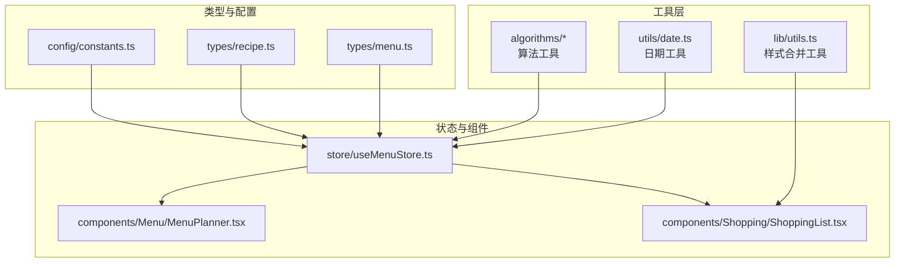
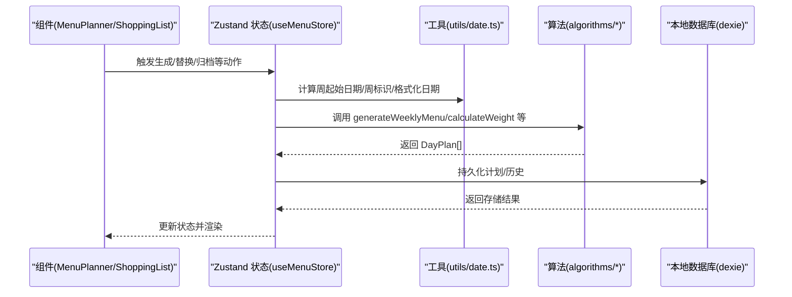
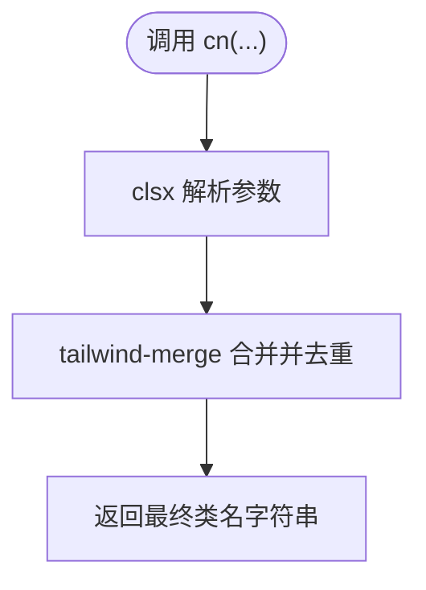
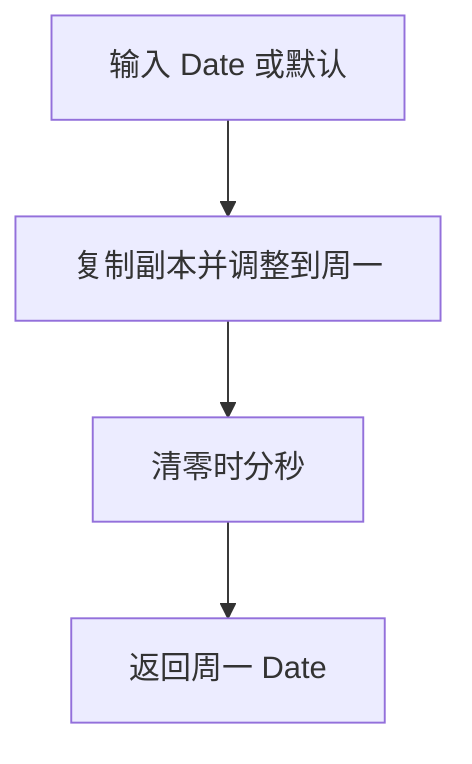
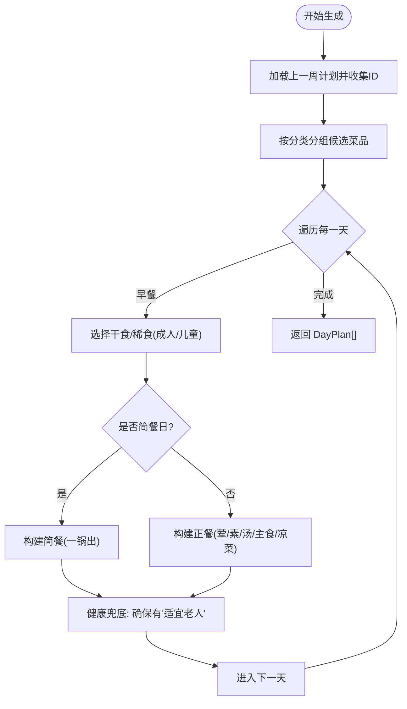
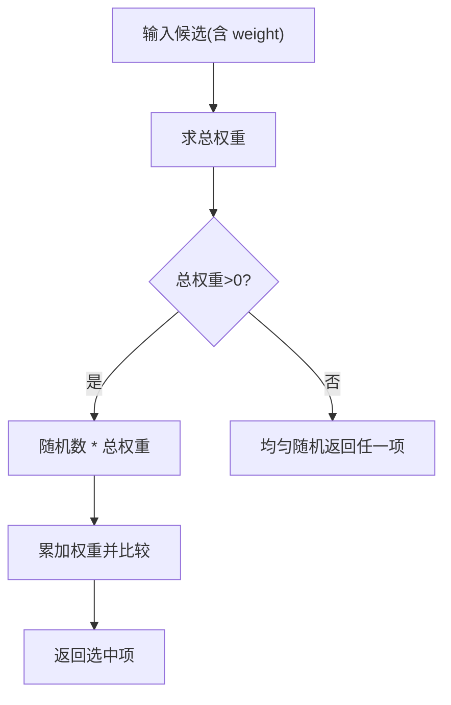
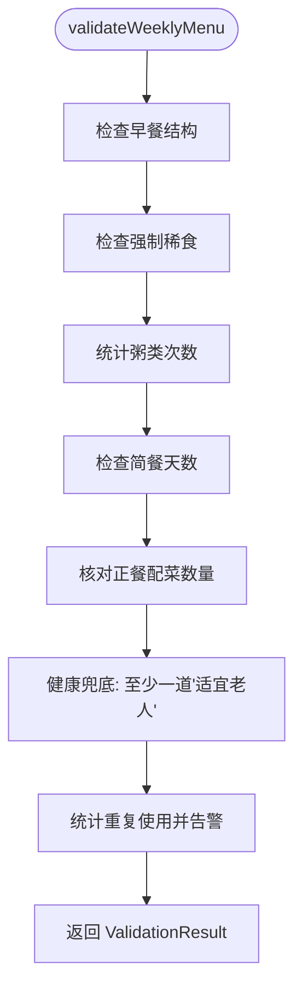
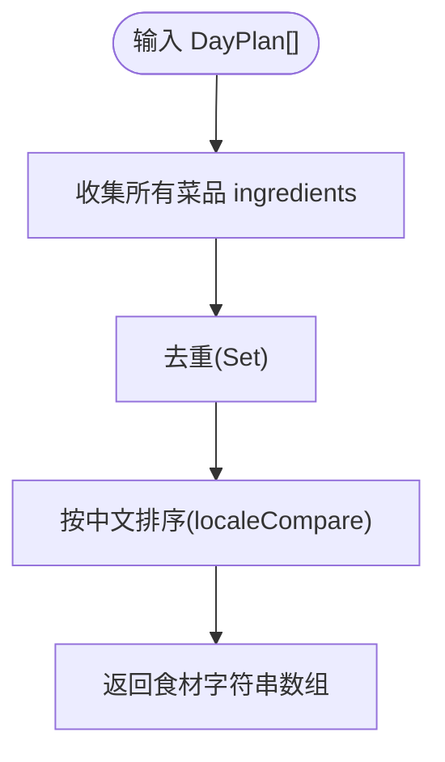
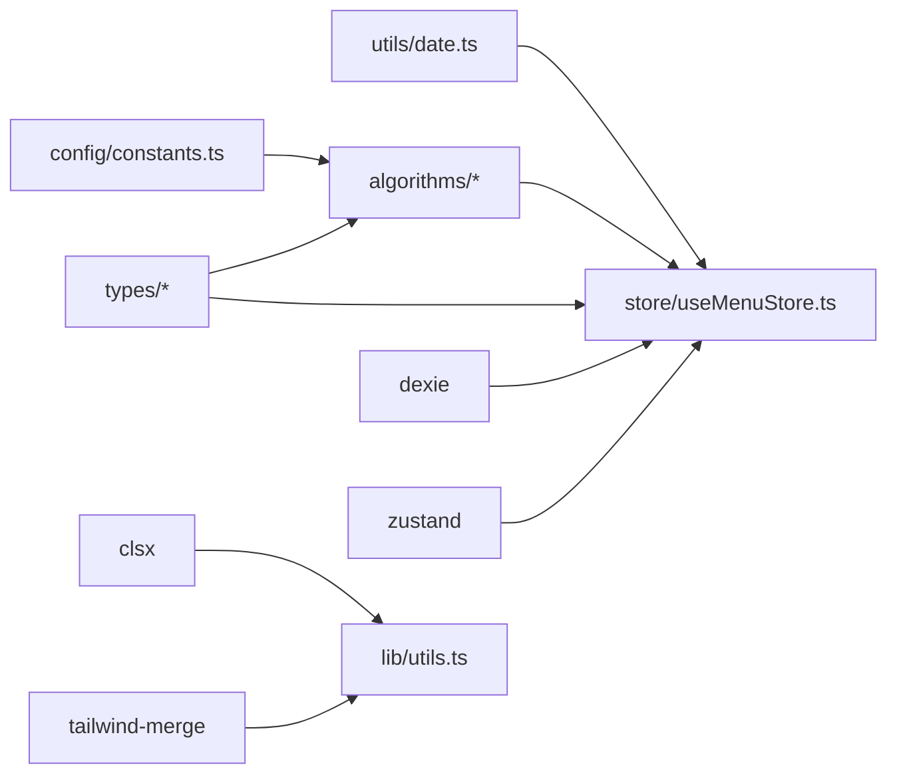

# 库级工具函数

<cite>
**本文引用的文件**
- [src/lib/utils.ts](file://src/lib/utils.ts)
- [src/utils/index.ts](file://src/utils/index.ts)
- [src/utils/date.ts](file://src/utils/date.ts)
- [src/algorithms/index.ts](file://src/algorithms/index.ts)
- [src/algorithms/menuGenerator.ts](file://src/algorithms/menuGenerator.ts)
- [src/algorithms/scoring.ts](file://src/algorithms/scoring.ts)
- [src/algorithms/validation.ts](file://src/algorithms/validation.ts)
- [src/algorithms/shoppingList.ts](file://src/algorithms/shoppingList.ts)
- [src/types/menu.ts](file://src/types/menu.ts)
- [src/types/recipe.ts](file://src/types/recipe.ts)
- [src/config/constants.ts](file://src/config/constants.ts)
- [src/store/useMenuStore.ts](file://src/store/useMenuStore.ts)
- [src/components/Menu/MenuPlanner.tsx](file://src/components/Menu/MenuPlanner.tsx)
- [src/components/Shopping/ShoppingList.tsx](file://src/components/Shopping/ShoppingList.tsx)
- [package.json](file://package.json)
</cite>

## 目录
1. [引言](#引言)
2. [项目结构](#项目结构)
3. [核心组件](#核心组件)
4. [架构总览](#架构总览)
5. [详细组件分析](#详细组件分析)
6. [依赖关系分析](#依赖关系分析)
7. [性能考量](#性能考量)
8. [故障排查指南](#故障排查指南)
9. [结论](#结论)
10. [附录](#附录)

## 引言
本文件聚焦于库级工具函数的设计与实现，系统梳理 utils 函数库的目的、类型定义、参数校验与错误处理机制，并结合实际业务场景（菜单生成、购物清单、日期工具）说明其可重用性、性能与内存优化策略。同时提供在 React 组件中的使用示例与集成指南，以及与第三方库（如 clsx、tailwind-merge、dexie、zustand）的集成方式与兼容性注意事项。

## 项目结构
- 工具函数分布
  - 样式合并工具：lib/utils.ts
  - 日期工具：utils/date.ts，通过 utils/index.ts 导出
  - 算法工具：algorithms/*，通过 algorithms/index.ts 统一导出
- 类型定义：types/menu.ts、types/recipe.ts
- 配置常量：config/constants.ts
- React 组件集成点：MenuPlanner.tsx、ShoppingList.tsx
- 状态管理：store/useMenuStore.ts

图表来源
- [src/lib/utils.ts:1-7](file://src/lib/utils.ts#L1-L7)
- [src/utils/date.ts:1-49](file://src/utils/date.ts#L1-L49)
- [src/algorithms/index.ts:1-6](file://src/algorithms/index.ts#L1-L6)
- [src/types/menu.ts:1-45](file://src/types/menu.ts#L1-L45)
- [src/types/recipe.ts:1-21](file://src/types/recipe.ts#L1-L21)
- [src/config/constants.ts:1-44](file://src/config/constants.ts#L1-L44)
- [src/store/useMenuStore.ts:1-292](file://src/store/useMenuStore.ts#L1-L292)
- [src/components/Menu/MenuPlanner.tsx:1-75](file://src/components/Menu/MenuPlanner.tsx#L1-L75)
- [src/components/Shopping/ShoppingList.tsx:1-130](file://src/components/Shopping/ShoppingList.tsx#L1-L130)

章节来源
- [src/lib/utils.ts:1-7](file://src/lib/utils.ts#L1-L7)
- [src/utils/index.ts:1-2](file://src/utils/index.ts#L1-L2)
- [src/utils/date.ts:1-49](file://src/utils/date.ts#L1-L49)
- [src/algorithms/index.ts:1-6](file://src/algorithms/index.ts#L1-L6)
- [src/types/menu.ts:1-45](file://src/types/menu.ts#L1-L45)
- [src/types/recipe.ts:1-21](file://src/types/recipe.ts#L1-L21)
- [src/config/constants.ts:1-44](file://src/config/constants.ts#L1-L44)
- [src/store/useMenuStore.ts:1-292](file://src/store/useMenuStore.ts#L1-L292)
- [src/components/Menu/MenuPlanner.tsx:1-75](file://src/components/Menu/MenuPlanner.tsx#L1-L75)
- [src/components/Shopping/ShoppingList.tsx:1-130](file://src/components/Shopping/ShoppingList.tsx#L1-L130)

## 核心组件
- 样式合并工具 cn
  - 功能：合并类名并进行 Tailwind 冲突修复
  - 输入：可变参数，元素为类名值
  - 输出：合并后的类名字符串
  - 依赖：clsx、tailwind-merge
- 日期工具
  - getMonday：获取指定日期所在周的周一（当日置0时分秒）
  - getWeekId：生成 ISO 周标识（如 "2024-W41"）
  - formatDate：格式化日期为 YYYY-MM-DD
  - getNextMonday：获取下周一
  - getFriday：根据周一推导周五
- 算法工具
  - generateWeeklyMenu：生成一周菜单（周一至周五）
  - calculateWeight / weightedRandomSelect：加权随机选择
  - validateWeeklyMenu：校验菜单是否符合规则
  - generateShoppingList：根据选中天数合并并去重食材

章节来源
- [src/lib/utils.ts:1-7](file://src/lib/utils.ts#L1-L7)
- [src/utils/date.ts:1-49](file://src/utils/date.ts#L1-L49)
- [src/algorithms/menuGenerator.ts:134-232](file://src/algorithms/menuGenerator.ts#L134-L232)
- [src/algorithms/scoring.ts:14-63](file://src/algorithms/scoring.ts#L14-L63)
- [src/algorithms/validation.ts:27-141](file://src/algorithms/validation.ts#L27-L141)
- [src/algorithms/shoppingList.ts:11-31](file://src/algorithms/shoppingList.ts#L11-L31)

## 架构总览
工具函数在应用中的位置与调用链路如下：

图表来源
- [src/store/useMenuStore.ts:131-152](file://src/store/useMenuStore.ts#L131-L152)
- [src/utils/date.ts:4-48](file://src/utils/date.ts#L4-L48)
- [src/algorithms/menuGenerator.ts:134-232](file://src/algorithms/menuGenerator.ts#L134-L232)
- [src/algorithms/scoring.ts:14-63](file://src/algorithms/scoring.ts#L14-L63)

## 详细组件分析

### 样式合并工具 cn
- 设计目的：统一类名拼接与冲突修复，提升 UI 组件复用性与一致性
- 实现要点
  - 输入参数类型：ClassValue...（支持字符串、对象、数组等）
  - 依赖：clsx 负责解析，tailwind-merge 解决冲突
- 错误处理：无显式异常；若传入无效值，遵循 clsx/tailwind-merge 的默认行为
- 性能与内存
  - 单次调用 O(n)（n 为输入类名数量），空间开销小
  - 适合高频调用（每个组件渲染时）

图表来源
- [src/lib/utils.ts:4-6](file://src/lib/utils.ts#L4-L6)

章节来源
- [src/lib/utils.ts:1-7](file://src/lib/utils.ts#L1-L7)

### 日期工具
- 设计目的：支撑菜单周视图与历史归档的时间计算
- 关键函数
  - getMonday：复制日期并调整到周一起点，清零时分秒
  - getWeekId：按 ISO 第四日法计算周序号，输出形如 "YYYY-Wxx"
  - formatDate：标准化日期字符串
  - getNextMonday / getFriday：辅助周范围推导
- 参数与错误处理
  - 默认参数为当前时间，避免空值
  - 无显式抛错；边界情况由 Date 对象行为决定
- 性能与内存
  - O(1) 时间复杂度，极低内存占用

图表来源
- [src/utils/date.ts:4-11](file://src/utils/date.ts#L4-L11)

章节来源
- [src/utils/date.ts:1-49](file://src/utils/date.ts#L1-L49)

### 菜单生成算法
- 设计目的：自动生成一周菜单，满足营养、多样性和季节偏好
- 核心流程
  - 读取上一周计划，构建跨周使用集合
  - 按分类分组候选菜品，计算权重并加权随机选择
  - 构建简餐/正餐，健康兜底确保至少一道“适宜老人”
  - 生成 DayPlan[] 结果
- 关键数据结构
  - DayPlan/BreakfastPlan/DinnerPlan/DinnerDish
  - UsageMap：菜品使用计数
  - PickContext：包含 lastWeekIds、twoWeeksAgoIds、season
- 参数与错误处理
  - 所有函数均接收明确类型参数，内部无抛错逻辑
  - 通过 fallback 机制保证在池枯竭时仍可返回合理结果
- 性能与内存
  - 时间复杂度近似 O(W×C×logU)，W 为天数，C 为分类数，U 为使用映射操作
  - 内存主要来自 Map/Set 与临时数组，整体可控

图表来源
- [src/algorithms/menuGenerator.ts:134-232](file://src/algorithms/menuGenerator.ts#L134-L232)
- [src/algorithms/menuGenerator.ts:238-260](file://src/algorithms/menuGenerator.ts#L238-L260)
- [src/algorithms/menuGenerator.ts:266-342](file://src/algorithms/menuGenerator.ts#L266-L342)
- [src/algorithms/menuGenerator.ts:347-373](file://src/algorithms/menuGenerator.ts#L347-L373)

章节来源
- [src/algorithms/menuGenerator.ts:1-374](file://src/algorithms/menuGenerator.ts#L1-L374)
- [src/types/menu.ts:1-45](file://src/types/menu.ts#L1-L45)

### 加权随机选择
- 设计目的：在候选集中按权重概率抽取，兼顾多样性与偏好
- 关键函数
  - calculateWeight：综合评分、新鲜度与季节偏好
  - weightedRandomSelect：总权重为 0 时退化为均匀随机
- 参数与错误处理
  - weightedRandomSelect 对空列表直接抛错，调用方需保证非空
- 性能与内存
  - calculateWeight O(1)
  - weightedRandomSelect O(n)，n 为候选数

图表来源
- [src/algorithms/scoring.ts:14-42](file://src/algorithms/scoring.ts#L14-L42)
- [src/algorithms/scoring.ts:48-63](file://src/algorithms/scoring.ts#L48-L63)

章节来源
- [src/algorithms/scoring.ts:1-64](file://src/algorithms/scoring.ts#L1-L64)

### 菜单校验
- 设计目的：确保生成的菜单符合预设规则（结构、强制项、限额、配菜数量、重复限制等）
- 关键点
  - 早餐结构完整性检查
  - 强制“牛奶燕麦片”规则
  - 粥类周限额
  - 正餐配菜数量与季节模式一致
  - 健康兜底提示
  - 重复使用统计与警告
- 返回值：ValidationResult（valid、errors、warnings）

图表来源
- [src/algorithms/validation.ts:27-141](file://src/algorithms/validation.ts#L27-L141)

章节来源
- [src/algorithms/validation.ts:1-142](file://src/algorithms/validation.ts#L1-L142)

### 购物清单生成
- 设计目的：根据选中的天数合并食材并去重，按中文排序便于查看
- 关键点
  - 合并干食、稀食与晚餐菜品的 ingredients
  - 字符串级别去重与排序
- 性能与内存
  - O(S) 时间（S 为总食材数），Set 去重与排序带来额外成本但可接受

图表来源
- [src/algorithms/shoppingList.ts:11-31](file://src/algorithms/shoppingList.ts#L11-L31)

章节来源
- [src/algorithms/shoppingList.ts:1-32](file://src/algorithms/shoppingList.ts#L1-L32)

### React 组件中的使用示例与集成指南

- 在购物清单组件中使用
  - 通过 generateShoppingList 合并并生成食材清单
  - 使用 cn 统一类名，提升 UI 一致性
  - 参考路径：[src/components/Shopping/ShoppingList.tsx:21-27](file://src/components/Shopping/ShoppingList.tsx#L21-L27)、[src/components/Shopping/ShoppingList.tsx:102-105](file://src/components/Shopping/ShoppingList.tsx#L102-L105)

- 在菜单规划组件中使用
  - 通过 useMenuStore 触发 generateMenu，内部调用 generateWeeklyMenu
  - 使用 getMonday/getWeekId/formatDate 辅助日期计算
  - 参考路径：[src/store/useMenuStore.ts:131-152](file://src/store/useMenuStore.ts#L131-L152)、[src/store/useMenuStore.ts:250-290](file://src/store/useMenuStore.ts#L250-L290)

- 在样式方面
  - 使用 cn 合并类名，避免冲突
  - 参考路径：[src/components/Shopping/ShoppingList.tsx:102-105](file://src/components/Shopping/ShoppingList.tsx#L102-L105)

章节来源
- [src/components/Shopping/ShoppingList.tsx:1-130](file://src/components/Shopping/ShoppingList.tsx#L1-L130)
- [src/store/useMenuStore.ts:1-292](file://src/store/useMenuStore.ts#L1-L292)

## 依赖关系分析
- 内部依赖
  - utils/date.ts 被 useMenuStore.ts 广泛使用
  - algorithms/* 被 useMenuStore.ts 调用
  - types/* 为算法与 store 提供类型保障
  - config/constants.ts 为算法提供规则与权重
- 外部依赖
  - clsx、tailwind-merge：样式合并
  - dexie：本地数据库
  - zustand：状态管理
  - lucide-react、@radix-ui：UI 图标与组件

图表来源
- [src/utils/date.ts:1-49](file://src/utils/date.ts#L1-L49)
- [src/store/useMenuStore.ts:1-292](file://src/store/useMenuStore.ts#L1-L292)
- [src/algorithms/index.ts:1-6](file://src/algorithms/index.ts#L1-L6)
- [src/types/menu.ts:1-45](file://src/types/menu.ts#L1-L45)
- [src/types/recipe.ts:1-21](file://src/types/recipe.ts#L1-L21)
- [src/config/constants.ts:1-44](file://src/config/constants.ts#L1-L44)
- [src/lib/utils.ts:1-7](file://src/lib/utils.ts#L1-L7)
- [package.json:12-27](file://package.json#L12-L27)

章节来源
- [package.json:12-27](file://package.json#L12-L27)

## 性能考量
- 工具函数层面
  - 日期工具与样式合并均为 O(1)/O(n) 级别，适合高频调用
  - 购物清单生成在食材规模有限时性能良好
- 算法层面
  - 菜单生成涉及多轮 Map/Set 查询与加权随机，整体可接受
  - weightedRandomSelect 在候选较多时建议控制池大小或缓存权重
- 内存优化
  - 使用 Map/Set 进行去重与计数，及时释放不再使用的中间变量
  - 避免在渲染路径中创建大对象，尽量复用已有结构

## 故障排查指南
- 样式冲突
  - 症状：Tailwind 类覆盖异常
  - 处理：确认传入 cn 的类名顺序与语义，必要时手动调整
  - 参考：[src/lib/utils.ts:4-6](file://src/lib/utils.ts#L4-L6)
- 日期计算偏差
  - 症状：周起始/结束日期不正确
  - 处理：检查输入 Date 是否为本地时区，必要时转换为 UTC
  - 参考：[src/utils/date.ts:4-11](file://src/utils/date.ts#L4-L11)
- 菜单生成空池
  - 症状：无法选择菜品
  - 处理：放宽筛选条件或增加候选池；检查拉黑与重复使用限制
  - 参考：[src/algorithms/menuGenerator.ts:82-117](file://src/algorithms/menuGenerator.ts#L82-L117)
- 加权随机异常
  - 症状：均匀分布或抛错
  - 处理：确保候选非空；检查权重计算与总权重
  - 参考：[src/algorithms/scoring.ts:48-63](file://src/algorithms/scoring.ts#L48-L63)
- 购物清单重复
  - 症状：食材重复
  - 处理：确认去重逻辑与排序参数
  - 参考：[src/algorithms/shoppingList.ts:11-31](file://src/algorithms/shoppingList.ts#L11-L31)

章节来源
- [src/lib/utils.ts:1-7](file://src/lib/utils.ts#L1-L7)
- [src/utils/date.ts:1-49](file://src/utils/date.ts#L1-L49)
- [src/algorithms/menuGenerator.ts:82-117](file://src/algorithms/menuGenerator.ts#L82-L117)
- [src/algorithms/scoring.ts:48-63](file://src/algorithms/scoring.ts#L48-L63)
- [src/algorithms/shoppingList.ts:11-31](file://src/algorithms/shoppingList.ts#L11-L31)

## 结论
库级工具函数围绕“可重用、可维护、高性能”的目标设计，覆盖样式、日期与算法三大领域。通过清晰的类型定义、稳健的参数与错误处理策略，以及与 React/Zustand/dexie 等生态的自然集成，有效支撑了菜单生成与购物清单等核心功能。建议在大规模候选池场景下进一步优化权重缓存与去重策略，以获得更佳性能。

## 附录
- 类型与常量参考
  - 菜单类型：BreakfastPlan、DinnerPlan、DinnerDish、DayPlan、WeeklyMenuPlan
  - 菜品类型：Recipe、RecipeCategory
  - 常量：规则阈值、季节配置、标签枚举
  - 参考路径：[src/types/menu.ts:1-45](file://src/types/menu.ts#L1-L45)、[src/types/recipe.ts:1-21](file://src/types/recipe.ts#L1-L21)、[src/config/constants.ts:1-44](file://src/config/constants.ts#L1-L44)