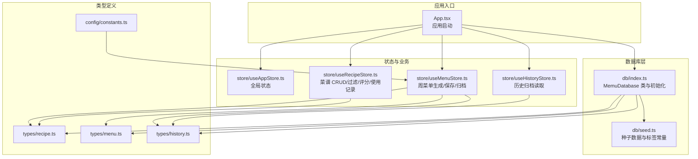
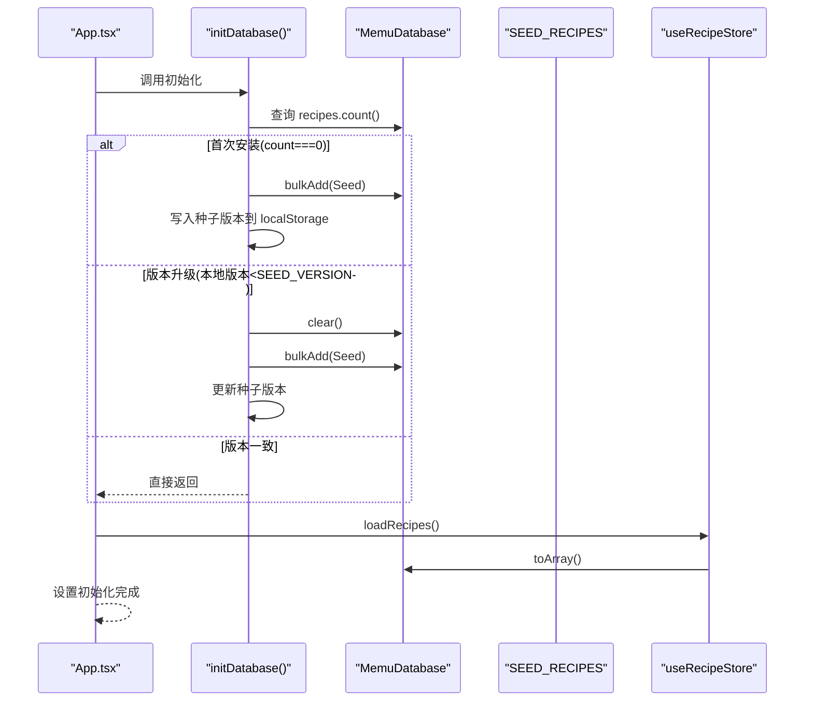
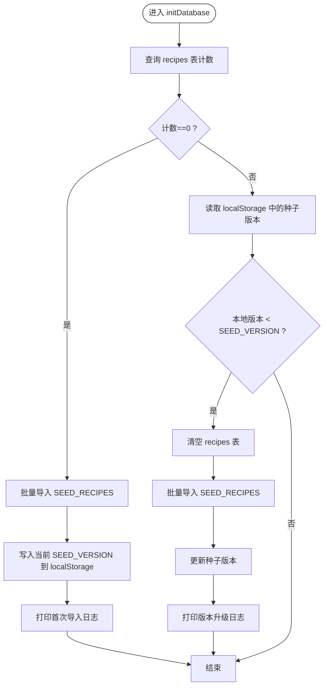
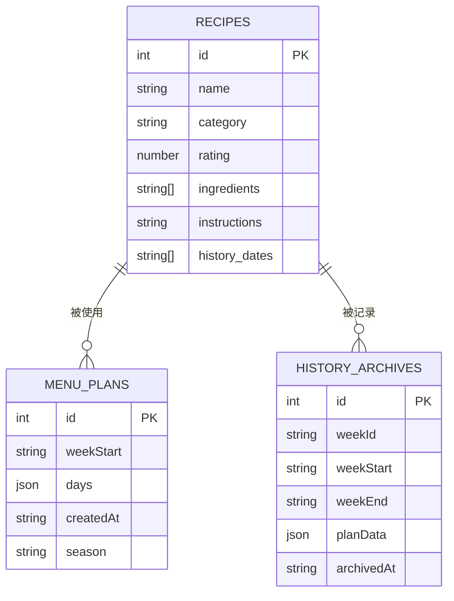
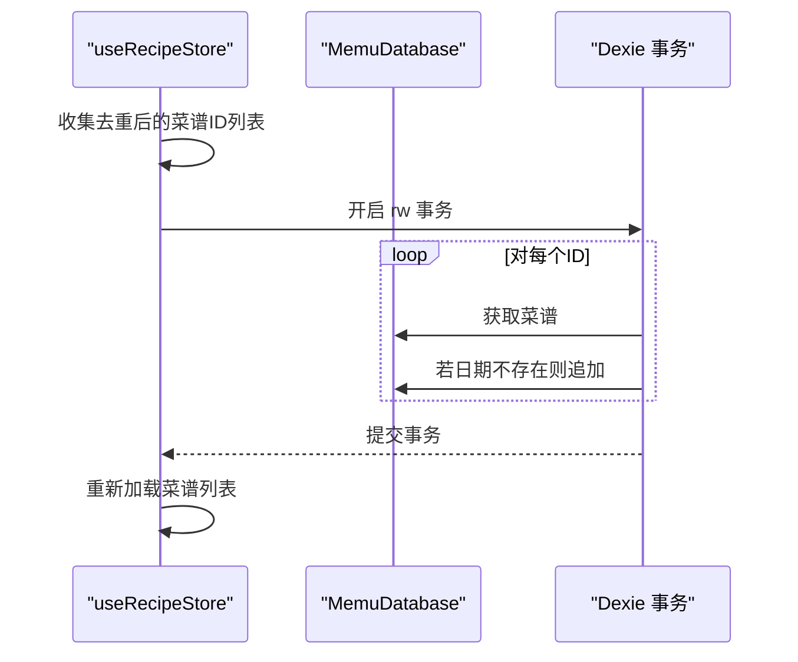
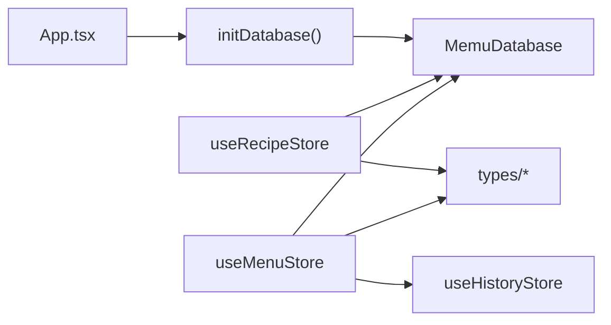

# 数据库工具

<cite>
**本文引用的文件**
- [src/db/index.ts](file://src/db/index.ts)
- [src/db/seed.ts](file://src/db/seed.ts)
- [src/App.tsx](file://src/App.tsx)
- [src/store/useAppStore.ts](file://src/store/useAppStore.ts)
- [src/store/useRecipeStore.ts](file://src/store/useRecipeStore.ts)
- [src/store/useMenuStore.ts](file://src/store/useMenuStore.ts)
- [src/store/useHistoryStore.ts](file://src/store/useHistoryStore.ts)
- [src/types/recipe.ts](file://src/types/recipe.ts)
- [src/types/menu.ts](file://src/types/menu.ts)
- [src/types/history.ts](file://src/types/history.ts)
- [src/config/constants.ts](file://src/config/constants.ts)
</cite>

## 目录
1. [简介](#简介)
2. [项目结构](#项目结构)
3. [核心组件](#核心组件)
4. [架构总览](#架构总览)
5. [详细组件分析](#详细组件分析)
6. [依赖关系分析](#依赖关系分析)
7. [性能考量](#性能考量)
8. [故障排查指南](#故障排查指南)
9. [结论](#结论)
10. [附录](#附录)

## 简介
本文件系统性梳理了 Memu 项目的数据库工具函数与数据持久化方案，重点覆盖：
- 数据库初始化流程与种子数据管理
- 数据迁移策略与版本控制
- 数据模型定义、索引与查询优化
- 事务处理与错误恢复机制
- 使用示例：应用启动时初始化与数据版本管理
- 最佳实践与备份恢复策略

## 项目结构
数据库相关的核心文件集中在 src/db 目录，并通过 Zustand Store 与业务组件交互。整体采用 Dexie（IndexedDB 的轻量封装）进行本地存储，配合自定义种子数据与版本控制，确保首次安装与升级时的数据一致性。

图表来源
- [src/App.tsx:11-22](file://src/App.tsx#L11-L22)
- [src/db/index.ts:7-22](file://src/db/index.ts#L7-L22)
- [src/db/seed.ts:1-709](file://src/db/seed.ts#L1-L709)
- [src/store/useAppStore.ts:17-25](file://src/store/useAppStore.ts#L17-L25)
- [src/store/useRecipeStore.ts:49-120](file://src/store/useRecipeStore.ts#L49-L120)
- [src/store/useMenuStore.ts:127-291](file://src/store/useMenuStore.ts#L127-L291)
- [src/types/recipe.ts:11-20](file://src/types/recipe.ts#L11-L20)
- [src/types/menu.ts:28-34](file://src/types/menu.ts#L28-L34)
- [src/types/history.ts:3-10](file://src/types/history.ts#L3-L10)
- [src/config/constants.ts:24-31](file://src/config/constants.ts#L24-L31)

章节来源
- [src/App.tsx:11-22](file://src/App.tsx#L11-L22)
- [src/db/index.ts:7-22](file://src/db/index.ts#L7-L22)

## 核心组件
- MemuDatabase 类：继承 Dexie，声明三张表（菜谱、周菜单计划、历史归档），定义初始版本与索引。
- 初始化函数：根据本地计数与种子版本决定是否导入/重置种子数据。
- 种子数据：包含约 80 道预置菜谱，涵盖多种分类与标签。
- Store 层：通过 Dexie 表进行 CRUD、过滤、评分、使用记录与事务批量更新。

章节来源
- [src/db/index.ts:7-22](file://src/db/index.ts#L7-L22)
- [src/db/index.ts:37-67](file://src/db/index.ts#L37-L67)
- [src/db/seed.ts:8-708](file://src/db/seed.ts#L8-L708)
- [src/store/useRecipeStore.ts:49-120](file://src/store/useRecipeStore.ts#L49-L120)

## 架构总览
应用启动时，App 组件在副作用中调用数据库初始化，随后加载菜谱并标记初始化完成。周菜单生成与归档过程涉及多表写入与事务，确保一致性。

图表来源
- [src/App.tsx:15-22](file://src/App.tsx#L15-L22)
- [src/db/index.ts:37-67](file://src/db/index.ts#L37-L67)
- [src/store/useRecipeStore.ts:58-64](file://src/store/useRecipeStore.ts#L58-L64)

## 详细组件分析

### 数据库初始化与种子数据管理
- 初始化策略
  - 首次安装：当菜谱表计数为 0 时，直接批量导入种子数据，并记录当前种子版本。
  - 版本升级：若本地存储的种子版本小于当前 SEED_VERSION，则清空菜谱表并重新导入，同时更新版本号。
  - 版本一致：不做任何处理。
- 种子版本控制
  - 通过 localStorage 存储版本号，便于跨会话识别升级场景。
  - 当种子数据内容变更时，需递增 SEED_VERSION 以触发重置逻辑。
- 日志与可观测性
  - 在不同分支输出日志，便于追踪初始化行为。

图表来源
- [src/db/index.ts:37-67](file://src/db/index.ts#L37-L67)

章节来源
- [src/db/index.ts:24-28](file://src/db/index.ts#L24-L28)
- [src/db/index.ts:37-67](file://src/db/index.ts#L37-L67)

### 数据模型与索引设计
- 表与字段
  - recipes：菜谱表，包含名称、分类、标签、食材、做法、评分、历史食用日期等。
  - menuPlans：周菜单计划表，包含周起始日期、每日计划、创建时间、季节模式等。
  - historyArchives：历史归档表，包含周标识、起止日期、计划快照、归档时间等。
- 索引与查询
  - recipes：主键自增 id，复合索引包括 name、category、rating，便于按分类、评分快速筛选。
  - menuPlans：主键自增 id，索引 weekStart，便于按周检索。
  - historyArchives：主键自增 id，索引 weekId、weekStart，便于按周范围查询。
- 类型约束
  - 使用 TypeScript 接口严格约束数据结构，减少运行期错误。

图表来源
- [src/types/recipe.ts:11-20](file://src/types/recipe.ts#L11-L20)
- [src/types/menu.ts:28-34](file://src/types/menu.ts#L28-L34)
- [src/types/history.ts:3-10](file://src/types/history.ts#L3-L10)
- [src/db/index.ts:14-18](file://src/db/index.ts#L14-L18)

章节来源
- [src/db/index.ts:14-18](file://src/db/index.ts#L14-L18)
- [src/types/recipe.ts:11-20](file://src/types/recipe.ts#L11-L20)
- [src/types/menu.ts:28-34](file://src/types/menu.ts#L28-L34)
- [src/types/history.ts:3-10](file://src/types/history.ts#L3-L10)

### 事务处理与批量操作
- 记录使用日期（批量）
  - 在 recordUsageDates 中，对多个菜谱 ID 去重后，在单个读写事务中逐条更新历史日期数组，避免并发冲突与部分失败。
  - 若某天已存在对应日期则跳过，保证幂等性。
- 保存/替换菜单
  - 通过 persistPlan 清空旧计划并新增快照，确保只保留最新计划。
- 归档流程
  - archivePlan 中先持久化历史归档，再批量给菜谱添加使用日期，最后清空当前计划，形成原子性归档。

图表来源
- [src/store/useRecipeStore.ts:92-107](file://src/store/useRecipeStore.ts#L92-L107)

章节来源
- [src/store/useRecipeStore.ts:92-107](file://src/store/useRecipeStore.ts#L92-L107)
- [src/store/useMenuStore.ts:119-125](file://src/store/useMenuStore.ts#L119-L125)
- [src/store/useMenuStore.ts:250-290](file://src/store/useMenuStore.ts#L250-L290)

### 查询性能与索引优化
- 建议的索引策略
  - recipes：name、category、rating 已建立索引，适合按分类与评分过滤；如需按标签过滤，可在 seed.ts 中扩展标签字段并考虑在 Dexie stores 中增加索引。
  - menuPlans：weekStart 建立索引，适合按周检索；如需按 season 过滤，可考虑在 stores 中增加索引。
  - historyArchives：weekId、weekStart 建立索引，适合按周范围查询。
- 查询建议
  - 使用 Dexie 的 where 条件与索引组合，避免全表扫描。
  - 对高频过滤（分类、标签、关键词）尽量走索引路径。
  - 批量操作使用 bulkAdd/bulkPut，减少往返次数。

章节来源
- [src/db/index.ts:14-18](file://src/db/index.ts#L14-L18)
- [src/store/useRecipeStore.ts:27-47](file://src/store/useRecipeStore.ts#L27-L47)

### 错误恢复机制
- 初始化阶段
  - 若批量导入失败，可通过重置函数将菜谱表清空并重新导入种子数据。
- 运行时异常
  - 记录使用日期时，若某菜谱不存在则跳过，避免中断整个流程。
  - 事务失败会回滚，保证数据一致性。
- 用户干预
  - 提供手动重置函数，便于开发调试或“恢复默认”。

章节来源
- [src/db/index.ts:62-67](file://src/db/index.ts#L62-L67)
- [src/store/useRecipeStore.ts:81-90](file://src/store/useRecipeStore.ts#L81-L90)

### 使用示例：应用启动初始化与数据版本管理
- 应用启动时序
  - App 组件在副作用中调用 initDatabase，随后加载菜谱并设置初始化完成标志。
- 数据版本管理
  - 修改种子数据后，递增 SEED_VERSION，即可触发自动重置。
- 菜谱管理
  - 通过 useRecipeStore 的 CRUD 与过滤接口，结合标签与分类实现高效检索。

章节来源
- [src/App.tsx:15-22](file://src/App.tsx#L15-L22)
- [src/db/index.ts:28-29](file://src/db/index.ts#L28-L29)
- [src/store/useRecipeStore.ts:58-64](file://src/store/useRecipeStore.ts#L58-L64)

## 依赖关系分析
- 组件耦合
  - App 依赖数据库初始化与菜谱加载。
  - 菜谱与菜单模块均依赖 MemuDatabase 的表实例。
  - 菜单归档依赖历史存储与菜谱使用记录。
- 外部依赖
  - Dexie：IndexedDB 的轻量封装，提供事务、索引与异步 API。
  - Zustand：轻量状态管理，简化 Store 与组件交互。
- 潜在循环依赖
  - 通过文件拆分与接口定义避免循环引用；Store 之间通过状态访问器间接通信。

图表来源
- [src/App.tsx:15-22](file://src/App.tsx#L15-L22)
- [src/db/index.ts:7-22](file://src/db/index.ts#L7-L22)
- [src/store/useRecipeStore.ts:49-120](file://src/store/useRecipeStore.ts#L49-L120)
- [src/store/useMenuStore.ts:127-291](file://src/store/useMenuStore.ts#L127-L291)

章节来源
- [src/App.tsx:15-22](file://src/App.tsx#L15-L22)
- [src/db/index.ts:7-22](file://src/db/index.ts#L7-L22)
- [src/store/useRecipeStore.ts:49-120](file://src/store/useRecipeStore.ts#L49-L120)
- [src/store/useMenuStore.ts:127-291](file://src/store/useMenuStore.ts#L127-L291)

## 性能考量
- 索引命中
  - 按分类、评分、周起始日期等常用条件查询时，优先使用已建立索引的字段。
- 批量写入
  - 使用 bulkAdd/bulkPut 替代多次 add/update，降低 I/O 成本。
- 事务边界
  - 将相关更新放在单个事务中，减少锁竞争与中间态暴露。
- 查询优化
  - 对高频过滤项（分类、标签、关键词）尽量走索引；必要时在 Dexie stores 中补充索引。
- 数据规模
  - 当数据量增长时，评估索引数量与维护成本，避免过度索引导致写入性能下降。

## 故障排查指南
- 初始化不生效
  - 检查 localStorage 中的种子版本是否正确；若版本过低，确认 SEED_VERSION 是否已递增。
  - 查看浏览器控制台日志，确认是否执行了批量导入或重置。
- 菜谱无法加载
  - 确认 recipes 表是否存在且有数据；检查初始化流程是否成功。
- 评分异常
  - 仅对有历史食用日期的菜谱允许评分；若报错，请先安排该菜谱在某日食用。
- 使用日期未更新
  - 检查 recordUsageDates 的输入 ID 是否存在；确认事务是否提交成功。
- 归档失败
  - 确认历史归档表写入成功后再进行使用日期更新与当前计划清理。

章节来源
- [src/db/index.ts:37-67](file://src/db/index.ts#L37-L67)
- [src/store/useRecipeStore.ts:81-90](file://src/store/useRecipeStore.ts#L81-L90)
- [src/store/useMenuStore.ts:250-290](file://src/store/useMenuStore.ts#L250-L290)

## 结论
本项目基于 Dexie 实现了完整的本地数据库方案，结合种子数据与版本控制，确保首次安装与升级时的数据一致性；通过索引与事务优化，兼顾查询效率与数据完整性。建议在后续迭代中：
- 根据实际查询需求在 Dexie stores 中补充索引；
- 对高频过滤项进行基准测试，持续优化查询路径；
- 在用户反馈较多的场景下，逐步引入更完善的错误上报与回滚策略。

## 附录
- 数据模型与索引参考
  - recipes：主键自增 id，索引 name、category、rating
  - menuPlans：主键自增 id，索引 weekStart
  - historyArchives：主键自增 id，索引 weekId、weekStart
- 关键函数与职责
  - initDatabase：初始化与版本升级
  - resetRecipesToSeed：手动重置种子数据
  - useRecipeStore：菜谱 CRUD、评分、使用记录、过滤
  - useMenuStore：周菜单生成、保存、替换、归档
  - useHistoryStore：历史归档读取与刷新