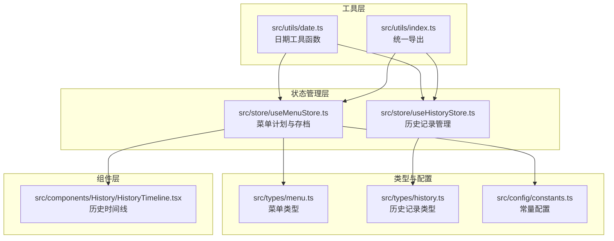
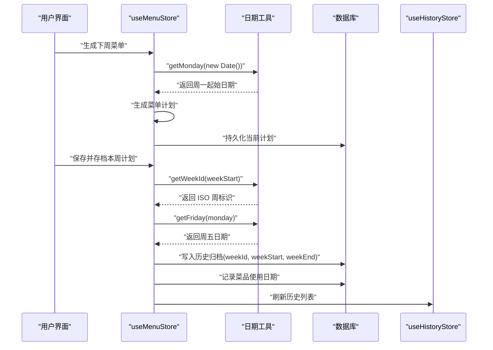
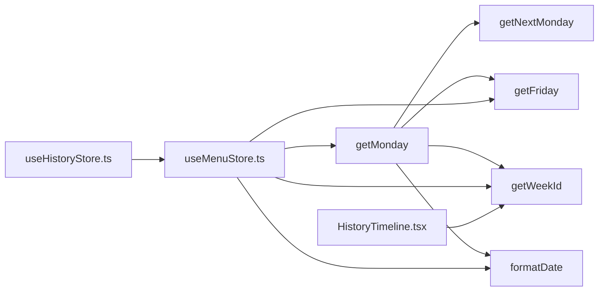

# 日期处理工具

<cite>
**本文引用的文件**
- [date.ts](file://src/utils/date.ts)
- [index.ts](file://src/utils/index.ts)
- [useMenuStore.ts](file://src/store/useMenuStore.ts)
- [useHistoryStore.ts](file://src/store/useHistoryStore.ts)
- [HistoryTimeline.tsx](file://src/components/History/HistoryTimeline.tsx)
- [menuGenerator.ts](file://src/algorithms/menuGenerator.ts)
- [menu.ts](file://src/types/menu.ts)
- [history.ts](file://src/types/history.ts)
- [constants.ts](file://src/config/constants.ts)
</cite>

## 目录
1. [简介](#简介)
2. [项目结构](#项目结构)
3. [核心组件](#核心组件)
4. [架构概览](#架构概览)
5. [详细组件分析](#详细组件分析)
6. [依赖关系分析](#依赖关系分析)
7. [性能考量](#性能考量)
8. [故障排查指南](#故障排查指南)
9. [结论](#结论)
10. [附录](#附录)

## 简介
本文件系统性梳理 Memu 应用中的日期处理工具函数，重点解析以下函数：
- getMonday：获取指定日期所在周的周一（归零时分秒）
- getWeekId：生成 ISO 周标识（如 "2024-W41"）
- formatDate：将日期格式化为 YYYY-MM-DD 字符串
- getNextMonday：获取下一个周一
- getFriday：基于周一推导周五日期

文档将从实现原理、参数与返回值、边界条件、数学原理、ISO 周算法、本地化考虑等方面进行深入说明，并结合菜单规划、历史记录、购物清单等实际应用场景给出最佳实践与常见陷阱提示。

## 项目结构
日期工具位于 src/utils/date.ts，通过 src/utils/index.ts 导出；在状态管理与组件中被广泛使用，主要涉及：
- 菜单计划生成与存档（store 层）
- 历史记录展示（组件层）
- 类型定义（types 层）

图表来源
- [date.ts:1-49](file://src/utils/date.ts#L1-L49)
- [index.ts:1-2](file://src/utils/index.ts#L1-L2)
- [useMenuStore.ts:1-292](file://src/store/useMenuStore.ts#L1-L292)
- [useHistoryStore.ts:1-46](file://src/store/useHistoryStore.ts#L1-L46)
- [HistoryTimeline.tsx:1-107](file://src/components/History/HistoryTimeline.tsx#L1-L107)
- [menu.ts:1-45](file://src/types/menu.ts#L1-L45)
- [history.ts:1-11](file://src/types/history.ts#L1-L11)
- [constants.ts:1-44](file://src/config/constants.ts#L1-L44)

章节来源
- [date.ts:1-49](file://src/utils/date.ts#L1-L49)
- [index.ts:1-2](file://src/utils/index.ts#L1-L2)

## 核心组件
本节聚焦五个日期工具函数的职责与交互方式：
- getMonday：将任意日期调整到当周周一，并清零时分秒
- getWeekId：根据 ISO 规则生成周标识（YYYY-"W"WW）
- formatDate：标准化日期字符串（YYYY-MM-DD）
- getNextMonday：在给定日期基础上推进到下个周一
- getFriday：从周一推导周五日期

这些函数在菜单计划生成、存档与历史记录展示中被反复调用，确保周粒度数据的一致性与可读性。

章节来源
- [date.ts:1-49](file://src/utils/date.ts#L1-L49)
- [useMenuStore.ts:1-292](file://src/store/useMenuStore.ts#L1-L292)
- [useHistoryStore.ts:1-46](file://src/store/useHistoryStore.ts#L1-L46)
- [HistoryTimeline.tsx:1-107](file://src/components/History/HistoryTimeline.tsx#L1-L107)

## 架构概览
下面的序列图展示了“生成菜单 → 存档计划”的关键流程，以及日期工具在其中的作用点。

图表来源
- [useMenuStore.ts:131-292](file://src/store/useMenuStore.ts#L131-L292)
- [date.ts:1-49](file://src/utils/date.ts#L1-L49)
- [useHistoryStore.ts:1-46](file://src/store/useHistoryStore.ts#L1-L46)

## 详细组件分析

### getMonday：获取本周一
- 功能：将输入日期调整到当周周一，并将时分秒毫秒清零，返回新的 Date 对象。
- 参数：
  - date: Date（可选，默认为当前时间）
- 返回值：Date（周一的日期，且时间为当天 00:00:00.000）
- 边界条件：
  - 当输入为周日时，diff 会向后推移 6 天，确保得到上周的周一
  - 当输入为周一时，diff 为 0，直接返回
- 数学原理：
  - 通过 d.getDate() - day + (day===0 ? -6 : 1) 计算偏移量，使目标日期落在当周周一
- 性能：O(1)，仅做一次日期运算与设置
- 本地化：依赖本地时区，若需跨时区一致性，建议传入 UTC 时间或转换为 UTC 后再处理

章节来源
- [date.ts:4-11](file://src/utils/date.ts#L4-L11)

### getWeekId：生成 ISO 周标识
- 功能：根据 ISO 第四日法（ISO 8601）生成周标识，格式为 "YYYY-Www"
- 参数：
  - date: Date（可选，默认为当前时间）
- 返回值：string（如 "2024-W41"）
- 实现要点：
  - 将输入日期归零时分秒，然后向后推移 (3 - (d.getDay()+6)%7) 天，使目标落在“该年的第四个星期”
  - 以该年的 1 月 4 日作为参考，计算与该日期之间的天数差，再除以 7 得到周数
  - 周数不足两位时左填充为两位
- 边界条件：
  - 年末与年初的跨年周（如 12 月底属于下一年的第 1 周），算法自动处理
- 数学原理：ISO 周算法的核心是“该年的第四个星期”作为基准周，确保跨年时的正确性
- 性能：O(1)，常数时间复杂度
- 本地化：依赖本地时区，若需跨时区一致性，建议传入 UTC 时间或转换为 UTC 后再处理

章节来源
- [date.ts:16-23](file://src/utils/date.ts#L16-L23)

### formatDate：日期格式化
- 功能：将 Date 对象格式化为 "YYYY-MM-DD" 字符串
- 参数：
  - date: Date（必填）
- 返回值：string（形如 "2024-10-18"）
- 实现要点：
  - 使用 Date.toISOString() 截取 "YYYY-MM-DD" 部分
- 边界条件：
  - 与本地时区相关，若需要固定时区输出，建议先转换为 UTC 或使用 Intl.DateTimeFormat
- 性能：O(1)，字符串截取操作
- 本地化：依赖本地时区，注意与 getMonday/getWeekId 的时区一致性

章节来源
- [date.ts:28-30](file://src/utils/date.ts#L28-L30)

### getNextMonday：获取下周一
- 功能：在给定日期基础上推进到下个周一
- 参数：
  - date: Date（可选，默认为当前时间）
- 返回值：Date（下周一的日期，且时间为当天 00:00:00.000）
- 实现要点：
  - 先调用 getMonday 获取本周一，再加 7 天
- 边界条件：
  - 输入为周日时，返回下周一下午或更晚的时间（取决于原始时间），但最终会被 getMonday 归零
- 性能：O(1)，两次日期运算
- 本地化：依赖本地时区

章节来源
- [date.ts:35-39](file://src/utils/date.ts#L35-L39)

### getFriday：基于周一推导周五
- 功能：从周一日期推导周五日期
- 参数：
  - monday: Date（必填，应为周一）
- 返回值：Date（周五的日期，且时间为当天 00:00:00.000）
- 实现要点：
  - 在周一基础上加 4 天
- 边界条件：
  - 输入必须为周一，否则结果将不正确
- 性能：O(1)
- 本地化：依赖本地时区

章节来源
- [date.ts:44-48](file://src/utils/date.ts#L44-L48)

### 在菜单规划中的应用
- 生成菜单时，使用 getMonday(new Date()) 确定当前周的起始日期，作为 weekStart
- 使用 getWeekId(monday) 生成 ISO 周标识，用于历史归档的 weekId 字段
- 使用 getFriday(monday) 计算周内周五日期，用于历史归档的 weekEnd 字段
- 菜单计划的类型定义要求 weekStart 为 ISO 日期字符串，便于排序与展示

章节来源
- [useMenuStore.ts:131-152](file://src/store/useMenuStore.ts#L131-L152)
- [useMenuStore.ts:250-292](file://src/store/useMenuStore.ts#L250-L292)
- [menu.ts:28-34](file://src/types/menu.ts#L28-L34)

### 在历史记录中的应用
- 历史归档对象包含 weekId、weekStart、weekEnd 三个字段，分别来自 getWeekId、formatDate、getFriday
- 历史时间线组件通过正则提取 weekId 中的年份与周数，生成本地化的周标签（如 "2024年第41周"）

章节来源
- [useHistoryStore.ts:250-292](file://src/store/useHistoryStore.ts#L250-L292)
- [history.ts:3-10](file://src/types/history.ts#L3-L10)
- [HistoryTimeline.tsx:15-25](file://src/components/History/HistoryTimeline.tsx#L15-L25)

### 在算法与配置中的应用
- 菜单生成算法中使用常量控制强制牛奶燕麦的日期（周一、三、五），与 getMonday 的周起始一致
- 生成菜单时，会将每道菜的使用日期写入菜品的历史记录数组，日期来源于从周一逐日累加

章节来源
- [menuGenerator.ts:1-374](file://src/algorithms/menuGenerator.ts#L1-L374)
- [constants.ts:1-44](file://src/config/constants.ts#L1-L44)
- [useMenuStore.ts:271-282](file://src/store/useMenuStore.ts#L271-L282)

## 依赖关系分析
- 工具函数依赖关系：
  - getNextMonday 依赖 getMonday
  - getFriday 依赖 getMonday（作为输入周一）
  - getWeekId 与 getMonday 在 store 中共同用于生成 weekId 与 weekStart/weekEnd
- 使用方依赖关系：
  - useMenuStore.ts 同时依赖 getMonday、getWeekId、getFriday、formatDate
  - HistoryTimeline.tsx 依赖 getWeekId 的输出进行本地化展示
  - useHistoryStore.ts 依赖 weekStart 字段进行排序与查询

图表来源
- [date.ts:1-49](file://src/utils/date.ts#L1-L49)
- [useMenuStore.ts:1-292](file://src/store/useMenuStore.ts#L1-L292)
- [HistoryTimeline.tsx:1-107](file://src/components/History/HistoryTimeline.tsx#L1-L107)
- [useHistoryStore.ts:1-46](file://src/store/useHistoryStore.ts#L1-L46)

章节来源
- [date.ts:1-49](file://src/utils/date.ts#L1-L49)
- [useMenuStore.ts:1-292](file://src/store/useMenuStore.ts#L1-L292)
- [HistoryTimeline.tsx:1-107](file://src/components/History/HistoryTimeline.tsx#L1-L107)
- [useHistoryStore.ts:1-46](file://src/store/useHistoryStore.ts#L1-L46)

## 性能考量
- 所有日期工具均为 O(1) 操作，开销极小
- 建议在高频调用场景（如渲染循环）中复用中间结果，避免重复计算
- 若涉及大量日期比较与格式化，可考虑缓存常用结果或使用更高效的日期库（如 dayjs）

## 故障排查指南
- 问题：跨时区显示异常
  - 现象：同一周在不同地区显示的周起始不一致
  - 原因：getMonday/getWeekId/formatDate 依赖本地时区
  - 解决：传入 UTC 时间或转换为 UTC 后再处理
- 问题：周标识与预期不符
  - 现象：年末或年初的跨年周标识不符合预期
  - 原因：ISO 周算法以“该年的第四个星期”为基准
  - 解决：确认输入日期与目标日期均处于同一时区，必要时转换为 UTC
- 问题：历史记录排序异常
  - 现象：历史记录按 weekStart 排序时顺序错误
  - 原因：weekStart 为 ISO 日期字符串（YYYY-MM-DD），字典序即时间序
  - 解决：保持 weekStart 为 ISO 字符串，避免自定义格式
- 问题：周五日期错误
  - 现象：getFriday(monday) 返回的周五不是预期的周五
  - 原因：monday 必须为周一，否则结果将不正确
  - 解决：确保传入的是 getMonday 的返回值

章节来源
- [useMenuStore.ts:250-292](file://src/store/useMenuStore.ts#L250-L292)
- [useHistoryStore.ts:21-46](file://src/store/useHistoryStore.ts#L21-L46)
- [date.ts:4-48](file://src/utils/date.ts#L4-L48)

## 结论
本文系统梳理了 Memu 项目中的日期处理工具函数，明确了它们的实现原理、参数与返回值、边界条件与本地化注意事项，并结合菜单规划、历史记录与算法配置的实际场景给出了使用建议与最佳实践。遵循本文的指导，可在保证功能正确性的前提下，提升代码的可维护性与跨时区兼容性。

## 附录

### 函数速查表
- getMonday(date?: Date): Date
  - 用途：获取当周周一（归零时分秒）
  - 返回：周一日期
- getWeekId(date?: Date): string
  - 用途：生成 ISO 周标识（YYYY-Www）
  - 返回：周标识字符串
- formatDate(date: Date): string
  - 用途：格式化为 YYYY-MM-DD
  - 返回：日期字符串
- getNextMonday(date?: Date): Date
  - 用途：获取下周一
  - 返回：下周一日期
- getFriday(monday: Date): Date
  - 用途：从周一推导周五
  - 返回：周五日期

### 实际使用示例（路径指引）
- 菜单生成与存档
  - 生成菜单时设置 weekStart：[useMenuStore.ts:140-146](file://src/store/useMenuStore.ts#L140-L146)
  - 生成周标识与结束日期：[useMenuStore.ts:254-267](file://src/store/useMenuStore.ts#L254-L267)
  - 记录菜品使用日期：[useMenuStore.ts:271-282](file://src/store/useMenuStore.ts#L271-L282)
- 历史记录展示
  - 本地化周标签生成：[HistoryTimeline.tsx:15-25](file://src/components/History/HistoryTimeline.tsx#L15-L25)
- 菜单算法与配置
  - 强制牛奶燕麦日与周内菜品使用策略：[menuGenerator.ts:1-374](file://src/algorithms/menuGenerator.ts#L1-L374)
  - 周标识与日期类型定义：[menu.ts:28-34](file://src/types/menu.ts#L28-L34), [history.ts:3-10](file://src/types/history.ts#L3-L10)