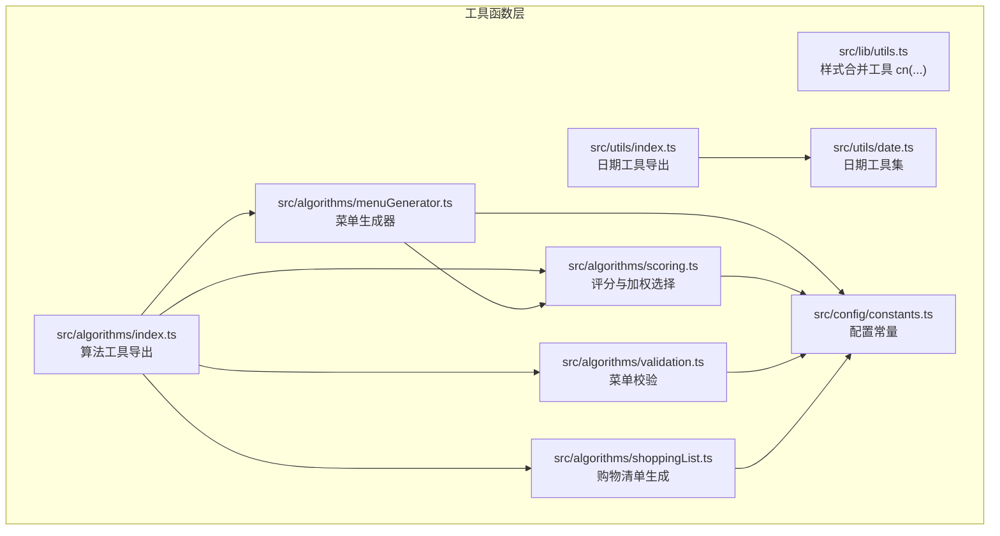
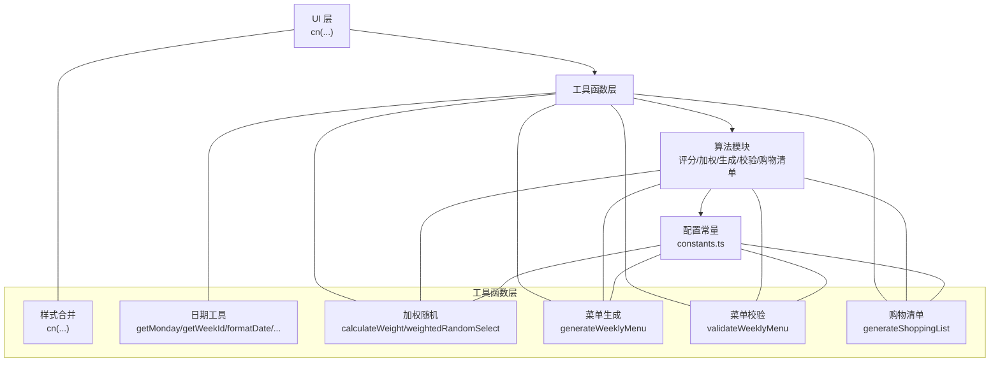
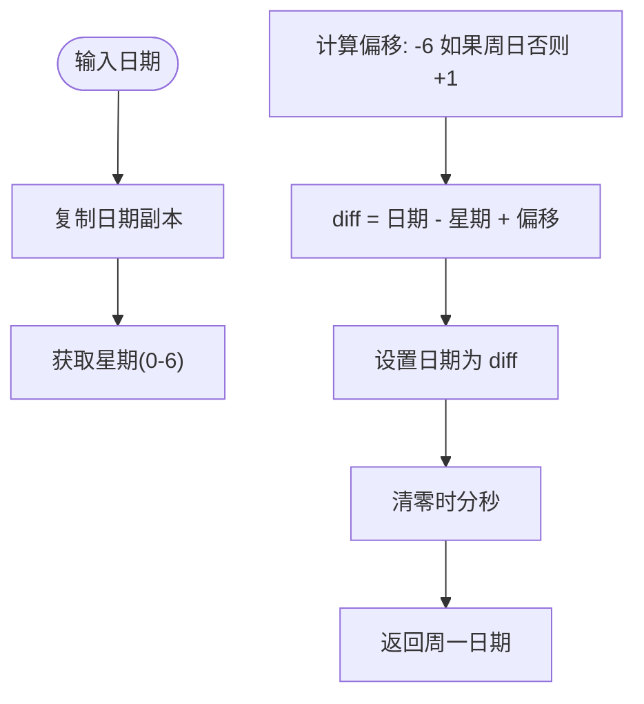
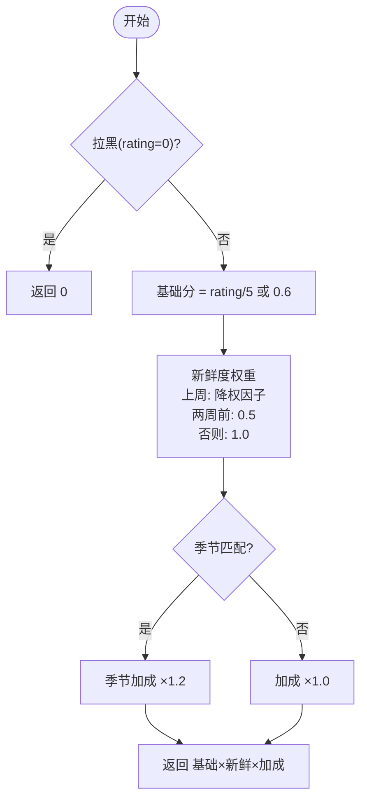
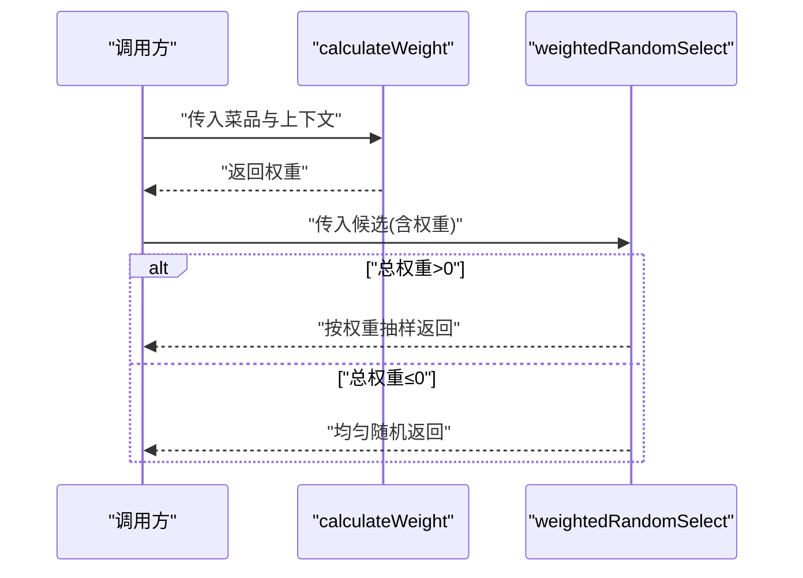
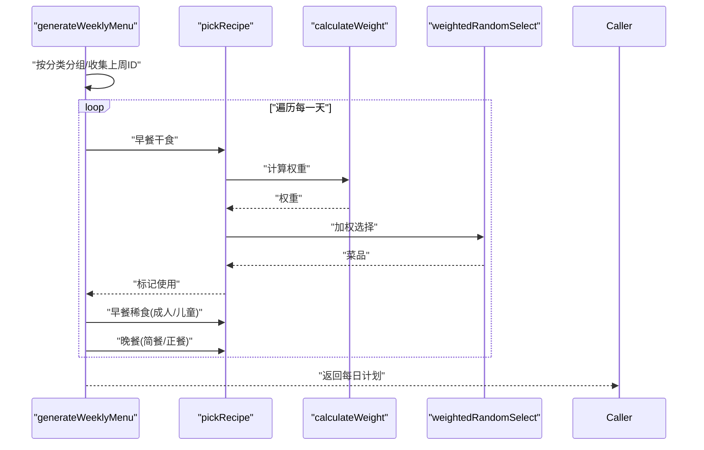
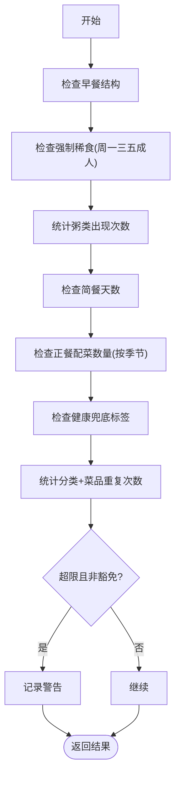
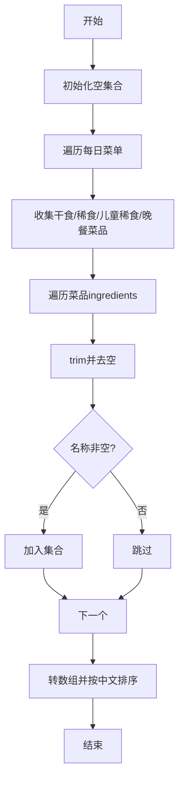
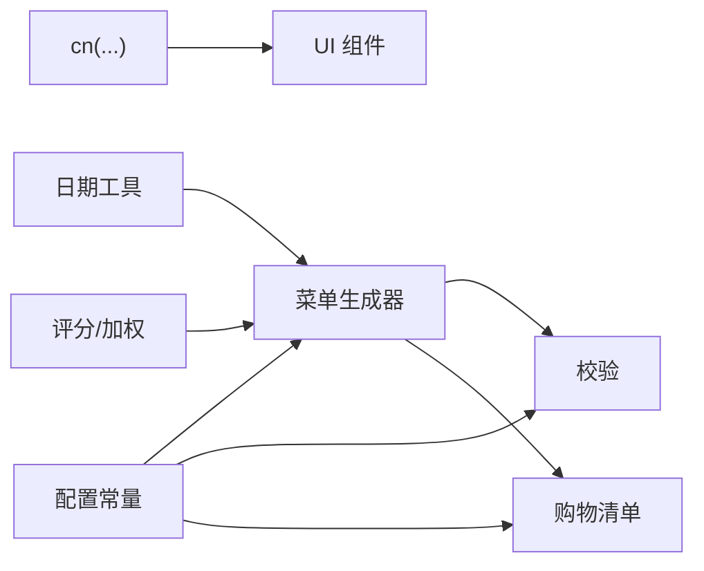

# 通用工具函数

<cite>
**本文引用的文件**
- [src/lib/utils.ts](file://src/lib/utils.ts)
- [src/utils/index.ts](file://src/utils/index.ts)
- [src/utils/date.ts](file://src/utils/date.ts)
- [src/algorithms/index.ts](file://src/algorithms/index.ts)
- [src/algorithms/menuGenerator.ts](file://src/algorithms/menuGenerator.ts)
- [src/algorithms/scoring.ts](file://src/algorithms/scoring.ts)
- [src/algorithms/validation.ts](file://src/algorithms/validation.ts)
- [src/algorithms/shoppingList.ts](file://src/algorithms/shoppingList.ts)
- [src/config/constants.ts](file://src/config/constants.ts)
</cite>

## 目录
1. [简介](#简介)
2. [项目结构](#项目结构)
3. [核心组件](#核心组件)
4. [架构概览](#架构概览)
5. [详细组件分析](#详细组件分析)
6. [依赖分析](#依赖分析)
7. [性能考虑](#性能考虑)
8. [故障排查指南](#故障排查指南)
9. [结论](#结论)
10. [附录](#附录)

## 简介
本文件系统性梳理并说明该项目中的“通用工具函数”库，涵盖整体设计思路、模块组织方式与各工具函数的功能、使用场景与实现要点。重点包括：
- 字符串处理：如去重、排序、格式化等
- 数组操作：如聚合、过滤、权重随机选择
- 对象合并与结构化数据处理：如按类别分组、键值映射
- 组合使用模式与性能优化建议
- 在菜单生成、购物清单、校验等组件中的应用与最佳实践

## 项目结构
工具函数主要分布在以下位置：
- UI 类样式合并工具：src/lib/utils.ts（cn 工具）
- 日期工具：src/utils/date.ts，统一导出入口 src/utils/index.ts
- 算法工具：src/algorithms/ 下的多个模块，统一导出入口 src/algorithms/index.ts
- 配置常量：src/config/constants.ts（被算法模块广泛引用）

图表来源
- [src/lib/utils.ts:1-7](file://src/lib/utils.ts#L1-L7)
- [src/utils/index.ts:1-2](file://src/utils/index.ts#L1-L2)
- [src/utils/date.ts:1-49](file://src/utils/date.ts#L1-L49)
- [src/algorithms/index.ts:1-6](file://src/algorithms/index.ts#L1-L6)
- [src/algorithms/menuGenerator.ts:1-374](file://src/algorithms/menuGenerator.ts#L1-L374)
- [src/algorithms/scoring.ts:1-64](file://src/algorithms/scoring.ts#L1-L64)
- [src/algorithms/validation.ts:1-142](file://src/algorithms/validation.ts#L1-L142)
- [src/algorithms/shoppingList.ts:1-32](file://src/algorithms/shoppingList.ts#L1-L32)
- [src/config/constants.ts:1-44](file://src/config/constants.ts#L1-L44)

章节来源
- [src/lib/utils.ts:1-7](file://src/lib/utils.ts#L1-L7)
- [src/utils/index.ts:1-2](file://src/utils/index.ts#L1-L2)
- [src/utils/date.ts:1-49](file://src/utils/date.ts#L1-L49)
- [src/algorithms/index.ts:1-6](file://src/algorithms/index.ts#L1-L6)
- [src/config/constants.ts:1-44](file://src/config/constants.ts#L1-L44)

## 核心组件
- 样式合并工具 cn：将 clsx 与 tailwind-merge 结合，实现条件类名合并与冲突修复
- 日期工具：提供周起始日期、ISO 周标识、日期格式化、下周一、周五推导等
- 加权随机选择：基于权重的概率抽样，支持总权重为 0 的退化情形
- 菜单生成器：按规则与权重生成一周菜单，含简餐/正餐、季节偏好、健康兜底
- 菜单校验：验证结构完整性、重复次数、标签要求、配菜数量等
- 购物清单生成：从菜单中提取食材并去重、排序

章节来源
- [src/lib/utils.ts:1-7](file://src/lib/utils.ts#L1-L7)
- [src/utils/date.ts:1-49](file://src/utils/date.ts#L1-L49)
- [src/algorithms/scoring.ts:1-64](file://src/algorithms/scoring.ts#L1-L64)
- [src/algorithms/menuGenerator.ts:1-374](file://src/algorithms/menuGenerator.ts#L1-L374)
- [src/algorithms/validation.ts:1-142](file://src/algorithms/validation.ts#L1-L142)
- [src/algorithms/shoppingList.ts:1-32](file://src/algorithms/shoppingList.ts#L1-L32)

## 架构概览
工具函数采用“功能域划分 + 统一导出”的组织方式：
- UI 层：样式合并工具 cn
- 业务工具层：日期工具、算法工具（评分/加权选择/菜单生成/校验/购物清单）
- 配置层：常量集中管理，供算法模块复用

图表来源
- [src/lib/utils.ts:1-7](file://src/lib/utils.ts#L1-L7)
- [src/utils/date.ts:1-49](file://src/utils/date.ts#L1-L49)
- [src/algorithms/scoring.ts:1-64](file://src/algorithms/scoring.ts#L1-L64)
- [src/algorithms/menuGenerator.ts:1-374](file://src/algorithms/menuGenerator.ts#L1-L374)
- [src/algorithms/validation.ts:1-142](file://src/algorithms/validation.ts#L1-L142)
- [src/algorithms/shoppingList.ts:1-32](file://src/algorithms/shoppingList.ts#L1-L32)
- [src/config/constants.ts:1-44](file://src/config/constants.ts#L1-L44)

## 详细组件分析

### 样式合并工具 cn
- 功能概述
  - 将条件类名集合通过 clsx 规范化，并用 tailwind-merge 解决冲突，输出最终类名字符串
- 使用场景
  - 组件根据状态动态拼装样式类，避免重复与冲突
- 实现要点
  - 输入为可变参数的类值集合，内部先合并再去重
- 性能与注意事项
  - O(n) 合并成本低；注意传入顺序与布尔表达式简洁性

章节来源
- [src/lib/utils.ts:1-7](file://src/lib/utils.ts#L1-L7)

### 日期工具集
- getMonday(date)
  - 计算给定日期所在周的周一（当日 00:00:00）
- getWeekId(date)
  - 生成 ISO 周标识，如 "YYYY-Www"
- formatDate(date)
  - 将日期格式化为 "YYYY-MM-DD"
- getNextMonday(date)
  - 返回下周一日期
- getFriday(monday)
  - 基于周一推导当周周五日期

图表来源
- [src/utils/date.ts:4-11](file://src/utils/date.ts#L4-L11)

章节来源
- [src/utils/date.ts:1-49](file://src/utils/date.ts#L1-L49)

### 加权随机选择
- calculateWeight(recipe, lastWeekIds, twoWeeksAgoIds, season)
  - 计算菜品权重，综合评分、跨周新鲜度与季节偏好
  - 拉黑菜品直接返回 0
- weightedRandomSelect(items)
  - 基于权重进行概率抽样；若总权重为 0 则均匀随机

图表来源
- [src/algorithms/scoring.ts:14-42](file://src/algorithms/scoring.ts#L14-L42)

图表来源
- [src/algorithms/scoring.ts:14-63](file://src/algorithms/scoring.ts#L14-L63)

章节来源
- [src/algorithms/scoring.ts:1-64](file://src/algorithms/scoring.ts#L1-L64)

### 菜单生成器
- generateWeeklyMenu(allRecipes, lastWeekPlan, season)
  - 生成周一至周五的每日菜单（10 餐），遵循强制/偏好/重复限制
  - 关键流程：按分类分组、收集上周使用 ID、逐日构建早餐与晚餐
- buildSimpleDinner / buildFormalDinner
  - 简餐：一锅出为主，夏季节气可额外搭配稀饭
  - 正餐：按季节配置荤/素/汤/主食/凉菜数量，健康兜底确保至少一道“适宜老人”
- ensureElderlyFriendly
  - 若未满足兜底条件，尝试替换第一道荤菜为带标签菜品

图表来源
- [src/algorithms/menuGenerator.ts:134-232](file://src/algorithms/menuGenerator.ts#L134-L232)
- [src/algorithms/menuGenerator.ts:238-342](file://src/algorithms/menuGenerator.ts#L238-L342)
- [src/algorithms/menuGenerator.ts:347-373](file://src/algorithms/menuGenerator.ts#L347-L373)
- [src/algorithms/scoring.ts:14-63](file://src/algorithms/scoring.ts#L14-L63)

章节来源
- [src/algorithms/menuGenerator.ts:1-374](file://src/algorithms/menuGenerator.ts#L1-L374)
- [src/algorithms/scoring.ts:1-64](file://src/algorithms/scoring.ts#L1-L64)

### 菜单校验
- validateWeeklyMenu(menu, season)
  - 结构完整性检查、强制稀食校验、粥类次数限制、简餐天数、正餐配菜数量、健康兜底、重复次数与 5 星特权

图表来源
- [src/algorithms/validation.ts:27-141](file://src/algorithms/validation.ts#L27-L141)

章节来源
- [src/algorithms/validation.ts:1-142](file://src/algorithms/validation.ts#L1-L142)

### 购物清单生成
- generateShoppingList(days)
  - 从每日菜单中提取所有菜品的食材，做字符串级去重与本地化排序，输出清单

图表来源
- [src/algorithms/shoppingList.ts:11-31](file://src/algorithms/shoppingList.ts#L11-L31)

章节来源
- [src/algorithms/shoppingList.ts:1-32](file://src/algorithms/shoppingList.ts#L1-L32)

## 依赖分析
- 模块耦合关系
  - 菜单生成依赖评分与加权选择；校验依赖配置常量；购物清单依赖菜单结构
  - 日期工具与样式工具相对独立，作为通用支撑
- 外部依赖
  - 样式合并依赖 clsx 与 tailwind-merge
  - 算法模块依赖配置常量与类型定义

图表来源
- [src/lib/utils.ts:1-7](file://src/lib/utils.ts#L1-L7)
- [src/utils/date.ts:1-49](file://src/utils/date.ts#L1-L49)
- [src/algorithms/scoring.ts:1-64](file://src/algorithms/scoring.ts#L1-L64)
- [src/algorithms/menuGenerator.ts:1-374](file://src/algorithms/menuGenerator.ts#L1-L374)
- [src/algorithms/validation.ts:1-142](file://src/algorithms/validation.ts#L1-L142)
- [src/algorithms/shoppingList.ts:1-32](file://src/algorithms/shoppingList.ts#L1-L32)
- [src/config/constants.ts:1-44](file://src/config/constants.ts#L1-L44)

章节来源
- [src/algorithms/index.ts:1-6](file://src/algorithms/index.ts#L1-L6)
- [src/config/constants.ts:1-44](file://src/config/constants.ts#L1-L44)

## 性能考虑
- 加权随机选择
  - 时间复杂度：O(n) 遍历候选并累加权重，随后一次线性扫描抽样
  - 优化建议：若候选规模较大，可预计算前缀和并二分查找，将抽样复杂度降至 O(log n)
- 菜单生成
  - 分类分组与使用计数 Map 查询为 O(1)，整体受循环次数与池大小影响
  - 优化建议：池过滤阶段尽量减少不必要的对象创建；对固定池（如稀食）可缓存过滤结果
- 购物清单
  - 去重使用 Set，排序使用本地化比较；时间复杂度近似 O(m log m)，m 为去重后元素数
  - 优化建议：若输入食材名称已有序，可考虑归并去重
- 样式合并
  - O(n) 合并与冲突修复，开销极小；建议在组件渲染前完成计算，避免重复调用

## 故障排查指南
- 加权随机选择报错
  - 现象：加权选择抛出“候选列表为空”错误
  - 排查：确认传入 items 非空；若总权重为 0，将退化为均匀随机，需检查权重计算逻辑
- 菜单校验告警
  - 现象：出现重复次数超限或缺少“适宜老人”标签的警告
  - 排查：核对配置常量中的重复上限与标签；检查健康兜底替换是否成功
- 购物清单异常
  - 现象：清单中出现空白或重复条目
  - 排查：确认食材名称在提取后经过 trim 与空值过滤；检查排序语言参数是否正确

章节来源
- [src/algorithms/scoring.ts:48-63](file://src/algorithms/scoring.ts#L48-L63)
- [src/algorithms/validation.ts:127-141](file://src/algorithms/validation.ts#L127-L141)
- [src/algorithms/shoppingList.ts:21-31](file://src/algorithms/shoppingList.ts#L21-L31)

## 结论
本工具函数库以清晰的模块边界与统一导出策略，实现了从 UI 样式、日期处理到算法决策与数据校验的全链路支撑。通过权重计算与加权随机选择，结合严格的规则校验与兜底策略，保证了菜单生成的合理性与可维护性。建议在大规模数据场景下进一步优化加权抽样与去重排序的复杂度，并在组件中合理复用这些工具函数，提升开发效率与一致性。

## 附录
- 组合使用模式示例
  - 菜单生成 → 校验 → 购物清单：先生成菜单并通过校验确保合规，再生成购物清单
  - 日期工具：配合菜单生成确定周起始与周标识，用于数据存储与展示
  - 样式合并：在 UI 组件中根据状态动态拼装类名，减少样式冲突
- 最佳实践
  - 将配置常量集中管理，避免魔法数字与字符串散落各处
  - 对权重计算与加权选择进行单元测试，覆盖总权重为 0 的退化分支
  - 在组件中延迟计算与缓存中间结果，避免重复计算