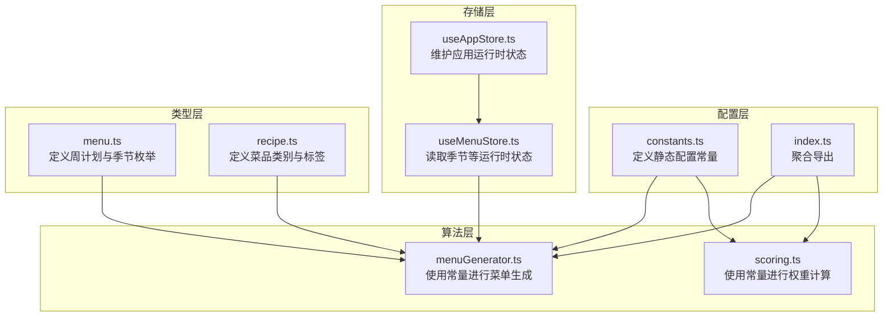
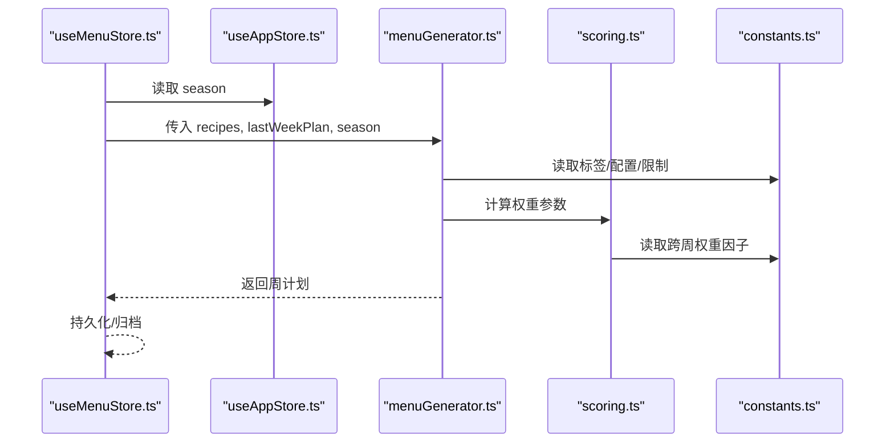
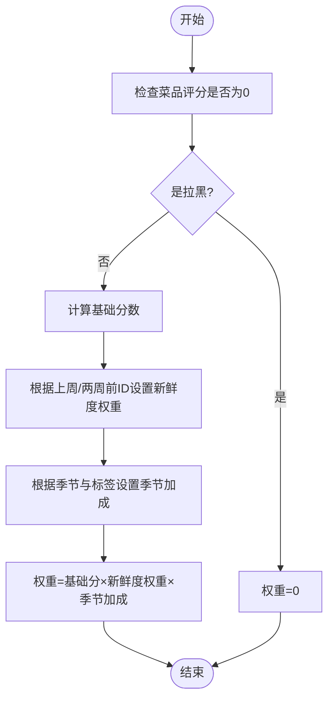
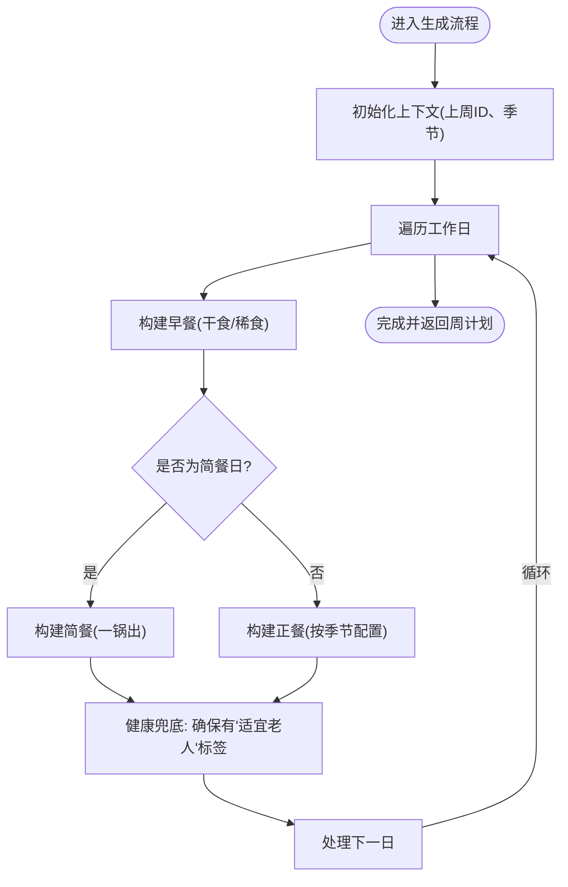
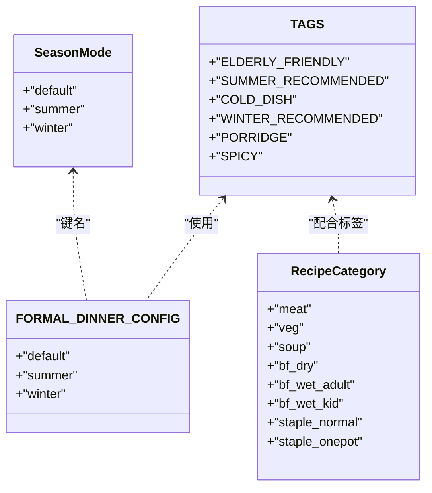
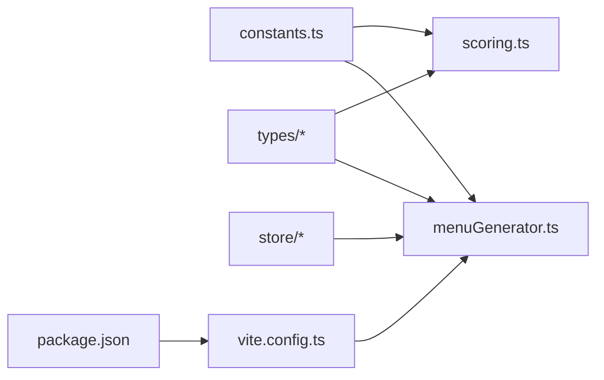

# 配置常量管理

<cite>
**本文引用的文件**
- [src/config/constants.ts](file://src/config/constants.ts)
- [src/config/index.ts](file://src/config/index.ts)
- [src/algorithms/menuGenerator.ts](file://src/algorithms/menuGenerator.ts)
- [src/algorithms/scoring.ts](file://src/algorithms/scoring.ts)
- [src/store/useMenuStore.ts](file://src/store/useMenuStore.ts)
- [src/store/useAppStore.ts](file://src/store/useAppStore.ts)
- [src/types/menu.ts](file://src/types/menu.ts)
- [src/types/recipe.ts](file://src/types/recipe.ts)
- [src/db/index.ts](file://src/db/index.ts)
- [vite.config.ts](file://vite.config.ts)
- [package.json](file://package.json)
</cite>

## 目录
1. [简介](#简介)
2. [项目结构](#项目结构)
3. [核心组件](#核心组件)
4. [架构概览](#架构概览)
5. [详细组件分析](#详细组件分析)
6. [依赖分析](#依赖分析)
7. [性能考虑](#性能考虑)
8. [故障排查指南](#故障排查指南)
9. [结论](#结论)
10. [附录](#附录)

## 简介
本文件系统性梳理项目中的“配置常量管理”机制，聚焦以下目标：
- 常量定义的组织结构与命名规范
- 各配置常量的作用、取值范围与默认行为
- 环境变量、运行时配置与静态配置的区别与使用场景
- 配置常量的扩展方法与自定义配置指南
- 在不同部署环境中的适配策略与最佳实践

## 项目结构
配置常量集中于配置模块，通过统一入口导出，供算法层、存储层与类型层复用。整体采用“静态常量 + 类型约束”的方式，确保跨模块一致性。

图表来源
- [src/config/constants.ts:1-44](file://src/config/constants.ts#L1-L44)
- [src/config/index.ts:1-2](file://src/config/index.ts#L1-L2)
- [src/algorithms/menuGenerator.ts:1-374](file://src/algorithms/menuGenerator.ts#L1-L374)
- [src/algorithms/scoring.ts:1-64](file://src/algorithms/scoring.ts#L1-L64)
- [src/store/useMenuStore.ts:1-292](file://src/store/useMenuStore.ts#L1-L292)
- [src/store/useAppStore.ts:1-26](file://src/store/useAppStore.ts#L1-L26)
- [src/types/menu.ts:1-45](file://src/types/menu.ts#L1-L45)
- [src/types/recipe.ts:1-21](file://src/types/recipe.ts#L1-L21)

章节来源
- [src/config/constants.ts:1-44](file://src/config/constants.ts#L1-L44)
- [src/config/index.ts:1-2](file://src/config/index.ts#L1-L2)
- [src/types/menu.ts:26-44](file://src/types/menu.ts#L26-L44)
- [src/types/recipe.ts:1-21](file://src/types/recipe.ts#L1-L21)

## 核心组件
本项目的配置常量主要位于配置模块，采用“命名清晰、职责单一”的组织方式，并通过类型层进行约束与校验。关键点如下：
- 常量命名：采用全大写加下划线的风格，语义明确（如最大重复次数、标签枚举、分类映射）。
- 分类组织：按业务域划分（如菜单结构、标签、分类映射），便于查找与维护。
- 导出策略：通过聚合导出文件统一暴露，降低跨模块导入复杂度。

章节来源
- [src/config/constants.ts:1-44](file://src/config/constants.ts#L1-L44)
- [src/config/index.ts:1-2](file://src/config/index.ts#L1-L2)

## 架构概览
配置常量在系统中的流转路径如下：配置模块提供静态常量；算法模块在生成菜单与计算权重时读取这些常量；存储模块根据运行时状态（如季节）参与决策；类型模块为常量使用提供类型安全。

图表来源
- [src/store/useMenuStore.ts:131-152](file://src/store/useMenuStore.ts#L131-L152)
- [src/store/useAppStore.ts:17-25](file://src/store/useAppStore.ts#L17-L25)
- [src/algorithms/menuGenerator.ts:134-232](file://src/algorithms/menuGenerator.ts#L134-L232)
- [src/algorithms/scoring.ts:14-42](file://src/algorithms/scoring.ts#L14-L42)
- [src/config/constants.ts:11-31](file://src/config/constants.ts#L11-L31)

## 详细组件分析

### 配置常量清单与说明
- 强制牛奶燕麦日（周一、三、五）
  - 作用：在指定工作日强制包含特定菜品，提升规律性与营养均衡。
  - 默认行为：仅在强制日生效，非强制日会从候选池中剔除该名称以保持多样性。
  - 使用场景：早餐稀食（成人）在强制日替换为该菜品。
  - 取值范围：字符串数组，元素来自工作日枚举。
  - 章节来源
    - [src/config/constants.ts:2](file://src/config/constants.ts#L2)
    - [src/algorithms/menuGenerator.ts:180-197](file://src/algorithms/menuGenerator.ts#L180-L197)

- 粥类每周最多出现天数
  - 作用：控制一周内含“粥类”标签菜品的最大出现天数，避免过度重复。
  - 默认行为：默认值为1，即一周最多1天出现粥类。
  - 使用场景：在构建早餐稀食（成人）时，按标签过滤候选池。
  - 取值范围：正整数。
  - 章节来源
    - [src/config/constants.ts:5](file://src/config/constants.ts#L5)
    - [src/algorithms/menuGenerator.ts:184-190](file://src/algorithms/menuGenerator.ts#L184-L190)

- 简餐每周次数
  - 作用：决定每周“简餐”（一锅出）的出现次数。
  - 默认行为：默认值为1，即每周固定1天为简餐。
  - 使用场景：随机选择一天作为简餐日，其余为正餐。
  - 取值范围：正整数。
  - 章节来源
    - [src/config/constants.ts:8](file://src/config/constants.ts#L8)
    - [src/algorithms/menuGenerator.ts:162](file://src/algorithms/menuGenerator.ts#L162)

- 正餐配置（按季节）
  - 作用：定义不同季节下的正餐组成（荤菜、素菜、汤、主食、凉菜数量）。
  - 默认行为：默认与冬季配置相同，夏季额外增加凉菜数量。
  - 使用场景：在构建正式晚餐时，依据季节动态调整各角色数量。
  - 取值范围：对象字面量，键为季节枚举，值为包含各项数量的对象。
  - 章节来源
    - [src/config/constants.ts:11-15](file://src/config/constants.ts#L11-L15)
    - [src/algorithms/menuGenerator.ts:266-342](file://src/algorithms/menuGenerator.ts#L266-L342)

- 跨周降权系数
  - 作用：对上周已出现的菜品给予降权，避免短期内重复。
  - 默认行为：默认值为0.1，显著降低权重。
  - 使用场景：在权重计算函数中，根据菜品是否出现在上周来调整权重。
  - 取值范围：(0, 1]，越小表示降权越强。
  - 章节来源
    - [src/config/constants.ts:18](file://src/config/constants.ts#L18)
    - [src/algorithms/scoring.ts:25-32](file://src/algorithms/scoring.ts#L25-L32)

- 5星菜周内最多出现次数
  - 作用：限制高评分菜品（5星）在一定周期内的重复次数，平衡偏好与多样性。
  - 默认行为：默认值为2。
  - 使用场景：在挑选菜品时，若已达到上限则跳过该菜品。
  - 取值范围：正整数。
  - 章节来源
    - [src/config/constants.ts:21](file://src/config/constants.ts#L21)
    - [src/algorithms/menuGenerator.ts:97-99](file://src/algorithms/menuGenerator.ts#L97-L99)

- 标签常量
  - 作用：统一管理菜品标签，确保跨模块一致性。
  - 默认行为：包含“适宜老人”“夏季推荐”“凉菜”“冬季推荐”“粥类”“辣”等标签。
  - 使用场景：构建候选池、健康兜底、季节匹配等。
  - 取值范围：字符串常量集合。
  - 章节来源
    - [src/config/constants.ts:24-31](file://src/config/constants.ts#L24-L31)
    - [src/algorithms/menuGenerator.ts:347-373](file://src/algorithms/menuGenerator.ts#L347-L373)

- 分类中文映射
  - 作用：将内部分类键映射为中文显示标签，便于UI展示。
  - 默认行为：覆盖常见分类键到中文的映射。
  - 使用场景：UI渲染与日志输出。
  - 取值范围：Record<string, string>。
  - 章节来源
    - [src/config/constants.ts:34-43](file://src/config/constants.ts#L34-L43)

### 关键流程图：权重计算与降权

图表来源
- [src/algorithms/scoring.ts:14-42](file://src/algorithms/scoring.ts#L14-L42)
- [src/config/constants.ts:18](file://src/config/constants.ts#L18)

### 关键流程图：菜单生成（正餐/简餐）

图表来源
- [src/algorithms/menuGenerator.ts:134-232](file://src/algorithms/menuGenerator.ts#L134-L232)
- [src/algorithms/menuGenerator.ts:238-260](file://src/algorithms/menuGenerator.ts#L238-L260)
- [src/algorithms/menuGenerator.ts:266-342](file://src/algorithms/menuGenerator.ts#L266-L342)
- [src/config/constants.ts:24-31](file://src/config/constants.ts#L24-L31)

### 关键类图：类型与常量关系

图表来源
- [src/types/menu.ts:26](file://src/types/menu.ts#L26)
- [src/types/recipe.ts:1-21](file://src/types/recipe.ts#L1-L21)
- [src/config/constants.ts:24-31](file://src/config/constants.ts#L24-L31)
- [src/config/constants.ts:11-15](file://src/config/constants.ts#L11-L15)

## 依赖分析
- 配置模块与算法模块的耦合
  - 算法模块直接依赖配置常量进行决策（如季节配置、标签过滤、降权系数）。
  - 优点：逻辑集中、易于维护；缺点：若常量变更需同步评估算法影响。
- 配置模块与存储/类型模块的协作
  - 存储模块通过运行时状态（如季节）参与决策，类型模块提供枚举与约束。
  - 优点：类型安全、边界清晰；缺点：需要在多处保持一致。
- 外部依赖与集成点
  - Vite别名与包管理器配置为模块解析提供便利，但与配置常量无直接耦合。

图表来源
- [src/config/constants.ts:1-44](file://src/config/constants.ts#L1-L44)
- [src/algorithms/menuGenerator.ts:1-374](file://src/algorithms/menuGenerator.ts#L1-L374)
- [src/algorithms/scoring.ts:1-64](file://src/algorithms/scoring.ts#L1-L64)
- [src/types/menu.ts:1-45](file://src/types/menu.ts#L1-L45)
- [src/types/recipe.ts:1-21](file://src/types/recipe.ts#L1-L21)
- [src/store/useMenuStore.ts:1-292](file://src/store/useMenuStore.ts#L1-L292)
- [vite.config.ts:1-14](file://vite.config.ts#L1-L14)
- [package.json:1-46](file://package.json#L1-L46)

章节来源
- [src/config/constants.ts:1-44](file://src/config/constants.ts#L1-L44)
- [src/algorithms/menuGenerator.ts:1-374](file://src/algorithms/menuGenerator.ts#L1-L374)
- [src/algorithms/scoring.ts:1-64](file://src/algorithms/scoring.ts#L1-L64)
- [src/types/menu.ts:1-45](file://src/types/menu.ts#L1-L45)
- [src/types/recipe.ts:1-21](file://src/types/recipe.ts#L1-L21)
- [src/store/useMenuStore.ts:1-292](file://src/store/useMenuStore.ts#L1-L292)
- [vite.config.ts:1-14](file://vite.config.ts#L1-L14)
- [package.json:1-46](file://package.json#L1-L46)

## 性能考虑
- 常量访问成本极低：均为静态值，读取开销可忽略。
- 降权系数与使用次数控制：通过跨周权重与5星重复上限，减少重复概率，提高多样性。
- 候选池过滤：按标签与季节过滤候选池，避免无效尝试，提升挑选效率。
- 建议
  - 将频繁使用的常量缓存至局部变量，减少重复导入带来的微小开销。
  - 在大规模数据场景下，优先使用索引与预过滤策略，结合常量约束进一步缩小候选集。

## 故障排查指南
- 常量未生效
  - 检查是否通过聚合导出文件正确引入。
  - 章节来源
    - [src/config/index.ts:1-2](file://src/config/index.ts#L1-L2)
- 菜单重复度过高
  - 检查跨周权重因子与5星重复上限是否合理。
  - 章节来源
    - [src/config/constants.ts:18](file://src/config/constants.ts#L18)
    - [src/config/constants.ts:21](file://src/config/constants.ts#L21)
- 季节配置不生效
  - 确认运行时状态（如季节）传递正确，且与常量键匹配。
  - 章节来源
    - [src/store/useAppStore.ts:17-25](file://src/store/useAppStore.ts#L17-L25)
    - [src/types/menu.ts:26](file://src/types/menu.ts#L26)
- 标签过滤异常
  - 确认菜品标签与常量标签一致，注意大小写与拼写。
  - 章节来源
    - [src/config/constants.ts:24-31](file://src/config/constants.ts#L24-L31)
- 数据库种子版本问题
  - 若种子数据未更新，检查版本号与本地存储版本键。
  - 章节来源
    - [src/db/index.ts:28-57](file://src/db/index.ts#L28-L57)

## 结论
本项目的配置常量管理以“静态常量 + 类型约束 + 聚合导出”为核心，实现了清晰、可维护、可扩展的配置体系。通过合理的命名规范与职责划分，常量在算法与存储层之间形成稳定桥梁，既保证了业务逻辑的一致性，也为后续扩展提供了良好基础。

## 附录

### 环境变量、运行时配置与静态配置
- 环境变量配置
  - 适用场景：部署差异（如API端点、调试开关）、敏感信息隔离。
  - 实施建议：在构建工具或容器环境中注入，避免硬编码到源码。
  - 章节来源
    - [vite.config.ts:1-14](file://vite.config.ts#L1-L14)
    - [package.json:6-10](file://package.json#L6-L10)
- 运行时配置
  - 适用场景：用户偏好、主题切换、语言选择、季节模式等。
  - 实施建议：通过状态管理（如Zustand）维护，避免全局污染。
  - 章节来源
    - [src/store/useAppStore.ts:17-25](file://src/store/useAppStore.ts#L17-L25)
    - [src/store/useMenuStore.ts:131-152](file://src/store/useMenuStore.ts#L131-L152)
- 静态配置
  - 适用场景：业务规则、默认阈值、标签与分类映射等。
  - 实施建议：集中管理、版本化变更、配套测试用例。
  - 章节来源
    - [src/config/constants.ts:1-44](file://src/config/constants.ts#L1-L44)

### 扩展方法与自定义配置指南
- 新增常量
  - 命名：遵循全大写+下划线，语义明确。
  - 位置：放入配置模块，必要时新增子文件以便分类。
  - 导出：通过聚合导出文件统一暴露。
  - 章节来源
    - [src/config/index.ts:1-2](file://src/config/index.ts#L1-L2)
- 修改现有常量
  - 影响评估：扫描使用点，评估算法与UI影响。
  - 回滚策略：保留旧值一段时间，逐步迁移。
  - 章节来源
    - [src/algorithms/menuGenerator.ts:134-232](file://src/algorithms/menuGenerator.ts#L134-L232)
    - [src/algorithms/scoring.ts:14-42](file://src/algorithms/scoring.ts#L14-L42)
- 自定义配置
  - 建议：通过运行时状态与静态常量组合，实现灵活适配。
  - 章节来源
    - [src/store/useAppStore.ts:17-25](file://src/store/useAppStore.ts#L17-L25)
    - [src/types/menu.ts:26](file://src/types/menu.ts#L26)

### 部署环境适配策略与最佳实践
- 开发环境
  - 使用默认静态常量，启用热更新与调试日志。
  - 章节来源
    - [vite.config.ts:1-14](file://vite.config.ts#L1-L14)
- 测试环境
  - 通过环境变量覆盖部分敏感配置，保持业务常量不变。
  - 章节来源
    - [package.json:6-10](file://package.json#L6-L10)
- 生产环境
  - 严格版本化管理，确保常量变更可追踪；监控异常日志，快速回滚。
  - 章节来源
    - [src/db/index.ts:28-57](file://src/db/index.ts#L28-L57)