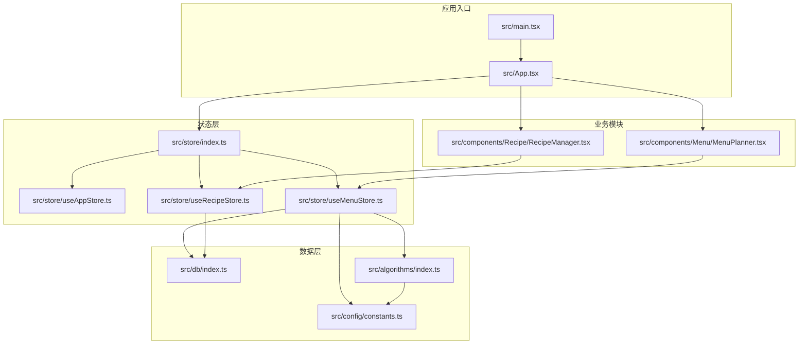
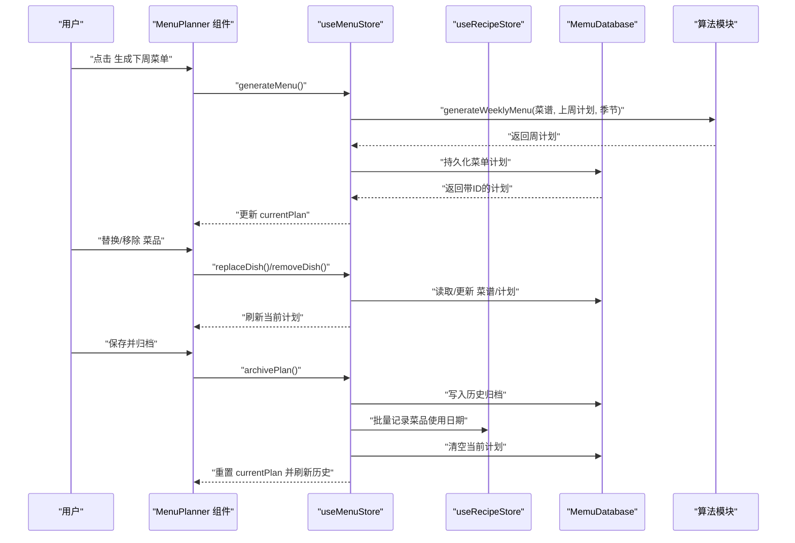
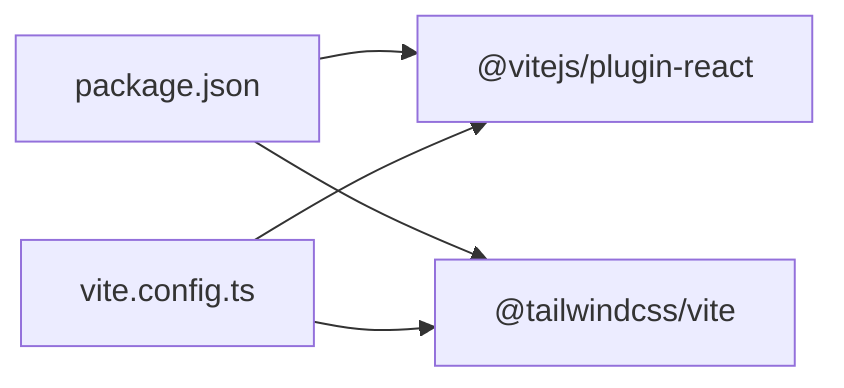

# 快速开始

<cite>
**本文引用的文件**
- [README.md](file://README.md)
- [package.json](file://package.json)
- [vite.config.ts](file://vite.config.ts)
- [src/main.tsx](file://src/main.tsx)
- [src/App.tsx](file://src/App.tsx)
- [src/db/index.ts](file://src/db/index.ts)
- [src/store/index.ts](file://src/store/index.ts)
- [src/store/useAppStore.ts](file://src/store/useAppStore.ts)
- [src/store/useRecipeStore.ts](file://src/store/useRecipeStore.ts)
- [src/store/useMenuStore.ts](file://src/store/useMenuStore.ts)
- [src/components/Menu/MenuPlanner.tsx](file://src/components/Menu/MenuPlanner.tsx)
- [src/components/Recipe/RecipeManager.tsx](file://src/components/Recipe/RecipeManager.tsx)
- [src/algorithms/index.ts](file://src/algorithms/index.ts)
- [src/config/constants.ts](file://src/config/constants.ts)
</cite>

## 目录
1. [简介](#简介)
2. [项目结构](#项目结构)
3. [核心组件](#核心组件)
4. [架构总览](#架构总览)
5. [详细组件分析](#详细组件分析)
6. [依赖关系分析](#依赖关系分析)
7. [性能考虑](#性能考虑)
8. [故障排查指南](#故障排查指南)
9. [结论](#结论)
10. [附录](#附录)

## 简介
Memu 是一个基于 React + TypeScript + Vite 构建的家庭智能菜单管理应用，目标是帮助用户高效完成“一周菜单规划 → 生成购物清单 → 记录使用历史”的闭环工作流。核心功能包括：
- 智能菜单规划：根据规则与权重自动生成下周菜单，并支持替换与移除菜品。
- 菜谱管理：新增、编辑、删除、评分与筛选菜谱，支持标签与分类管理。
- 历史追踪：将当周菜单归档，记录每日使用菜品的历史日期，便于统计与回顾。
- 购物清单：从菜单中自动汇总所需食材，生成采购清单。

本指南面向初学者与有经验的开发者，提供从环境准备到运行、从功能使用到问题排查的完整路径。

## 项目结构
项目采用前端单页应用架构，核心目录与职责如下：
- src/components：UI 组件与业务模块（菜单、菜谱、历史、购物）。
- src/store：状态管理（Zustand），包含应用态、菜单态、菜谱态、历史态。
- src/db：本地数据库（Dexie），存储菜谱、菜单计划、历史归档。
- src/algorithms：菜单生成、评分与校验、购物清单生成等算法入口。
- src/config/constants.ts：规则常量（季节模式、配菜数量、标签等）。
- vite.config.ts：Vite 开发与构建配置，含路径别名与插件。
- package.json：脚本、依赖与版本信息。

图表来源
- [src/main.tsx:1-11](file://src/main.tsx#L1-L11)
- [src/App.tsx:1-83](file://src/App.tsx#L1-L83)
- [src/store/index.ts:1-6](file://src/store/index.ts#L1-L6)
- [src/store/useAppStore.ts:1-26](file://src/store/useAppStore.ts#L1-L26)
- [src/store/useRecipeStore.ts:1-121](file://src/store/useRecipeStore.ts#L1-L121)
- [src/store/useMenuStore.ts:1-292](file://src/store/useMenuStore.ts#L1-L292)
- [src/components/Menu/MenuPlanner.tsx:1-75](file://src/components/Menu/MenuPlanner.tsx#L1-L75)
- [src/components/Recipe/RecipeManager.tsx:1-110](file://src/components/Recipe/RecipeManager.tsx#L1-L110)
- [src/db/index.ts:1-34](file://src/db/index.ts#L1-L34)
- [src/algorithms/index.ts:1-6](file://src/algorithms/index.ts#L1-L6)
- [src/config/constants.ts:1-44](file://src/config/constants.ts#L1-L44)

章节来源
- [vite.config.ts:1-14](file://vite.config.ts#L1-L14)
- [package.json:1-46](file://package.json#L1-L46)

## 核心组件
- 应用入口与路由：应用在入口文件中挂载根组件，根组件负责初始化数据库与菜谱列表，并通过标签页切换展示菜单、购物、菜谱、历史四个区域。
- 数据库与初始化：数据库类定义表结构，初始化函数在首次启动时导入种子菜谱，确保用户开箱即用。
- 状态管理：应用态（活动标签、季节模式、初始化状态）、菜谱态（加载/增删改查/评分/筛选）、菜单态（生成/加载/替换/移除/归档）。
- 菜单规划：提供“生成下周菜单”“替换菜品”“移除菜品”“保存并归档”等能力。
- 菜谱管理：支持分类筛选、关键词搜索、详情查看与新增/编辑对话框。
- 算法与规则：菜单生成、评分权重、规则校验、购物清单生成；规则集中于常量文件。

章节来源
- [src/main.tsx:1-11](file://src/main.tsx#L1-L11)
- [src/App.tsx:11-83](file://src/App.tsx#L11-L83)
- [src/db/index.ts:7-34](file://src/db/index.ts#L7-L34)
- [src/store/useAppStore.ts:4-26](file://src/store/useAppStore.ts#L4-L26)
- [src/store/useRecipeStore.ts:11-121](file://src/store/useRecipeStore.ts#L11-L121)
- [src/store/useMenuStore.ts:21-292](file://src/store/useMenuStore.ts#L21-L292)
- [src/components/Menu/MenuPlanner.tsx:8-75](file://src/components/Menu/MenuPlanner.tsx#L8-L75)
- [src/components/Recipe/RecipeManager.tsx:26-110](file://src/components/Recipe/RecipeManager.tsx#L26-L110)
- [src/algorithms/index.ts:1-6](file://src/algorithms/index.ts#L1-L6)
- [src/config/constants.ts:1-44](file://src/config/constants.ts#L1-L44)

## 架构总览
下图展示了从用户操作到数据持久化的端到端流程，涵盖菜单生成、替换、归档与历史更新。

图表来源
- [src/components/Menu/MenuPlanner.tsx:8-75](file://src/components/Menu/MenuPlanner.tsx#L8-L75)
- [src/store/useMenuStore.ts:127-292](file://src/store/useMenuStore.ts#L127-L292)
- [src/store/useRecipeStore.ts:58-107](file://src/store/useRecipeStore.ts#L58-L107)
- [src/db/index.ts:7-34](file://src/db/index.ts#L7-L34)
- [src/algorithms/index.ts:1-6](file://src/algorithms/index.ts#L1-L6)

## 详细组件分析

### 应用初始化与入口
- 入口文件负责渲染根组件，并在根组件中执行数据库初始化与菜谱加载。
- 根组件在初始化完成后显示主界面，包含顶部标题与底部标签页导航。

章节来源
- [src/main.tsx:1-11](file://src/main.tsx#L1-L11)
- [src/App.tsx:15-33](file://src/App.tsx#L15-L33)
- [src/App.tsx:48-77](file://src/App.tsx#L48-L77)

### 数据库与种子数据
- 数据库类定义三张表：菜谱、菜单计划、历史归档，并设置索引字段。
- 初始化函数在数据库为空时批量导入种子菜谱，确保首次使用即可看到示例数据。

章节来源
- [src/db/index.ts:7-20](file://src/db/index.ts#L7-L20)
- [src/db/index.ts:27-33](file://src/db/index.ts#L27-L33)

### 菜单规划模块
- 提供“生成下周菜单”“替换菜品”“移除菜品”“保存并归档”等交互。
- 生成逻辑调用算法模块生成周计划，保存至菜单计划表；替换/移除会实时更新并持久化；归档时写入历史归档表并回填菜品使用日期。

章节来源
- [src/components/Menu/MenuPlanner.tsx:8-75](file://src/components/Menu/MenuPlanner.tsx#L8-L75)
- [src/store/useMenuStore.ts:131-152](file://src/store/useMenuStore.ts#L131-L152)
- [src/store/useMenuStore.ts:167-241](file://src/store/useMenuStore.ts#L167-L241)
- [src/store/useMenuStore.ts:250-291](file://src/store/useMenuStore.ts#L250-L291)

### 菜谱管理模块
- 支持分类筛选、关键词搜索、详情弹窗与新增/编辑对话框。
- 后端存储使用本地数据库，提供增删改查、评分与使用日期记录能力。

章节来源
- [src/components/Recipe/RecipeManager.tsx:26-110](file://src/components/Recipe/RecipeManager.tsx#L26-L110)
- [src/store/useRecipeStore.ts:58-120](file://src/store/useRecipeStore.ts#L58-L120)

### 状态管理（Zustand）
- 应用态：维护当前标签页、季节模式与初始化状态。
- 菜谱态：维护菜谱列表、过滤条件与过滤后的结果，提供加载、增删改查、评分、使用日期记录与过滤应用。
- 菜单态：维护当前周计划、生成状态，提供生成、加载、替换、移除、保存与归档。

章节来源
- [src/store/useAppStore.ts:4-26](file://src/store/useAppStore.ts#L4-L26)
- [src/store/useRecipeStore.ts:11-25](file://src/store/useRecipeStore.ts#L11-L25)
- [src/store/useMenuStore.ts:21-37](file://src/store/useMenuStore.ts#L21-L37)

### 算法与规则
- 菜单生成：根据当前季节、上周计划与规则常量生成周计划。
- 权重计算与随机选择：按评分与跨周降权进行加权随机选择。
- 规则校验：对生成的菜单进行合规性检查。
- 购物清单：从菜单中提取所需食材生成采购清单。

章节来源
- [src/algorithms/index.ts:1-6](file://src/algorithms/index.ts#L1-L6)
- [src/config/constants.ts:1-44](file://src/config/constants.ts#L1-L44)

## 依赖关系分析
- 构建与工具链：Vite + React 插件 + TailwindCSS 插件；路径别名为 @ 指向 src。
- 运行时依赖：React、ReactDOM、Radix UI 组件库、Tailwind 合并工具、Zustand 状态库、Dexie 本地数据库、Lucide React 图标。
- 开发依赖：TypeScript、ESLint、TailwindCSS、Vite 及相关插件。

图表来源
- [package.json:6-44](file://package.json#L6-L44)
- [vite.config.ts:1-14](file://vite.config.ts#L1-L14)

章节来源
- [package.json:12-28](file://package.json#L12-L28)
- [package.json:29-44](file://package.json#L29-L44)
- [vite.config.ts:6-13](file://vite.config.ts#L6-L13)

## 性能考虑
- 状态粒度：使用 Zustand 将应用态、菜谱态、菜单态分离，降低不必要的重渲染。
- 数据访问：Dexie 事务批量更新与去重收集（如收集已用菜品 ID）减少无效查询。
- 生成流程：菜单生成异步执行并禁用生成按钮，避免并发冲突。
- UI 优化：使用虚拟化或分页可进一步优化大列表渲染（当前为网格布局，建议在数据量增长后评估）。

## 故障排查指南
- 初始化失败或空白页面
  - 确认数据库初始化是否成功，检查控制台日志与数据库表是否存在。
  - 若种子数据未导入，确认初始化函数执行路径。
- 菜谱评分异常
  - 仅当菜品曾被使用过才允许评分，若报错请先在菜单中使用该菜品。
- 替换菜品无响应
  - 检查候选池是否为空（可能因评分或使用限制导致可用菜品不足），系统会在必要时放宽限制以兜底。
- 归档后历史未更新
  - 确认归档流程已完成并将使用日期回填至菜谱历史字段。
- 开发服务器无法启动
  - 检查 Node.js 与包管理器版本，确保依赖安装完成且端口未被占用。

章节来源
- [src/db/index.ts:27-33](file://src/db/index.ts#L27-L33)
- [src/store/useRecipeStore.ts:81-90](file://src/store/useRecipeStore.ts#L81-L90)
- [src/store/useMenuStore.ts:167-224](file://src/store/useMenuStore.ts#L167-L224)
- [src/store/useMenuStore.ts:250-291](file://src/store/useMenuStore.ts#L250-L291)

## 结论
Memu 提供了从“智能菜单规划”到“历史追踪”的完整家庭厨房管理体验。通过清晰的模块划分、本地数据库与状态管理，以及可扩展的算法体系，既适合快速上手，也便于后续迭代与定制。建议在团队协作中配合 ESLint 与类型检查，持续完善测试与文档。

## 附录

### 环境要求
- Node.js：建议使用 LTS 版本（具体版本号请参考项目开发时的 Node.js 版本）。
- 包管理器：npm 或 pnpm（项目使用 npm 脚本，亦可在 pnpm 下正常运行）。
- 浏览器：现代浏览器（支持 ES2020+ 语法与 Web API）。

章节来源
- [package.json:6-11](file://package.json#L6-L11)

### 安装步骤
- 克隆仓库后，在项目根目录安装依赖。
- 安装完成后，首次启动会自动初始化数据库并导入种子菜谱。

章节来源
- [src/db/index.ts:27-33](file://src/db/index.ts#L27-L33)

### 启动与构建
- 开发服务器：运行开发脚本以启动本地服务。
- 预览：运行预览脚本在本地查看生产构建效果。
- 构建：运行构建脚本生成生产包。

章节来源
- [package.json:6-11](file://package.json#L6-L11)

### 基本使用示例
- 打开应用后，进入“本周排餐”标签页，点击“🎲 生成下周菜单”生成周计划。
- 在周计划中点击“替换菜品”或“移除菜品”调整菜单。
- 点击“💾 保存并存档”将当周计划归档并记录历史。
- 在“菜谱管理”中新增/编辑菜谱，使用分类与搜索快速定位。
- 在“历史记录”中查看过往周计划与使用情况。

章节来源
- [src/components/Menu/MenuPlanner.tsx:26-71](file://src/components/Menu/MenuPlanner.tsx#L26-L71)
- [src/components/Recipe/RecipeManager.tsx:42-98](file://src/components/Recipe/RecipeManager.tsx#L42-L98)
- [src/App.tsx:48-77](file://src/App.tsx#L48-L77)