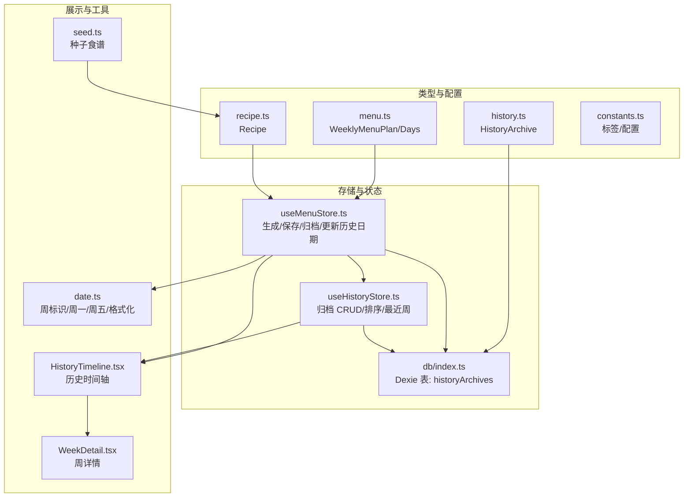
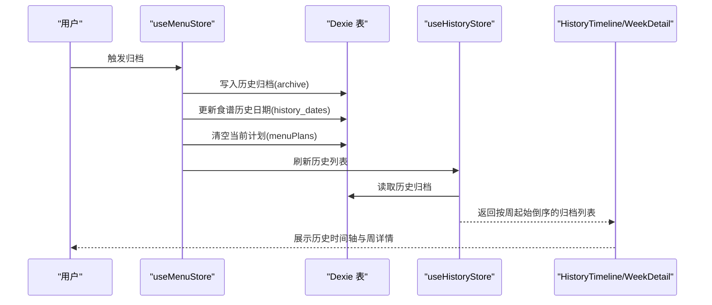
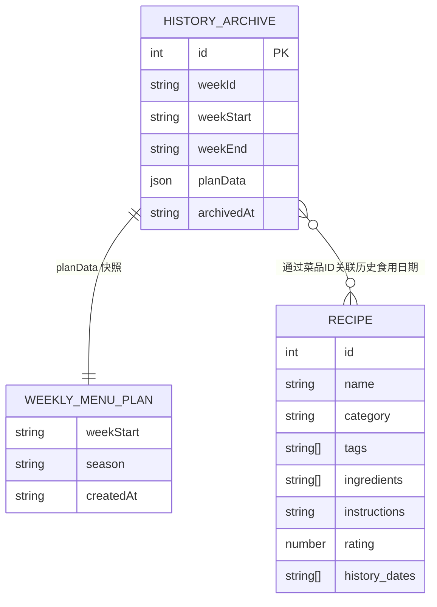
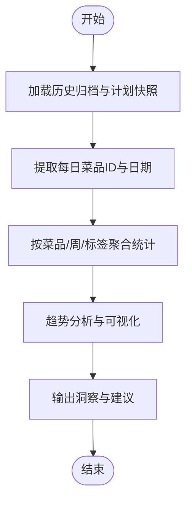
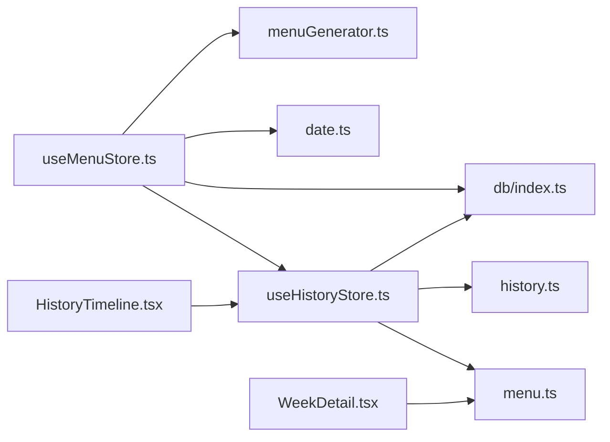

# 历史记录数据模型

<cite>
**本文引用的文件**
- [src/types/history.ts](file://src/types/history.ts)
- [src/types/menu.ts](file://src/types/menu.ts)
- [src/types/recipe.ts](file://src/types/recipe.ts)
- [src/db/index.ts](file://src/db/index.ts)
- [src/store/useHistoryStore.ts](file://src/store/useHistoryStore.ts)
- [src/store/useMenuStore.ts](file://src/store/useMenuStore.ts)
- [src/components/History/HistoryTimeline.tsx](file://src/components/History/HistoryTimeline.tsx)
- [src/components/History/WeekDetail.tsx](file://src/components/History/WeekDetail.tsx)
- [src/utils/date.ts](file://src/utils/date.ts)
- [src/config/constants.ts](file://src/config/constants.ts)
- [src/db/seed.ts](file://src/db/seed.ts)
</cite>

## 目录
1. [简介](#简介)
2. [项目结构](#项目结构)
3. [核心组件](#核心组件)
4. [架构总览](#架构总览)
5. [详细组件分析](#详细组件分析)
6. [依赖分析](#依赖分析)
7. [性能考虑](#性能考虑)
8. [故障排查指南](#故障排查指南)
9. [结论](#结论)
10. [附录](#附录)

## 简介
本文件系统性地阐述“历史记录数据模型”，聚焦于历史归档（HistoryArchive）的结构、与食谱（Recipe）及菜单（WeeklyMenuPlan）的关系、数据完整性约束、聚合统计与趋势分析思路、查询优化与索引策略，以及在图表展示、统计分析与个性化推荐中的应用示例。历史记录用于保存每周菜单计划的快照，并在归档时同步更新食谱的历史食用日期，形成可追溯的消费轨迹。

## 项目结构
围绕历史记录的关键模块与文件如下：
- 类型定义：历史归档、菜单计划、食谱
- 存储层：IndexedDB（Dexie）表结构与初始化
- 状态管理：历史归档的加载、删除、最近周检索
- 菜单流程：生成、保存、归档、更新食谱历史日期
- 展示组件：历史时间轴与周详情
- 工具与配置：日期计算、标签与配置常量

**图示来源**
- [src/types/history.ts:1-11](file://src/types/history.ts#L1-L11)
- [src/types/menu.ts:1-45](file://src/types/menu.ts#L1-L45)
- [src/types/recipe.ts:1-21](file://src/types/recipe.ts#L1-L21)
- [src/db/index.ts:1-68](file://src/db/index.ts#L1-L68)
- [src/store/useHistoryStore.ts:1-46](file://src/store/useHistoryStore.ts#L1-L46)
- [src/store/useMenuStore.ts:1-292](file://src/store/useMenuStore.ts#L1-L292)
- [src/components/History/HistoryTimeline.tsx:1-107](file://src/components/History/HistoryTimeline.tsx#L1-L107)
- [src/components/History/WeekDetail.tsx:1-56](file://src/components/History/WeekDetail.tsx#L1-L56)
- [src/utils/date.ts:1-49](file://src/utils/date.ts#L1-L49)
- [src/config/constants.ts:1-44](file://src/config/constants.ts#L1-L44)
- [src/db/seed.ts:1-709](file://src/db/seed.ts#L1-L709)

**章节来源**
- [src/types/history.ts:1-11](file://src/types/history.ts#L1-L11)
- [src/db/index.ts:1-68](file://src/db/index.ts#L1-L68)

## 核心组件
- 历史归档（HistoryArchive）
  - 字段：id（自增主键）、weekId（如 "2024-W41"）、weekStart（周一日期）、weekEnd（周五日期）、planData（WeeklyMenuPlan 快照）、archivedAt（归档时间戳）
  - 用途：保存每周菜单计划的不可变快照，便于回溯与统计
- 菜单计划（WeeklyMenuPlan）
  - 字段：weekStart、days（DayPlan 数组）、createdAt、season
  - 与历史归档的关系：归档时将 planData 持久化为历史记录的一部分
- 食谱（Recipe）
  - 字段：history_dates（历史食用日期数组）
  - 与历史归档的关系：归档时根据计划中的菜品 ID，向对应食谱的 history_dates 添加日期，形成“菜品-食用日期”关联

**章节来源**
- [src/types/history.ts:3-10](file://src/types/history.ts#L3-L10)
- [src/types/menu.ts:28-34](file://src/types/menu.ts#L28-L34)
- [src/types/recipe.ts:11-20](file://src/types/recipe.ts#L11-L20)

## 架构总览
历史记录贯穿“生成-保存-归档-统计”的闭环：
- 生成阶段：生成 WeeklyMenuPlan
- 保存阶段：将计划写入 menuPlans 表
- 归档阶段：将计划快照写入 historyArchives，并更新各菜品的 history_dates
- 展示阶段：useHistoryStore 读取历史归档，HistoryTimeline/WeekDetail 展示

**图示来源**
- [src/store/useMenuStore.ts:250-291](file://src/store/useMenuStore.ts#L250-L291)
- [src/store/useHistoryStore.ts:21-44](file://src/store/useHistoryStore.ts#L21-L44)
- [src/components/History/HistoryTimeline.tsx:27-106](file://src/components/History/HistoryTimeline.tsx#L27-L106)
- [src/components/History/WeekDetail.tsx:44-55](file://src/components/History/WeekDetail.tsx#L44-L55)

## 详细组件分析

### 历史归档实体结构与字段定义
- id：自增主键，唯一标识每条历史记录
- weekId：ISO 周标识，如 "2024-W41"，用于跨年/跨周排序与展示
- weekStart：周一日期（YYYY-MM-DD），作为排序与范围查询的锚点
- weekEnd：周五日期（YYYY-MM-DD），辅助展示与范围判断
- planData：WeeklyMenuPlan 的深拷贝快照，包含一周的每日计划（含早餐与晚餐构成）
- archivedAt：归档时间戳，用于审计与排序

字段约束与一致性：
- weekStart 与 weekEnd 由 weekId 推导，确保周内日期连续且正确
- planData 与当前周计划解耦，归档后不受后续修改影响

**章节来源**
- [src/types/history.ts:3-10](file://src/types/history.ts#L3-L10)
- [src/store/useMenuStore.ts:254-267](file://src/store/useMenuStore.ts#L254-L267)
- [src/utils/date.ts:13-48](file://src/utils/date.ts#L13-L48)

### 历史记录与食谱、菜单的关系
- 与 WeeklyMenuPlan 的关系
  - 归档时将当前周计划的 planData 写入历史归档，形成不可变快照
  - 历史记录不直接引用 WeeklyMenuPlan 的 id，而是持有完整的 planData
- 与 Recipe 的关系
  - 归档流程中遍历 planData 中的每日菜品 ID，向对应食谱的 history_dates 添加当天日期
  - 通过 history_dates 实现“菜品-食用日期”的多对多历史轨迹

**图示来源**
- [src/types/history.ts:3-10](file://src/types/history.ts#L3-L10)
- [src/types/menu.ts:28-34](file://src/types/menu.ts#L28-L34)
- [src/types/recipe.ts:11-20](file://src/types/recipe.ts#L11-L20)
- [src/store/useMenuStore.ts:271-282](file://src/store/useMenuStore.ts#L271-L282)

**章节来源**
- [src/store/useMenuStore.ts:250-291](file://src/store/useMenuStore.ts#L250-L291)
- [src/types/recipe.ts:19](file://src/types/recipe.ts#L19)

### 历史记录与菜单的数据完整性约束
- weekId 与 weekStart/weekEnd 的一致性
  - weekId 由周一起始推导，weekStart/weekEnd 由周一起始推导，确保周内日期连续
- 归档原子性
  - 归档时先写入历史归档，再批量更新食谱历史日期，最后清空当前计划表，保证一致性
- 历史日期去重
  - 归档时对每日菜品 ID 去重后再更新历史日期，避免重复写入

**章节来源**
- [src/store/useMenuStore.ts:250-291](file://src/store/useMenuStore.ts#L250-L291)
- [src/utils/date.ts:13-48](file://src/utils/date.ts#L13-L48)

### 历史数据的聚合统计、趋势分析与数据挖掘
以下为概念性设计，帮助理解如何基于历史记录进行分析（不绑定具体实现）：

- 聚合统计
  - 菜品频率：统计每个菜品在历史中的出现次数与占比
  - 周频趋势：按周聚合每日菜品使用次数，观察菜品使用趋势
  - 营养与标签：按标签（如“适宜老人”、“夏季推荐”）统计菜品使用情况
- 趋势分析
  - 季节性：对比不同季节（summer/winter/default）菜品偏好变化
  - 重复率：分析菜品在两周内的重复使用情况（结合 CROSS_WEEK_WEIGHT_FACTOR 思想）
- 数据挖掘
  - 关联规则：发现菜品组合（如某荤菜与某汤的搭配频率）
  - 个性化推荐：基于历史日期与菜品评分，构建用户偏好画像

[此图为概念流程，无需图示来源]

### 查询优化、索引策略与大数据量处理
- 索引策略（基于 Dexie）
  - historyArchives 表：主键 id（自增），weekId、weekStart（复合索引可用）
  - menuPlans 表：weekStart（索引），用于快速定位当前周计划
  - recipes 表：name、category、rating（索引），用于筛选与评分
- 查询优化建议
  - 历史列表排序：按 weekStart 倒序（最近在前），避免全表排序
  - 范围查询：按 weekStart/weekEnd 进行范围过滤
  - 分页加载：历史记录较多时采用分页或虚拟滚动
- 大数据量处理
  - 归档批处理：一次归档只做一次批量更新食谱历史日期
  - 清理策略：定期清理过期历史记录（如保留最近 N 周）

**章节来源**
- [src/db/index.ts:14-19](file://src/db/index.ts#L14-L19)
- [src/store/useHistoryStore.ts:21-26](file://src/store/useHistoryStore.ts#L21-L26)

### 图表展示、统计分析与个性化推荐示例
- 图表展示
  - 历史时间轴：按周展示归档列表，点击展开周详情
  - 周详情：展示每日早餐与晚餐构成，标注菜品类别徽标
- 统计分析
  - 菜品使用 Top-N：统计历史中使用最多的菜品
  - 季节分布：按季节统计菜品使用次数
- 个性化推荐
  - 基于历史日期与评分，为用户推荐相似菜品或调整搭配

**章节来源**
- [src/components/History/HistoryTimeline.tsx:15-25](file://src/components/History/HistoryTimeline.tsx#L15-L25)
- [src/components/History/WeekDetail.tsx:8-42](file://src/components/History/WeekDetail.tsx#L8-L42)

## 依赖分析
- useMenuStore 依赖
  - 生成算法：generateWeeklyMenu（来自算法模块）
  - 日期工具：getMonday/getWeekId/getFriday/formatDate
  - 食谱与历史存储：更新食谱历史日期、写入历史归档
- useHistoryStore 依赖
  - Dexie 表：historyArchives
  - 排序与删除：按周起始倒序、删除指定归档
- 展示组件依赖
  - 历史时间轴依赖历史归档列表与确认对话框
  - 周详情依赖菜单类型定义与标签徽标

**图示来源**
- [src/store/useMenuStore.ts:1-292](file://src/store/useMenuStore.ts#L1-L292)
- [src/store/useHistoryStore.ts:1-46](file://src/store/useHistoryStore.ts#L1-L46)
- [src/components/History/HistoryTimeline.tsx:1-107](file://src/components/History/HistoryTimeline.tsx#L1-L107)
- [src/components/History/WeekDetail.tsx:1-56](file://src/components/History/WeekDetail.tsx#L1-L56)
- [src/db/index.ts:1-68](file://src/db/index.ts#L1-L68)
- [src/types/history.ts:1-11](file://src/types/history.ts#L1-L11)
- [src/types/menu.ts:1-45](file://src/types/menu.ts#L1-L45)
- [src/utils/date.ts:1-49](file://src/utils/date.ts#L1-L49)

**章节来源**
- [src/store/useMenuStore.ts:1-292](file://src/store/useMenuStore.ts#L1-L292)
- [src/store/useHistoryStore.ts:1-46](file://src/store/useHistoryStore.ts#L1-L46)

## 性能考虑
- 索引与查询
  - 为 weekStart 建立索引，支持快速排序与范围查询
  - 对 weekId 建立索引，提升周标识查询效率
- 批量操作
  - 归档时一次性更新所有菜品的历史日期，减少多次写入
- 内存与渲染
  - 历史时间轴采用折叠面板与懒加载，避免一次性渲染大量周详情
- 数据清理
  - 定期清理过期历史记录，控制表规模

[本节为通用指导，无需章节来源]

## 故障排查指南
- 历史记录为空
  - 检查是否执行过归档流程；确认 useMenuStore 的 archivePlan 是否成功写入历史归档并刷新列表
- 周排序异常
  - 确认 weekStart 字符串格式为 YYYY-MM-DD，排序逻辑按字符串比较
- 食谱历史日期未更新
  - 检查归档流程中是否遍历了 planData 的每日菜品 ID，并调用了 recordUsageDates
- 删除历史记录后未生效
  - 确认 deleteArchive 后调用了 loadArchives 刷新列表

**章节来源**
- [src/store/useHistoryStore.ts:21-44](file://src/store/useHistoryStore.ts#L21-L44)
- [src/store/useMenuStore.ts:250-291](file://src/store/useMenuStore.ts#L250-L291)

## 结论
历史记录数据模型以 HistoryArchive 为核心，通过 WeeklyMenuPlan 快照与 Recipe.history_dates 的联动，构建了可追溯、可统计、可分析的消费轨迹。配合合理的索引与批处理策略，可在大数据量场景下保持良好性能；通过图表与统计分析，可为个性化推荐与健康饮食管理提供支撑。

## 附录
- 周标识与日期工具
  - getWeekId：生成 ISO 周标识（如 "2024-W41"）
  - getMonday/getFriday：基于给定日期推导周一与周五
  - formatDate：统一日期格式（YYYY-MM-DD）
- 标签与配置常量
  - 标签：适宜老人、夏季推荐、凉菜、冬季推荐、粥类、辣
  - 配置：强制牛奶燕麦日、每周粥类最大天数、正餐配置、跨周降权系数、五星菜重复上限

**章节来源**
- [src/utils/date.ts:13-48](file://src/utils/date.ts#L13-L48)
- [src/config/constants.ts:1-44](file://src/config/constants.ts#L1-L44)