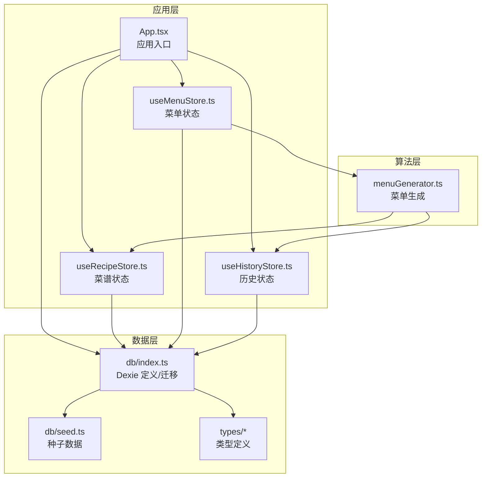
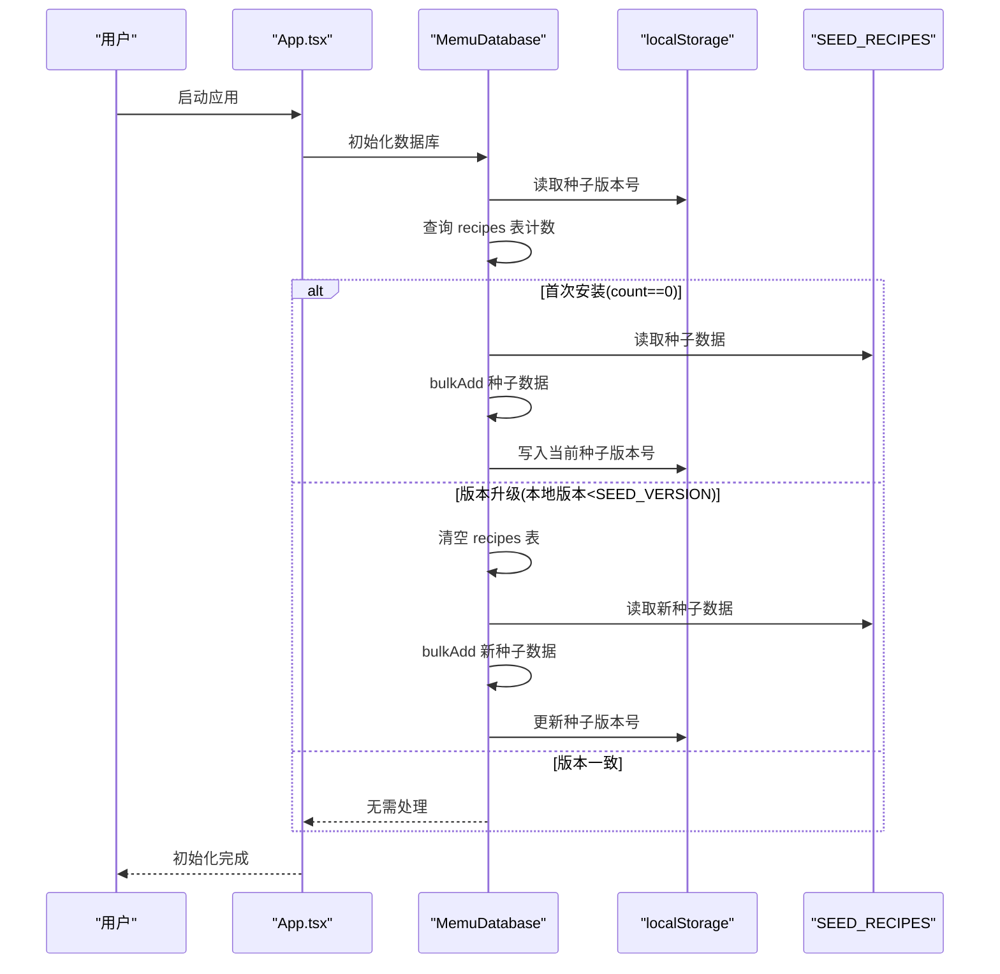
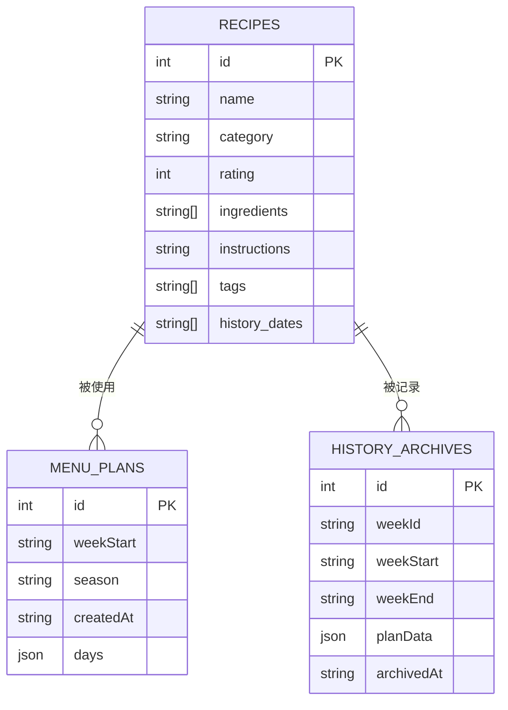
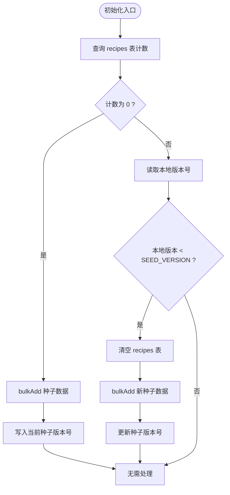
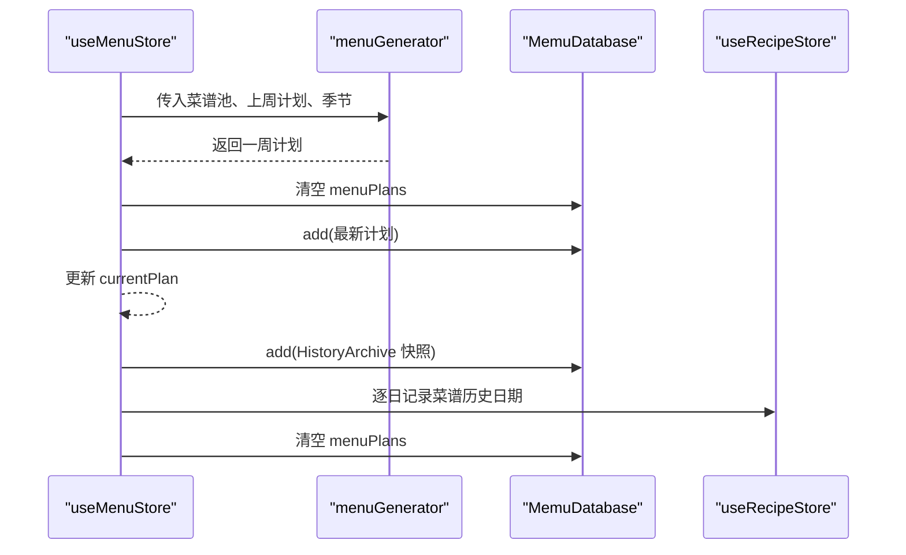
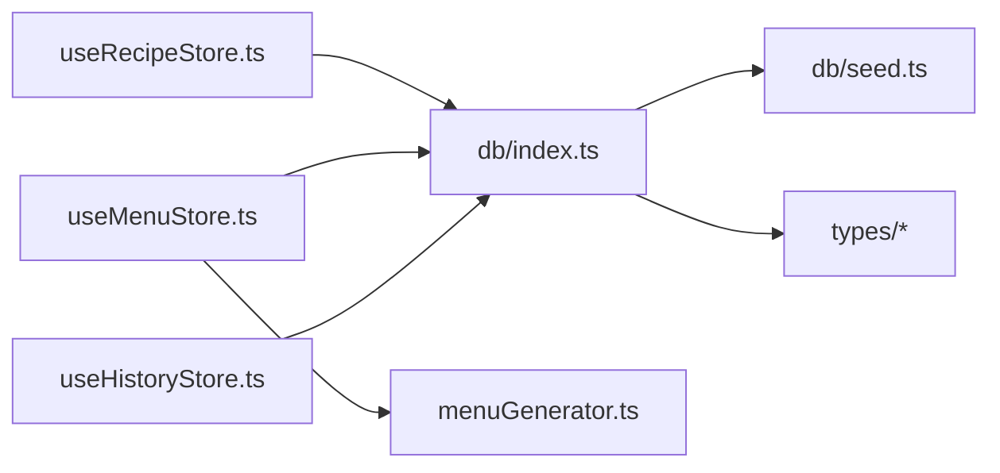

# 数据库模式设计

<cite>
**本文引用的文件**
- [src/db/index.ts](file://src/db/index.ts)
- [src/db/seed.ts](file://src/db/seed.ts)
- [src/types/recipe.ts](file://src/types/recipe.ts)
- [src/types/menu.ts](file://src/types/menu.ts)
- [src/types/history.ts](file://src/types/history.ts)
- [src/config/constants.ts](file://src/config/constants.ts)
- [src/store/useRecipeStore.ts](file://src/store/useRecipeStore.ts)
- [src/store/useMenuStore.ts](file://src/store/useMenuStore.ts)
- [src/store/useHistoryStore.ts](file://src/store/useHistoryStore.ts)
- [src/algorithms/menuGenerator.ts](file://src/algorithms/menuGenerator.ts)
- [src/App.tsx](file://src/App.tsx)
</cite>

## 目录
1. [简介](#简介)
2. [项目结构](#项目结构)
3. [核心组件](#核心组件)
4. [架构总览](#架构总览)
5. [详细组件分析](#详细组件分析)
6. [依赖分析](#依赖分析)
7. [性能考虑](#性能考虑)
8. [故障排查指南](#故障排查指南)
9. [结论](#结论)
10. [附录](#附录)

## 简介
本文件系统性阐述 Memu 的数据库模式设计，覆盖本地存储的数据结构、表关系与约束、种子数据初始化流程、默认值与预填充策略、数据模型与 IndexedDB 的映射、序列化机制与版本迁移方案，并给出备份恢复、清理与性能调优建议，以及扩展指南、向后兼容与升级策略、一致性与并发控制实现。

## 项目结构
- 数据层：基于 Dexie（IndexedDB 的封装）实现三层：
  - 数据库定义与版本迁移：src/db/index.ts
  - 种子数据：src/db/seed.ts
  - 类型定义：src/types/*.ts
- 应用层：通过 Zustand Store 访问数据库，负责业务逻辑与状态管理：
  - 菜谱管理：src/store/useRecipeStore.ts
  - 菜单规划：src/store/useMenuStore.ts
  - 历史归档：src/store/useHistoryStore.ts
- 算法层：菜单生成与权重计算等算法位于 src/algorithms/*
- 初始化入口：src/App.tsx 在应用启动时执行数据库初始化与种子数据导入

**图表来源**
- [src/App.tsx:11-22](file://src/App.tsx#L11-L22)
- [src/db/index.ts:7-22](file://src/db/index.ts#L7-L22)
- [src/db/seed.ts:1-10](file://src/db/seed.ts#L1-L10)
- [src/store/useRecipeStore.ts:1-25](file://src/store/useRecipeStore.ts#L1-L25)
- [src/store/useMenuStore.ts:1-37](file://src/store/useMenuStore.ts#L1-L37)
- [src/store/useHistoryStore.ts:1-15](file://src/store/useHistoryStore.ts#L1-L15)
- [src/algorithms/menuGenerator.ts:1-18](file://src/algorithms/menuGenerator.ts#L1-L18)

**章节来源**
- [src/App.tsx:11-22](file://src/App.tsx#L11-L22)
- [src/db/index.ts:7-22](file://src/db/index.ts#L7-L22)

## 核心组件
- 数据库类 MemuDatabase：继承自 Dexie，声明三张表 recipes、menuPlans、historyArchives，并定义初始版本 1 的 stores 规则。
- 种子数据：包含约 80 道预置菜谱，覆盖多种分类与标签，首次运行或版本升级时导入。
- 类型系统：Recipe、WeeklyMenuPlan、HistoryArchive 三类核心实体，配合枚举与接口确保字段语义与约束。
- 初始化流程：应用启动时检查本地计数与版本，决定是否导入或重置种子数据。

**章节来源**
- [src/db/index.ts:7-22](file://src/db/index.ts#L7-L22)
- [src/db/index.ts:37-57](file://src/db/index.ts#L37-L57)
- [src/db/seed.ts:8-20](file://src/db/seed.ts#L8-L20)
- [src/types/recipe.ts:11-20](file://src/types/recipe.ts#L11-L20)
- [src/types/menu.ts:28-34](file://src/types/menu.ts#L28-L34)
- [src/types/history.ts:3-10](file://src/types/history.ts#L3-L10)

## 架构总览
数据库采用 IndexedDB 存储，Dexie 提供 ORM 能力与简单迁移语法。应用通过 Store 层读写数据库，算法层根据业务规则生成菜单并写入数据库。初始化阶段完成种子数据导入与版本校验。

**图表来源**
- [src/App.tsx:15-22](file://src/App.tsx#L15-L22)
- [src/db/index.ts:37-57](file://src/db/index.ts#L37-L57)
- [src/db/seed.ts:8-20](file://src/db/seed.ts#L8-L20)

## 详细组件分析

### 数据库与表结构
- 表定义与索引
  - recipes：主键自增 id，索引 name、category、rating
  - menuPlans：主键自增 id，索引 weekStart
  - historyArchives：主键自增 id，索引 weekId、weekStart
- 版本迁移
  - 当前版本 1，后续如需变更表结构，可在新版本中通过 stores 语法添加/删除索引或新增表。
- 数据模型映射
  - TypeScript 接口与 Dexie 表一一对应，Dexie 自动序列化对象为 IndexedDB 记录。

**图表来源**
- [src/db/index.ts:14-18](file://src/db/index.ts#L14-L18)
- [src/types/recipe.ts:11-20](file://src/types/recipe.ts#L11-L20)
- [src/types/menu.ts:28-34](file://src/types/menu.ts#L28-L34)
- [src/types/history.ts:3-10](file://src/types/history.ts#L3-L10)

**章节来源**
- [src/db/index.ts:14-18](file://src/db/index.ts#L14-L18)
- [src/types/recipe.ts:11-20](file://src/types/recipe.ts#L11-L20)
- [src/types/menu.ts:28-34](file://src/types/menu.ts#L28-L34)
- [src/types/history.ts:3-10](file://src/types/history.ts#L3-L10)

### 种子数据与初始化流程
- 种子数据来源：src/db/seed.ts 提供约 80 道菜谱，覆盖早餐、荤菜、素菜、汤、主食、简餐等分类，含标签与历史日期字段。
- 初始化策略：
  - 首次安装：recipes 表计数为 0 时直接 bulkAdd 种子数据，并写入当前种子版本号。
  - 版本升级：若本地版本小于 SEED_VERSION，则清空 recipes 并重新导入，同时更新版本号。
  - 版本一致：不做任何处理。
- 版本号管理：SEED_VERSION 与 localStorage 中的版本键共同维护，确保跨浏览器升级行为一致。

**图表来源**
- [src/db/index.ts:37-57](file://src/db/index.ts#L37-L57)
- [src/db/seed.ts:8-20](file://src/db/seed.ts#L8-L20)

**章节来源**
- [src/db/index.ts:24-28](file://src/db/index.ts#L24-L28)
- [src/db/index.ts:37-57](file://src/db/index.ts#L37-L57)
- [src/db/seed.ts:8-20](file://src/db/seed.ts#L8-L20)

### 数据模型与序列化
- 对象序列化：Dexie 默认将 JavaScript 对象序列化为 IndexedDB 记录，包括数组与嵌套对象。
- 字段语义：
  - Recipe：包含名称、分类、标签、食材列表、做法文本、评分、历史食用日期。
  - WeeklyMenuPlan：包含周起始日期、星期计划、创建时间、季节模式、星期天明细。
  - HistoryArchive：包含周标识、起止日期、计划快照、归档时间。
- 默认值与空值：
  - rating 默认为 null（未品尝），history_dates 默认为空数组。
  - 未指定 id 的实体在插入时由 Dexie 自增分配。

**章节来源**
- [src/types/recipe.ts:11-20](file://src/types/recipe.ts#L11-L20)
- [src/types/menu.ts:28-34](file://src/types/menu.ts#L28-L34)
- [src/types/history.ts:3-10](file://src/types/history.ts#L3-L10)

### 菜单生成与数据写入
- 菜单生成：算法根据分类池、使用次数、权重与季节模式随机挑选菜品，确保多样性和健康兜底。
- 写入策略：生成完成后将计划写入 menuPlans 表，清空旧计划并持久化最新版本。
- 归档流程：归档时将当前计划快照写入 historyArchives，并为每道菜记录历史食用日期，随后清空当前计划。

**图表来源**
- [src/store/useMenuStore.ts:131-152](file://src/store/useMenuStore.ts#L131-L152)
- [src/store/useMenuStore.ts:250-291](file://src/store/useMenuStore.ts#L250-L291)
- [src/algorithms/menuGenerator.ts:134-232](file://src/algorithms/menuGenerator.ts#L134-L232)

**章节来源**
- [src/store/useMenuStore.ts:119-125](file://src/store/useMenuStore.ts#L119-L125)
- [src/store/useMenuStore.ts:250-291](file://src/store/useMenuStore.ts#L250-L291)
- [src/algorithms/menuGenerator.ts:134-232](file://src/algorithms/menuGenerator.ts#L134-L232)

### 并发与事务控制
- 事务：recordUsageDates 使用 db.transaction('rw', ...) 包裹批量更新，保证同一事务内的原子性。
- 并发：应用层使用 Zustand 管理状态，Store 内部方法串行执行数据库操作，避免竞态。
- 一致性：归档流程先写入历史，再更新菜谱历史日期，最后清空当前计划，形成一致的快照。

**章节来源**
- [src/store/useRecipeStore.ts:95-107](file://src/store/useRecipeStore.ts#L95-L107)
- [src/store/useMenuStore.ts:250-291](file://src/store/useMenuStore.ts#L250-L291)

### 数据备份与恢复
- 备份思路：将 menuPlans 与 historyArchives 的当前内容导出为 JSON 文件，作为完整备份。
- 恢复思路：清空对应表后批量导入备份数据；如需重置菜谱库，调用 resetRecipesToSeed。
- 清理策略：定期删除历史归档或清空旧计划，释放存储空间。

**章节来源**
- [src/db/index.ts:62-67](file://src/db/index.ts#L62-L67)
- [src/store/useHistoryStore.ts:30-37](file://src/store/useHistoryStore.ts#L30-L37)

## 依赖分析
- 组件耦合
  - useMenuStore 依赖算法模块与 Store 层其他模块，承担“菜单生成—持久化—归档”的协调职责。
  - useRecipeStore 与 useHistoryStore 分别面向菜谱与历史，通过 db 实例访问底层数据。
- 外部依赖
  - Dexie：提供 IndexedDB 的声明式 ORM 与迁移能力。
  - localStorage：用于种子版本号持久化，驱动种子数据的自动重置。

**图表来源**
- [src/store/useRecipeStore.ts:1-25](file://src/store/useRecipeStore.ts#L1-L25)
- [src/store/useMenuStore.ts:1-37](file://src/store/useMenuStore.ts#L1-L37)
- [src/store/useHistoryStore.ts:1-15](file://src/store/useHistoryStore.ts#L1-L15)
- [src/db/index.ts:7-22](file://src/db/index.ts#L7-L22)
- [src/db/seed.ts:1-10](file://src/db/seed.ts#L1-L10)
- [src/types/recipe.ts:11-20](file://src/types/recipe.ts#L11-L20)

**章节来源**
- [src/store/useRecipeStore.ts:1-25](file://src/store/useRecipeStore.ts#L1-L25)
- [src/store/useMenuStore.ts:1-37](file://src/store/useMenuStore.ts#L1-L37)
- [src/store/useHistoryStore.ts:1-15](file://src/store/useHistoryStore.ts#L1-L15)
- [src/db/index.ts:7-22](file://src/db/index.ts#L7-L22)

## 性能考虑
- 索引优化：recipes 表已建立常用查询字段索引，有助于筛选与评分场景。
- 批量操作：种子导入使用 bulkAdd，减少多次往返；记录历史日期使用事务包裹批量更新。
- 查询策略：Store 层在内存中进行过滤与排序，避免频繁 IO；必要时可引入 Dexie 的复合索引或查询优化。
- 存储容量：定期清理历史归档，避免历史数据无限增长影响性能。

[本节为通用指导，无需列出具体文件来源]

## 故障排查指南
- 种子数据未导入
  - 检查初始化函数是否执行、recipes 表计数是否为 0、localStorage 版本号是否正确更新。
- 菜谱评分异常
  - 仅当菜谱 history_dates 非空时允许评分，否则抛出错误。
- 归档失败或数据不一致
  - 确认归档流程顺序：写入历史 → 更新菜谱历史日期 → 清空当前计划；必要时回滚或重建。

**章节来源**
- [src/db/index.ts:37-57](file://src/db/index.ts#L37-L57)
- [src/store/useRecipeStore.ts:81-90](file://src/store/useRecipeStore.ts#L81-L90)
- [src/store/useMenuStore.ts:250-291](file://src/store/useMenuStore.ts#L250-L291)

## 结论
Memu 的数据库模式以 Dexie 为核心，结合种子数据与版本号管理，实现了简洁可靠的本地存储方案。通过明确的表结构、合理的索引与事务控制，满足了菜谱管理、菜单生成与历史归档的业务需求。未来可通过版本迁移扩展表结构、引入更细粒度的索引与缓存策略，进一步提升性能与可维护性。

[本节为总结性内容，无需列出具体文件来源]

## 附录

### 版本迁移与扩展指南
- 迁移步骤
  - 在新版本中增加新的 version(n) 并在 stores 中声明新增表或索引。
  - 如需数据转换，可在迁移回调中执行转换逻辑。
- 向后兼容
  - 保持现有字段语义不变；新增字段提供默认值；避免删除已有索引。
- 升级策略
  - 通过 SEED_VERSION 与 localStorage 版本号协同，确保升级时自动重置种子数据。

**章节来源**
- [src/db/index.ts:14-18](file://src/db/index.ts#L14-L18)
- [src/db/index.ts:24-28](file://src/db/index.ts#L24-L28)

### 数据一致性与并发控制要点
- 事务边界：在需要强一致性的批量更新中使用事务，避免部分成功导致的状态不一致。
- 并发隔离：Store 方法串行执行数据库操作，降低竞态风险；复杂场景可引入锁或状态合并策略。

**章节来源**
- [src/store/useRecipeStore.ts:95-107](file://src/store/useRecipeStore.ts#L95-L107)