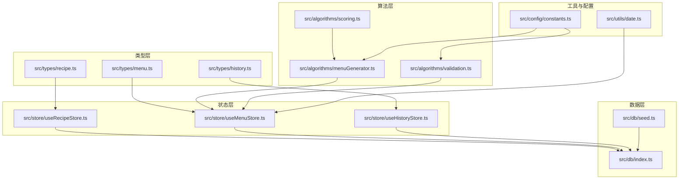
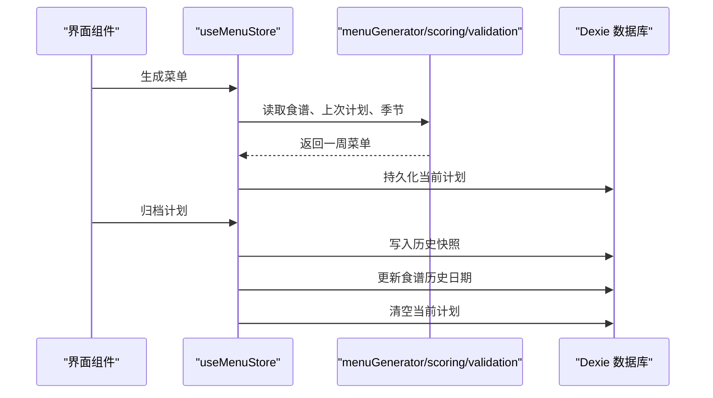
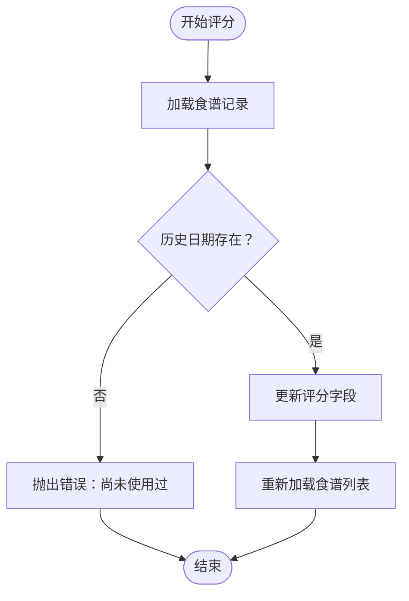
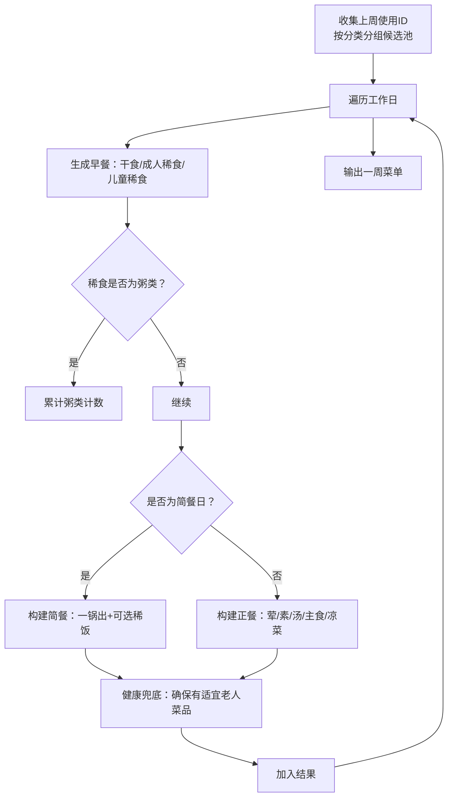
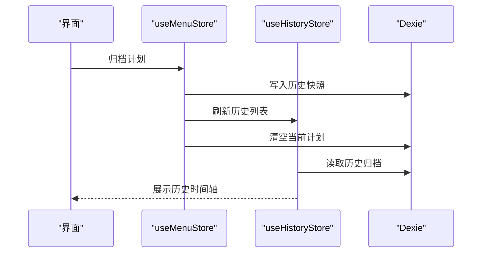
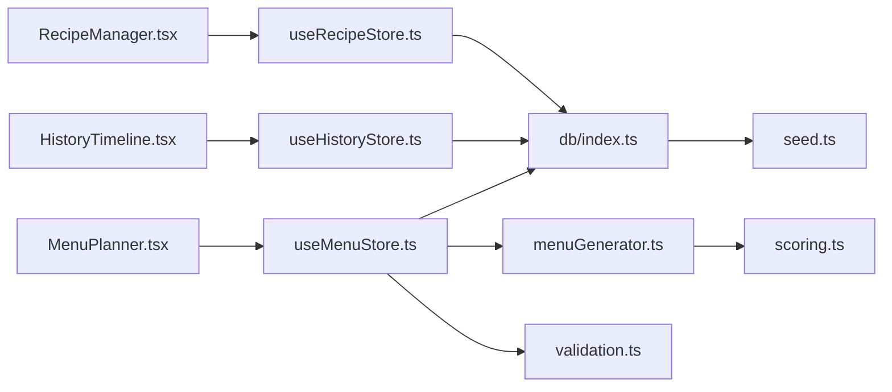

# 数据模型

<cite>
**本文引用的文件**   
- [src/types/recipe.ts](file://src/types/recipe.ts)
- [src/types/menu.ts](file://src/types/menu.ts)
- [src/types/history.ts](file://src/types/history.ts)
- [src/db/index.ts](file://src/db/index.ts)
- [src/db/seed.ts](file://src/db/seed.ts)
- [src/store/useRecipeStore.ts](file://src/store/useRecipeStore.ts)
- [src/store/useMenuStore.ts](file://src/store/useMenuStore.ts)
- [src/store/useHistoryStore.ts](file://src/store/useHistoryStore.ts)
- [src/algorithms/menuGenerator.ts](file://src/algorithms/menuGenerator.ts)
- [src/algorithms/scoring.ts](file://src/algorithms/scoring.ts)
- [src/algorithms/validation.ts](file://src/algorithms/validation.ts)
- [src/config/constants.ts](file://src/config/constants.ts)
- [src/utils/date.ts](file://src/utils/date.ts)
- [src/components/Recipe/RecipeManager.tsx](file://src/components/Recipe/RecipeManager.tsx)
- [src/components/Menu/MenuPlanner.tsx](file://src/components/Menu/MenuPlanner.tsx)
- [src/components/History/HistoryTimeline.tsx](file://src/components/History/HistoryTimeline.tsx)
</cite>

## 目录
1. [引言](#引言)
2. [项目结构](#项目结构)
3. [核心组件](#核心组件)
4. [架构总览](#架构总览)
5. [详细组件分析](#详细组件分析)
6. [依赖分析](#依赖分析)
7. [性能考虑](#性能考虑)
8. [故障排查指南](#故障排查指南)
9. [结论](#结论)
10. [附录](#附录)

## 引言
本文件面向 Memu 的数据模型，系统化梳理食谱、菜单、历史记录三大核心实体的数据结构、类型系统、接口契约与业务规则，并结合数据库模型、迁移策略与版本兼容性管理给出实践建议。同时覆盖数据校验、序列化/反序列化、性能优化以及数据安全与隐私保护的实现思路。

## 项目结构
Memu 的数据模型围绕前端状态与本地数据库展开：类型定义位于 types 目录，状态逻辑通过 zustand stores 管理，算法模块负责菜单生成与评分权重计算，数据库采用 Dexie 进行 IndexedDB 封装，配套种子数据初始化。

图表来源
- [src/types/recipe.ts:1-21](file://src/types/recipe.ts#L1-L21)
- [src/types/menu.ts:1-45](file://src/types/menu.ts#L1-L45)
- [src/types/history.ts:1-11](file://src/types/history.ts#L1-L11)
- [src/store/useRecipeStore.ts:1-121](file://src/store/useRecipeStore.ts#L1-L121)
- [src/store/useMenuStore.ts:1-292](file://src/store/useMenuStore.ts#L1-L292)
- [src/store/useHistoryStore.ts:1-46](file://src/store/useHistoryStore.ts#L1-L46)
- [src/algorithms/menuGenerator.ts:1-368](file://src/algorithms/menuGenerator.ts#L1-L368)
- [src/algorithms/scoring.ts:1-64](file://src/algorithms/scoring.ts#L1-L64)
- [src/algorithms/validation.ts:1-142](file://src/algorithms/validation.ts#L1-L142)
- [src/db/index.ts:1-34](file://src/db/index.ts#L1-L34)
- [src/db/seed.ts:1-745](file://src/db/seed.ts#L1-L745)
- [src/utils/date.ts:1-49](file://src/utils/date.ts#L1-L49)
- [src/config/constants.ts:1-44](file://src/config/constants.ts#L1-L44)

章节来源
- [src/types/recipe.ts:1-21](file://src/types/recipe.ts#L1-L21)
- [src/types/menu.ts:1-45](file://src/types/menu.ts#L1-L45)
- [src/types/history.ts:1-11](file://src/types/history.ts#L1-L11)
- [src/db/index.ts:1-34](file://src/db/index.ts#L1-L34)
- [src/db/seed.ts:1-745](file://src/db/seed.ts#L1-L745)
- [src/store/useRecipeStore.ts:1-121](file://src/store/useRecipeStore.ts#L1-L121)
- [src/store/useMenuStore.ts:1-292](file://src/store/useMenuStore.ts#L1-L292)
- [src/store/useHistoryStore.ts:1-46](file://src/store/useHistoryStore.ts#L1-L46)
- [src/algorithms/menuGenerator.ts:1-368](file://src/algorithms/menuGenerator.ts#L1-L368)
- [src/algorithms/scoring.ts:1-64](file://src/algorithms/scoring.ts#L1-L64)
- [src/algorithms/validation.ts:1-142](file://src/algorithms/validation.ts#L1-L142)
- [src/config/constants.ts:1-44](file://src/config/constants.ts#L1-L44)
- [src/utils/date.ts:1-49](file://src/utils/date.ts#L1-L49)

## 核心组件
- 食谱（Recipe）
  - 字段：id、name、category、tags、ingredients、instructions、rating、history_dates
  - 类型系统：枚举类别的联合类型，rating 支持 null/0/1-5
  - 业务规则：评分仅在有历史使用记录后允许；记录使用日期用于跨周权重与重复控制
- 菜单（WeeklyMenuPlan）
  - 结构：周起始日期、星期各日计划（含早餐与晚餐）、创建时间、季节模式
  - 早餐：干食、成人稀食、儿童稀食
  - 晚餐：简餐或正式正餐，正式正餐按角色划分荤/素/汤/主食/凉菜/一锅出
  - 季节模式：default/summer/winter，影响正餐配菜数量与汤品选择
- 历史记录（HistoryArchive）
  - 结构：周标识、周起止日期、计划快照、归档时间
  - 用途：归档已确认的菜单计划，作为后续生成器的“上周参考”

章节来源
- [src/types/recipe.ts:11-20](file://src/types/recipe.ts#L11-L20)
- [src/types/menu.ts:3-34](file://src/types/menu.ts#L3-L34)
- [src/types/history.ts:3-10](file://src/types/history.ts#L3-L10)

## 架构总览
数据流自上而下：UI 组件通过 stores 触发动作，stores 调用算法模块进行菜单生成与评分权重计算，最终写入 Dexie 数据库。历史归档时，将当前计划快照写入历史表，并更新食谱的历史使用日期。

图表来源
- [src/store/useMenuStore.ts:131-152](file://src/store/useMenuStore.ts#L131-L152)
- [src/store/useMenuStore.ts:250-290](file://src/store/useMenuStore.ts#L250-L290)
- [src/algorithms/menuGenerator.ts:128-226](file://src/algorithms/menuGenerator.ts#L128-L226)
- [src/algorithms/scoring.ts:14-42](file://src/algorithms/scoring.ts#L14-L42)
- [src/algorithms/validation.ts:27-141](file://src/algorithms/validation.ts#L27-L141)
- [src/db/index.ts:7-22](file://src/db/index.ts#L7-L22)

## 详细组件分析

### 食谱数据模型与状态管理
- 数据结构
  - RecipeCategory 为受控枚举，确保分类一致性
  - rating 为可空评分，null 表示未品尝，0 表示拉黑，1-5 为星级
  - history_dates 记录菜品被使用的日期集合，用于跨周权重与重复控制
- 状态与动作
  - 加载、新增、更新、删除、评分、记录使用日期
  - 评分前置条件：仅当历史使用日期非空时允许评分
  - 记录使用日期：去重批量写入，事务保障一致性
- 关键流程（评分）

图表来源
- [src/store/useRecipeStore.ts:81-90](file://src/store/useRecipeStore.ts#L81-L90)

章节来源
- [src/types/recipe.ts:1-21](file://src/types/recipe.ts#L1-L21)
- [src/store/useRecipeStore.ts:11-25](file://src/store/useRecipeStore.ts#L11-L25)
- [src/store/useRecipeStore.ts:81-107](file://src/store/useRecipeStore.ts#L81-L107)

### 菜单数据模型与生成算法
- 数据结构
  - DayPlan：包含星期标识、标签、早餐与晚餐
  - DinnerDish：菜品与角色（meat/veg/soup/staple/cold_dish/onepot）
  - WeeklyMenuPlan：包含周起始、星期计划、创建时间、季节模式
- 生成策略
  - 按分类分组候选池，使用加权随机抽取
  - 跨周降权因子、季节标签加分、星级菜品重复上限
  - 正餐健康兜底：至少一道“适宜老人”标签菜品
  - 简餐日：随机选定一天，仅含一锅出主食，夏季可额外搭配稀饭
- 关键流程（生成一周菜单）

图表来源
- [src/algorithms/menuGenerator.ts:128-226](file://src/algorithms/menuGenerator.ts#L128-L226)
- [src/algorithms/menuGenerator.ts:232-336](file://src/algorithms/menuGenerator.ts#L232-L336)
- [src/algorithms/scoring.ts:14-42](file://src/algorithms/scoring.ts#L14-L42)

章节来源
- [src/types/menu.ts:1-45](file://src/types/menu.ts#L1-L45)
- [src/algorithms/menuGenerator.ts:1-368](file://src/algorithms/menuGenerator.ts#L1-L368)
- [src/algorithms/scoring.ts:1-64](file://src/algorithms/scoring.ts#L1-L64)
- [src/config/constants.ts:1-44](file://src/config/constants.ts#L1-L44)

### 历史记录与归档流程
- 数据结构
  - HistoryArchive：包含周标识、周起止、计划快照、归档时间
- 归档流程
  - 生成计划快照（深拷贝），写入历史表
  - 遍历计划中每日菜品，向食谱历史日期追加对应日期
  - 清空当前计划表，刷新历史列表

图表来源
- [src/store/useMenuStore.ts:250-290](file://src/store/useMenuStore.ts#L250-L290)
- [src/store/useHistoryStore.ts:21-44](file://src/store/useHistoryStore.ts#L21-L44)

章节来源
- [src/types/history.ts:1-11](file://src/types/history.ts#L1-L11)
- [src/store/useMenuStore.ts:250-290](file://src/store/useMenuStore.ts#L250-L290)
- [src/store/useHistoryStore.ts:1-46](file://src/store/useHistoryStore.ts#L1-L46)

### 数据校验与业务规则
- 校验维度
  - 早餐结构完整性（干食/稀食齐全）
  - 强制稀食：周一、三、五成人稀食必须为“牛奶燕麦片”
  - 粥类周限额：每周最多 MAX_PORRIDGE_DAYS_PER_WEEK 次
  - 简餐天数：每周 SIMPLE_MEAL_COUNT_PER_WEEK 天
  - 正餐配菜数量：按季节模式配置
  - 健康兜底：至少一道“适宜老人”标签菜品
  - 重复控制：普通菜品周内最多 1 次，5 星菜品最多 FIVE_STAR_MAX_REPEAT 次
- 输出结构
  - ValidationResult：valid、errors、warnings

章节来源
- [src/algorithms/validation.ts:12-142](file://src/algorithms/validation.ts#L12-L142)
- [src/config/constants.ts:1-44](file://src/config/constants.ts#L1-L44)

### 类型系统与接口契约
- 类型定义
  - RecipeCategory：受控枚举，确保分类一致性
  - Role：DinnerDish 的角色集合
  - SeasonMode：季节模式
  - WeeklyMenuPlan：菜单计划主体
- 接口契约
  - stores 动作签名与数据库表字段一一对应
  - 算法输入输出均基于上述类型，保证编译期安全

章节来源
- [src/types/recipe.ts:1-9](file://src/types/recipe.ts#L1-L9)
- [src/types/menu.ts:3-34](file://src/types/menu.ts#L3-L34)
- [src/types/history.ts:1-11](file://src/types/history.ts#L1-L11)

### 数据库模型与迁移策略
- 数据库版本与索引
  - 版本 1：recipes、menuPlans、historyArchives 三张表
  - 索引：recipes(name, category, rating)，menuPlans(weekStart)，historyArchives(weekId, weekStart)
- 种子数据
  - 首次启动时若食谱表为空，批量导入预置菜谱
- 迁移与兼容性
  - 当前版本为 1，如需升级可在新版本中添加 version(n).stores(...)，并提供迁移脚本
  - 建议保留向后兼容字段，避免破坏既有快照

章节来源
- [src/db/index.ts:14-19](file://src/db/index.ts#L14-L19)
- [src/db/index.ts:27-33](file://src/db/index.ts#L27-L33)
- [src/db/seed.ts:1-745](file://src/db/seed.ts#L1-L745)

### 使用示例与序列化/反序列化
- 示例场景
  - 新增食谱：调用 stores 的 addRecipe，自动刷新列表
  - 生成菜单：调用 generateMenu，内部持久化当前计划
  - 归档计划：调用 archivePlan，写入历史并清空当前计划
- 序列化/反序列化
  - 归档时使用 JSON 深拷贝保存计划快照，确保历史不可变
  - 日期格式统一为 ISO 日期字符串，便于排序与展示

章节来源
- [src/store/useRecipeStore.ts:66-79](file://src/store/useRecipeStore.ts#L66-L79)
- [src/store/useMenuStore.ts:131-152](file://src/store/useMenuStore.ts#L131-L152)
- [src/store/useMenuStore.ts:250-290](file://src/store/useMenuStore.ts#L250-L290)
- [src/utils/date.ts:28-30](file://src/utils/date.ts#L28-L30)

## 依赖分析
- 组件与状态
  - RecipeManager 依赖 useRecipeStore，渲染与交互
  - MenuPlanner 依赖 useMenuStore，触发生成、替换、删除与归档
  - HistoryTimeline 依赖 useHistoryStore，展示历史归档
- 状态与算法
  - useMenuStore 依赖 menuGenerator、scoring、validation
  - useRecipeStore 依赖 db，提供 CRUD 与评分、记录使用日期
- 数据层
  - 三张表：recipes、menuPlans、historyArchives
  - 种子数据初始化

图表来源
- [src/components/Recipe/RecipeManager.tsx:1-110](file://src/components/Recipe/RecipeManager.tsx#L1-L110)
- [src/components/Menu/MenuPlanner.tsx:1-75](file://src/components/Menu/MenuPlanner.tsx#L1-L75)
- [src/components/History/HistoryTimeline.tsx:1-107](file://src/components/History/HistoryTimeline.tsx#L1-L107)
- [src/store/useRecipeStore.ts:1-121](file://src/store/useRecipeStore.ts#L1-L121)
- [src/store/useMenuStore.ts:1-292](file://src/store/useMenuStore.ts#L1-L292)
- [src/store/useHistoryStore.ts:1-46](file://src/store/useHistoryStore.ts#L1-L46)
- [src/db/index.ts:1-34](file://src/db/index.ts#L1-L34)
- [src/db/seed.ts:1-745](file://src/db/seed.ts#L1-L745)
- [src/algorithms/menuGenerator.ts:1-368](file://src/algorithms/menuGenerator.ts#L1-L368)
- [src/algorithms/scoring.ts:1-64](file://src/algorithms/scoring.ts#L1-L64)
- [src/algorithms/validation.ts:1-142](file://src/algorithms/validation.ts#L1-L142)

章节来源
- [src/components/Recipe/RecipeManager.tsx:1-110](file://src/components/Recipe/RecipeManager.tsx#L1-L110)
- [src/components/Menu/MenuPlanner.tsx:1-75](file://src/components/Menu/MenuPlanner.tsx#L1-L75)
- [src/components/History/HistoryTimeline.tsx:1-107](file://src/components/History/HistoryTimeline.tsx#L1-L107)
- [src/store/index.ts:1-6](file://src/store/index.ts#L1-L6)

## 性能考虑
- 查询与索引
  - recipes 建立复合索引，支持按名称、分类、评分快速检索
  - menuPlans 按周起始日期索引，便于快速定位当前计划
- 写入优化
  - 批量导入种子数据，减少多次 I/O
  - 事务内批量更新食谱历史日期，降低锁竞争
- 算法复杂度
  - 生成菜单采用按分类分组与加权随机，时间复杂度与候选池大小线性相关
  - 校验阶段遍历一周计划，整体 O(天数×菜品数)，在当前规模下可接受
- 前端渲染
  - 使用虚拟滚动与懒加载，避免大量 DOM 渲染压力

## 故障排查指南
- 无法评分
  - 现象：提示“尚未使用过，无法评分”
  - 原因：食谱历史日期为空
  - 处理：先通过归档流程记录使用日期，再进行评分
- 菜单不符合规则
  - 现象：出现重复菜品或缺少“适宜老人”标签
  - 原因：重复控制阈值或健康兜底未满足
  - 处理：检查评分权重与重复计数，必要时手动替换菜品
- 归档后历史缺失
  - 现象：历史时间轴为空
  - 原因：未执行归档或数据库异常
  - 处理：确认归档流程完成，检查历史表数据

章节来源
- [src/store/useRecipeStore.ts:81-90](file://src/store/useRecipeStore.ts#L81-L90)
- [src/algorithms/validation.ts:91-134](file://src/algorithms/validation.ts#L91-L134)
- [src/store/useMenuStore.ts:250-290](file://src/store/useMenuStore.ts#L250-L290)

## 结论
Memu 的数据模型以清晰的类型系统为基础，结合 Dexie 本地数据库与 zustand 状态管理，实现了从食谱维护、菜单生成、校验到历史归档的完整闭环。通过权重与规则约束，既保证了营养均衡与多样性，又兼顾了易用性与可扩展性。建议在后续版本中完善数据库迁移机制与权限控制，进一步提升长期可用性与安全性。

## 附录
- 数据安全与隐私保护
  - 本地存储：数据驻留在用户设备，无需网络传输，天然具备隐私优势
  - 访问控制：当前为单用户本地应用，无需服务端鉴权；如扩展为多用户，建议引入本地加密与登录态管理
- 版本兼容性
  - 数据库版本号与索引变更需谨慎，建议每次升级提供迁移脚本与回滚策略
- 使用建议
  - 定期备份历史归档，防止误删
  - 合理设置标签与评分，提升生成质量