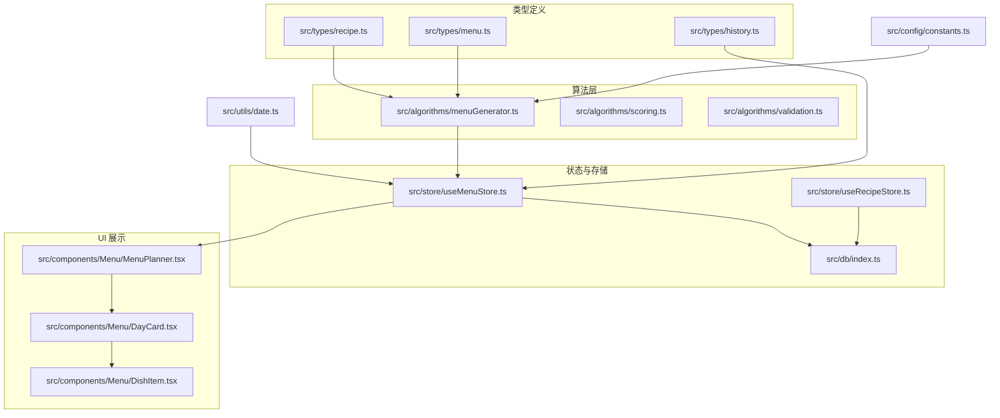
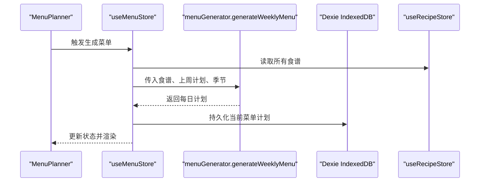
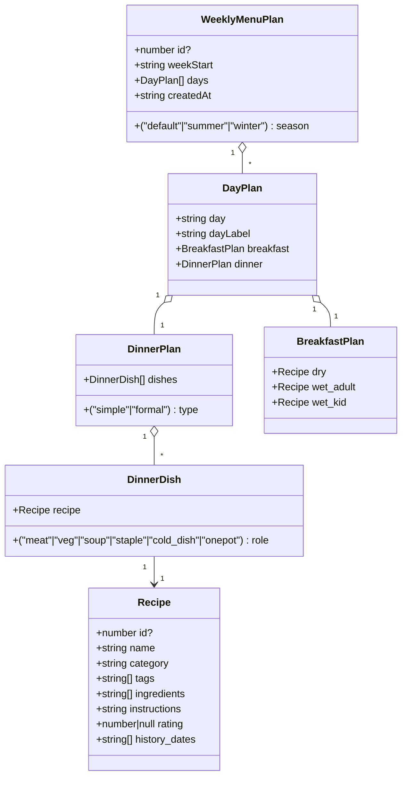
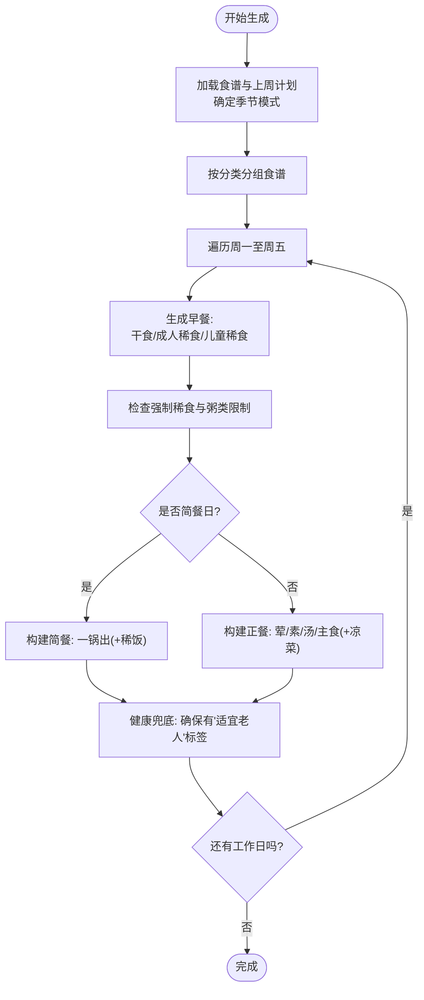
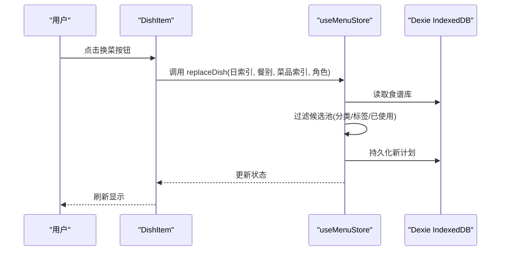
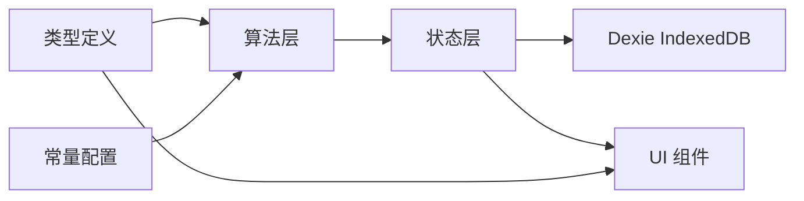

# 菜单数据模型

<cite>
**本文引用的文件**
- [src/types/menu.ts](file://src/types/menu.ts)
- [src/types/recipe.ts](file://src/types/recipe.ts)
- [src/algorithms/menuGenerator.ts](file://src/algorithms/menuGenerator.ts)
- [src/store/useMenuStore.ts](file://src/store/useMenuStore.ts)
- [src/store/useRecipeStore.ts](file://src/store/useRecipeStore.ts)
- [src/config/constants.ts](file://src/config/constants.ts)
- [src/db/index.ts](file://src/db/index.ts)
- [src/components/Menu/MenuPlanner.tsx](file://src/components/Menu/MenuPlanner.tsx)
- [src/components/Menu/DayCard.tsx](file://src/components/Menu/DayCard.tsx)
- [src/components/Menu/DishItem.tsx](file://src/components/Menu/DishItem.tsx)
- [src/utils/date.ts](file://src/utils/date.ts)
- [src/types/history.ts](file://src/types/history.ts)
</cite>

## 目录
1. [简介](#简介)
2. [项目结构](#项目结构)
3. [核心组件](#核心组件)
4. [架构总览](#架构总览)
5. [详细组件分析](#详细组件分析)
6. [依赖分析](#依赖分析)
7. [性能考虑](#性能考虑)
8. [故障排查指南](#故障排查指南)
9. [结论](#结论)
10. [附录](#附录)

## 简介
本文件系统性阐述“菜单数据模型”，覆盖菜单实体的数据结构、菜单与食谱的关联关系、菜单生成算法中的数据模型与约束、序列化与存储策略、以及在用户界面中的展示与交互逻辑。目标是帮助开发者与产品人员快速理解并正确使用菜单数据模型。

## 项目结构
该项目采用前端单页应用架构，围绕“菜单”“食谱”“历史归档”三大领域对象构建，通过 Zustand 状态管理与 Dexie IndexedDB 实现本地持久化与状态同步；菜单生成算法位于独立模块，遵循可测试与可扩展的设计原则。

图表来源
- [src/types/recipe.ts:1-21](file://src/types/recipe.ts#L1-L21)
- [src/types/menu.ts:1-45](file://src/types/menu.ts#L1-L45)
- [src/types/history.ts:1-11](file://src/types/history.ts#L1-L11)
- [src/algorithms/menuGenerator.ts:1-374](file://src/algorithms/menuGenerator.ts#L1-L374)
- [src/store/useMenuStore.ts:1-292](file://src/store/useMenuStore.ts#L1-L292)
- [src/store/useRecipeStore.ts:1-121](file://src/store/useRecipeStore.ts#L1-L121)
- [src/db/index.ts:1-68](file://src/db/index.ts#L1-L68)
- [src/components/Menu/MenuPlanner.tsx:1-75](file://src/components/Menu/MenuPlanner.tsx#L1-L75)
- [src/components/Menu/DayCard.tsx:1-78](file://src/components/Menu/DayCard.tsx#L1-L78)
- [src/components/Menu/DishItem.tsx:1-124](file://src/components/Menu/DishItem.tsx#L1-L124)
- [src/config/constants.ts:1-44](file://src/config/constants.ts#L1-L44)
- [src/utils/date.ts:1-49](file://src/utils/date.ts#L1-L49)

章节来源
- [src/types/menu.ts:1-45](file://src/types/menu.ts#L1-L45)
- [src/types/recipe.ts:1-21](file://src/types/recipe.ts#L1-L21)
- [src/config/constants.ts:1-44](file://src/config/constants.ts#L1-L44)
- [src/db/index.ts:1-68](file://src/db/index.ts#L1-L68)

## 核心组件
- 菜单实体：每周菜单计划（包含周起始日期、星期映射、每日计划、创建时间、季节模式）
- 每日计划：包含早餐与晚餐两部分，早餐分为干食、成人稀食、儿童稀食；晚餐为菜品集合及类型（简餐/正餐）
- 菜品实体：食谱（Recipe），包含名称、分类、标签、食材、做法、评分、历史食用日期等
- 关联关系：菜单与食谱为一对多映射，即一个菜单计划包含多个食谱实例，每个食谱可被多次使用
- 生成算法：根据约束与权重随机选择菜品，确保多样性、健康兜底与季节适配
- 存储策略：使用 Dexie 对 IndexedDB 进行 CRUD，菜单计划与历史归档分别持久化
- UI 展示：周视图卡片与菜品条目，支持换菜与删除操作

章节来源
- [src/types/menu.ts:19-34](file://src/types/menu.ts#L19-L34)
- [src/types/recipe.ts:11-20](file://src/types/recipe.ts#L11-L20)
- [src/algorithms/menuGenerator.ts:134-232](file://src/algorithms/menuGenerator.ts#L134-L232)
- [src/store/useMenuStore.ts:127-292](file://src/store/useMenuStore.ts#L127-L292)
- [src/db/index.ts:7-22](file://src/db/index.ts#L7-L22)

## 架构总览
菜单数据模型贯穿“类型定义—算法—状态—存储—UI”的完整链路。算法层负责生成与校验，状态层负责读写与交互，存储层负责本地持久化，UI 层负责可视化与用户操作。

图表来源
- [src/components/Menu/MenuPlanner.tsx:8-75](file://src/components/Menu/MenuPlanner.tsx#L8-L75)
- [src/store/useMenuStore.ts:131-152](file://src/store/useMenuStore.ts#L131-L152)
- [src/algorithms/menuGenerator.ts:134-232](file://src/algorithms/menuGenerator.ts#L134-L232)
- [src/db/index.ts:12-22](file://src/db/index.ts#L12-L22)
- [src/store/useRecipeStore.ts:58-64](file://src/store/useRecipeStore.ts#L58-L64)

## 详细组件分析

### 数据模型定义
- 食谱（Recipe）：包含唯一标识、名称、分类、标签数组、食材数组、做法文本、评分（0=拉黑，1-5=评分）、历史食用日期数组
- 菜单计划（WeeklyMenuPlan）：包含可选 ID、周起始日期（周一）、每日计划数组、创建时间、季节模式
- 每日计划（DayPlan）：包含星期键值与中文标签、早餐计划、晚餐计划
- 早餐计划（BreakfastPlan）：包含干食、成人稀食、儿童稀食
- 晚餐计划（DinnerPlan）：包含类型（简餐/正餐）与菜品数组
- 菜品项（DinnerDish）：包含食谱与角色（荤、素、汤、主食、凉菜、一锅出）

图表来源
- [src/types/recipe.ts:11-20](file://src/types/recipe.ts#L11-L20)
- [src/types/menu.ts:9-34](file://src/types/menu.ts#L9-L34)

章节来源
- [src/types/recipe.ts:11-20](file://src/types/recipe.ts#L11-L20)
- [src/types/menu.ts:3-34](file://src/types/menu.ts#L3-L34)

### 菜单与食谱的关联关系与一对多映射
- 关系性质：菜单计划包含多个每日计划，每日计划包含多个菜品项，菜品项引用食谱实体；因此菜单与食谱为一对多映射
- 引用方式：菜品项持有食谱对象引用，而非仅持有 ID，便于 UI 直接渲染与交互
- 使用计数：生成算法与换菜逻辑维护使用计数映射，避免重复使用高分菜品或超出约束

章节来源
- [src/algorithms/menuGenerator.ts:30-122](file://src/algorithms/menuGenerator.ts#L30-L122)
- [src/store/useMenuStore.ts:39-117](file://src/store/useMenuStore.ts#L39-L117)

### 菜单生成算法的数据模型、冲突检测与约束
- 输入：所有食谱、上周菜单计划（用于跨周权重与使用控制）、当前季节模式
- 输出：每日计划数组（含早餐与晚餐）
- 关键约束：
  - 必须稀食：周一、三、五强制包含特定稀食（如牛奶燕麦片）
  - 粥类限制：每周最多出现指定天数
  - 简餐安排：每周随机一天为简餐（一锅出，可搭配稀饭）
  - 正餐配置：按季节调整荤素汤主食数量，夏季额外添加凉菜
  - 健康兜底：至少包含一道“适宜老人”标签菜品，否则替换第一道荤菜
  - 使用次数：普通菜品每周最多使用一次，5星菜品最多使用两次
  - 拉黑过滤：评分标记为0的菜品直接排除
- 冲突检测与解决：
  - 使用计数映射（按菜品分类）跟踪已使用次数
  - 严格候选（权重>0且未超限）优先，软候选（未超限但权重被下调）其次，最后兜底允许重复
  - 换菜时收集当前周已使用菜品 ID，避免重复

图表来源
- [src/algorithms/menuGenerator.ts:134-232](file://src/algorithms/menuGenerator.ts#L134-L232)
- [src/algorithms/menuGenerator.ts:238-342](file://src/algorithms/menuGenerator.ts#L238-L342)
- [src/algorithms/menuGenerator.ts:347-373](file://src/algorithms/menuGenerator.ts#L347-L373)

章节来源
- [src/algorithms/menuGenerator.ts:73-117](file://src/algorithms/menuGenerator.ts#L73-L117)
- [src/algorithms/menuGenerator.ts:134-232](file://src/algorithms/menuGenerator.ts#L134-L232)
- [src/config/constants.ts:1-44](file://src/config/constants.ts#L1-L44)

### 序列化格式、存储策略与性能优化
- 序列化格式：
  - 菜单计划：JSON 结构，包含周起始日期、每日计划、创建时间、季节模式
  - 历史归档：包含周标识、周起始/结束日期、计划快照、归档时间
- 存储策略：
  - 使用 Dexie 对 IndexedDB 进行建模：recipes、menuPlans、historyArchives
  - 菜单计划表与历史表均建立索引以提升查询效率
  - 初始化时根据种子版本自动导入或重置食谱数据
- 性能优化：
  - 生成阶段按分类分组食谱，降低查找成本
  - 使用 Map 记录使用计数，O(1) 查询与更新
  - 换菜时先过滤拉黑与已使用菜品，再进行均匀随机选择
  - 事务批量更新食谱历史日期，减少数据库往返

章节来源
- [src/db/index.ts:7-22](file://src/db/index.ts#L7-L22)
- [src/db/index.ts:37-57](file://src/db/index.ts#L37-L57)
- [src/store/useMenuStore.ts:119-125](file://src/store/useMenuStore.ts#L119-L125)
- [src/store/useRecipeStore.ts:92-107](file://src/store/useRecipeStore.ts#L92-L107)

### 用户界面展示逻辑与交互处理
- 周视图：MenuPlanner 渲染每日卡片，支持生成菜单、切换季节、保存并存档
- 日卡片：DayCard 展示早餐与晚餐区域，标注简餐标签，支持换菜与删除
- 菜品条目：DishItem 展示菜品名称与角色徽章，悬停显示换菜/删除按钮，并弹窗展示详情
- 交互流程：
  - 生成菜单：触发算法生成并持久化，刷新 UI
  - 换菜：根据角色推导候选池，排除拉黑与当前菜品，避免重复使用
  - 删除：仅支持晚餐菜品删除（早餐槽位固定）
  - 存档：将当前计划快照写入历史归档，更新食谱历史日期并清空当前计划

图表来源
- [src/components/Menu/DishItem.tsx:50-124](file://src/components/Menu/DishItem.tsx#L50-L124)
- [src/store/useMenuStore.ts:167-224](file://src/store/useMenuStore.ts#L167-L224)
- [src/db/index.ts:12-22](file://src/db/index.ts#L12-L22)

章节来源
- [src/components/Menu/MenuPlanner.tsx:8-75](file://src/components/Menu/MenuPlanner.tsx#L8-L75)
- [src/components/Menu/DayCard.tsx:13-78](file://src/components/Menu/DayCard.tsx#L13-L78)
- [src/components/Menu/DishItem.tsx:50-124](file://src/components/Menu/DishItem.tsx#L50-L124)
- [src/store/useMenuStore.ts:167-241](file://src/store/useMenuStore.ts#L167-L241)

## 依赖分析
- 类型依赖：算法层依赖菜单与食谱类型定义；状态层依赖算法与类型；UI 层依赖状态与类型
- 配置依赖：算法层依赖常量配置（强制稀食、最大粥类天数、正餐配置、标签常量、跨周权重因子）
- 存储依赖：状态层依赖 Dexie 数据库；算法层间接依赖存储（通过状态层）
- UI 依赖：UI 组件依赖状态层与类型定义

图表来源
- [src/types/menu.ts:1-45](file://src/types/menu.ts#L1-L45)
- [src/types/recipe.ts:1-21](file://src/types/recipe.ts#L1-L21)
- [src/config/constants.ts:1-44](file://src/config/constants.ts#L1-L44)
- [src/algorithms/menuGenerator.ts:1-18](file://src/algorithms/menuGenerator.ts#L1-L18)
- [src/store/useMenuStore.ts:1-16](file://src/store/useMenuStore.ts#L1-L16)
- [src/db/index.ts:1-6](file://src/db/index.ts#L1-L6)

章节来源
- [src/algorithms/menuGenerator.ts:1-18](file://src/algorithms/menuGenerator.ts#L1-L18)
- [src/store/useMenuStore.ts:1-16](file://src/store/useMenuStore.ts#L1-L16)
- [src/db/index.ts:1-6](file://src/db/index.ts#L1-L6)

## 性能考虑
- 数据结构优化：使用 Map 记录使用计数，避免线性扫描；按分类分组食谱，降低筛选成本
- 算法优化：严格候选优先、软候选兜底、必要时允许重复的三层策略，平衡多样性与可用性
- 存储优化：批量更新食谱历史日期，减少事务开销；索引建立在常用查询字段上
- UI 优化：只在需要时加载与渲染，换菜与删除操作即时反馈，避免全量重绘

## 故障排查指南
- 生成失败或返回空菜品：
  - 检查食谱库是否为空或全部被拉黑
  - 检查约束是否过于严格（如粥类已达上限、5星菜品重复次数已达上限）
- 换菜无效：
  - 确认候选池是否为空（可能已无合适菜品）
  - 检查是否选择了当前菜品或已使用过的菜品
- 存档后历史日期未更新：
  - 确认存档流程已完成并调用了记录历史日期的步骤
  - 检查食谱历史日期字段是否正确写入

章节来源
- [src/store/useMenuStore.ts:250-290](file://src/store/useMenuStore.ts#L250-L290)
- [src/store/useRecipeStore.ts:92-107](file://src/store/useRecipeStore.ts#L92-L107)

## 结论
本菜单数据模型以清晰的类型定义为基础，结合严格的生成约束与高效的存储策略，实现了可维护、可扩展的菜单生成与展示体系。通过合理的 UI 交互与状态管理，用户可以便捷地生成、调整与归档每周菜单。

## 附录
- 关键字段说明
  - 菜单计划：周起始日期（周一）、每日计划数组、创建时间、季节模式
  - 每日计划：星期键值与中文标签、早餐与晚餐计划
  - 早餐计划：干食、成人稀食、儿童稀食
  - 晚餐计划：类型（简餐/正餐）、菜品数组
  - 菜品项：食谱引用与角色
  - 食谱：名称、分类、标签、食材、做法、评分、历史食用日期