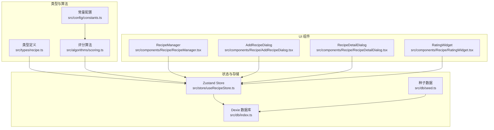
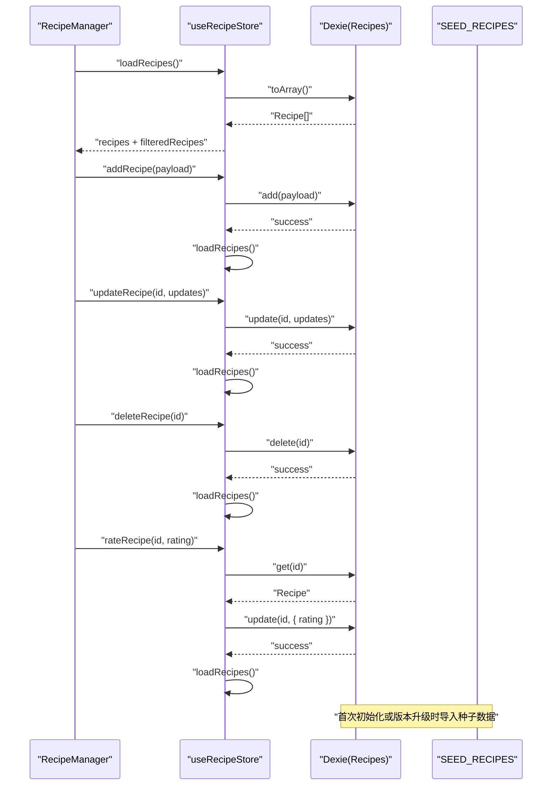
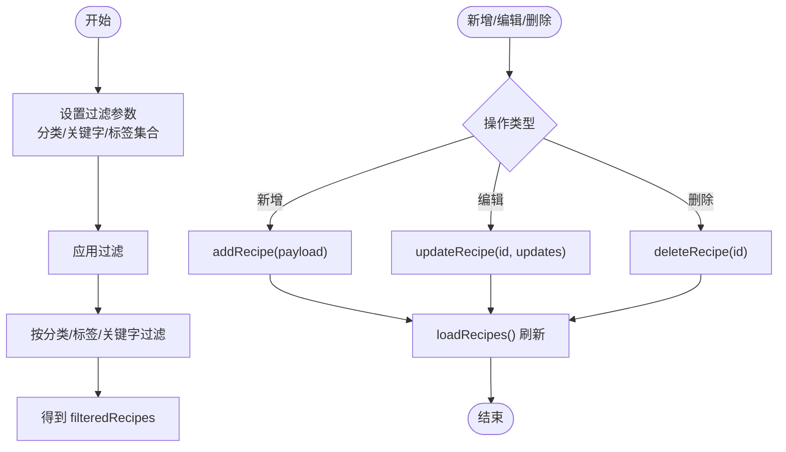
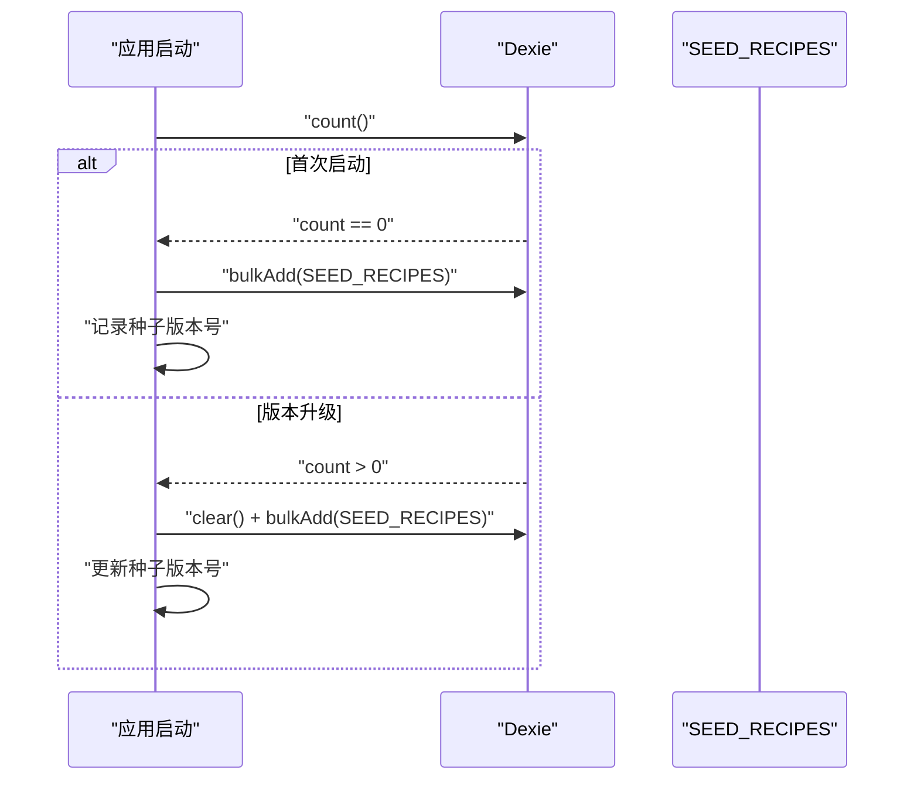
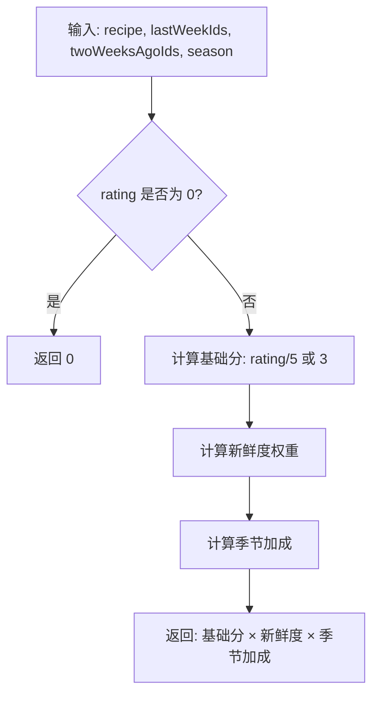
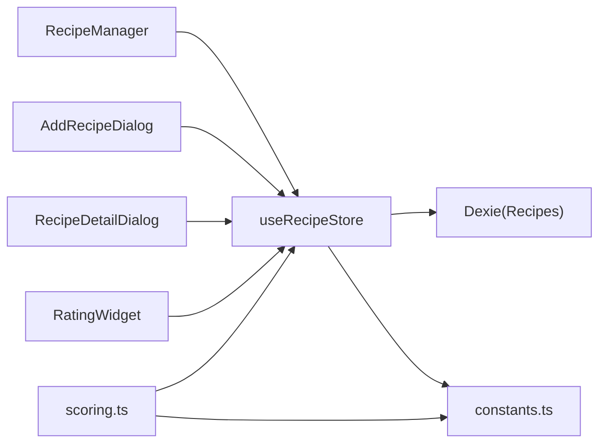

# 食谱数据模型

<cite>
**本文引用的文件**
- [src/types/recipe.ts](file://src/types/recipe.ts)
- [src/store/useRecipeStore.ts](file://src/store/useRecipeStore.ts)
- [src/db/index.ts](file://src/db/index.ts)
- [src/db/seed.ts](file://src/db/seed.ts)
- [src/components/Recipe/RecipeManager.tsx](file://src/components/Recipe/RecipeManager.tsx)
- [src/components/Recipe/AddRecipeDialog.tsx](file://src/components/Recipe/AddRecipeDialog.tsx)
- [src/components/Recipe/RecipeDetailDialog.tsx](file://src/components/Recipe/RecipeDetailDialog.tsx)
- [src/components/Recipe/RatingWidget.tsx](file://src/components/Recipe/RatingWidget.tsx)
- [src/algorithms/scoring.ts](file://src/algorithms/scoring.ts)
- [src/config/constants.ts](file://src/config/constants.ts)
</cite>

## 目录
1. [简介](#简介)
2. [项目结构](#项目结构)
3. [核心组件](#核心组件)
4. [架构概览](#架构概览)
5. [详细组件分析](#详细组件分析)
6. [依赖关系分析](#依赖关系分析)
7. [性能考量](#性能考量)
8. [故障排查指南](#故障排查指南)
9. [结论](#结论)
10. [附录](#附录)

## 简介
本文件围绕“食谱数据模型”进行系统化文档化，涵盖食谱实体的完整数据结构、类型接口设计、属性约束与数据验证规则，以及创建、更新、删除、查询等操作的实现细节。同时，结合评分系统、标签分类与季节性属性的设计理念，给出在状态管理中的使用示例与最佳实践，并通过可视化图表帮助读者理解整体架构与关键流程。

## 项目结构
食谱相关代码主要分布在以下模块：
- 类型定义：位于 [src/types/recipe.ts](file://src/types/recipe.ts)，定义了食谱类别与接口。
- 状态管理：位于 [src/store/useRecipeStore.ts](file://src/store/useRecipeStore.ts)，封装了食谱的 CRUD 与筛选逻辑。
- 数据持久化：位于 [src/db/index.ts](file://src/db/index.ts)，基于 Dexie 的 IndexedDB 封装；种子数据位于 [src/db/seed.ts](file://src/db/seed.ts)。
- UI 组件：位于 [src/components/Recipe/](file://src/components/Recipe/)，包含管理界面、新增对话框、详情对话框与评分控件。
- 算法与配置：位于 [src/algorithms/scoring.ts](file://src/algorithms/scoring.ts) 和 [src/config/constants.ts](file://src/config/constants.ts)，分别负责权重计算与标签/分类常量。



图示来源
- [src/types/recipe.ts:11-21](file://src/types/recipe.ts#L11-L21)
- [src/store/useRecipeStore.ts:49-120](file://src/store/useRecipeStore.ts#L49-L120)
- [src/db/index.ts:7-22](file://src/db/index.ts#L7-L22)
- [src/db/seed.ts:8-709](file://src/db/seed.ts#L8-L709)
- [src/components/Recipe/RecipeManager.tsx:26-34](file://src/components/Recipe/RecipeManager.tsx#L26-L34)
- [src/components/Recipe/AddRecipeDialog.tsx:32-86](file://src/components/Recipe/AddRecipeDialog.tsx#L32-L86)
- [src/components/Recipe/RecipeDetailDialog.tsx:25-43](file://src/components/Recipe/RecipeDetailDialog.tsx#L25-L43)
- [src/components/Recipe/RatingWidget.tsx:11-62](file://src/components/Recipe/RatingWidget.tsx#L11-L62)
- [src/algorithms/scoring.ts:14-42](file://src/algorithms/scoring.ts#L14-L42)
- [src/config/constants.ts:24-43](file://src/config/constants.ts#L24-L43)

章节来源
- [src/types/recipe.ts:1-21](file://src/types/recipe.ts#L1-L21)
- [src/store/useRecipeStore.ts:1-121](file://src/store/useRecipeStore.ts#L1-L121)
- [src/db/index.ts:1-68](file://src/db/index.ts#L1-L68)
- [src/db/seed.ts:1-709](file://src/db/seed.ts#L1-L709)
- [src/components/Recipe/RecipeManager.tsx:1-110](file://src/components/Recipe/RecipeManager.tsx#L1-L110)
- [src/components/Recipe/AddRecipeDialog.tsx:1-200](file://src/components/Recipe/AddRecipeDialog.tsx#L1-L200)
- [src/components/Recipe/RecipeDetailDialog.tsx:1-159](file://src/components/Recipe/RecipeDetailDialog.tsx#L1-L159)
- [src/components/Recipe/RatingWidget.tsx:1-63](file://src/components/Recipe/RatingWidget.tsx#L1-L63)
- [src/algorithms/scoring.ts:1-64](file://src/algorithms/scoring.ts#L1-L64)
- [src/config/constants.ts:1-44](file://src/config/constants.ts#L1-L44)

## 核心组件
- 食谱类型与分类
  - 定义了 RecipeCategory 枚举与 Recipe 接口，包含 id、name、category、tags、ingredients、instructions、rating、history_dates 等字段。
  - 字段语义与约束：
    - id：可选自增主键（IndexedDB 自增）。
    - name：必填字符串，作为检索关键词之一。
    - category：RecipeCategory 枚举，支持荤菜、素菜、汤、早餐干食、早餐稀食（成人/儿童）、主食、简餐（一锅出）等。
    - tags：字符串数组，用于标注“适宜老人”、“夏季推荐”、“凉菜”、“辣”等特性。
    - ingredients：食材数组，用于展示与检索。
    - instructions：做法文本，支持多行展示。
    - rating：数值评分，null 表示未品尝，0 表示拉黑，1-5 为星级评分。
    - history_dates：历史食用日期数组，用于评分前置条件与菜单生成权重计算。
- 状态管理
  - 提供 recipes、filteredRecipes、filters 三个状态，以及 loadRecipes、addRecipe、updateRecipe、deleteRecipe、rateRecipe、recordUsageDates、setFilters、applyFilters 等动作。
  - 过滤逻辑支持分类、标签集合与关键字（名称、食材、标签）的组合过滤。
- 数据持久化
  - 使用 Dexie 对 recipes 表进行 CRUD 操作，索引包含 name、category、rating。
  - 初始化时根据种子数据版本号决定是否导入或重置种子数据。
- 评分与权重
  - 评分仅在存在历史食用日期时允许；拉黑（0）直接屏蔽权重。
  - 权重计算综合考虑评分基础分、新鲜度（跨周降权）、季节性加成与历史使用情况。

章节来源
- [src/types/recipe.ts:11-21](file://src/types/recipe.ts#L11-L21)
- [src/store/useRecipeStore.ts:11-25](file://src/store/useRecipeStore.ts#L11-L25)
- [src/store/useRecipeStore.ts:27-47](file://src/store/useRecipeStore.ts#L27-L47)
- [src/db/index.ts:7-22](file://src/db/index.ts#L7-L22)
- [src/db/index.ts:37-57](file://src/db/index.ts#L37-L57)
- [src/algorithms/scoring.ts:14-42](file://src/algorithms/scoring.ts#L14-L42)

## 架构概览
从 UI 到状态再到存储的数据流如下：



图示来源
- [src/components/Recipe/RecipeManager.tsx:26-34](file://src/components/Recipe/RecipeManager.tsx#L26-L34)
- [src/store/useRecipeStore.ts:58-79](file://src/store/useRecipeStore.ts#L58-L79)
- [src/store/useRecipeStore.ts:81-90](file://src/store/useRecipeStore.ts#L81-L90)
- [src/db/index.ts:37-57](file://src/db/index.ts#L37-L57)
- [src/db/seed.ts:8-709](file://src/db/seed.ts#L8-L709)

## 详细组件分析

### 食谱类型与接口设计
- 设计要点
  - 使用枚举限定分类范围，确保数据一致性与 UI 显示的一致性。
  - tags 采用字符串数组，便于灵活扩展与组合过滤。
  - rating 采用 nullable 数值，配合 history_dates 实现“先尝后评”的策略。
  - ingredients 与 instructions 以数组/字符串形式组织，利于展示与检索。
- 属性约束与验证规则
  - name 必填且参与关键字检索。
  - category 必须属于 RecipeCategory。
  - tags 为字符串数组，内容来自常量集合。
  - rating ∈ {null, 0} ∪ [1,5]。
  - history_dates 为日期字符串数组，用于评分前置与权重计算。

```mermaid
classDiagram
class Recipe {
+number id?
+string name
+RecipeCategory category
+string[] tags
+string[] ingredients
+string instructions
+number|null rating
+string[] history_dates
}
class RecipeCategory {
<<enumeration>>
"meat"
"veg"
"soup"
"bf_dry"
"bf_wet_adult"
"bf_wet_kid"
"staple_normal"
"staple_onepot"
}
Recipe --> RecipeCategory : "使用"
```

图示来源
- [src/types/recipe.ts:11-21](file://src/types/recipe.ts#L11-L21)

章节来源
- [src/types/recipe.ts:1-21](file://src/types/recipe.ts#L1-L21)
- [src/config/constants.ts:24-43](file://src/config/constants.ts#L24-L43)

### 状态管理与数据操作
- 创建（新增）
  - 新增对话框收集 name、category、ingredients、instructions、tags 等字段，提交后调用 addRecipe，内部写入数据库并刷新列表。
- 更新（编辑）
  - 通过 updateRecipe 接受部分更新，支持修改名称、分类、标签、食材、做法等。
- 删除（移除）
  - 通过 deleteRecipe 删除指定 id 的食谱，并刷新列表。
- 查询（筛选）
  - setFilters 动态设置 filters，包括分类、关键字与标签集合；applyFilters 重新应用过滤逻辑。
  - 过滤规则：分类全匹配；标签集合为“包含所有”；关键字在 name、ingredients、tags 的拼接结果中出现。
- 记录使用日期
  - recordUsageDates 支持批量记录某日的使用情况，避免重复记录同一日期。



图示来源
- [src/store/useRecipeStore.ts:11-25](file://src/store/useRecipeStore.ts#L11-L25)
- [src/store/useRecipeStore.ts:27-47](file://src/store/useRecipeStore.ts#L27-L47)
- [src/store/useRecipeStore.ts:58-79](file://src/store/useRecipeStore.ts#L58-L79)
- [src/store/useRecipeStore.ts:92-107](file://src/store/useRecipeStore.ts#L92-L107)

章节来源
- [src/store/useRecipeStore.ts:1-121](file://src/store/useRecipeStore.ts#L1-L121)
- [src/components/Recipe/AddRecipeDialog.tsx:32-86](file://src/components/Recipe/AddRecipeDialog.tsx#L32-L86)
- [src/components/Recipe/RecipeDetailDialog.tsx:25-43](file://src/components/Recipe/RecipeDetailDialog.tsx#L25-L43)

### 数据持久化与种子数据
- 数据库结构
  - recipes 表：主键自增，索引 name、category、rating。
  - 初始化策略：首次启动或版本升级时导入 SEED_RECIPES。
- 种子数据
  - 包含约 80 道菜谱，覆盖多种分类与标签，便于快速体验与测试。



图示来源
- [src/db/index.ts:37-57](file://src/db/index.ts#L37-L57)
- [src/db/seed.ts:8-709](file://src/db/seed.ts#L8-L709)

章节来源
- [src/db/index.ts:1-68](file://src/db/index.ts#L1-L68)
- [src/db/seed.ts:1-709](file://src/db/seed.ts#L1-L709)

### 评分系统与权重计算
- 评分规则
  - 仅当历史食用日期非空时允许评分；拉黑（0）直接屏蔽权重。
  - 评分基础分为 rating/5，若未评分则按 3 星折算。
- 权重计算
  - freshWeight：上周使用 0.1，两周前 0.5，更久或未使用 1.0。
  - seasonBonus：与当前季节匹配的标签（夏季/冬季推荐）加成 1.2。
  - 最终权重 = 基础分 × 新鲜度权重 × 季节加成。
- 权重随机选择
  - 总权重为 0 时退化为均匀随机；否则按权重累积概率抽样。



图示来源
- [src/algorithms/scoring.ts:14-42](file://src/algorithms/scoring.ts#L14-L42)
- [src/config/constants.ts:24-31](file://src/config/constants.ts#L24-L31)

章节来源
- [src/algorithms/scoring.ts:1-64](file://src/algorithms/scoring.ts#L1-L64)
- [src/config/constants.ts:17-31](file://src/config/constants.ts#L17-L31)

### 标签分类与季节性属性
- 标签体系
  - 适宜老人、夏季推荐、凉菜、冬季推荐、粥类、辣。
  - UI 中通过 TagBadge 与 RatingWidget 展示与交互。
- 季节性属性
  - 与权重计算联动，匹配季节的菜品获得加成，提升菜单生成的合理性与多样性。

章节来源
- [src/config/constants.ts:24-31](file://src/config/constants.ts#L24-L31)
- [src/components/Recipe/RecipeDetailDialog.tsx:45-57](file://src/components/Recipe/RecipeDetailDialog.tsx#L45-L57)
- [src/components/Recipe/RatingWidget.tsx:11-22](file://src/components/Recipe/RatingWidget.tsx#L11-L22)

### 状态管理中的使用示例与最佳实践
- 在组件中使用
  - 通过 useRecipeStore 获取 recipes、filteredRecipes、filters，并调用 loadRecipes、setFilters、applyFilters 等动作。
  - 在 RecipeManager 中监听 loadRecipes 生命周期，确保页面渲染时数据已就绪。
- 最佳实践
  - 新增/编辑/删除后统一调用 loadRecipes 刷新视图，避免状态不一致。
  - 过滤参数变更时优先使用 setFilters 并立即应用，减少不必要的重复计算。
  - 评分前置条件严格检查 history_dates，避免无效操作。
  - 批量记录使用日期时先去重，避免重复写入。

章节来源
- [src/components/Recipe/RecipeManager.tsx:26-34](file://src/components/Recipe/RecipeManager.tsx#L26-L34)
- [src/store/useRecipeStore.ts:58-79](file://src/store/useRecipeStore.ts#L58-L79)
- [src/store/useRecipeStore.ts:92-107](file://src/store/useRecipeStore.ts#L92-L107)

## 依赖关系分析
- 组件依赖
  - RecipeManager 依赖 useRecipeStore 与分类常量，负责筛选与展示。
  - AddRecipeDialog 依赖 useRecipeStore 与分类常量，负责新增。
  - RecipeDetailDialog 依赖 useRecipeStore 与 RatingWidget，负责详情与评分。
  - RatingWidget 依赖 Recipe 接口与评分前置条件。
- 状态与存储
  - useRecipeStore 依赖 Dexie 数据库与过滤函数，负责 CRUD 与筛选。
- 算法与配置
  - scoring.ts 依赖 TAGS 常量与 SeasonMode，负责权重计算。
  - constants.ts 提供标签与分类映射，贯穿 UI 与算法层。



图示来源
- [src/components/Recipe/RecipeManager.tsx:16-34](file://src/components/Recipe/RecipeManager.tsx#L16-L34)
- [src/components/Recipe/AddRecipeDialog.tsx:21-86](file://src/components/Recipe/AddRecipeDialog.tsx#L21-L86)
- [src/components/Recipe/RecipeDetailDialog.tsx:15-43](file://src/components/Recipe/RecipeDetailDialog.tsx#L15-L43)
- [src/components/Recipe/RatingWidget.tsx:4-22](file://src/components/Recipe/RatingWidget.tsx#L4-L22)
- [src/store/useRecipeStore.ts:2-3](file://src/store/useRecipeStore.ts#L2-L3)
- [src/algorithms/scoring.ts:1-3](file://src/algorithms/scoring.ts#L1-L3)
- [src/config/constants.ts:24-43](file://src/config/constants.ts#L24-L43)

章节来源
- [src/components/Recipe/RecipeManager.tsx:1-110](file://src/components/Recipe/RecipeManager.tsx#L1-L110)
- [src/components/Recipe/AddRecipeDialog.tsx:1-200](file://src/components/Recipe/AddRecipeDialog.tsx#L1-L200)
- [src/components/Recipe/RecipeDetailDialog.tsx:1-159](file://src/components/Recipe/RecipeDetailDialog.tsx#L1-L159)
- [src/components/Recipe/RatingWidget.tsx:1-63](file://src/components/Recipe/RatingWidget.tsx#L1-L63)
- [src/store/useRecipeStore.ts:1-121](file://src/store/useRecipeStore.ts#L1-L121)
- [src/algorithms/scoring.ts:1-64](file://src/algorithms/scoring.ts#L1-L64)
- [src/config/constants.ts:1-44](file://src/config/constants.ts#L1-L44)

## 性能考量
- 过滤复杂度
  - 过滤函数对每个 recipe 做一次布尔判断，时间复杂度 O(n)；建议在数据量较大时限制一次性渲染数量或启用虚拟滚动。
- 权重计算
  - 权重计算为 O(1) 常数操作，适合在菜单生成时对候选集批量计算。
- 数据库访问
  - Dexie 读取与写入均在内存中完成，批量导入/清空时注意异步与事务边界，避免阻塞 UI。
- UI 渲染
  - 使用 filteredRecipes 控制渲染数量，避免一次性渲染过多卡片导致卡顿。

## 故障排查指南
- 无法评分
  - 检查 recipe.history_dates 是否为空；仅当存在历史食用日期时才允许评分。
- 删除失败
  - 确认传入的 id 存在；查看数据库是否存在该记录。
- 过滤无效
  - 检查 filters 的分类、标签集合与关键字是否正确设置；确认 applyFilters 已执行。
- 种子数据未导入
  - 查看本地版本号与 SEED_VERSION 是否一致；必要时手动重置种子数据。

章节来源
- [src/store/useRecipeStore.ts:81-90](file://src/store/useRecipeStore.ts#L81-L90)
- [src/store/useRecipeStore.ts:76-79](file://src/store/useRecipeStore.ts#L76-L79)
- [src/store/useRecipeStore.ts:117-119](file://src/store/useRecipeStore.ts#L117-L119)
- [src/db/index.ts:37-57](file://src/db/index.ts#L37-L57)

## 结论
本食谱数据模型以清晰的类型定义为基础，结合状态管理与数据库持久化，实现了完整的 CRUD 与筛选能力；评分系统与权重算法进一步提升了菜单生成的智能化水平。通过标签与季节性属性的设计，系统能够更好地适配不同人群与时节需求。建议在实际使用中遵循状态刷新与前置校验的最佳实践，确保数据一致性与用户体验。

## 附录
- 关键字段一览
  - id：自增主键（可选）
  - name：菜名（必填）
  - category：分类（RecipeCategory）
  - tags：标签数组（字符串）
  - ingredients：食材数组（字符串）
  - instructions：做法（字符串）
  - rating：评分（null/0/1-5）
  - history_dates：历史食用日期数组（字符串）