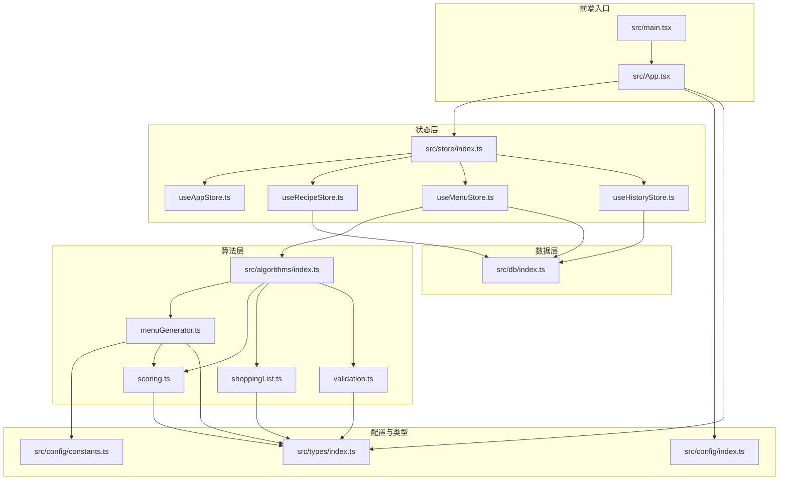
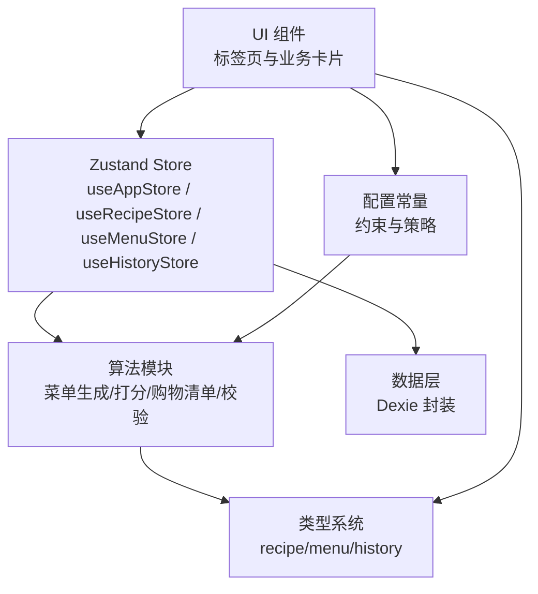
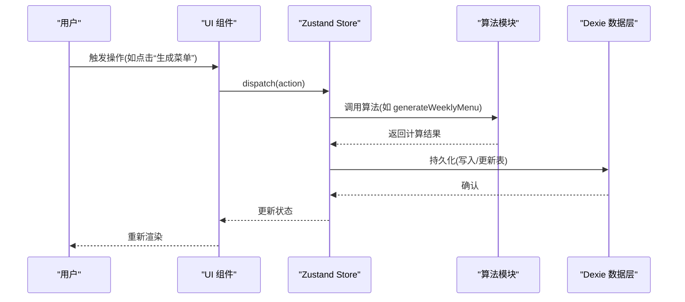
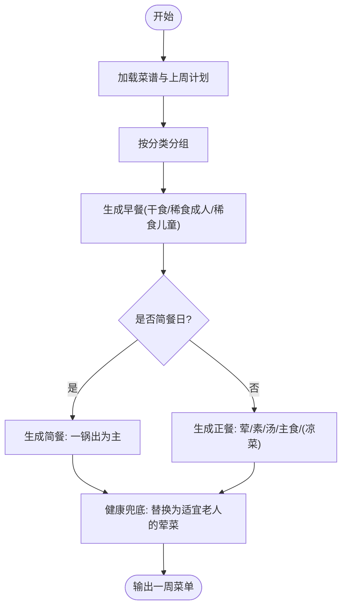
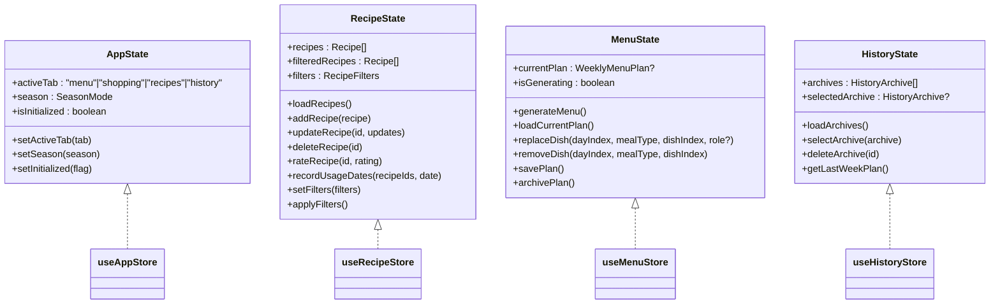
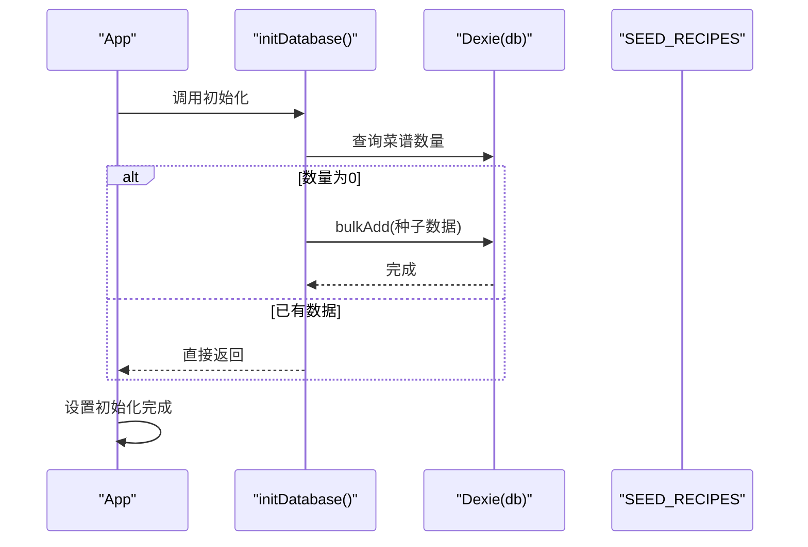
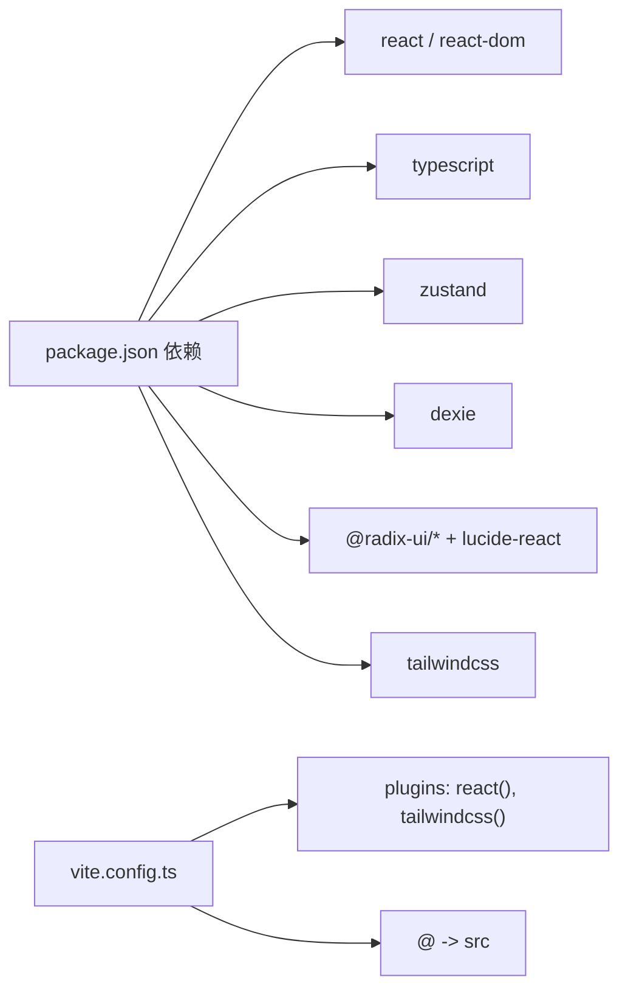

# 架构概览

<cite>
**本文档引用的文件**
- [package.json](file://package.json)
- [vite.config.ts](file://vite.config.ts)
- [src/main.tsx](file://src/main.tsx)
- [src/App.tsx](file://src/App.tsx)
- [src/store/index.ts](file://src/store/index.ts)
- [src/store/useAppStore.ts](file://src/store/useAppStore.ts)
- [src/store/useRecipeStore.ts](file://src/store/useRecipeStore.ts)
- [src/store/useMenuStore.ts](file://src/store/useMenuStore.ts)
- [src/store/useHistoryStore.ts](file://src/store/useHistoryStore.ts)
- [src/db/index.ts](file://src/db/index.ts)
- [src/algorithms/index.ts](file://src/algorithms/index.ts)
- [src/algorithms/menuGenerator.ts](file://src/algorithms/menuGenerator.ts)
- [src/algorithms/scoring.ts](file://src/algorithms/scoring.ts)
- [src/algorithms/shoppingList.ts](file://src/algorithms/shoppingList.ts)
- [src/algorithms/validation.ts](file://src/algorithms/validation.ts)
- [src/config/index.ts](file://src/config/index.ts)
- [src/config/constants.ts](file://src/config/constants.ts)
- [src/types/index.ts](file://src/types/index.ts)
- [src/types/recipe.ts](file://src/types/recipe.ts)
- [src/types/menu.ts](file://src/types/menu.ts)
- [src/types/history.ts](file://src/types/history.ts)
- [src/utils/date.ts](file://src/utils/date.ts)
</cite>

## 目录
1. [引言](#引言)
2. [项目结构](#项目结构)
3. [核心组件](#核心组件)
4. [架构总览](#架构总览)
5. [详细组件分析](#详细组件分析)
6. [依赖分析](#依赖分析)
7. [性能考虑](#性能考虑)
8. [故障排查指南](#故障排查指南)
9. [结论](#结论)
10. [附录](#附录)

## 引言
本项目采用 React 18 + TypeScript + Vite 技术栈，结合 Zustand 实现轻量级状态管理，并通过算法模块实现“算法驱动”的菜单规划与数据处理流程。系统围绕“用户输入 → 算法处理 → 状态更新 → UI 渲染 → 数据持久化”这一闭环展开，强调可维护性、可扩展性与开发体验。

## 项目结构
项目采用按功能域划分的目录组织方式：src 下按领域拆分算法、组件、状态、数据库、类型与工具等模块，配合 Vite 的别名配置与 TailwindCSS 样式集成，形成清晰的层次化架构。

图表来源
- [src/main.tsx:1-11](file://src/main.tsx#L1-L11)
- [src/App.tsx:1-83](file://src/App.tsx#L1-L83)
- [src/store/index.ts:1-6](file://src/store/index.ts#L1-L6)
- [src/store/useAppStore.ts:1-26](file://src/store/useAppStore.ts#L1-L26)
- [src/store/useRecipeStore.ts:1-121](file://src/store/useRecipeStore.ts#L1-L121)
- [src/store/useMenuStore.ts:1-292](file://src/store/useMenuStore.ts#L1-L292)
- [src/store/useHistoryStore.ts:1-46](file://src/store/useHistoryStore.ts#L1-L46)
- [src/algorithms/index.ts:1-6](file://src/algorithms/index.ts#L1-L6)
- [src/algorithms/menuGenerator.ts:1-368](file://src/algorithms/menuGenerator.ts#L1-L368)
- [src/algorithms/scoring.ts](file://src/algorithms/scoring.ts)
- [src/algorithms/shoppingList.ts](file://src/algorithms/shoppingList.ts)
- [src/algorithms/validation.ts](file://src/algorithms/validation.ts)
- [src/db/index.ts:1-34](file://src/db/index.ts#L1-L34)
- [src/config/index.ts:1-2](file://src/config/index.ts#L1-L2)
- [src/config/constants.ts](file://src/config/constants.ts)
- [src/types/index.ts:1-4](file://src/types/index.ts#L1-L4)

章节来源
- [package.json:1-46](file://package.json#L1-L46)
- [vite.config.ts:1-14](file://vite.config.ts#L1-L14)
- [src/main.tsx:1-11](file://src/main.tsx#L1-L11)
- [src/App.tsx:1-83](file://src/App.tsx#L1-L83)

## 核心组件
- 应用入口与路由容器
  - 入口渲染：负责挂载根组件与全局样式。
  - 应用容器：集中初始化数据库、加载菜谱、设置初始化完成状态；通过标签页切换承载四大功能区域。
- 状态管理层
  - 应用状态：维护当前激活标签页、季节模式与初始化标志。
  - 菜谱状态：提供加载、增删改查、评分、使用日期记录与过滤能力。
  - 菜单状态：负责周计划生成、替换菜品、保存归档、读取当前计划。
  - 历史状态：维护历史归档列表、选中项与删除操作，并提供“上周计划”查询。
- 算法层
  - 菜单生成：按分类与权重随机选择菜品，遵循重复次数、季节与标签策略，输出一周菜单。
  - 打分与加权：计算候选菜品的权重，综合考虑使用历史、星级与季节因素。
  - 采购清单：根据菜单生成购物需求。
  - 校验：校验菜单是否满足约束条件。
- 数据层
  - Dexie 封装：定义表结构、版本迁移与初始化种子数据。
- 配置与类型
  - 常量：约束与配置项（如每日数量、标签、强制项等）。
  - 类型：统一的领域模型（菜谱、菜单、历史）。

章节来源
- [src/main.tsx:1-11](file://src/main.tsx#L1-L11)
- [src/App.tsx:1-83](file://src/App.tsx#L1-L83)
- [src/store/useAppStore.ts:1-26](file://src/store/useAppStore.ts#L1-L26)
- [src/store/useRecipeStore.ts:1-121](file://src/store/useRecipeStore.ts#L1-L121)
- [src/store/useMenuStore.ts:1-292](file://src/store/useMenuStore.ts#L1-L292)
- [src/store/useHistoryStore.ts:1-46](file://src/store/useHistoryStore.ts#L1-L46)
- [src/algorithms/menuGenerator.ts:1-368](file://src/algorithms/menuGenerator.ts#L1-L368)
- [src/algorithms/scoring.ts](file://src/algorithms/scoring.ts)
- [src/algorithms/shoppingList.ts](file://src/algorithms/shoppingList.ts)
- [src/algorithms/validation.ts](file://src/algorithms/validation.ts)
- [src/db/index.ts:1-34](file://src/db/index.ts#L1-L34)
- [src/config/constants.ts](file://src/config/constants.ts)
- [src/types/recipe.ts](file://src/types/recipe.ts)
- [src/types/menu.ts](file://src/types/menu.ts)
- [src/types/history.ts](file://src/types/history.ts)

## 架构总览
系统采用“组件化 + 状态管理 + 算法驱动 + 数据持久化”的分层架构。UI 层通过标签页组织四大功能区；状态层使用 Zustand 提供细粒度 Store；算法层封装菜单生成与相关策略；数据层基于 Dexie 提供 IndexedDB 访问与种子数据初始化。

图表来源
- [src/App.tsx:1-83](file://src/App.tsx#L1-L83)
- [src/store/index.ts:1-6](file://src/store/index.ts#L1-L6)
- [src/store/useMenuStore.ts:1-292](file://src/store/useMenuStore.ts#L1-L292)
- [src/store/useRecipeStore.ts:1-121](file://src/store/useRecipeStore.ts#L1-L121)
- [src/store/useHistoryStore.ts:1-46](file://src/store/useHistoryStore.ts#L1-L46)
- [src/algorithms/index.ts:1-6](file://src/algorithms/index.ts#L1-L6)
- [src/db/index.ts:1-34](file://src/db/index.ts#L1-L34)
- [src/config/constants.ts](file://src/config/constants.ts)
- [src/types/index.ts:1-4](file://src/types/index.ts#L1-L4)

## 详细组件分析

### 状态管理与数据流
- 初始化流程
  - 入口渲染后，应用容器执行数据库初始化与菜谱加载，完成后设置初始化完成标志，进入正常 UI。
- 数据流闭环
  - 用户输入（切换标签、点击生成、替换菜品、评分等）触发对应 Store 动作。
  - Store 调用算法模块进行计算或直接读写数据库。
  - Store 更新状态，驱动 UI 重新渲染。
  - Store 将结果持久化至 Dexie 表，确保刷新后数据不丢失。

图表来源
- [src/App.tsx:15-22](file://src/App.tsx#L15-L22)
- [src/store/useMenuStore.ts:131-152](file://src/store/useMenuStore.ts#L131-L152)
- [src/store/useRecipeStore.ts:58-64](file://src/store/useRecipeStore.ts#L58-L64)
- [src/db/index.ts:27-33](file://src/db/index.ts#L27-L33)

章节来源
- [src/App.tsx:15-22](file://src/App.tsx#L15-L22)
- [src/store/useAppStore.ts:17-25](file://src/store/useAppStore.ts#L17-L25)
- [src/store/useMenuStore.ts:127-152](file://src/store/useMenuStore.ts#L127-L152)
- [src/store/useRecipeStore.ts:49-64](file://src/store/useRecipeStore.ts#L49-L64)
- [src/db/index.ts:27-33](file://src/db/index.ts#L27-L33)

### 菜单生成算法（算法驱动）
- 关键策略
  - 分类分组：按菜谱分类构建候选池。
  - 权重计算：综合星级、使用历史、季节与标签影响。
  - 重复控制：普通菜每周最多一次，五颗星菜有限重复。
  - 季节与标签：夏令推荐、适宜老人、凉菜与粥类等约束。
  - 兜底机制：当严格筛选无解时放宽约束，优先排除拉黑菜品。
- 输出结构
  - 一周五天，每天包含早餐与晚餐，早餐三槽位，晚餐按正式/简餐策略组合多道菜。

图表来源
- [src/algorithms/menuGenerator.ts:128-226](file://src/algorithms/menuGenerator.ts#L128-L226)
- [src/algorithms/menuGenerator.ts:232-336](file://src/algorithms/menuGenerator.ts#L232-L336)
- [src/algorithms/menuGenerator.ts:341-367](file://src/algorithms/menuGenerator.ts#L341-L367)

章节来源
- [src/algorithms/menuGenerator.ts:128-226](file://src/algorithms/menuGenerator.ts#L128-L226)
- [src/algorithms/menuGenerator.ts:232-336](file://src/algorithms/menuGenerator.ts#L232-L336)
- [src/algorithms/menuGenerator.ts:341-367](file://src/algorithms/menuGenerator.ts#L341-L367)

### 状态管理类图（Zustand Store）

图表来源
- [src/store/useAppStore.ts:6-15](file://src/store/useAppStore.ts#L6-L15)
- [src/store/useRecipeStore.ts:11-25](file://src/store/useRecipeStore.ts#L11-L25)
- [src/store/useMenuStore.ts:21-37](file://src/store/useMenuStore.ts#L21-L37)
- [src/store/useHistoryStore.ts:6-15](file://src/store/useHistoryStore.ts#L6-L15)

章节来源
- [src/store/useAppStore.ts:1-26](file://src/store/useAppStore.ts#L1-L26)
- [src/store/useRecipeStore.ts:1-121](file://src/store/useRecipeStore.ts#L1-L121)
- [src/store/useMenuStore.ts:1-292](file://src/store/useMenuStore.ts#L1-L292)
- [src/store/useHistoryStore.ts:1-46](file://src/store/useHistoryStore.ts#L1-L46)

### 数据持久化与初始化
- 初始化流程
  - 应用启动时调用数据库初始化函数，若菜谱表为空则批量导入种子数据。
- 数据模型
  - 菜谱表、菜单计划表、历史归档表，分别承载菜谱、周计划与历史快照。
- 事务与一致性
  - 使用事务批量更新菜谱使用日期，避免部分更新导致的数据不一致。

图表来源
- [src/App.tsx:15-22](file://src/App.tsx#L15-L22)
- [src/db/index.ts:27-33](file://src/db/index.ts#L27-L33)

章节来源
- [src/App.tsx:15-22](file://src/App.tsx#L15-L22)
- [src/db/index.ts:1-34](file://src/db/index.ts#L1-L34)

## 依赖分析
- 技术栈与插件
  - React 18、TypeScript、Vite、TailwindCSS、Radix UI、Lucide React、Dexie、Zustand。
- 关键耦合点
  - Store 之间存在协作：菜单状态依赖应用状态（季节模式）、历史状态（上周计划），并通过算法模块与数据层交互。
  - 算法模块依赖配置常量与类型系统，确保策略与数据结构一致。
- 外部依赖与集成
  - Vite 插件链路：React 插件与 TailwindCSS 插件协同工作，路径别名 @ 指向 src。

图表来源
- [package.json:12-28](file://package.json#L12-L28)
- [package.json:29-44](file://package.json#L29-L44)
- [vite.config.ts:1-14](file://vite.config.ts#L1-L14)

章节来源
- [package.json:1-46](file://package.json#L1-L46)
- [vite.config.ts:1-14](file://vite.config.ts#L1-L14)

## 性能考虑
- 开发与构建优化
  - Vite 提供快速热更新与打包能力；按需引入 TailwindCSS 插件以减少构建体积。
- 状态与渲染
  - Zustand 采用细粒度订阅，避免不必要的重渲染；Store 动作内部尽量合并数据库操作，减少 IO 次数。
- 算法复杂度
  - 菜单生成涉及多轮权重计算与候选筛选，建议在数据规模扩大时引入缓存与索引优化。
- 数据访问
  - Dexie 基于 IndexedDB，适合浏览器端离线场景；批量写入与事务使用可降低抖动。

## 故障排查指南
- 初始化失败
  - 症状：页面长时间显示初始化状态。
  - 排查：确认数据库初始化函数是否成功导入种子数据；检查控制台错误与网络请求。
- 菜谱评分异常
  - 症状：提示“尚未使用过，无法评分”。
  - 排查：确认菜谱的使用日期字段是否存在且非空；检查评分动作是否正确调用。
- 菜单生成为空或不合理
  - 症状：生成结果缺少必要菜品或违反约束。
  - 排查：核对配置常量与标签设置；检查权重计算与兜底逻辑是否生效。
- 历史归档缺失
  - 症状：归档列表为空或删除后未刷新。
  - 排查：确认归档写入与加载动作是否执行；检查选中项清理逻辑。

章节来源
- [src/App.tsx:24-33](file://src/App.tsx#L24-L33)
- [src/store/useRecipeStore.ts:81-90](file://src/store/useRecipeStore.ts#L81-L90)
- [src/store/useMenuStore.ts:250-290](file://src/store/useMenuStore.ts#L250-L290)
- [src/store/useHistoryStore.ts:21-26](file://src/store/useHistoryStore.ts#L21-L26)

## 结论
本项目以 React 18 + TypeScript + Vite 为基础，结合 Zustand 与 Dexie，构建了清晰的组件化与算法驱动架构。通过明确的状态管理、可扩展的算法模块与本地持久化，实现了从“用户输入 → 算法处理 → 状态更新 → UI 渲染 → 数据持久化”的完整闭环。该架构既便于初学者理解，也为后续扩展提供了良好基础。

## 附录
- 关键设计约束
  - 季节模式影响菜单构成与标签筛选。
  - 重复次数与星级限制保障多样性与偏好平衡。
  - 健康兜底策略确保营养均衡。
- 常用路径别名
  - @ 指向 src，简化导入路径。