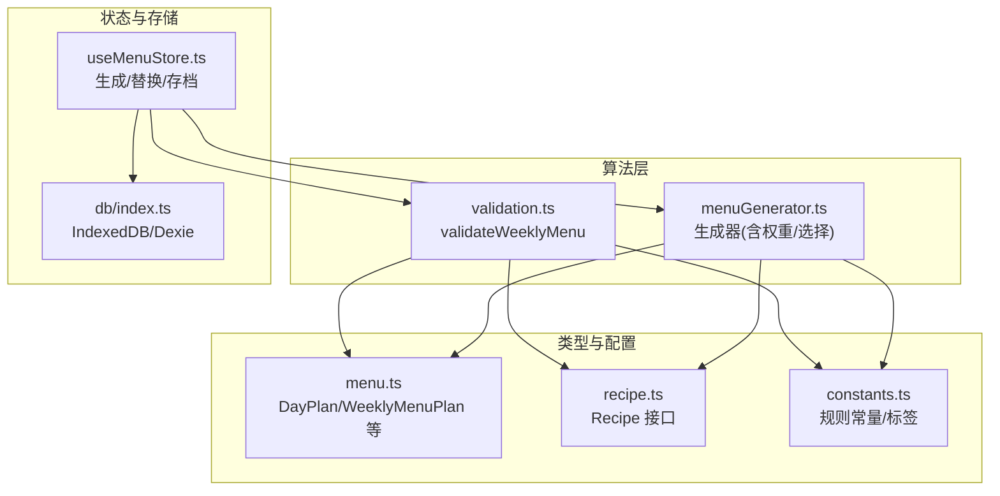
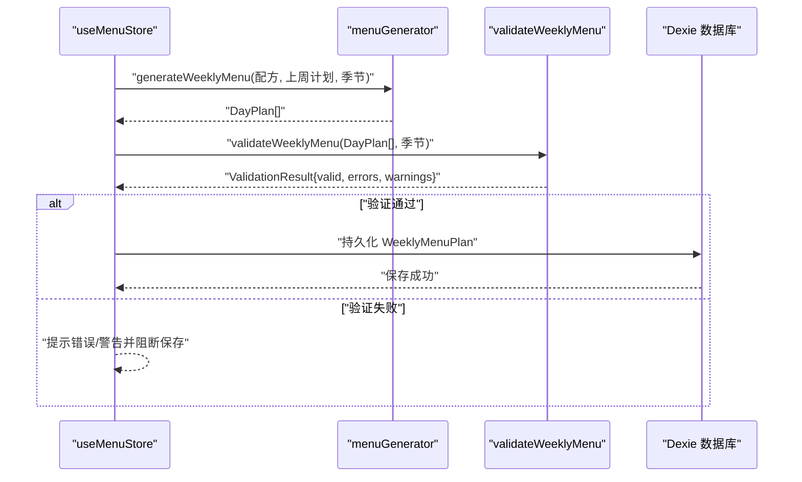
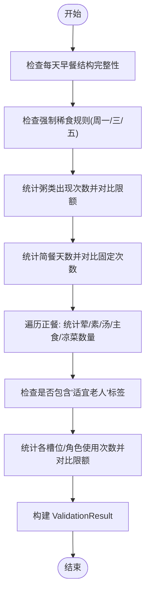
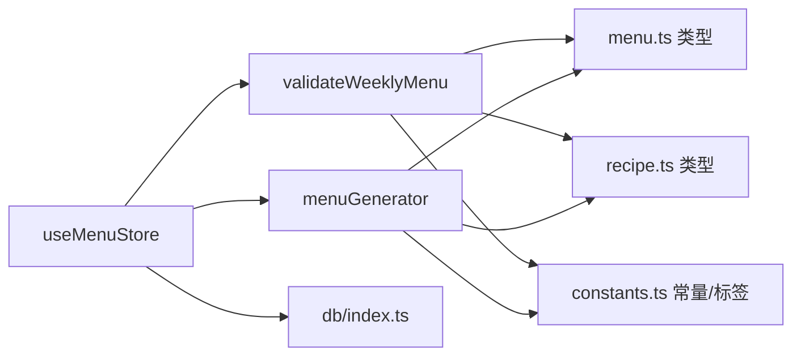

# 数据验证算法

<cite>
**本文引用的文件列表**
- [validation.ts](file://src/algorithms/validation.ts)
- [menuGenerator.ts](file://src/algorithms/menuGenerator.ts)
- [constants.ts](file://src/config/constants.ts)
- [menu.ts](file://src/types/menu.ts)
- [recipe.ts](file://src/types/recipe.ts)
- [useMenuStore.ts](file://src/store/useMenuStore.ts)
- [index.ts](file://src/algorithms/index.ts)
- [index.ts](file://src/db/index.ts)
</cite>

## 目录
1. [简介](#简介)
2. [项目结构](#项目结构)
3. [核心组件](#核心组件)
4. [架构总览](#架构总览)
5. [详细组件分析](#详细组件分析)
6. [依赖关系分析](#依赖关系分析)
7. [性能考量](#性能考量)
8. [故障排查指南](#故障排查指南)
9. [结论](#结论)
10. [附录](#附录)

## 简介
本文聚焦于数据验证算法，系统性解析 validateWeeklyMenu 函数的验证逻辑与规则体系，覆盖输入数据完整性检查、格式验证、业务规则校验、错误检测机制与异常处理策略，并阐述 ValidationResult 类型的结构定义、验证规则的扩展机制以及与用户输入处理和数据持久化的集成方式。通过分层讲解与可视化图示，帮助读者快速掌握验证算法在不同场景下的应用与优化要点。

## 项目结构
验证算法位于算法模块中，配合类型定义、配置常量、状态管理与数据库层共同完成菜单生成与验证的闭环。

图表来源
- [validation.ts:1-142](file://src/algorithms/validation.ts#L1-L142)
- [menuGenerator.ts:1-374](file://src/algorithms/menuGenerator.ts#L1-L374)
- [constants.ts:1-44](file://src/config/constants.ts#L1-L44)
- [menu.ts:1-45](file://src/types/menu.ts#L1-L45)
- [recipe.ts:1-21](file://src/types/recipe.ts#L1-L21)
- [useMenuStore.ts:1-292](file://src/store/useMenuStore.ts#L1-L292)
- [index.ts:1-68](file://src/db/index.ts#L1-L68)

章节来源
- [validation.ts:1-142](file://src/algorithms/validation.ts#L1-L142)
- [menuGenerator.ts:1-374](file://src/algorithms/menuGenerator.ts#L1-L374)
- [constants.ts:1-44](file://src/config/constants.ts#L1-L44)
- [menu.ts:1-45](file://src/types/menu.ts#L1-L45)
- [recipe.ts:1-21](file://src/types/recipe.ts#L1-L21)
- [useMenuStore.ts:1-292](file://src/store/useMenuStore.ts#L1-L292)
- [index.ts:1-68](file://src/db/index.ts#L1-L68)

## 核心组件
- validateWeeklyMenu：对一周菜单进行综合验证，输出统一的验证结果对象。
- ValidationResult：标准化的验证结果结构，包含 valid、errors、warnings 字段。
- 规则常量与标签：来自 constants.ts，定义了强制规则、限额与标签集合。
- 类型系统：menu.ts 定义了 DayPlan、WeeklyMenuPlan 等结构；recipe.ts 定义了 Recipe 结构及分类与标签。

章节来源
- [validation.ts:12-16](file://src/algorithms/validation.ts#L12-L16)
- [validation.ts:27-141](file://src/algorithms/validation.ts#L27-L141)
- [constants.ts:1-44](file://src/config/constants.ts#L1-L44)
- [menu.ts:19-34](file://src/types/menu.ts#L19-L34)
- [recipe.ts:11-20](file://src/types/recipe.ts#L11-L20)

## 架构总览
validateWeeklyMenu 在菜单生成完成后被调用，对生成结果进行一致性与合规性检查。其与生成器、配置常量、类型系统、状态管理与数据库层协同工作，形成“生成—验证—持久化”的闭环。

图表来源
- [useMenuStore.ts:131-152](file://src/store/useMenuStore.ts#L131-L152)
- [menuGenerator.ts:134-232](file://src/algorithms/menuGenerator.ts#L134-L232)
- [validation.ts:27-141](file://src/algorithms/validation.ts#L27-L141)
- [index.ts:1-68](file://src/db/index.ts#L1-L68)

## 详细组件分析

### validateWeeklyMenu 验证流程与规则体系
validateWeeklyMenu 对输入的 DayPlan 数组执行七层规则校验，逐条收集错误与警告，最终汇总为 ValidationResult。

- 层次结构与规则清单
  1) 早餐结构完整性：确保每天的早餐包含干食、成人稀食、儿童稀食三个槽位。
  2) 强制稀食规则：周一、三、五的成人稀食必须为“牛奶燕麦片”。
  3) 粥类限额：一周内粥类菜品出现次数不得超过限额。
  4) 简餐天数：一周内简餐天数必须等于固定次数。
  5) 正餐配菜数量：根据季节模式，核对荤菜、素菜、汤、主食、凉菜的数量。
  6) 健康兜底：正餐至少包含一道“适宜老人”标签菜品，否则触发警告。
  7) 重复检测：按分类+菜品维度统计使用次数，普通菜品限1次，5星菜品限 FIVE_STAR_MAX_REPEAT 次；“牛奶燕麦片”在强制日有豁免。

- 错误检测机制
  - 对每个规则逐一扫描，遇到不满足条件即追加错误或警告消息。
  - 使用 Map 记录各槽位/角色的菜品使用计数，支持跨日重复控制与豁免逻辑。
  - 特殊豁免：强制日的“牛奶燕麦片”不计入重复限制；5星菜品在限额内可放宽。

- 异常处理策略
  - 采用“累积式”错误收集，不因首个错误中断后续检查，确保全面反馈。
  - 返回值中 valid 字段仅在 errors 为空时为 true，warnings 作为非致命建议保留。

- 错误信息生成规则
  - 消息包含具体天次与期望/实际数值，便于定位问题。
  - 对于重复检测，消息包含菜品名与出现位置（槽位/角色）。

- 返回值结构定义
  - valid: boolean，整体是否通过。
  - errors: string[]，严重错误列表。
  - warnings: string[]，非致命建议列表。

章节来源
- [validation.ts:27-141](file://src/algorithms/validation.ts#L27-L141)
- [constants.ts:2-31](file://src/config/constants.ts#L2-L31)
- [menu.ts:3-17](file://src/types/menu.ts#L3-L17)

### ValidationResult 类型详解
- 字段说明
  - valid：布尔值，表示整体验证结果。
  - errors：字符串数组，记录导致验证失败的错误信息。
  - warnings：字符串数组，记录可能导致体验下降的警告信息。

- 使用场景
  - 生成后立即调用 validateWeeklyMenu 获取结果。
  - UI 层根据 valid、errors、warnings 渲染错误提示与警告徽章。

章节来源
- [validation.ts:12-16](file://src/algorithms/validation.ts#L12-L16)

### 验证规则扩展机制
- 新增规则的建议步骤
  - 在 constants.ts 中新增或调整相关常量与标签。
  - 在 validateWeeklyMenu 中添加新的规则分支，遵循现有错误/警告收集模式。
  - 更新类型定义（如需要）以支持新字段或新枚举。
  - 在 UI 层增加对应的消息展示与交互。

- 豁免与特例
  - “牛奶燕麦片”在强制日的豁免逻辑已在代码中体现，可作为新增豁免的参考模板。
  - 5星菜品的重复限制可通过常量调整，便于策略迭代。

章节来源
- [validation.ts:98-134](file://src/algorithms/validation.ts#L98-L134)
- [constants.ts:20-21](file://src/config/constants.ts#L20-L21)

### 与用户输入处理和数据持久化的集成
- 用户输入处理
  - 用户通过菜单替换/删除操作修改当前计划，随后可触发验证。
  - 替换逻辑基于 pickReplacement 与类别/标签过滤，避免重复与黑名单菜品。

- 数据持久化
  - 生成与替换后的计划通过 useMenuStore 的持久化函数写入 IndexedDB。
  - 存档时会记录每道菜的历史食用日期，便于后续权重计算与复用。

- 集成点
  - 生成流程：生成器产出 DayPlan[]，随后调用 validateWeeklyMenu，再持久化。
  - 替换流程：替换后直接持久化，若需要可再次调用 validateWeeklyMenu 进行即时校验。

章节来源
- [useMenuStore.ts:131-152](file://src/store/useMenuStore.ts#L131-L152)
- [useMenuStore.ts:167-224](file://src/store/useMenuStore.ts#L167-L224)
- [useMenuStore.ts:250-290](file://src/store/useMenuStore.ts#L250-L290)
- [index.ts:1-68](file://src/db/index.ts#L1-L68)

### 验证算法的层次结构与复杂度
- 时间复杂度
  - 早餐结构完整性：O(D)，D 为天数。
  - 强制稀食规则：O(D)。
  - 粥类限额：O(D)。
  - 简餐天数：O(D)。
  - 正餐配菜核对：O(D·C)，C 为每日正餐菜数。
  - 健康兜底：O(D·C)。
  - 重复检测：O(D·C)。
  - 总体：O(D·C)。

- 空间复杂度
  - 使用 Map 记录使用计数，空间约为 O(N)，N 为不同菜品数量。

- 优化建议
  - 将重复检测与健康兜底合并为一次遍历，减少重复扫描。
  - 对正餐配菜统计使用更高效的数据结构（如计数数组）。
  - 将“牛奶燕麦片”豁免与5星重复限制提取为可配置常量，便于动态调整。

章节来源
- [validation.ts:27-141](file://src/algorithms/validation.ts#L27-L141)

### 验证场景与错误信息示例
- 场景一：早餐结构不完整
  - 触发条件：某天早餐缺少干食/稀食之一。
  - 错误信息：包含天次与缺失槽位的提示。

- 场景二：强制稀食不符合要求
  - 触发条件：周一/三/五的成人稀食不是“牛奶燕麦片”。
  - 错误信息：包含天次与期望菜品名。

- 场景三：粥类超限
  - 触发条件：一周内粥类出现次数超过限额。
  - 错误信息：包含实际次数与限额。

- 场景四：简餐天数不符
  - 触发条件：简餐天数不等于固定次数。
  - 错误信息：包含实际与期望天数。

- 场景五：正餐配菜数量不匹配
  - 触发条件：荤/素/汤/主食/凉菜数量与季节配置不符。
  - 错误信息：包含天次与实际/期望数量。

- 场景六：缺少“适宜老人”标签
  - 触发条件：正餐未包含“适宜老人”标签菜品。
  - 警告信息：包含天次与建议。

- 场景七：重复菜品超限
  - 触发条件：普通菜品重复次数>1，或5星菜品重复次数>限额。
  - 警告信息：包含菜品名、出现位置与次数。

章节来源
- [validation.ts:31-141](file://src/algorithms/validation.ts#L31-L141)
- [constants.ts:2-31](file://src/config/constants.ts#L2-L31)

### 关键流程图：validateWeeklyMenu 核心逻辑

图表来源
- [validation.ts:27-141](file://src/algorithms/validation.ts#L27-L141)

## 依赖关系分析
- validateWeeklyMenu 依赖
  - 类型：DayPlan、SeasonMode、Recipe。
  - 配置：规则常量与标签集合。
  - 工具：recipeKey 用于唯一标识菜品。

- 与生成器的关系
  - 生成器负责产出符合规则的菜单，验证器负责检查生成结果是否合规。
  - 两者通过 DayPlan/WeeklyMenuPlan 类型耦合，保持接口稳定。

- 与状态管理/数据库的关系
  - useMenuStore 在生成与替换后调用验证器，并将结果与持久化结合。
  - 数据库层负责计划的读取、保存与归档。

图表来源
- [validation.ts:1-10](file://src/algorithms/validation.ts#L1-L10)
- [menuGenerator.ts:1-18](file://src/algorithms/menuGenerator.ts#L1-L18)
- [menu.ts:1-45](file://src/types/menu.ts#L1-L45)
- [recipe.ts:1-21](file://src/types/recipe.ts#L1-L21)
- [constants.ts:1-44](file://src/config/constants.ts#L1-L44)
- [useMenuStore.ts:1-292](file://src/store/useMenuStore.ts#L1-L292)
- [index.ts:1-68](file://src/db/index.ts#L1-L68)

章节来源
- [index.ts:1-6](file://src/algorithms/index.ts#L1-L6)
- [menuGenerator.ts:134-232](file://src/algorithms/menuGenerator.ts#L134-L232)
- [useMenuStore.ts:131-152](file://src/store/useMenuStore.ts#L131-L152)

## 性能考量
- 复杂度控制
  - 当前实现为线性时间复杂度，适合一周5天的规模。
  - 若未来扩展至更长周期，建议优化重复检测与配菜统计的遍历次数。

- 内存占用
  - 使用 Map 记录使用计数，内存开销与不同菜品数量成正比。
  - 可通过去重键（id/name）与只记录必要字段降低内存压力。

- 可扩展性
  - 将规则常量集中管理，便于动态调整与灰度发布。
  - 将重复检测与健康兜底合并为单次遍历，减少多次扫描带来的开销。

## 故障排查指南
- 常见问题
  - 生成后验证失败：检查是否有“牛奶燕麦片”在强制日未出现、粥类是否超限、简餐天数是否正确、正餐配菜数量是否与季节配置一致、是否存在“适宜老人”标签菜品。
  - 替换后仍报重复：确认替换逻辑是否正确排除了当前菜品与已使用菜品，以及5星菜品的重复限额设置。

- 排查步骤
  - 通过 ValidationResult.errors 与 warnings 快速定位问题。
  - 在 UI 层显示错误/警告列表，引导用户修正。
  - 对于重复检测，可在替换前打印使用计数与候选池，辅助诊断。

章节来源
- [validation.ts:136-141](file://src/algorithms/validation.ts#L136-L141)
- [useMenuStore.ts:167-224](file://src/store/useMenuStore.ts#L167-L224)

## 结论
validateWeeklyMenu 提供了清晰、可扩展的验证框架，覆盖结构完整性、强制规则、限额控制、配菜平衡与健康兜底等关键业务规则。通过标准化的 ValidationResult 输出与完善的错误/警告机制，验证算法能够有效保障菜单质量，并与生成器、状态管理与数据库层无缝衔接。未来可在性能与可维护性方面进一步优化，同时保持规则的灵活性与可配置性。

## 附录
- 相关导出与入口
  - algorithms/index.ts 导出了 validateWeeklyMenu 与类型，便于外部模块统一引用。

章节来源
- [index.ts:1-6](file://src/algorithms/index.ts#L1-L6)