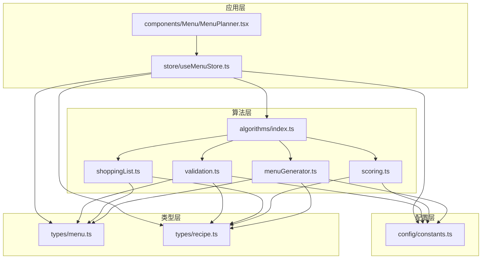
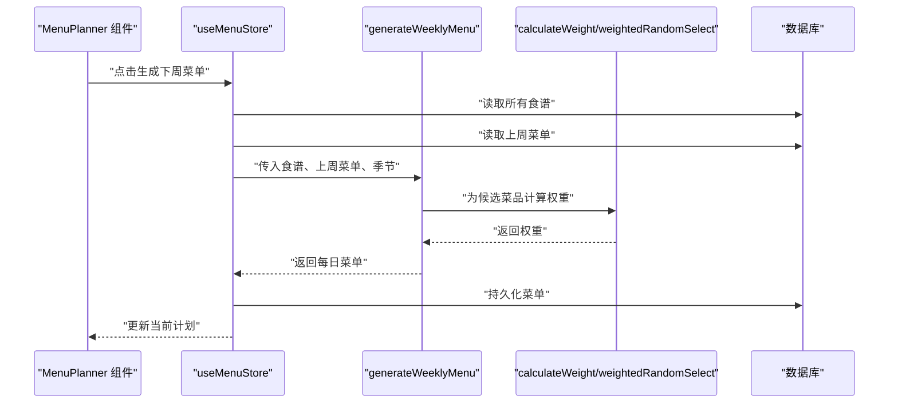
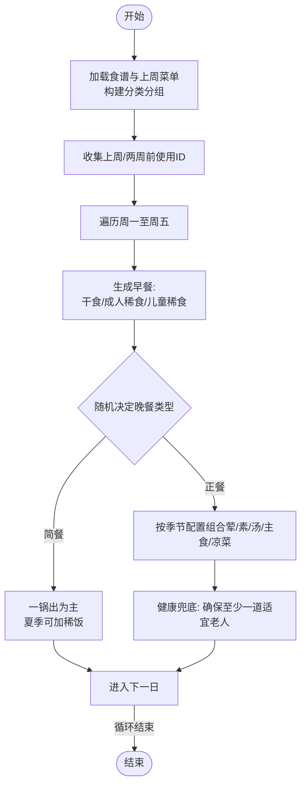
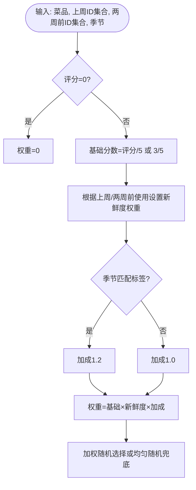
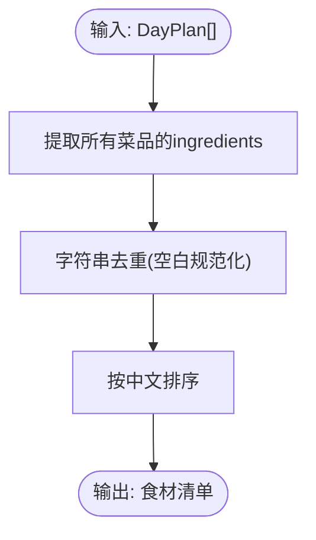
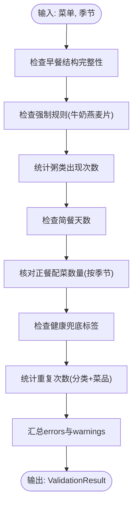
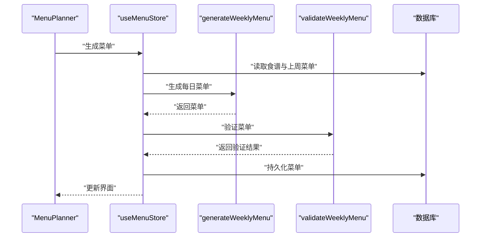
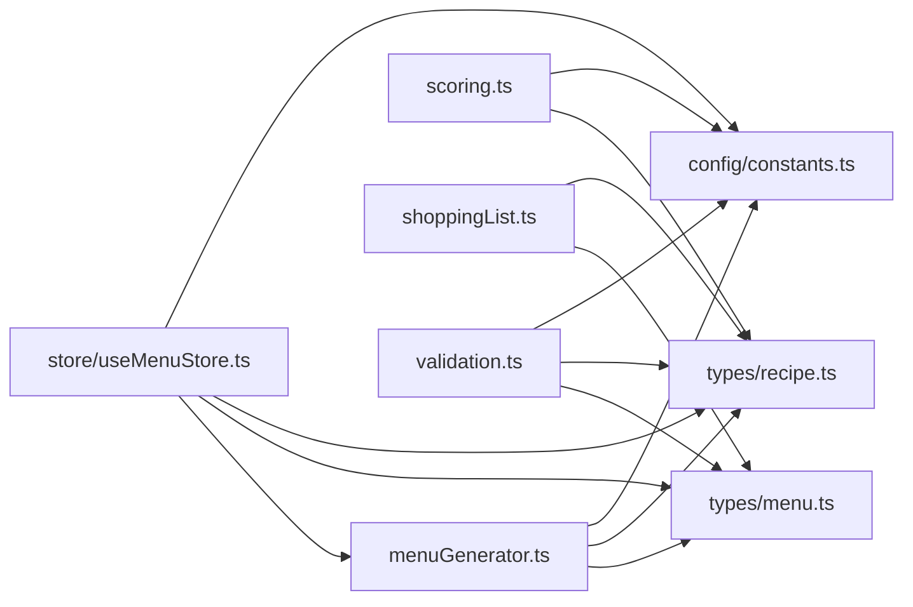

# 核心算法模块

<cite>
**本文引用的文件**
- [src/algorithms/index.ts](file://src/algorithms/index.ts)
- [src/algorithms/menuGenerator.ts](file://src/algorithms/menuGenerator.ts)
- [src/algorithms/scoring.ts](file://src/algorithms/scoring.ts)
- [src/algorithms/shoppingList.ts](file://src/algorithms/shoppingList.ts)
- [src/algorithms/validation.ts](file://src/algorithms/validation.ts)
- [src/types/menu.ts](file://src/types/menu.ts)
- [src/types/recipe.ts](file://src/types/recipe.ts)
- [src/config/constants.ts](file://src/config/constants.ts)
- [src/store/useMenuStore.ts](file://src/store/useMenuStore.ts)
- [src/components/Menu/MenuPlanner.tsx](file://src/components/Menu/MenuPlanner.tsx)
</cite>

## 目录
1. [简介](#简介)
2. [项目结构](#项目结构)
3. [核心组件](#核心组件)
4. [架构概览](#架构概览)
5. [详细组件分析](#详细组件分析)
6. [依赖分析](#依赖分析)
7. [性能考虑](#性能考虑)
8. [故障排查指南](#故障排查指南)
9. [结论](#结论)

## 简介
本文件面向具备一定算法基础的开发者，深入解析 Memu 核心算法模块：菜单生成算法、评分与加权随机选择、购物清单自动化以及数据验证规则。文档涵盖每个算法的输入输出、处理流程、复杂度分析、边界条件与错误恢复机制，并通过可视化图表展示算法间的协作关系与数据传递路径。

## 项目结构
核心算法位于 src/algorithms 目录，配合类型定义 src/types 和全局常量 src/config。状态管理与组件交互在 src/store 与 src/components 中体现，形成“算法层-类型层-配置层-应用层”的清晰分层。

**图表来源**
- [src/algorithms/index.ts:1-6](file://src/algorithms/index.ts#L1-L6)
- [src/algorithms/menuGenerator.ts:1-368](file://src/algorithms/menuGenerator.ts#L1-L368)
- [src/algorithms/scoring.ts:1-64](file://src/algorithms/scoring.ts#L1-L64)
- [src/algorithms/shoppingList.ts:1-32](file://src/algorithms/shoppingList.ts#L1-L32)
- [src/algorithms/validation.ts:1-142](file://src/algorithms/validation.ts#L1-L142)
- [src/types/menu.ts:1-45](file://src/types/menu.ts#L1-L45)
- [src/types/recipe.ts:1-21](file://src/types/recipe.ts#L1-L21)
- [src/config/constants.ts:1-44](file://src/config/constants.ts#L1-L44)
- [src/store/useMenuStore.ts:1-292](file://src/store/useMenuStore.ts#L1-L292)
- [src/components/Menu/MenuPlanner.tsx:1-75](file://src/components/Menu/MenuPlanner.tsx#L1-L75)

**章节来源**
- [src/algorithms/index.ts:1-6](file://src/algorithms/index.ts#L1-L6)
- [src/types/menu.ts:1-45](file://src/types/menu.ts#L1-L45)
- [src/types/recipe.ts:1-21](file://src/types/recipe.ts#L1-L21)
- [src/config/constants.ts:1-44](file://src/config/constants.ts#L1-L44)

## 核心组件
- 菜单生成器：按周生成周一至周五的每日菜单（含早餐与晚餐），遵循季节模式、重复约束、强制规则与健康兜底。
- 评分与加权随机：基于评分、新鲜度与季节性计算权重，采用轮盘赌式加权随机选择。
- 购物清单：从已选菜单中提取食材并去重、排序，生成购物清单。
- 数据验证：校验菜单结构完整性、强制规则、配菜数量、重复次数与健康标签等。

**章节来源**
- [src/algorithms/menuGenerator.ts:128-226](file://src/algorithms/menuGenerator.ts#L128-L226)
- [src/algorithms/scoring.ts:14-63](file://src/algorithms/scoring.ts#L14-L63)
- [src/algorithms/shoppingList.ts:11-31](file://src/algorithms/shoppingList.ts#L11-L31)
- [src/algorithms/validation.ts:27-141](file://src/algorithms/validation.ts#L27-L141)

## 架构概览
算法层通过统一出口导出，供状态管理与组件调用；类型层定义数据结构，配置层提供规则常量；应用层负责调度与持久化。

**图表来源**
- [src/components/Menu/MenuPlanner.tsx:23-36](file://src/components/Menu/MenuPlanner.tsx#L23-L36)
- [src/store/useMenuStore.ts:131-152](file://src/store/useMenuStore.ts#L131-L152)
- [src/algorithms/menuGenerator.ts:128-226](file://src/algorithms/menuGenerator.ts#L128-L226)
- [src/algorithms/scoring.ts:14-63](file://src/algorithms/scoring.ts#L14-L63)

## 详细组件分析

### 菜单生成算法（generateWeeklyMenu）
- 输入
  - 所有食谱：Recipe[]
  - 上周菜单：WeeklyMenuPlan | null
  - 季节模式：SeasonMode
- 输出
  - 每日计划：DayPlan[]（周一至周五）
- 关键流程
  - 构建按分类分组的候选池
  - 计算上周/两周前使用ID集合，作为新鲜度权重依据
  - 每日：
    - 早餐：干食（全家共享）、成人稀食（含强制牛奶燕麦片规则）、儿童稀食
    - 晚餐：随机选择简餐或正餐
      - 简餐：一锅出为主，夏季若为“夏季推荐”可额外搭配稀饭
      - 正餐：按季节配置组合荤/素/汤/主食/凉菜，健康兜底确保至少一道“适宜老人”
  - 使用计数器避免重复（5星菜有重复上限）
- 边界与兜底
  - 若候选不足，先放宽重复限制再兜底为非拉黑菜品
  - 缺失菜品时使用占位符（placeholder）保证结构完整
- 复杂度
  - 时间：O(D×C×P)，D=5天，C=分类数，P为候选池平均大小
  - 空间：O(N)，N为食谱总数（分组与使用计数）

**图表来源**
- [src/algorithms/menuGenerator.ts:128-226](file://src/algorithms/menuGenerator.ts#L128-L226)
- [src/algorithms/menuGenerator.ts:232-254](file://src/algorithms/menuGenerator.ts#L232-L254)
- [src/algorithms/menuGenerator.ts:260-336](file://src/algorithms/menuGenerator.ts#L260-L336)
- [src/algorithms/menuGenerator.ts:341-367](file://src/algorithms/menuGenerator.ts#L341-L367)

**章节来源**
- [src/algorithms/menuGenerator.ts:128-226](file://src/algorithms/menuGenerator.ts#L128-L226)
- [src/algorithms/menuGenerator.ts:232-254](file://src/algorithms/menuGenerator.ts#L232-L254)
- [src/algorithms/menuGenerator.ts:260-336](file://src/algorithms/menuGenerator.ts#L260-L336)
- [src/algorithms/menuGenerator.ts:341-367](file://src/algorithms/menuGenerator.ts#L341-L367)

### 评分系统与加权随机（calculateWeight, weightedRandomSelect）
- 评分权重构成
  - 基础分数：评分归一化（null 视为3分）
  - 新鲜度权重：上周使用降权，两周前半权，更久或未使用全权
  - 季节加成：与季节匹配的标签获得1.2倍加成
  - 拉黑：评分为0直接权重为0
- 加权随机
  - 总权重为0时退化为均匀随机
  - 采用累积权重轮盘赌选择
- 复杂度
  - 计算权重：O(1) 单个菜品
  - 加权随机：O(n) n为候选数

**图表来源**
- [src/algorithms/scoring.ts:14-42](file://src/algorithms/scoring.ts#L14-L42)
- [src/algorithms/scoring.ts:48-63](file://src/algorithms/scoring.ts#L48-L63)

**章节来源**
- [src/algorithms/scoring.ts:14-42](file://src/algorithms/scoring.ts#L14-L42)
- [src/algorithms/scoring.ts:48-63](file://src/algorithms/scoring.ts#L48-L63)

### 购物清单自动化（generateShoppingList）
- 输入：DayPlan[]（已选菜单）
- 输出：string[]（去重并按中文排序的食材清单）
- 流程
  - 合并所有菜品的 ingredients
  - 字符串去重（空白规范化）
  - 按中文区域排序
- 复杂度
  - 时间：O(S)，S为所有食材项数
  - 空间：O(S)

**图表来源**
- [src/algorithms/shoppingList.ts:11-31](file://src/algorithms/shoppingList.ts#L11-L31)

**章节来源**
- [src/algorithms/shoppingList.ts:11-31](file://src/algorithms/shoppingList.ts#L11-L31)

### 数据验证规则（validateWeeklyMenu）
- 输入：DayPlan[]，SeasonMode
- 输出：ValidationResult（valid, errors[], warnings[]）
- 校验要点
  - 结构完整性：每日早餐必须包含干食、成人稀食、儿童稀食
  - 强制规则：周一、三、五成人稀食必须为“牛奶燕麦片”
  - 粥类限制：每周最多出现天数
  - 简餐天数：每周固定次数
  - 正餐配菜数量：按季节配置核对荤/素/汤/主食/凉菜数量
  - 健康兜底：正餐缺少“适宜老人”标签给出警告
  - 重复检测：分类+菜品维度统计，5星菜有重复上限豁免
- 复杂度
  - 时间：O(D×C)，D为天数，C为菜品数
  - 空间：O(U)，U为唯一菜品数

**图表来源**
- [src/algorithms/validation.ts:27-141](file://src/algorithms/validation.ts#L27-L141)

**章节来源**
- [src/algorithms/validation.ts:27-141](file://src/algorithms/validation.ts#L27-L141)

### 算法协作与数据传递
- 生成阶段：MenuPlanner -> useMenuStore.generateMenu -> generateWeeklyMenu -> scoring.calculateWeight/weightedRandomSelect -> DB 持久化
- 替换阶段：MenuPlanner -> useMenuStore.replaceDish -> pickReplacement（均匀随机，放宽使用限制）-> DB 更新
- 验证阶段：useMenuStore.archivePlan -> validateWeeklyMenu -> DB 历史归档

**图表来源**
- [src/components/Menu/MenuPlanner.tsx:23-36](file://src/components/Menu/MenuPlanner.tsx#L23-L36)
- [src/store/useMenuStore.ts:131-152](file://src/store/useMenuStore.ts#L131-L152)
- [src/algorithms/validation.ts:27-141](file://src/algorithms/validation.ts#L27-L141)

**章节来源**
- [src/store/useMenuStore.ts:131-152](file://src/store/useMenuStore.ts#L131-L152)
- [src/components/Menu/MenuPlanner.tsx:23-36](file://src/components/Menu/MenuPlanner.tsx#L23-L36)

## 依赖分析
- 类型依赖
  - menuGenerator.ts 依赖 DayPlan、WeeklyMenuPlan、SeasonMode、RecipeCategory
  - scoring.ts 依赖 Recipe、SeasonMode
  - shoppingList.ts 依赖 DayPlan、Recipe
  - validation.ts 依赖 DayPlan、Recipe
- 配置依赖
  - constants.ts 提供强制规则、限额、季节配置、标签常量
- 应用依赖
  - useMenuStore.ts 调用 generateWeeklyMenu 并集成验证与持久化

**图表来源**
- [src/algorithms/menuGenerator.ts:1-18](file://src/algorithms/menuGenerator.ts#L1-L18)
- [src/algorithms/scoring.ts:1-3](file://src/algorithms/scoring.ts#L1-L3)
- [src/algorithms/shoppingList.ts:1-3](file://src/algorithms/shoppingList.ts#L1-L3)
- [src/algorithms/validation.ts:1-10](file://src/algorithms/validation.ts#L1-L10)
- [src/store/useMenuStore.ts:1-16](file://src/store/useMenuStore.ts#L1-L16)

**章节来源**
- [src/types/menu.ts:1-45](file://src/types/menu.ts#L1-L45)
- [src/types/recipe.ts:1-21](file://src/types/recipe.ts#L1-L21)
- [src/config/constants.ts:1-44](file://src/config/constants.ts#L1-L44)

## 性能考虑
- 菜单生成
  - 分类分组一次建立，后续查询 O(1)，整体近似 O(D×C×P)
  - 使用 Map/Set 进行去重与计数，时间复杂度可控
- 评分与加权随机
  - 单次权重计算 O(1)，随机选择 O(n)，n 通常较小
- 购物清单
  - 去重使用 Set，排序使用 localeCompare，整体 O(S log S)
- 验证
  - 多次线性扫描，整体 O(D×C)
- 优化建议
  - 对于超大食谱库，可考虑预构建索引（如按分类、标签、季节）
  - 加权随机可缓存候选权重以减少重复计算
  - 验证阶段可并行化（如多核环境）

[本节为通用性能讨论，无需特定文件来源]

## 故障排查指南
- 菜单生成失败或空值
  - 检查是否有足够候选（特别是被拉黑或重复限制导致的候选不足）
  - 查看兜底逻辑是否触发（放宽重复限制）
- 食谱缺失或标签不匹配
  - 确认食谱标签与常量一致（如“适宜老人”、“夏季推荐”）
- 购物清单异常
  - 检查 ingredients 是否为数组，是否存在空字符串或空白
- 验证告警
  - 关注重复次数与5星上限、健康标签缺失、配菜数量不符
- 状态管理问题
  - 生成/替换/存档流程中检查数据库读写与持久化顺序

**章节来源**
- [src/algorithms/menuGenerator.ts:79-111](file://src/algorithms/menuGenerator.ts#L79-L111)
- [src/algorithms/validation.ts:127-134](file://src/algorithms/validation.ts#L127-L134)
- [src/store/useMenuStore.ts:167-224](file://src/store/useMenuStore.ts#L167-L224)

## 结论
Memu 的核心算法以清晰的分层设计实现：评分与加权随机提供智能选择，菜单生成遵循严格的规则与健康兜底，购物清单自动化提升实用性，验证规则保障质量。通过合理的数据结构与边界处理，系统在可维护性与性能之间取得平衡。建议在大规模场景下引入索引与缓存策略，进一步优化随机选择与验证阶段的吞吐。