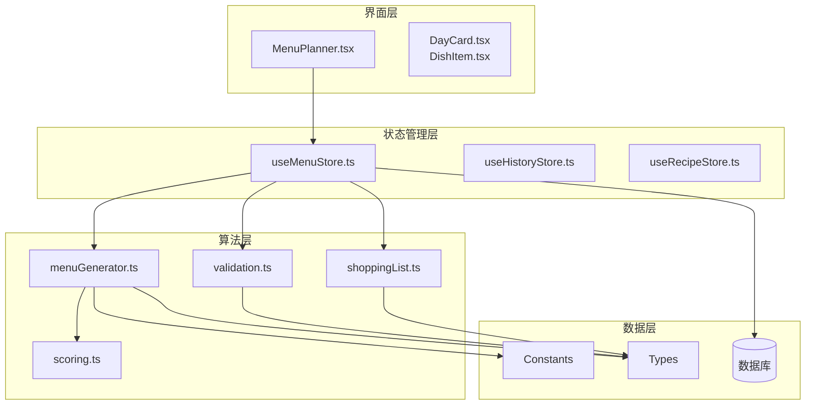
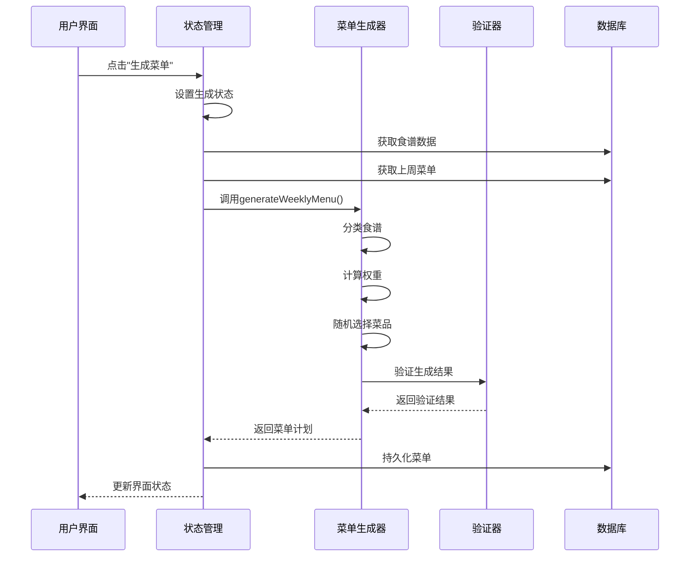
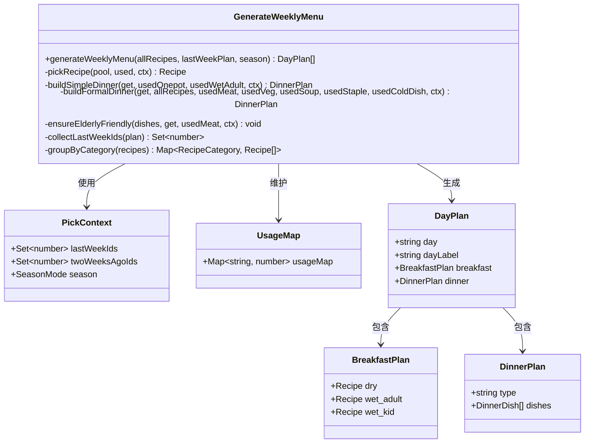
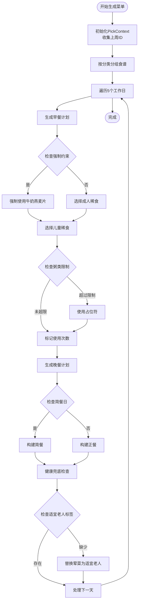
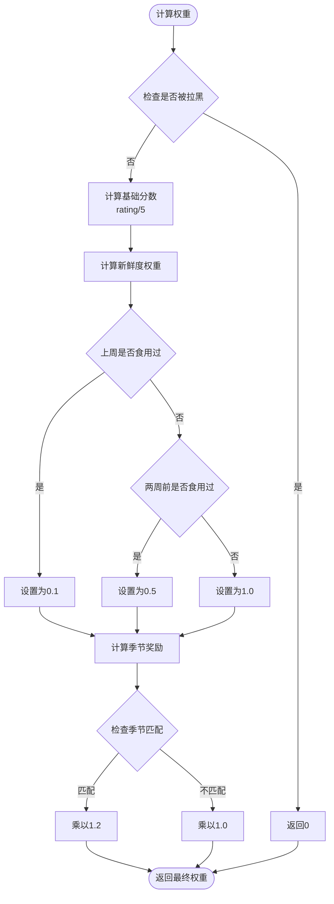
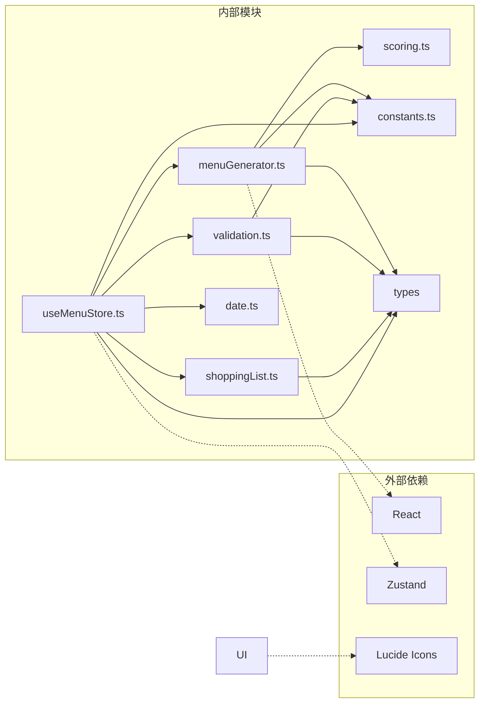

# 菜单生成算法

<cite>
**本文档引用的文件**
- [menuGenerator.ts](file://src/algorithms/menuGenerator.ts)
- [scoring.ts](file://src/algorithms/scoring.ts)
- [validation.ts](file://src/algorithms/validation.ts)
- [shoppingList.ts](file://src/algorithms/shoppingList.ts)
- [constants.ts](file://src/config/constants.ts)
- [menu.ts](file://src/types/menu.ts)
- [recipe.ts](file://src/types/recipe.ts)
- [useMenuStore.ts](file://src/store/useMenuStore.ts)
- [MenuPlanner.tsx](file://src/components/Menu/MenuPlanner.tsx)
- [date.ts](file://src/utils/date.ts)
</cite>

## 目录
1. [简介](#简介)
2. [项目结构](#项目结构)
3. [核心组件](#核心组件)
4. [架构概览](#架构概览)
5. [详细组件分析](#详细组件分析)
6. [依赖关系分析](#依赖关系分析)
7. [性能考虑](#性能考虑)
8. [故障排除指南](#故障排除指南)
9. [结论](#结论)

## 简介

本项目是一个基于React + TypeScript + Vite构建的智能菜单生成系统。该系统的核心算法是`generateWeeklyMenu`函数，它能够根据食谱数据、用户偏好和季节性因素自动生成一周（周一至周五）的营养均衡菜单。

该算法采用加权随机选择策略，结合多种约束条件和优化机制，确保生成的菜单既符合用户的饮食偏好，又满足营养均衡和多样性的要求。系统还提供了完整的验证机制、购物清单生成功能以及与数据库的无缝集成。

## 项目结构

项目采用模块化的架构设计，主要分为以下几个层次：



**图表来源**
- [MenuPlanner.tsx:1-75](file://src/components/Menu/MenuPlanner.tsx#L1-L75)
- [useMenuStore.ts:1-292](file://src/store/useMenuStore.ts#L1-L292)
- [menuGenerator.ts:1-368](file://src/algorithms/menuGenerator.ts#L1-L368)

**章节来源**
- [menuGenerator.ts:1-368](file://src/algorithms/menuGenerator.ts#L1-L368)
- [useMenuStore.ts:1-292](file://src/store/useMenuStore.ts#L1-L292)

## 核心组件

### generateWeeklyMenu 函数

`generateWeeklyMenu`是整个菜单生成系统的核心函数，负责生成一周的完整菜单计划。该函数接收三个主要参数：

- `allRecipes`: 所有可用的食谱数据
- `lastWeekPlan`: 上一周的菜单计划（用于避免重复）
- `season`: 季节模式（默认/夏季/冬季）

函数返回一个包含5个元素的数组，每个元素代表周一到周五的一天菜单。

**章节来源**
- [menuGenerator.ts:128-226](file://src/algorithms/menuGenerator.ts#L128-L226)

### 权重计算系统

算法采用加权随机选择策略，通过`calculateWeight`函数计算每个食谱的抽取权重。权重计算公式为：

```
权重 = 基础分数 × 新鲜度权重 × 季节奖励
```

其中：
- 基础分数：基于食谱评分（1-5星），空评视为3星
- 新鲜度权重：上周食用0.1，两周前食用0.5，其他情况1.0
- 季节奖励：与季节匹配的食谱获得1.2倍奖励

**章节来源**
- [scoring.ts:14-42](file://src/algorithms/scoring.ts#L14-L42)

### 约束满足机制

系统实现了多层次的约束满足机制：

1. **强制约束**：周一、周三、周五的成人稀食必须为"牛奶燕麦片"
2. **重复控制**：普通食谱每周最多出现1次，5星食谱最多出现2次
3. **多样性保证**：每日至少包含1道"适宜老人"标签的菜品
4. **季节适应**：夏季菜单包含凉菜，冬季菜单包含温热菜品

**章节来源**
- [menuGenerator.ts:174-196](file://src/algorithms/menuGenerator.ts#L174-L196)
- [validation.ts:27-141](file://src/algorithms/validation.ts#L27-L141)

## 架构概览

系统采用分层架构设计，各层职责明确：



**图表来源**
- [useMenuStore.ts:131-152](file://src/store/useMenuStore.ts#L131-L152)
- [menuGenerator.ts:128-226](file://src/algorithms/menuGenerator.ts#L128-L226)

## 详细组件分析

### 菜单生成器类图



**图表来源**
- [menuGenerator.ts:24-226](file://src/algorithms/menuGenerator.ts#L24-L226)
- [menu.ts:3-34](file://src/types/menu.ts#L3-L34)

### 算法工作流程



**图表来源**
- [menuGenerator.ts:128-226](file://src/algorithms/menuGenerator.ts#L128-L226)
- [menuGenerator.ts:232-336](file://src/algorithms/menuGenerator.ts#L232-L336)

### 权重计算流程



**图表来源**
- [scoring.ts:14-42](file://src/algorithms/scoring.ts#L14-L42)

**章节来源**
- [menuGenerator.ts:79-111](file://src/algorithms/menuGenerator.ts#L79-L111)
- [scoring.ts:14-42](file://src/algorithms/scoring.ts#L14-L42)

### 约束满足算法

系统实现了以下关键约束：

1. **强制约束**：通过`MANDATORY_MILK_OATMEAL_DAYS`配置确保特定日期的强制菜品
2. **重复控制**：使用`UsageMap`跟踪菜品使用次数，普通菜品每周最多1次，5星菜品最多2次
3. **多样性保证**：通过`ensureElderlyFriendly`函数确保每天至少有一道"适宜老人"标签的菜品
4. **季节适应**：根据季节调整菜品选择策略，夏季增加凉菜，冬季减少凉菜

**章节来源**
- [menuGenerator.ts:174-196](file://src/algorithms/menuGenerator.ts#L174-L196)
- [menuGenerator.ts:341-367](file://src/algorithms/menuGenerator.ts#L341-L367)

## 依赖关系分析



**图表来源**
- [menuGenerator.ts:1-18](file://src/algorithms/menuGenerator.ts#L1-L18)
- [useMenuStore.ts:1-16](file://src/store/useMenuStore.ts#L1-L16)

**章节来源**
- [menuGenerator.ts:1-18](file://src/algorithms/menuGenerator.ts#L1-L18)
- [useMenuStore.ts:1-16](file://src/store/useMenuStore.ts#L1-L16)

## 性能考虑

### 时间复杂度分析

- **整体复杂度**：O(N × D)，其中N为食谱总数，D为工作日天数（5天）
- **每日常规操作**：O(N)（最坏情况下需要遍历所有食谱）
- **权重计算**：O(1)（固定时间操作）
- **分类查找**：O(1)（通过Map查找，平均O(1)）

### 空间复杂度评估

- **内存占用**：O(N + C)，其中N为食谱数量，C为分类数量（约8个分类）
- **使用计数器**：O(U)，其中U为唯一菜品数量
- **临时数据结构**：O(D × K)，其中K为每餐的平均菜品数量

### 性能优化技巧

1. **预处理优化**：使用`groupByCategory`预先按分类组织食谱，避免重复遍历
2. **缓存机制**：利用`lastWeekIds`集合进行O(1)的重复检查
3. **权重缓存**：在食谱级别缓存权重值，避免重复计算
4. **早停机制**：当候选池为空时立即返回，避免不必要的计算

**章节来源**
- [menuGenerator.ts:51-59](file://src/algorithms/menuGenerator.ts#L51-L59)
- [menuGenerator.ts:34-49](file://src/algorithms/menuGenerator.ts#L34-L49)

## 故障排除指南

### 常见问题及解决方案

1. **生成的菜单不符合预期**
   - 检查`validateWeeklyMenu`返回的错误信息
   - 确认食谱标签和分类设置正确
   - 验证季节模式配置

2. **权重计算异常**
   - 检查食谱评分是否在有效范围内
   - 确认`CROSS_WEEK_WEIGHT_FACTOR`配置正确
   - 验证季节标签是否正确设置

3. **性能问题**
   - 检查食谱数据量是否过大
   - 确认数据库查询是否优化
   - 考虑添加索引以提高查询速度

**章节来源**
- [validation.ts:12-16](file://src/algorithms/validation.ts#L12-L16)
- [scoring.ts:14-42](file://src/algorithms/scoring.ts#L14-L42)

### 调试工具

系统提供了完整的验证功能，可以检查生成的菜单是否符合所有约束条件：

- **结构完整性检查**：确保每餐都有完整的菜品组成
- **强制约束检查**：验证特殊日期的强制菜品
- **重复控制检查**：监控菜品使用频率
- **多样性检查**：确保营养均衡

**章节来源**
- [validation.ts:27-141](file://src/algorithms/validation.ts#L27-L141)

## 结论

本菜单生成算法通过精心设计的约束满足机制和权重计算策略，实现了智能化的菜单规划。算法的主要优势包括：

1. **智能权重系统**：通过多维度权重计算确保菜品选择的合理性
2. **严格的约束控制**：多层次的约束机制确保生成的菜单符合各种要求
3. **良好的扩展性**：模块化设计便于添加新的约束条件和优化策略
4. **完善的验证机制**：提供全面的质量保证和错误检测

该算法为家庭和小型餐饮场景提供了高效的菜单生成解决方案，能够显著减少人工规划菜单的时间成本，同时确保营养均衡和饮食多样性。