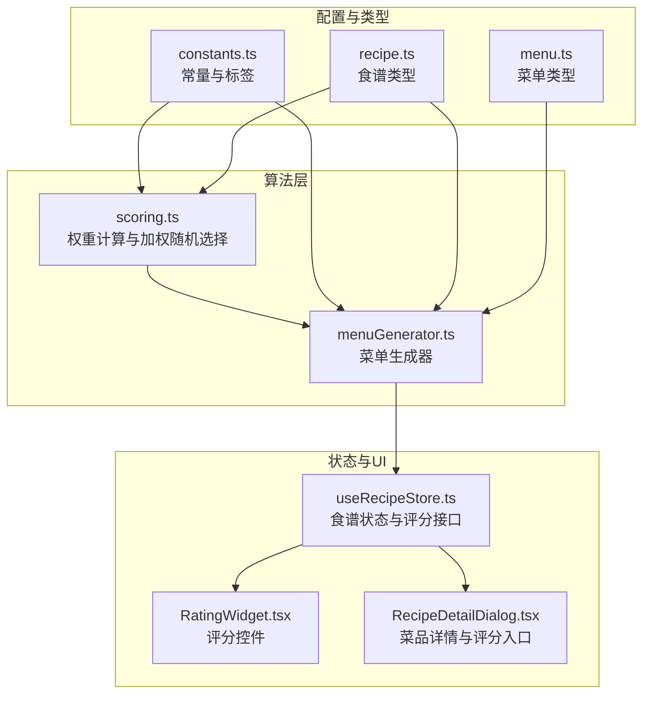
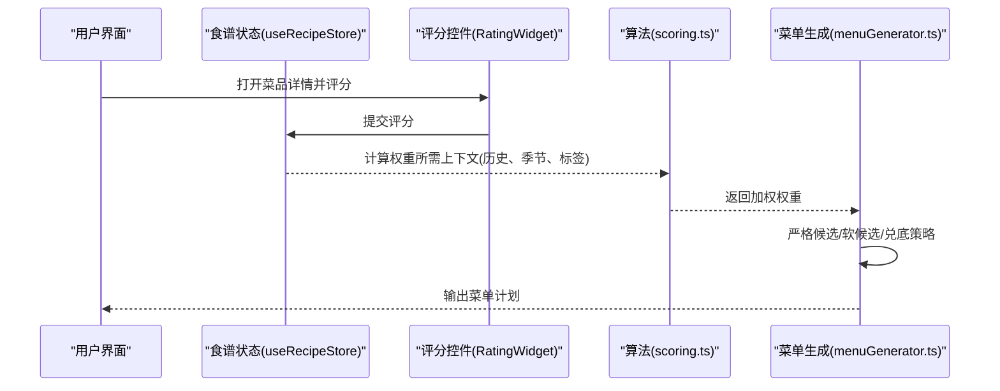
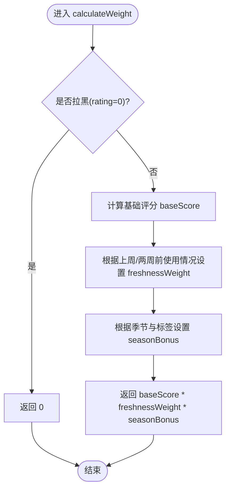
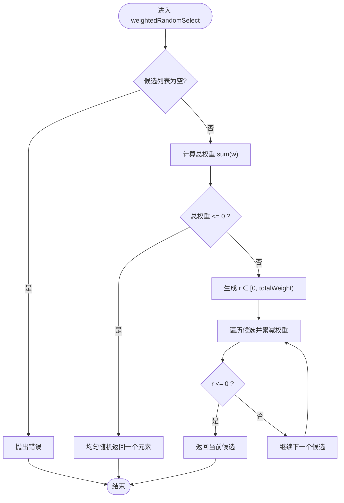
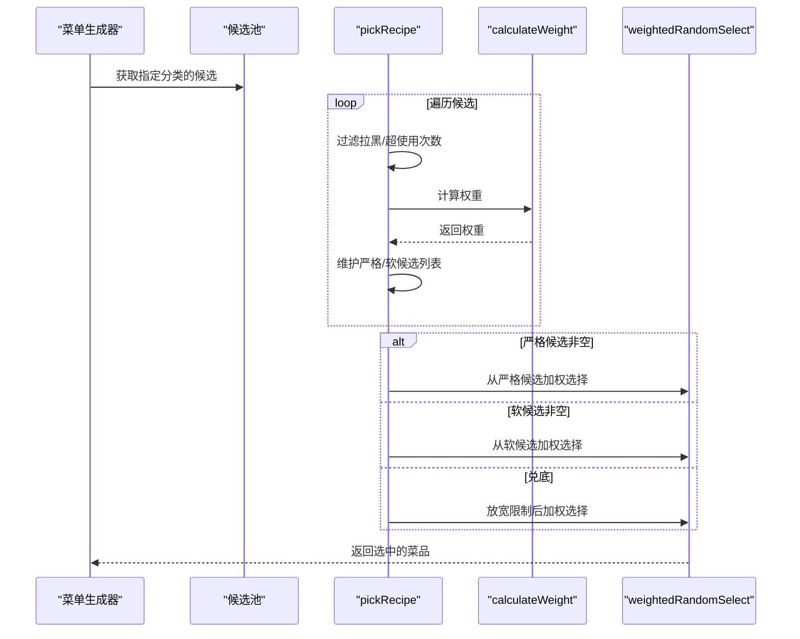
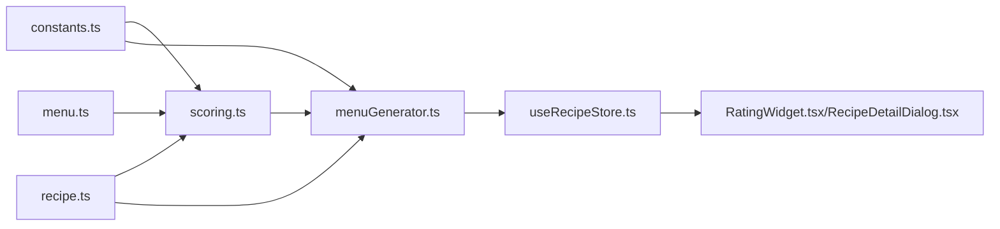

# 评分系统算法

<cite>
**本文引用的文件**
- [src/algorithms/scoring.ts](file://src/algorithms/scoring.ts)
- [src/algorithms/menuGenerator.ts](file://src/algorithms/menuGenerator.ts)
- [src/config/constants.ts](file://src/config/constants.ts)
- [src/types/recipe.ts](file://src/types/recipe.ts)
- [src/types/menu.ts](file://src/types/menu.ts)
- [src/store/useRecipeStore.ts](file://src/store/useRecipeStore.ts)
- [src/components/Recipe/RatingWidget.tsx](file://src/components/Recipe/RatingWidget.tsx)
- [src/components/Recipe/RecipeDetailDialog.tsx](file://src/components/Recipe/RecipeDetailDialog.tsx)
- [src/algorithms/index.ts](file://src/algorithms/index.ts)
</cite>

## 目录
1. [简介](#简介)
2. [项目结构](#项目结构)
3. [核心组件](#核心组件)
4. [架构概览](#架构概览)
5. [详细组件分析](#详细组件分析)
6. [依赖关系分析](#依赖关系分析)
7. [性能考量](#性能考量)
8. [故障排查指南](#故障排查指南)
9. [结论](#结论)
10. [附录](#附录)

## 简介
本文件围绕评分系统算法进行深入技术文档说明，重点解释两个核心函数：calculateWeight（权重计算）与 weightedRandomSelect（加权随机选择）。文档涵盖以下内容：
- 数学模型与权重构成：基础评分、新鲜度衰减、季节性加成、拉黑惩罚等。
- 随机选择机制与概率分布策略：轮盘赌式采样、总权重为零时的均匀退化策略。
- 边界条件与错误处理：空集合抛错、负权重裁剪、兑底策略。
- 实际应用场景：食谱推荐与菜单生成中的具体用法与可扩展性。
- 性能特征与优化建议：时间复杂度、空间复杂度与常见优化点。

## 项目结构
评分系统算法位于 src/algorithms 目录，配合配置常量、类型定义与前端交互组件共同完成“评分—权重—随机选择—菜单生成”的完整闭环。

图表来源
- [src/algorithms/scoring.ts:1-64](file://src/algorithms/scoring.ts#L1-L64)
- [src/algorithms/menuGenerator.ts:1-374](file://src/algorithms/menuGenerator.ts#L1-L374)
- [src/config/constants.ts:1-44](file://src/config/constants.ts#L1-L44)
- [src/types/recipe.ts:1-21](file://src/types/recipe.ts#L1-L21)
- [src/types/menu.ts:1-45](file://src/types/menu.ts#L1-L45)
- [src/store/useRecipeStore.ts:1-121](file://src/store/useRecipeStore.ts#L1-L121)
- [src/components/Recipe/RatingWidget.tsx:1-63](file://src/components/Recipe/RatingWidget.tsx#L1-L63)
- [src/components/Recipe/RecipeDetailDialog.tsx:1-159](file://src/components/Recipe/RecipeDetailDialog.tsx#L1-L159)

章节来源
- [src/algorithms/scoring.ts:1-64](file://src/algorithms/scoring.ts#L1-L64)
- [src/algorithms/menuGenerator.ts:1-374](file://src/algorithms/menuGenerator.ts#L1-L374)
- [src/config/constants.ts:1-44](file://src/config/constants.ts#L1-L44)
- [src/types/recipe.ts:1-21](file://src/types/recipe.ts#L1-L21)
- [src/types/menu.ts:1-45](file://src/types/menu.ts#L1-L45)
- [src/store/useRecipeStore.ts:1-121](file://src/store/useRecipeStore.ts#L1-L121)
- [src/components/Recipe/RatingWidget.tsx:1-63](file://src/components/Recipe/RatingWidget.tsx#L1-L63)
- [src/components/Recipe/RecipeDetailDialog.tsx:1-159](file://src/components/Recipe/RecipeDetailDialog.tsx#L1-L159)

## 核心组件
- 权重计算函数 calculateWeight：基于评分、新鲜度与季节性计算最终权重。
- 加权随机选择函数 weightedRandomSelect：按权重概率抽取条目，总权重为零时退化为均匀随机。
- 菜单生成器 menuGenerator：在生成菜单时调用上述函数，并结合使用次数限制与兑底策略。

章节来源
- [src/algorithms/scoring.ts:14-42](file://src/algorithms/scoring.ts#L14-L42)
- [src/algorithms/scoring.ts:48-63](file://src/algorithms/scoring.ts#L48-L63)
- [src/algorithms/menuGenerator.ts:82-117](file://src/algorithms/menuGenerator.ts#L82-L117)

## 架构概览
下图展示了从“评分输入”到“菜单生成”的端到端流程，以及算法层与业务层的交互关系。

图表来源
- [src/store/useRecipeStore.ts:81-90](file://src/store/useRecipeStore.ts#L81-L90)
- [src/components/Recipe/RatingWidget.tsx:11-62](file://src/components/Recipe/RatingWidget.tsx#L11-L62)
- [src/algorithms/scoring.ts:14-42](file://src/algorithms/scoring.ts#L14-L42)
- [src/algorithms/menuGenerator.ts:82-117](file://src/algorithms/menuGenerator.ts#L82-L117)

## 详细组件分析

### 权重计算：calculateWeight
- 输入参数
  - recipe：食谱对象，包含评分、标签、类别等信息。
  - lastWeekRecipeIds、twoWeeksAgoIds：上周/两周前已使用菜品ID集合。
  - season：季节模式（默认/夏季/冬季）。
- 权重构成
  - 基础评分 baseScore：若未评分则按3分折算，再归一化到[0,1]区间；评分0视为拉黑直接返回0。
  - 新鲜度衰减 freshnessWeight：
    - 上周吃过：乘以跨周降权系数；
    - 两周前吃过：乘以0.5；
    - 从未吃过或不在集合中：不衰减。
  - 季节性加成 seasonBonus：
    - 夏季且带有“夏季推荐”标签：乘以1.2；
    - 冬季且带有“冬季推荐”标签：乘以1.2；
    - 否则不加成。
  - 最终权重：baseScore × freshnessWeight × seasonBonus。
- 边界与健壮性
  - 拉黑直接返回0，确保不会被选中。
  - 对于无ID的菜品，新鲜度衰减逻辑跳过（避免误判）。
- 复杂度
  - 时间复杂度：O(1)。
  - 空间复杂度：O(1)。

图表来源
- [src/algorithms/scoring.ts:14-42](file://src/algorithms/scoring.ts#L14-L42)
- [src/config/constants.ts:17-18](file://src/config/constants.ts#L17-L18)
- [src/config/constants.ts:24-31](file://src/config/constants.ts#L24-L31)

章节来源
- [src/algorithms/scoring.ts:14-42](file://src/algorithms/scoring.ts#L14-L42)
- [src/config/constants.ts:17-18](file://src/config/constants.ts#L17-L18)
- [src/config/constants.ts:24-31](file://src/config/constants.ts#L24-L31)
- [src/types/recipe.ts:11-20](file://src/types/recipe.ts#L11-L20)

### 加权随机选择：weightedRandomSelect
- 功能概述
  - 在候选列表 items 中按权重进行概率抽样，item 必须包含 weight 字段。
  - 若总权重 totalWeight ≤ 0，则退化为均匀随机选择。
- 算法步骤
  1) 计算所有正权重之和；
  2) 生成 [0, totalWeight) 的随机数 r；
  3) 累减每个 item 的权重，当累计值首次不小于 r 时返回该 item；
  4) 若循环结束仍未命中，返回最后一个元素（防止浮点误差导致的漏选）。
- 边界与健壮性
  - 空列表抛出异常，避免静默失败；
  - 对负权重进行裁剪（取0），保证权重非负；
  - totalWeight 为0时退化为均匀随机，确保可用性。
- 复杂度
  - 时间复杂度：O(n)，n 为候选数量；
  - 空间复杂度：O(1)。

图表来源
- [src/algorithms/scoring.ts:48-63](file://src/algorithms/scoring.ts#L48-L63)

章节来源
- [src/algorithms/scoring.ts:48-63](file://src/algorithms/scoring.ts#L48-L63)

### 菜单生成中的应用：pickRecipe 与生成流程
- 严格候选/软候选/兑底策略
  - 严格候选：未超使用次数且权重 > 0；
  - 软候选：未超使用次数但权重被最小化（如0.001）；
  - 兑底：当严格与软候选均为空时，放宽限制允许重复，但优先保证多样性。
- 使用次数限制
  - 普通菜品：使用次数 > 0 即视为超限；
  - 五星菜品：最多使用 FIVE_STAR_MAX_REPEAT 次。
- 季节性与标签过滤
  - 正餐汤品在不同季节会优先选择对应标签的菜品；
  - 简餐模式下，夏季推荐的一锅出可额外搭配带粥类标签的稀食。
- 健康兜底
  - 若正餐未包含“适宜老人”标签，则替换第一道荤菜为带该标签的菜品。

图表来源
- [src/algorithms/menuGenerator.ts:82-117](file://src/algorithms/menuGenerator.ts#L82-L117)
- [src/algorithms/scoring.ts:14-42](file://src/algorithms/scoring.ts#L14-L42)
- [src/algorithms/scoring.ts:48-63](file://src/algorithms/scoring.ts#L48-L63)
- [src/config/constants.ts:20-21](file://src/config/constants.ts#L20-L21)

章节来源
- [src/algorithms/menuGenerator.ts:82-117](file://src/algorithms/menuGenerator.ts#L82-L117)
- [src/config/constants.ts:20-21](file://src/config/constants.ts#L20-L21)

### 评分系统在食谱推荐与菜单生成中的应用
- 评分输入与持久化
  - 用户通过评分控件提交评分，仅当菜品有历史食用记录时允许评分；
  - 评分写入数据库后刷新本地状态，供后续权重计算使用。
- 推荐与生成
  - 菜单生成时，对候选菜品计算权重并进行加权随机选择；
  - 通过“健康兜底”、“季节性偏好”、“新鲜度衰减”等策略提升推荐质量与多样性。

章节来源
- [src/store/useRecipeStore.ts:81-90](file://src/store/useRecipeStore.ts#L81-L90)
- [src/components/Recipe/RatingWidget.tsx:11-62](file://src/components/Recipe/RatingWidget.tsx#L11-L62)
- [src/components/Recipe/RecipeDetailDialog.tsx:31-35](file://src/components/Recipe/RecipeDetailDialog.tsx#L31-L35)
- [src/algorithms/menuGenerator.ts:134-232](file://src/algorithms/menuGenerator.ts#L134-L232)

## 依赖关系分析
- 模块耦合
  - scoring.ts 与 constants.ts、recipe.ts、menu.ts 紧密耦合，分别提供权重因子、数据模型与季节模式。
  - menuGenerator.ts 依赖 scoring.ts 的权重计算与加权随机选择，并依赖 constants.ts 的配置与标签。
- 外部依赖
  - 评分与菜单存储依赖数据库访问（db），由状态层封装。
- 可能的循环依赖
  - 当前模块间无循环导入，职责清晰：算法层只负责计算与选择，业务层负责组织与策略。

图表来源
- [src/config/constants.ts:1-44](file://src/config/constants.ts#L1-L44)
- [src/types/recipe.ts:1-21](file://src/types/recipe.ts#L1-L21)
- [src/types/menu.ts:1-45](file://src/types/menu.ts#L1-L45)
- [src/algorithms/scoring.ts:1-64](file://src/algorithms/scoring.ts#L1-L64)
- [src/algorithms/menuGenerator.ts:1-374](file://src/algorithms/menuGenerator.ts#L1-L374)
- [src/store/useRecipeStore.ts:1-121](file://src/store/useRecipeStore.ts#L1-L121)
- [src/components/Recipe/RatingWidget.tsx:1-63](file://src/components/Recipe/RatingWidget.tsx#L1-L63)
- [src/components/Recipe/RecipeDetailDialog.tsx:1-159](file://src/components/Recipe/RecipeDetailDialog.tsx#L1-L159)

章节来源
- [src/algorithms/index.ts:1-5](file://src/algorithms/index.ts#L1-L5)

## 性能考量
- 时间复杂度
  - calculateWeight：O(1)。
  - weightedRandomSelect：O(n)。
  - pickRecipe：O(n)（n 为候选池大小）。
  - generateWeeklyMenu：整体 O(W×C×n)，W 为工作日数，C 为每类菜品的平均候选数。
- 空间复杂度
  - 临时数组（严格/软候选）最多 O(n)。
  - 使用计数 Map 按菜品键维护，最坏 O(k)，k 为已使用菜品种类数。
- 优化建议
  - 将权重缓存至菜品对象，避免重复计算（适用于静态数据场景）。
  - 对大候选池采用分桶或预排序索引，降低加权随机选择成本。
  - 在菜单生成前对候选池按权重进行预筛选，减少无效遍历。
  - 将 seasonBonus 与标签匹配改为哈希表查找，提高查找效率。

## 故障排查指南
- weightedRandomSelect 抛出“候选列表为空”
  - 触发原因：传入空数组或所有候选权重均为负值导致总权重为0。
  - 解决方案：检查上游过滤逻辑，确保至少存在一个有效候选；必要时启用兑底策略。
- calculateWeight 返回0
  - 触发原因：菜品被标记为拉黑（rating=0）。
  - 解决方案：在菜单生成阶段跳过拉黑菜品，或在兑底阶段放宽限制。
- 季节性偏好未生效
  - 触发原因：菜品标签缺失或季节模式不匹配。
  - 解决方案：核对标签常量与季节模式，确保标签一致。
- 使用次数限制导致无法选择
  - 触发原因：普通菜品已使用过，或五星菜品已达最大使用次数。
  - 解决方案：调整 FIVE_STAR_MAX_REPEAT 或在兑底阶段放宽限制。

章节来源
- [src/algorithms/scoring.ts:48-63](file://src/algorithms/scoring.ts#L48-L63)
- [src/algorithms/menuGenerator.ts:82-117](file://src/algorithms/menuGenerator.ts#L82-L117)
- [src/config/constants.ts:20-21](file://src/config/constants.ts#L20-L21)

## 结论
评分系统通过“评分—权重—加权随机选择—策略兑底”的闭环设计，在保证概率正确性的同时兼顾了实用性与可扩展性。calculateWeight 与 weightedRandomSelect 作为核心算法，具备明确的数学模型与稳健的边界处理；在菜单生成场景中，结合使用次数限制、季节偏好与健康兜底策略，实现了高质量、多样化的推荐结果。未来可在缓存、索引与预筛选等方面进一步优化性能。

## 附录
- 关键配置与常量
  - 跨周降权系数、五星菜品最大使用次数、季节配置、标签常量等。
- 类型定义
  - 食谱与菜单的数据结构，确保算法输入输出一致性。
- 导出入口
  - 算法模块统一导出，便于上层业务按需引入。

章节来源
- [src/config/constants.ts:17-31](file://src/config/constants.ts#L17-L31)
- [src/types/recipe.ts:11-20](file://src/types/recipe.ts#L11-L20)
- [src/types/menu.ts:19-34](file://src/types/menu.ts#L19-L34)
- [src/algorithms/index.ts:1-5](file://src/algorithms/index.ts#L1-L5)