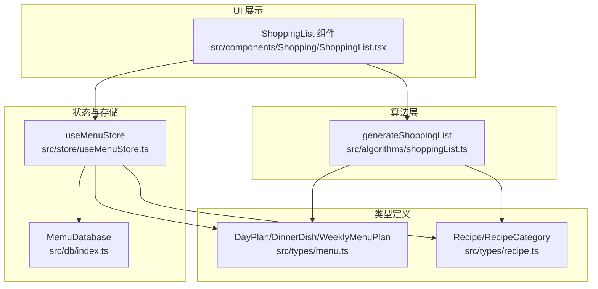
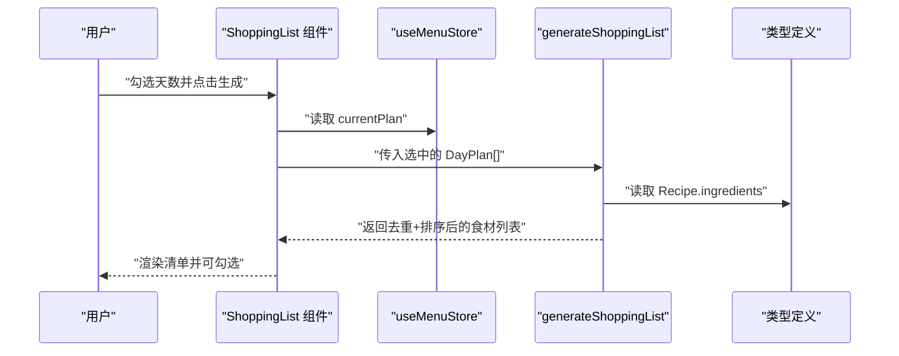
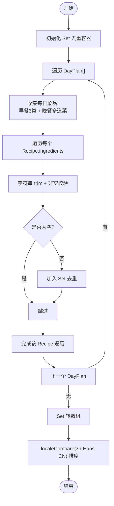
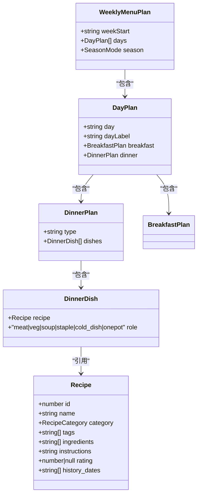
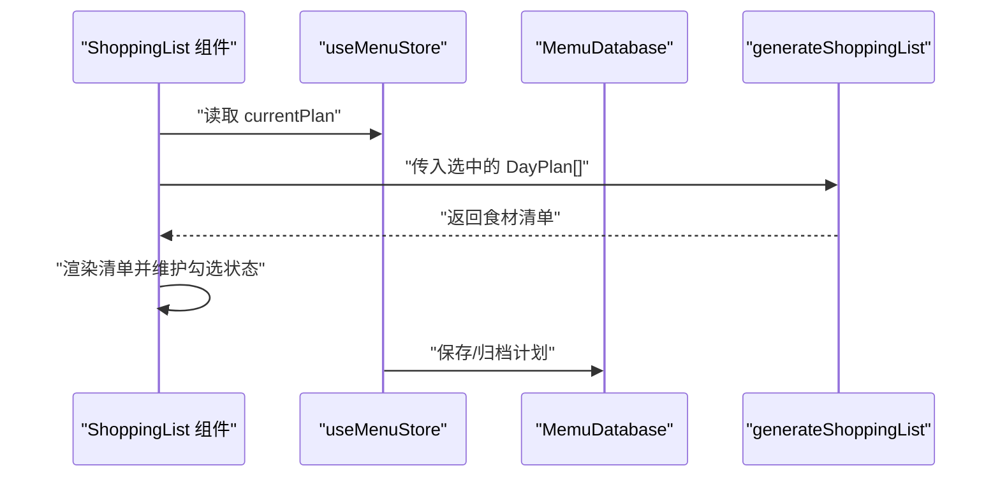
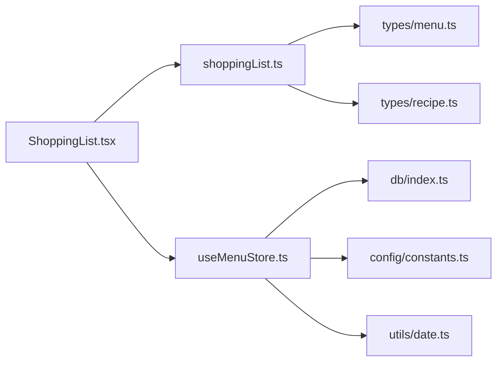

# 购物清单算法

<cite>
**本文引用的文件**
- [src/algorithms/shoppingList.ts](file://src/algorithms/shoppingList.ts)
- [src/components/Shopping/ShoppingList.tsx](file://src/components/Shopping/ShoppingList.tsx)
- [src/types/menu.ts](file://src/types/menu.ts)
- [src/types/recipe.ts](file://src/types/recipe.ts)
- [src/store/useMenuStore.ts](file://src/store/useMenuStore.ts)
- [src/db/index.ts](file://src/db/index.ts)
- [src/config/constants.ts](file://src/config/constants.ts)
- [src/utils/date.ts](file://src/utils/date.ts)
- [src/algorithms/index.ts](file://src/algorithms/index.ts)
</cite>

## 目录
1. [简介](#简介)
2. [项目结构](#项目结构)
3. [核心组件](#核心组件)
4. [架构总览](#架构总览)
5. [详细组件分析](#详细组件分析)
6. [依赖关系分析](#依赖关系分析)
7. [性能考量](#性能考量)
8. [故障排查指南](#故障排查指南)
9. [结论](#结论)
10. [附录](#附录)

## 简介
本文件围绕“购物清单算法”展开，重点解析 generateShoppingList 函数的工作机制，涵盖输入数据处理、食材聚合逻辑、去重与排序策略，并结合前端组件与状态管理展示完整的数据流与实时更新机制。文档同时给出时间复杂度分析、内存使用优化建议以及与菜单系统交互的实践路径。

## 项目结构
购物清单算法位于算法层，通过类型定义与状态管理连接到 UI 层，形成“算法-类型-状态-UI”的闭环。

图表来源
- [src/algorithms/shoppingList.ts:11-31](file://src/algorithms/shoppingList.ts#L11-L31)
- [src/types/menu.ts:19-34](file://src/types/menu.ts#L19-L34)
- [src/types/recipe.ts:11-20](file://src/types/recipe.ts#L11-L20)
- [src/store/useMenuStore.ts:127-291](file://src/store/useMenuStore.ts#L127-L291)
- [src/db/index.ts:7-22](file://src/db/index.ts#L7-L22)
- [src/components/Shopping/ShoppingList.tsx:11-129](file://src/components/Shopping/ShoppingList.tsx#L11-L129)

章节来源
- [src/algorithms/shoppingList.ts:11-31](file://src/algorithms/shoppingList.ts#L11-L31)
- [src/components/Shopping/ShoppingList.tsx:11-129](file://src/components/Shopping/ShoppingList.tsx#L11-L129)
- [src/types/menu.ts:19-34](file://src/types/menu.ts#L19-L34)
- [src/types/recipe.ts:11-20](file://src/types/recipe.ts#L11-L20)
- [src/store/useMenuStore.ts:127-291](file://src/store/useMenuStore.ts#L127-L291)
- [src/db/index.ts:7-22](file://src/db/index.ts#L7-L22)

## 核心组件
- generateShoppingList：核心算法函数，负责从选中的天数计划中提取食材，进行去重与排序，输出最终购物清单。
- ShoppingList 组件：用户界面入口，提供天数选择、生成清单、勾选完成项等交互。
- 类型系统：DayPlan、DinnerDish、Recipe 等类型定义了菜单与菜品的数据结构。
- 状态管理：useMenuStore 提供加载/保存/替换菜品等能力，支撑购物清单的实时数据来源。
- 存储层：Dexie 数据库封装了 IndexedDB 访问，提供配方与菜单计划的持久化。

章节来源
- [src/algorithms/shoppingList.ts:11-31](file://src/algorithms/shoppingList.ts#L11-L31)
- [src/components/Shopping/ShoppingList.tsx:11-129](file://src/components/Shopping/ShoppingList.tsx#L11-L129)
- [src/types/menu.ts:19-34](file://src/types/menu.ts#L19-L34)
- [src/types/recipe.ts:11-20](file://src/types/recipe.ts#L11-L20)
- [src/store/useMenuStore.ts:127-291](file://src/store/useMenuStore.ts#L127-L291)
- [src/db/index.ts:7-22](file://src/db/index.ts#L7-L22)

## 架构总览
购物清单生成的端到端流程如下：
- 用户在 UI 中选择若干天数
- 组件调用 generateShoppingList，传入选中的 DayPlan 数组
- 算法遍历每日的早餐与晚餐菜品，收集食材字符串
- 使用 Set 去重，再按中文本地化排序
- 返回字符串数组，组件渲染清单并支持勾选

图表来源
- [src/components/Shopping/ShoppingList.tsx:21-27](file://src/components/Shopping/ShoppingList.tsx#L21-L27)
- [src/algorithms/shoppingList.ts:11-31](file://src/algorithms/shoppingList.ts#L11-L31)
- [src/types/recipe.ts:11-20](file://src/types/recipe.ts#L11-L20)

## 详细组件分析

### generateShoppingList 算法详解
- 输入：DayPlan[]（选中的工作日计划）
- 输出：string[]（去重并按中文排序的食材清单）
- 关键步骤
  - 初始化 Set 用于去重
  - 遍历每个 DayPlan，收集以下菜品：
    - 早餐：dry、wet_adult、wet_kid
    - 晚餐：dishes[].recipe
  - 对每个 Recipe.ingredients 进行非空与 trim 处理，过滤空字符串后加入 Set
  - 将 Set 转为数组并按中文本地化 localeCompare 排序
- 去重机制
  - 使用 Set<string> 自动去除重复字符串
  - 去重粒度为字符串级别，空白前后差异会被统一处理
- 排序策略
  - 使用 localeCompare(a, b, 'zh-Hans-CN') 实现中文拼音顺序排序
- 错误处理
  - 忽略无效或非数组的 ingredients 字段，保证健壮性

图表来源
- [src/algorithms/shoppingList.ts:11-31](file://src/algorithms/shoppingList.ts#L11-L31)

章节来源
- [src/algorithms/shoppingList.ts:11-31](file://src/algorithms/shoppingList.ts#L11-L31)

### 数据模型与类型约束
- DayPlan：包含 day、dayLabel、breakfast、dinner 等字段
- DinnerDish：包含 recipe 和 role（荤菜/素菜/汤/主食/凉菜/一锅出）
- Recipe：包含 id、name、category、tags、ingredients、instructions、rating、history_dates
- WeeklyMenuPlan：包含 weekStart、days[]、season 等

图表来源
- [src/types/menu.ts:3-34](file://src/types/menu.ts#L3-L34)
- [src/types/recipe.ts:11-20](file://src/types/recipe.ts#L11-L20)

章节来源
- [src/types/menu.ts:3-34](file://src/types/menu.ts#L3-L34)
- [src/types/recipe.ts:11-20](file://src/types/recipe.ts#L11-L20)

### UI 与状态交互
- ShoppingList 组件
  - 维护 selectedDays、shoppingItems、checkedItems
  - 生成按钮触发 generateShoppingList，筛选选中的 DayPlan
  - 渲染勾选项并统计已购/总数
- useMenuStore
  - 提供 currentPlan（WeeklyMenuPlan），作为算法输入来源
  - 保存/归档计划时会持久化到 IndexedDB
- 数据持久化
  - MemuDatabase 定义 recipes、menuPlans、historyArchives 表
  - 通过 Dexie 进行 CRUD 操作

图表来源
- [src/components/Shopping/ShoppingList.tsx:15-27](file://src/components/Shopping/ShoppingList.tsx#L15-L27)
- [src/store/useMenuStore.ts:127-291](file://src/store/useMenuStore.ts#L127-L291)
- [src/db/index.ts:7-22](file://src/db/index.ts#L7-L22)
- [src/algorithms/shoppingList.ts:11-31](file://src/algorithms/shoppingList.ts#L11-L31)

章节来源
- [src/components/Shopping/ShoppingList.tsx:11-129](file://src/components/Shopping/ShoppingList.tsx#L11-L129)
- [src/store/useMenuStore.ts:127-291](file://src/store/useMenuStore.ts#L127-L291)
- [src/db/index.ts:7-22](file://src/db/index.ts#L7-L22)

## 依赖关系分析
- generateShoppingList 依赖类型定义（DayPlan、Recipe）以正确访问 ingredients
- UI 组件依赖算法函数与状态管理
- 状态管理依赖数据库以加载/保存菜单计划
- 标签与分类常量影响菜单生成与替换逻辑（间接影响购物清单）

图表来源
- [src/components/Shopping/ShoppingList.tsx:7-15](file://src/components/Shopping/ShoppingList.tsx#L7-L15)
- [src/algorithms/shoppingList.ts:1-2](file://src/algorithms/shoppingList.ts#L1-L2)
- [src/types/menu.ts:1-2](file://src/types/menu.ts#L1-L2)
- [src/types/recipe.ts:1-1](file://src/types/recipe.ts#L1-L1)
- [src/store/useMenuStore.ts:1-16](file://src/store/useMenuStore.ts#L1-L16)
- [src/db/index.ts:1-6](file://src/db/index.ts#L1-L6)
- [src/config/constants.ts:24-31](file://src/config/constants.ts#L24-L31)
- [src/utils/date.ts:1-11](file://src/utils/date.ts#L1-L11)

章节来源
- [src/algorithms/index.ts:1-6](file://src/algorithms/index.ts#L1-L6)
- [src/config/constants.ts:24-31](file://src/config/constants.ts#L24-L31)

## 性能考量
- 时间复杂度
  - 设 N 为选中天数，M 为每日平均菜品数，K 为平均每道菜的食材数
  - 算法遍历 O(N×M) 个 Recipe，对每个 Recipe 遍历 O(K) 个 ingredients
  - 去重使用 Set，插入摊销 O(1)，整体近似 O(N×M×K)
  - 排序使用 localeCompare，复杂度 O(U log U)，其中 U 为去重后的唯一食材数
  - 总体复杂度 O(N×M×K + U log U)
- 空间复杂度
  - 去重容器 Set 最坏情况存储所有唯一食材，空间 O(U)
  - 返回数组长度 O(U)
- 优化建议
  - 若食材名称标准化（如统一单位、去除多余修饰词），可减少重复项，提升去重效率
  - 对超大清单场景，可考虑分页渲染与虚拟滚动
  - 在 UI 层缓存上次生成结果，避免重复计算

## 故障排查指南
- 生成清单为空
  - 检查是否已生成菜单计划且 currentPlan 存在
  - 确认选中的天数至少有一个为 true
  - 核对 DayPlan 中 breakfast 与 dinner 的字段是否完整
- 食材重复或缺失
  - 确保 Recipe.ingredients 为数组且不包含空值
  - 检查字符串是否包含不可见空白字符，必要时在上游清洗
- 排序异常
  - 确保 localeCompare 使用 zh-Hans-CN 区域设置
  - 检查是否存在特殊字符导致排序不稳定
- 数据不同步
  - 确认 useMenuStore 的 savePlan/replaceDish/archivePlan 是否成功持久化
  - 检查 MemuDatabase 的表结构与索引是否正确

章节来源
- [src/components/Shopping/ShoppingList.tsx:21-27](file://src/components/Shopping/ShoppingList.tsx#L21-L27)
- [src/store/useMenuStore.ts:243-291](file://src/store/useMenuStore.ts#L243-L291)
- [src/db/index.ts:7-22](file://src/db/index.ts#L7-L22)

## 结论
generateShoppingList 采用简洁高效的集合去重与本地化排序策略，能够稳定地从菜单计划中提取所需食材并生成易读的购物清单。其与 UI、状态管理与存储层的协作清晰，具备良好的扩展性与可维护性。通过合理的输入清洗与 UI 缓存策略，可在大规模数据场景下保持良好性能。

## 附录
- 与菜单系统的数据交互要点
  - UI 通过 useMenuStore.currentPlan 获取周计划
  - 生成清单前先筛选选中的 DayPlan
  - 保存/归档计划时确保数据持久化
- 实时更新机制
  - 替换菜品或移除菜品后，重新生成清单即可反映最新变化
  - 归档完成后清空当前计划，需重新加载最新计划

章节来源
- [src/components/Shopping/ShoppingList.tsx:15-27](file://src/components/Shopping/ShoppingList.tsx#L15-L27)
- [src/store/useMenuStore.ts:167-241](file://src/store/useMenuStore.ts#L167-L241)
- [src/db/index.ts:119-125](file://src/db/index.ts#L119-L125)