# 历史状态管理

<cite>
**本文档引用的文件**
- [useHistoryStore.ts](file://src/store/useHistoryStore.ts)
- [history.ts](file://src/types/history.ts)
- [HistoryTimeline.tsx](file://src/components/History/HistoryTimeline.tsx)
- [WeekDetail.tsx](file://src/components/History/WeekDetail.tsx)
- [index.ts](file://src/db/index.ts)
- [seed.ts](file://src/db/seed.ts)
- [useMenuStore.ts](file://src/store/useMenuStore.ts)
- [date.ts](file://src/utils/date.ts)
- [useRecipeStore.ts](file://src/store/useRecipeStore.ts)
- [scoring.ts](file://src/algorithms/scoring.ts)
- [constants.ts](file://src/config/constants.ts)
- [RatingWidget.tsx](file://src/components/Recipe/RatingWidget.tsx)
</cite>

## 目录
1. [简介](#简介)
2. [项目结构](#项目结构)
3. [核心组件](#核心组件)
4. [架构概览](#架构概览)
5. [详细组件分析](#详细组件分析)
6. [依赖关系分析](#依赖关系分析)
7. [性能考虑](#性能考虑)
8. [故障排除指南](#故障排除指南)
9. [结论](#结论)
10. [附录](#附录)

## 简介

历史状态管理是 Memu 应用中的关键功能模块，负责管理用户的烹饪历史记录。该系统通过本地 IndexedDB 数据库存储历史数据，提供历史记录的时间轴展示、查询、删除和统计分析功能。系统采用 Zustand 状态管理库实现响应式状态控制，并通过精心设计的数据结构确保历史数据的完整性和可追溯性。

历史状态管理不仅记录了每周的菜单计划，还维护了详细的菜品使用历史，为评分系统和智能推荐算法提供了重要的数据支撑。通过历史数据分析，用户可以了解自己的饮食偏好和营养摄入情况，从而做出更健康的饮食选择。

## 项目结构

历史状态管理系统在项目中的组织结构如下：

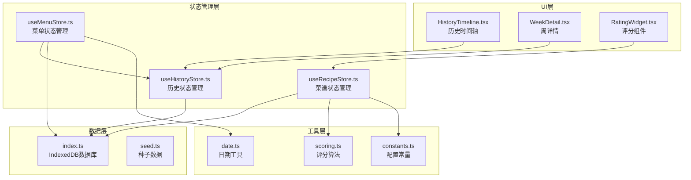

**图表来源**
- [useHistoryStore.ts:1-46](file://src/store/useHistoryStore.ts#L1-L46)
- [useMenuStore.ts:1-292](file://src/store/useMenuStore.ts#L1-L292)
- [index.ts:1-68](file://src/db/index.ts#L1-L68)

**章节来源**
- [useHistoryStore.ts:1-46](file://src/store/useHistoryStore.ts#L1-L46)
- [index.ts:1-68](file://src/db/index.ts#L1-L68)

## 核心组件

历史状态管理系统由以下核心组件构成：

### 1. 历史状态存储 (useHistoryStore)

历史状态存储是整个系统的核心，负责管理历史数据的生命周期。它使用 Zustand 创建状态容器，提供完整的 CRUD 操作能力。

### 2. 历史数据模型 (HistoryArchive)

历史数据模型定义了存储在数据库中的历史记录结构，包括时间戳、周标识符和完整的菜单计划数据。

### 3. 历史时间轴组件 (HistoryTimeline)

历史时间轴组件提供可视化的历史记录展示界面，支持时间轴导航、详情展开和删除操作。

### 4. 数据库层 (IndexedDB)

数据库层使用 Dexie 库封装 IndexedDB 操作，提供类型安全的数据库访问接口和自动迁移功能。

**章节来源**
- [useHistoryStore.ts:6-15](file://src/store/useHistoryStore.ts#L6-L15)
- [history.ts:3-10](file://src/types/history.ts#L3-L10)
- [HistoryTimeline.tsx:27-106](file://src/components/History/HistoryTimeline.tsx#L27-L106)
- [index.ts:7-22](file://src/db/index.ts#L7-L22)

## 架构概览

历史状态管理采用分层架构设计，确保各组件职责清晰、耦合度低：

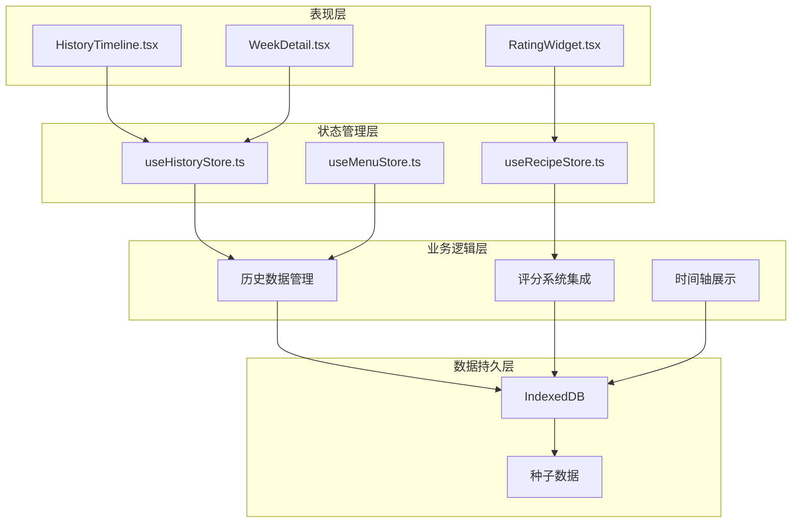

**图表来源**
- [useHistoryStore.ts:17-45](file://src/store/useHistoryStore.ts#L17-L45)
- [useMenuStore.ts:250-290](file://src/store/useMenuStore.ts#L250-L290)
- [useRecipeStore.ts:81-107](file://src/store/useRecipeStore.ts#L81-L107)

系统采用以下设计原则：

1. **单一职责原则**: 每个组件只负责特定的功能领域
2. **依赖注入**: 通过参数传递依赖关系，降低耦合度
3. **不可变数据**: 状态更新采用不可变模式，确保数据一致性
4. **异步操作**: 所有数据库操作都是异步的，避免阻塞主线程

## 详细组件分析

### 历史状态存储 (useHistoryStore)

历史状态存储实现了完整的状态管理功能，包括数据加载、选择、删除和查询操作。

#### 状态结构设计

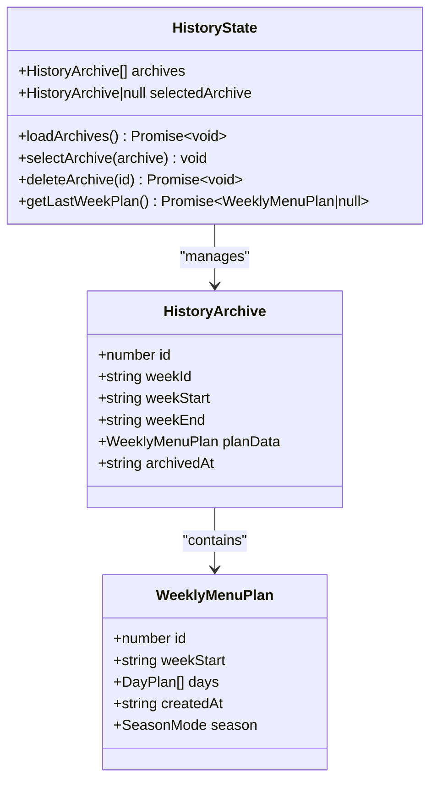

**图表来源**
- [useHistoryStore.ts:6-15](file://src/store/useHistoryStore.ts#L6-L15)
- [history.ts:3-10](file://src/types/history.ts#L3-L10)
- [menu.ts:28-34](file://src/types/menu.ts#L28-L34)

#### 关键操作流程

##### 历史记录加载流程

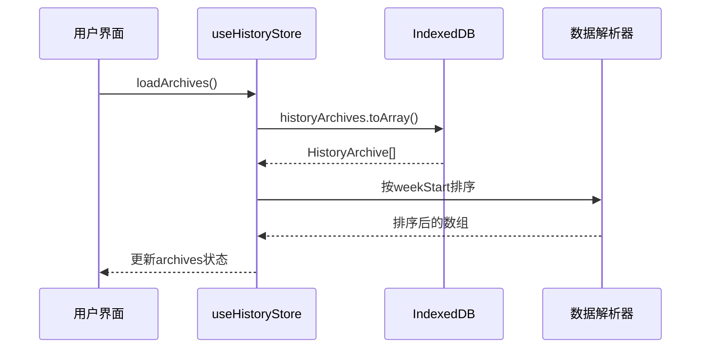

**图表来源**
- [useHistoryStore.ts:21-26](file://src/store/useHistoryStore.ts#L21-L26)

##### 历史记录删除流程

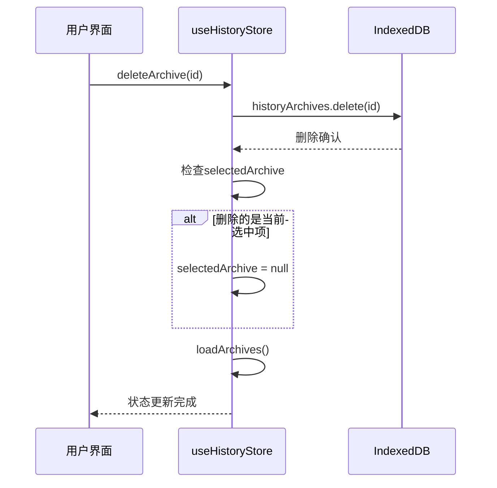

**图表来源**
- [useHistoryStore.ts:30-37](file://src/store/useHistoryStore.ts#L30-L37)

**章节来源**
- [useHistoryStore.ts:17-45](file://src/store/useHistoryStore.ts#L17-L45)

### 历史时间轴组件 (HistoryTimeline)

历史时间轴组件提供了直观的历史记录展示界面，采用时间轴设计让用户能够快速浏览历史记录。

#### 时间轴展示逻辑

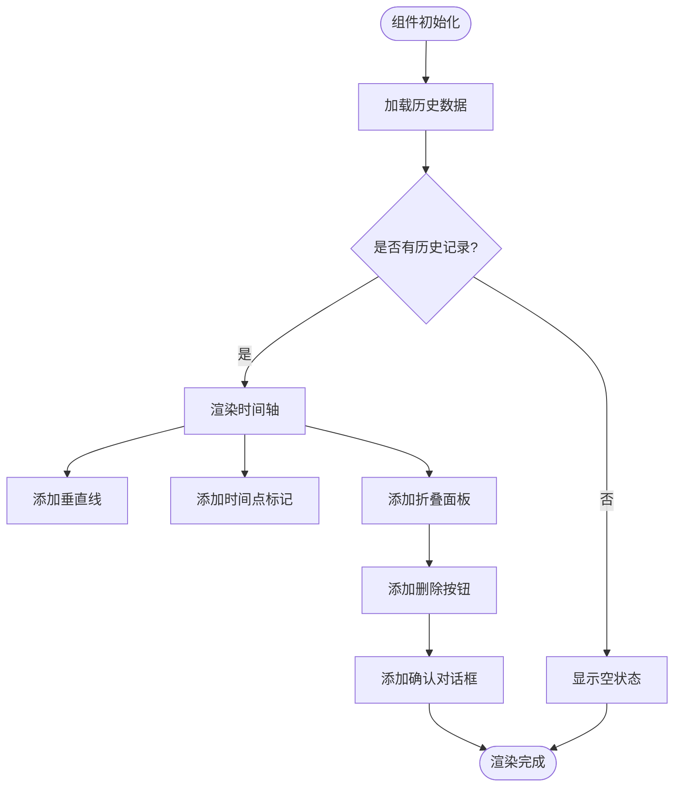

**图表来源**
- [HistoryTimeline.tsx:27-106](file://src/components/History/HistoryTimeline.tsx#L27-L106)

#### 周标识符格式化

组件实现了智能的周标识符格式化功能，支持多种显示格式：

- ISO周标识符格式：`YYYY-Www`
- 中文格式：`YYYY年第ww周`
- 日期范围格式：`MM/DD - MM/DD`

**章节来源**
- [HistoryTimeline.tsx:15-25](file://src/components/History/HistoryTimeline.tsx#L15-L25)
- [HistoryTimeline.tsx:27-106](file://src/components/History/HistoryTimeline.tsx#L27-L106)

### 数据库架构 (IndexedDB)

数据库层使用 Dexie 库提供类型安全的 IndexedDB 访问，支持自动版本管理和数据迁移。

#### 数据表设计

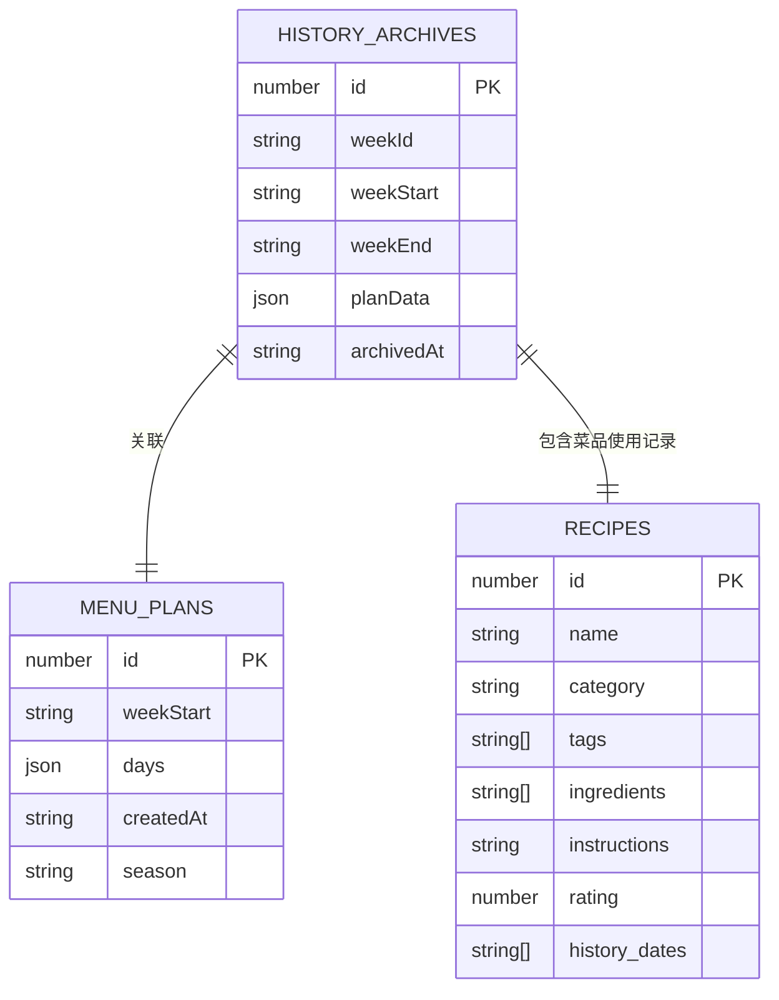

**图表来源**
- [index.ts:7-22](file://src/db/index.ts#L7-L22)

#### 数据库初始化流程

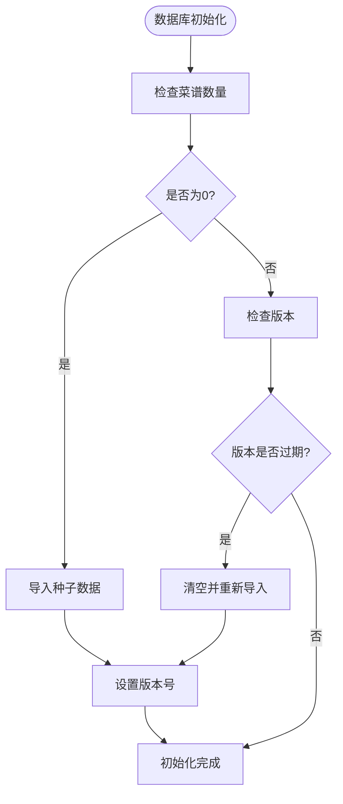

**图表来源**
- [index.ts:37-57](file://src/db/index.ts#L37-L57)

**章节来源**
- [index.ts:7-22](file://src/db/index.ts#L7-L22)
- [index.ts:37-57](file://src/db/index.ts#L37-L57)

### 评分系统集成

历史状态管理与评分系统深度集成，通过历史使用记录驱动菜品评分功能。

#### 评分数据流

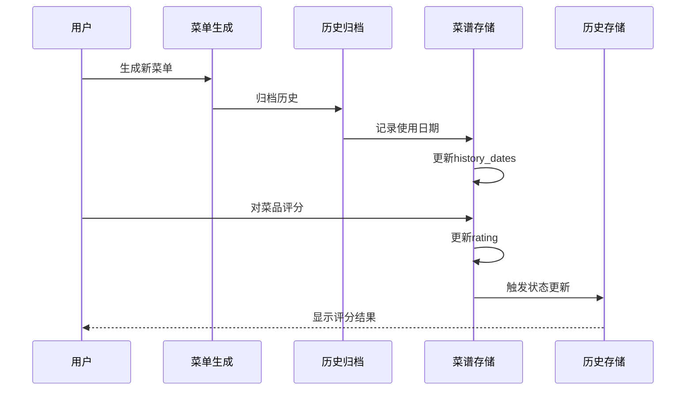

**图表来源**
- [useMenuStore.ts:271-282](file://src/store/useMenuStore.ts#L271-L282)
- [useRecipeStore.ts:81-90](file://src/store/useRecipeStore.ts#L81-L90)

#### 评分算法集成

评分系统使用历史数据进行智能权重计算：

- **新鲜度权重**: 基于菜品最近食用时间调整权重
- **季节性奖励**: 符合季节特点的菜品获得额外权重
- **个人偏好**: 基于用户评分历史调整抽取概率

**章节来源**
- [useMenuStore.ts:271-282](file://src/store/useMenuStore.ts#L271-L282)
- [useRecipeStore.ts:81-90](file://src/store/useRecipeStore.ts#L81-L90)
- [scoring.ts:14-42](file://src/algorithms/scoring.ts#L14-L42)

## 依赖关系分析

历史状态管理系统涉及多个层面的依赖关系，形成了复杂但有序的依赖网络。

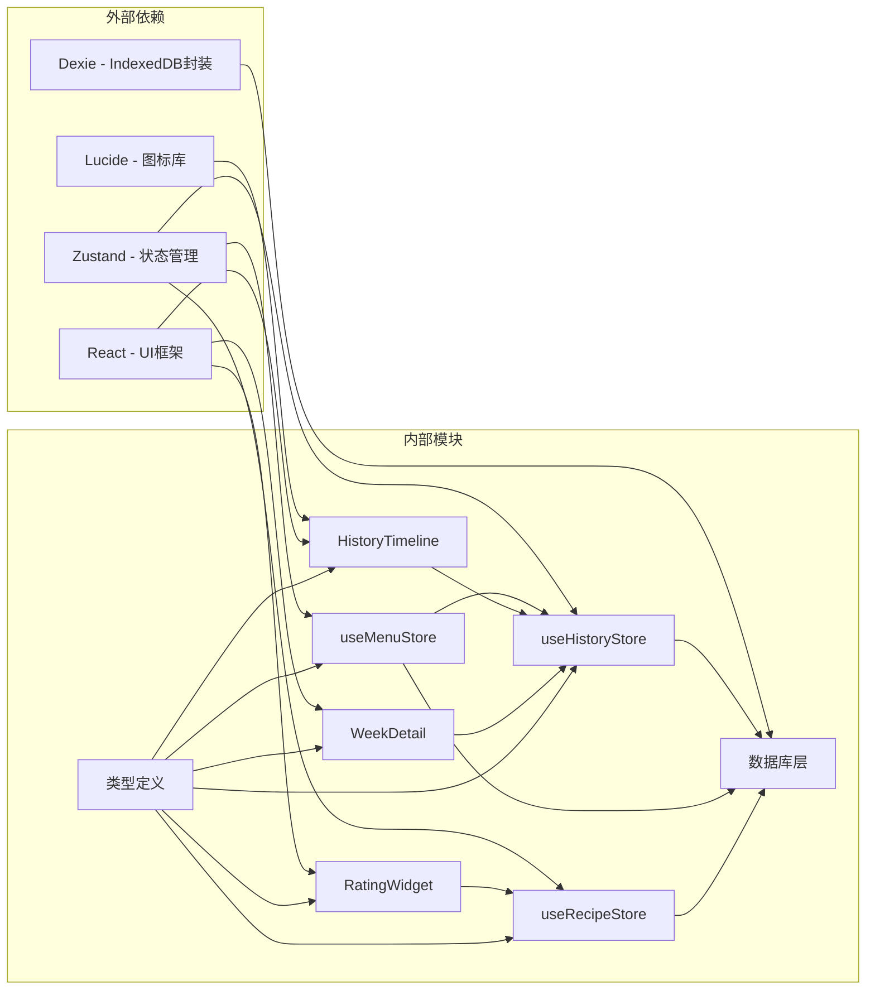

**图表来源**
- [useHistoryStore.ts:1-2](file://src/store/useHistoryStore.ts#L1-L2)
- [HistoryTimeline.tsx:1-12](file://src/components/History/HistoryTimeline.tsx#L1-L12)

### 组件间交互关系

系统中各组件之间的交互关系体现了清晰的分层架构：

1. **UI组件** (HistoryTimeline, WeekDetail, RatingWidget) - 负责用户交互
2. **状态管理** (useHistoryStore, useMenuStore, useRecipeStore) - 负责业务逻辑
3. **数据持久化** (数据库层) - 负责数据存储

### 数据流向

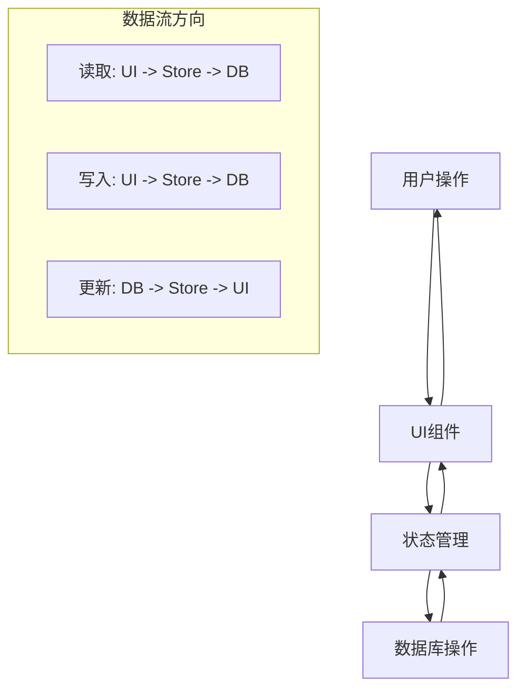

**图表来源**
- [useHistoryStore.ts:21-37](file://src/store/useHistoryStore.ts#L21-L37)

**章节来源**
- [useHistoryStore.ts:1-46](file://src/store/useHistoryStore.ts#L1-L46)
- [useMenuStore.ts:1-292](file://src/store/useMenuStore.ts#L1-L292)
- [useRecipeStore.ts:1-121](file://src/store/useRecipeStore.ts#L1-L121)

## 性能考虑

历史状态管理系统在设计时充分考虑了性能优化，采用了多种策略确保系统的高效运行。

### 数据库性能优化

1. **索引设计**: 为常用查询字段建立索引，提高查询效率
2. **批量操作**: 使用事务和批量操作减少数据库往返次数
3. **缓存策略**: 在内存中缓存常用数据，减少数据库访问

### 状态管理优化

1. **状态分割**: 将大型状态分解为独立的小状态，避免不必要的重渲染
2. **选择器模式**: 使用选择器函数精确控制组件订阅的状态变化
3. **异步操作**: 所有数据库操作都是异步的，避免阻塞UI线程

### 内存管理

1. **垃圾回收**: 及时清理不再使用的状态引用
2. **数据压缩**: 对大型数据结构进行必要的压缩和优化
3. **懒加载**: 按需加载历史数据，避免一次性加载所有记录

## 故障排除指南

### 常见问题及解决方案

#### 历史记录无法加载

**症状**: 历史时间轴显示空白或加载失败

**可能原因**:
1. IndexedDB 数据库初始化失败
2. 网络连接问题导致数据同步失败
3. 浏览器不支持 IndexedDB

**解决步骤**:
1. 检查浏览器控制台错误信息
2. 验证 IndexedDB 是否正常工作
3. 清除浏览器缓存后重试

#### 历史记录删除失败

**症状**: 删除历史记录时出现错误或记录仍然存在

**可能原因**:
1. 数据库权限不足
2. 索引损坏
3. 并发操作冲突

**解决步骤**:
1. 检查数据库连接状态
2. 重启应用后重试删除操作
3. 如果问题持续，考虑重置数据库

#### 评分功能异常

**症状**: 无法对菜品进行评分或评分不生效

**可能原因**:
1. 菜品尚未被使用过
2. 网络连接中断
3. 数据库事务失败

**解决步骤**:
1. 确保菜品至少被使用过一次
2. 检查网络连接状态
3. 重新登录应用后重试

### 调试技巧

1. **启用开发模式**: 在开发环境中启用详细的日志输出
2. **使用浏览器开发者工具**: 监控 IndexedDB 操作和状态变化
3. **单元测试**: 编写针对关键功能的单元测试

**章节来源**
- [useHistoryStore.ts:30-37](file://src/store/useHistoryStore.ts#L30-L37)
- [useRecipeStore.ts:81-90](file://src/store/useRecipeStore.ts#L81-L90)

## 结论

历史状态管理系统通过精心设计的架构和实现，成功地解决了烹饪历史记录的存储、查询、管理和分析需求。系统采用现代前端技术栈，结合 IndexedDB 提供的本地存储能力，为用户提供了稳定可靠的历史数据管理功能。

系统的主要优势包括：

1. **完整的功能覆盖**: 从数据存储到用户界面的全栈解决方案
2. **良好的扩展性**: 模块化设计便于功能扩展和维护
3. **优秀的用户体验**: 直观的时间轴展示和流畅的操作体验
4. **可靠的性能表现**: 优化的数据库访问和状态管理策略

未来可以考虑的功能增强包括：
- 历史数据的导出和备份功能
- 更丰富的统计分析报告
- 多设备同步支持
- 高级搜索和筛选功能

## 附录

### API 定义

#### 历史状态存储 API

| 方法 | 参数 | 返回值 | 描述 |
|------|------|--------|------|
| loadArchives | 无 | Promise<void> | 加载所有历史记录 |
| selectArchive | archive: HistoryArchive \| null | void | 选择特定历史记录 |
| deleteArchive | id: number | Promise<void> | 删除指定历史记录 |
| getLastWeekPlan | 无 | Promise<WeeklyMenuPlan \| null> | 获取最新一周计划 |

#### 数据库操作 API

| 方法 | 参数 | 返回值 | 描述 |
|------|------|--------|------|
| historyArchives.toArray | 无 | Promise<HistoryArchive[]> | 获取所有历史记录 |
| historyArchives.delete | id: number | Promise<void> | 删除历史记录 |
| historyArchives.add | archive: HistoryArchive | Promise<number> | 添加新历史记录 |

### 配置选项

#### 常量配置

| 常量名 | 值 | 描述 |
|--------|-----|------|
| CROSS_WEEK_WEIGHT_FACTOR | 0.1 | 跨周降权系数 |
| MAX_PORRIDGE_DAYS_PER_WEEK | 1 | 粥类每周最大出现次数 |
| SIMPLE_MEAL_COUNT_PER_WEEK | 1 | 简餐每周出现次数 |

#### 类型定义

```typescript
interface HistoryArchive {
  id?: number;
  weekId: string;          // ISO周标识符
  weekStart: string;       // 周一日期
  weekEnd: string;         // 周五日期
  planData: WeeklyMenuPlan;
  archivedAt: string;      // 归档时间
}

interface WeeklyMenuPlan {
  id?: number;
  weekStart: string;
  days: DayPlan[];
  createdAt: string;
  season: SeasonMode;
}
```