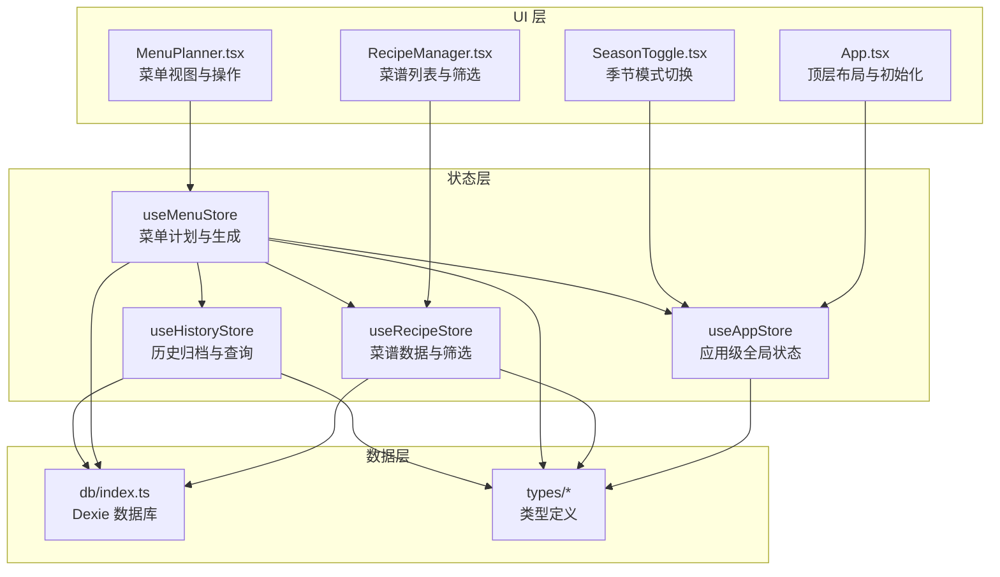
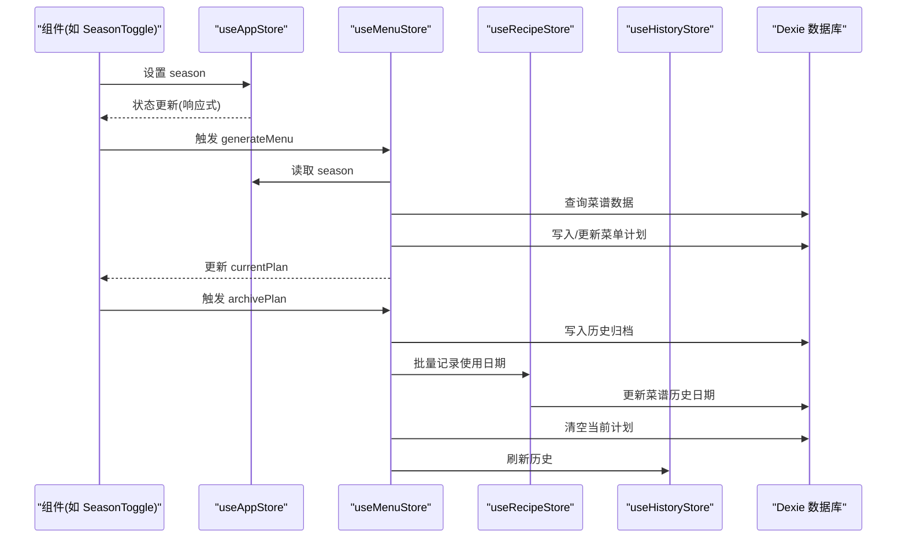
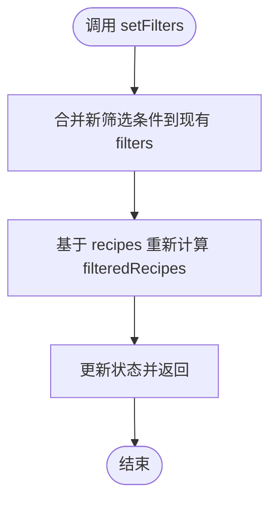
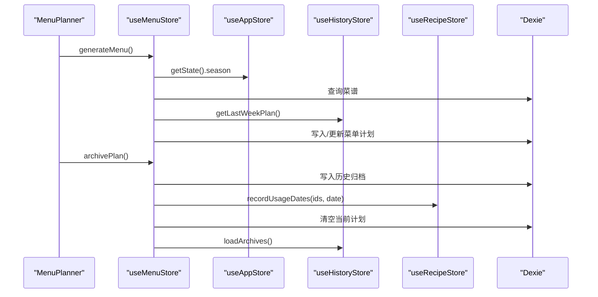
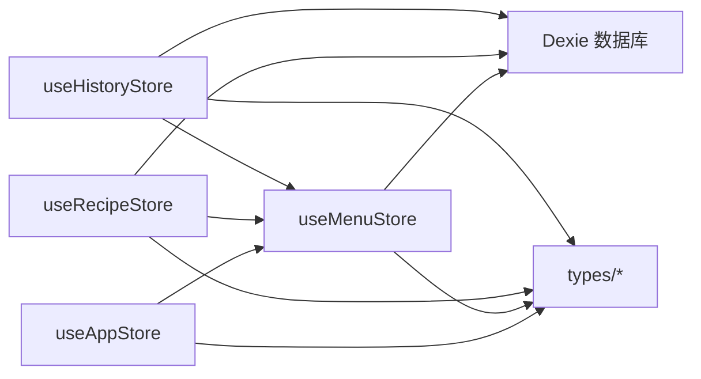

# 应用状态管理

<cite>
**本文引用的文件**
- [src/store/useAppStore.ts](file://src/store/useAppStore.ts)
- [src/store/index.ts](file://src/store/index.ts)
- [src/App.tsx](file://src/App.tsx)
- [src/components/Menu/SeasonToggle.tsx](file://src/components/Menu/SeasonToggle.tsx)
- [src/components/Menu/MenuPlanner.tsx](file://src/components/Menu/MenuPlanner.tsx)
- [src/components/Recipe/RecipeManager.tsx](file://src/components/Recipe/RecipeManager.tsx)
- [src/store/useRecipeStore.ts](file://src/store/useRecipeStore.ts)
- [src/store/useMenuStore.ts](file://src/store/useMenuStore.ts)
- [src/store/useHistoryStore.ts](file://src/store/useHistoryStore.ts)
- [src/db/index.ts](file://src/db/index.ts)
- [src/types/menu.ts](file://src/types/menu.ts)
- [src/types/recipe.ts](file://src/types/recipe.ts)
- [src/types/history.ts](file://src/types/history.ts)
- [src/config/constants.ts](file://src/config/constants.ts)
</cite>

## 目录
1. [简介](#简介)
2. [项目结构](#项目结构)
3. [核心组件](#核心组件)
4. [架构总览](#架构总览)
5. [详细组件分析](#详细组件分析)
6. [依赖关系分析](#依赖关系分析)
7. [性能考量](#性能考量)
8. [故障排查指南](#故障排查指南)
9. [结论](#结论)
10. [附录：使用示例与最佳实践](#附录使用示例与最佳实践)

## 简介
本文件系统性阐述 Memu 应用的状态管理方案，重点围绕应用级状态容器 useAppStore 的设计与实现，覆盖全局状态结构、状态更新机制、持久化策略、跨组件同步以及监听与变更通知方式。同时结合 useRecipeStore、useMenuStore、useHistoryStore 等子状态模块，说明它们如何与 useAppStore 协作，形成统一的应用状态生态。

## 项目结构
应用采用“按功能域划分”的状态模块组织方式，核心状态集中在 src/store 下，通过单一入口导出，便于在组件中按需引入。应用主入口 App.tsx 负责初始化流程与顶层 UI 布局，各功能页面（如菜单规划、菜谱管理、历史记录）通过各自的 Store Hook 访问状态与动作。



图表来源
- [src/store/useAppStore.ts:1-26](file://src/store/useAppStore.ts#L1-L26)
- [src/store/useRecipeStore.ts:1-121](file://src/store/useRecipeStore.ts#L1-L121)
- [src/store/useMenuStore.ts:1-292](file://src/store/useMenuStore.ts#L1-L292)
- [src/store/useHistoryStore.ts:1-46](file://src/store/useHistoryStore.ts#L1-L46)
- [src/App.tsx:1-83](file://src/App.tsx#L1-L83)
- [src/components/Menu/SeasonToggle.tsx:1-27](file://src/components/Menu/SeasonToggle.tsx#L1-L27)
- [src/components/Menu/MenuPlanner.tsx:1-75](file://src/components/Menu/MenuPlanner.tsx#L1-L75)
- [src/components/Recipe/RecipeManager.tsx:1-110](file://src/components/Recipe/RecipeManager.tsx#L1-L110)
- [src/db/index.ts:1-34](file://src/db/index.ts#L1-L34)
- [src/types/menu.ts:1-45](file://src/types/menu.ts#L1-L45)
- [src/types/recipe.ts:1-21](file://src/types/recipe.ts#L1-L21)
- [src/types/history.ts:1-11](file://src/types/history.ts#L1-L11)

章节来源
- [src/store/index.ts:1-6](file://src/store/index.ts#L1-L6)
- [src/App.tsx:1-83](file://src/App.tsx#L1-L83)

## 核心组件
本节聚焦 useAppStore 的设计与职责边界，它是应用级全局状态的唯一事实来源，负责：
- 当前激活的标签页 activeTab：控制主界面四个功能区的显示与切换
- 季节模式 season：影响菜单生成算法的权重与约束
- 初始化标志 isInitialized：控制应用启动阶段的加载态渲染

useAppStore 使用 Zustand 的 create API 构建，状态与动作在同一作用域内声明，简洁直观；通过 getState 访问器可实现跨模块读取应用状态（例如 useMenuStore 在生成菜单时读取 season）。

章节来源
- [src/store/useAppStore.ts:1-26](file://src/store/useAppStore.ts#L1-L26)
- [src/store/index.ts:1-6](file://src/store/index.ts#L1-L6)
- [src/types/menu.ts:26](file://src/types/menu.ts#L26)

## 架构总览
应用状态管理遵循“单向数据流”原则：组件通过 Hook 订阅状态，触发动作修改状态，Zustand 自动通知订阅者进行重渲染。useAppStore 作为根状态，承载 UI 交互与全局偏好；useRecipeStore 管理菜谱数据与筛选；useMenuStore 负责菜单计划的生成、替换、保存与归档；useHistoryStore 提供历史归档的增删查与最近计划读取。



图表来源
- [src/components/Menu/SeasonToggle.tsx:1-27](file://src/components/Menu/SeasonToggle.tsx#L1-L27)
- [src/store/useAppStore.ts:1-26](file://src/store/useAppStore.ts#L1-L26)
- [src/store/useMenuStore.ts:127-292](file://src/store/useMenuStore.ts#L127-L292)
- [src/store/useRecipeStore.ts:49-121](file://src/store/useRecipeStore.ts#L49-L121)
- [src/store/useHistoryStore.ts:17-46](file://src/store/useHistoryStore.ts#L17-L46)
- [src/db/index.ts:1-34](file://src/db/index.ts#L1-L34)

## 详细组件分析

### useAppStore：应用级全局状态
- 状态字段
  - activeTab：TabKey 类型，控制主界面四大区域的可见性
  - season：SeasonMode 类型，影响算法权重
  - isInitialized：布尔值，控制启动页渲染
- 动作
  - setActiveTab(tab)：切换当前激活标签页
  - setSeason(season)：切换季节模式
  - setInitialized(v)：标记初始化完成
- 设计要点
  - 使用 create 构造函数，集中声明状态与动作
  - 通过 getState 访问器在其他 Store 中读取应用状态（如 useMenuStore 读取 season）
  - 与 UI 组件直接绑定，实现跨组件状态同步

```mermaid
classDiagram
class AppState {
+TabKey activeTab
+SeasonMode season
+boolean isInitialized
+setActiveTab(tab)
+setSeason(season)
+setInitialized(v)
}
class TabKey {
<<enum>>
"menu"
"shopping"
"recipes"
"history"
}
class SeasonMode {
<<enum>>
"default"
"summer"
"winter"
}
AppState --> TabKey : "使用"
AppState --> SeasonMode : "使用"
```

图表来源
- [src/store/useAppStore.ts:4-15](file://src/store/useAppStore.ts#L4-L15)
- [src/types/menu.ts:26](file://src/types/menu.ts#L26)

章节来源
- [src/store/useAppStore.ts:1-26](file://src/store/useAppStore.ts#L1-L26)
- [src/types/menu.ts:26](file://src/types/menu.ts#L26)

### useRecipeStore：菜谱数据与筛选
- 状态字段
  - recipes：完整菜谱列表
  - filteredRecipes：基于 filters 的筛选结果
  - filters：包含分类、关键词、标签集合的筛选条件
- 动作
  - loadRecipes：从数据库加载菜谱并刷新筛选结果
  - add/update/delete/rate：对菜谱执行 CRUD 与评分
  - recordUsageDates：批量记录菜谱使用日期
  - setFilters/applyFilters：更新筛选条件并重新计算筛选结果
- 关键逻辑
  - filterRecipes：根据分类、标签与关键词进行多维过滤
  - 事务性更新：recordUsageDates 使用事务确保一致性
  - 与数据库交互：通过 db.recipes 表进行持久化



图表来源
- [src/store/useRecipeStore.ts:109-119](file://src/store/useRecipeStore.ts#L109-L119)

章节来源
- [src/store/useRecipeStore.ts:1-121](file://src/store/useRecipeStore.ts#L1-L121)
- [src/db/index.ts:1-34](file://src/db/index.ts#L1-L34)
- [src/types/recipe.ts:11-21](file://src/types/recipe.ts#L11-L21)

### useMenuStore：菜单计划生成与管理
- 状态字段
  - currentPlan：当前周菜单计划或 null
  - isGenerating：生成过程中的加载态
- 动作
  - generateMenu：读取 season、最近计划与菜谱，生成新计划并持久化
  - loadCurrentPlan：从数据库加载最新计划
  - replaceDish/removeDish/savePlan/archivePlan：对计划进行替换、删除、保存与归档
- 关键逻辑
  - 读取 useAppStore 的 season 以驱动算法
  - 读取 useHistoryStore 的最近计划以实现跨周降权
  - 使用 collectAllRecipeIds/collectUsedIds/pickReplacement 等工具函数实现菜品替换与去重
  - archivePlan 将计划写入历史表，并调用 useRecipeStore.recordUsageDates 记录使用日期



图表来源
- [src/store/useMenuStore.ts:131-152](file://src/store/useMenuStore.ts#L131-L152)
- [src/store/useMenuStore.ts:250-290](file://src/store/useMenuStore.ts#L250-L290)
- [src/store/useAppStore.ts:134](file://src/store/useAppStore.ts#L134)
- [src/store/useHistoryStore.ts:39-44](file://src/store/useHistoryStore.ts#L39-L44)
- [src/store/useRecipeStore.ts:92-107](file://src/store/useRecipeStore.ts#L92-L107)

章节来源
- [src/store/useMenuStore.ts:1-292](file://src/store/useMenuStore.ts#L1-L292)
- [src/store/useHistoryStore.ts:1-46](file://src/store/useHistoryStore.ts#L1-L46)
- [src/store/useRecipeStore.ts:1-121](file://src/store/useRecipeStore.ts#L1-L121)

### useHistoryStore：历史归档与查询
- 状态字段
  - archives：历史归档列表（按周起始倒序）
  - selectedArchive：当前选中的归档
- 动作
  - loadArchives：从数据库加载并排序
  - selectArchive：设置选中归档
  - deleteArchive：删除指定归档并刷新列表
  - getLastWeekPlan：返回最新归档的计划数据

章节来源
- [src/store/useHistoryStore.ts:1-46](file://src/store/useHistoryStore.ts#L1-L46)

### UI 组件与状态联动
- App.tsx
  - 初始化数据库与加载菜谱后设置 isInitialized，从而渲染主界面
  - 通过 Tabs 绑定 useAppStore 的 activeTab 与 setActiveTab 实现标签页切换
- SeasonToggle.tsx
  - 通过 useAppStore 的 season 与 setSeason 切换季节模式
- MenuPlanner.tsx
  - 读取 useMenuStore 的 currentPlan/isGenerating 并调用 generateMenu/loadCurrentPlan/archivePlan/replaceDish/removeDish
- RecipeManager.tsx
  - 读取 useRecipeStore 的 filteredRecipes/filters 并通过 setFilters 更新筛选条件

章节来源
- [src/App.tsx:11-83](file://src/App.tsx#L11-L83)
- [src/components/Menu/SeasonToggle.tsx:1-27](file://src/components/Menu/SeasonToggle.tsx#L1-L27)
- [src/components/Menu/MenuPlanner.tsx:1-75](file://src/components/Menu/MenuPlanner.tsx#L1-L75)
- [src/components/Recipe/RecipeManager.tsx:1-110](file://src/components/Recipe/RecipeManager.tsx#L1-L110)

## 依赖关系分析
- 模块耦合
  - useMenuStore 依赖 useAppStore（读取 season）、useRecipeStore（记录使用日期）、useHistoryStore（读取最近计划）
  - useRecipeStore 与 useMenuStore 通过数据库共享数据一致性
  - useHistoryStore 与 useMenuStore 通过归档表进行数据交换
- 外部依赖
  - Dexie：浏览器端 IndexedDB 封装，提供 CRUD 能力
  - Zustand：轻量状态管理库，提供 create API 与响应式订阅
- 类型契约
  - types/* 定义了菜单、菜谱、历史归档的数据模型，确保跨模块数据结构一致



图表来源
- [src/store/useAppStore.ts:1-26](file://src/store/useAppStore.ts#L1-L26)
- [src/store/useMenuStore.ts:1-292](file://src/store/useMenuStore.ts#L1-L292)
- [src/store/useRecipeStore.ts:1-121](file://src/store/useRecipeStore.ts#L1-L121)
- [src/store/useHistoryStore.ts:1-46](file://src/store/useHistoryStore.ts#L1-L46)
- [src/db/index.ts:1-34](file://src/db/index.ts#L1-L34)
- [src/types/menu.ts:1-45](file://src/types/menu.ts#L1-L45)
- [src/types/recipe.ts:1-21](file://src/types/recipe.ts#L1-L21)
- [src/types/history.ts:1-11](file://src/types/history.ts#L1-L11)

## 性能考量
- 状态粒度
  - 将应用级偏好（activeTab、season、isInitialized）与业务数据（recipes、currentPlan）分离，降低无关重渲染
- 计算优化
  - 菜谱筛选在 setFilters 时即时计算，避免在渲染路径中重复计算
- I/O 优化
  - recordUsageDates 使用事务批量更新，减少多次 I/O
  - generateMenu 后一次性持久化新计划，避免频繁写入
- 依赖读取
  - 使用 getState 访问器按需读取应用状态，避免不必要的订阅

## 故障排查指南
- 初始化失败
  - 症状：始终显示加载页
  - 排查：确认 App.tsx 中 initDatabase 与 loadRecipes 是否成功执行，检查 db 初始化逻辑
- 菜谱评分异常
  - 症状：提示“尚未被使用过，无法评分”
  - 排查：确认菜谱的 history_dates 是否为空，仅当存在使用日期才允许评分
- 菜单替换无效
  - 症状：替换后计划未更新
  - 排查：确认 replaceDish 的 dayIndex/mealType/dishIndex 参数正确，检查 pickReplacement 是否返回有效菜品
- 季节模式不生效
  - 症状：generateMenu 未按季节调整
  - 排查：确认 SeasonToggle 已设置 season，useMenuStore 正确读取 useAppStore.getState().season

章节来源
- [src/App.tsx:15-22](file://src/App.tsx#L15-L22)
- [src/store/useRecipeStore.ts:81-90](file://src/store/useRecipeStore.ts#L81-L90)
- [src/store/useMenuStore.ts:167-224](file://src/store/useMenuStore.ts#L167-L224)
- [src/components/Menu/SeasonToggle.tsx:11-27](file://src/components/Menu/SeasonToggle.tsx#L11-L27)

## 结论
本应用采用 Zustand 构建清晰、解耦的状态层，useAppStore 作为应用级根状态，承载 UI 与偏好；配合 useRecipeStore、useMenuStore、useHistoryStore 实现从数据到计划再到历史的完整闭环。通过 Dexie 提供的本地持久化能力，实现了离线可用与快速响应。整体架构具备良好的扩展性与可维护性。

## 附录：使用示例与最佳实践
- 使用示例
  - 切换标签页：在 UI 中绑定 Tabs 的 value 与 onValueChange，分别使用 useAppStore 的 activeTab 与 setActiveTab
  - 切换季节模式：在 SeasonToggle 中使用 useAppStore 的 season 与 setSeason
  - 生成菜单：在 MenuPlanner 中调用 useMenuStore 的 generateMenu
  - 筛选菜谱：在 RecipeManager 中通过 setFilters 更新筛选条件
- 状态访问模式
  - 读取：直接从对应 Store Hook 获取状态
  - 修改：调用对应 Store 的动作方法
  - 跨模块读取：使用 getState 访问其他 Store 的状态（如 useMenuStore 读取 season）
- 最佳实践
  - 将全局偏好与业务数据分层管理，避免状态混杂
  - 在动作内部统一处理副作用与持久化，保持状态更新的幂等性
  - 对批量更新使用事务，确保数据一致性
  - 通过类型定义严格约束数据结构，减少运行期错误

章节来源
- [src/App.tsx:48-62](file://src/App.tsx#L48-L62)
- [src/components/Menu/SeasonToggle.tsx:11-27](file://src/components/Menu/SeasonToggle.tsx#L11-L27)
- [src/components/Menu/MenuPlanner.tsx:8-21](file://src/components/Menu/MenuPlanner.tsx#L8-L21)
- [src/components/Recipe/RecipeManager.tsx:27-80](file://src/components/Recipe/RecipeManager.tsx#L27-L80)
- [src/store/useMenuStore.ts:131-152](file://src/store/useMenuStore.ts#L131-L152)
- [src/store/useRecipeStore.ts:109-119](file://src/store/useRecipeStore.ts#L109-L119)