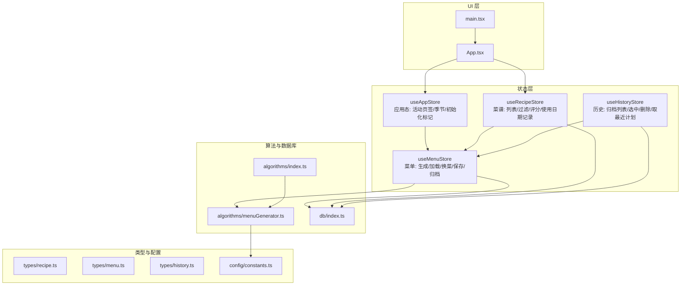
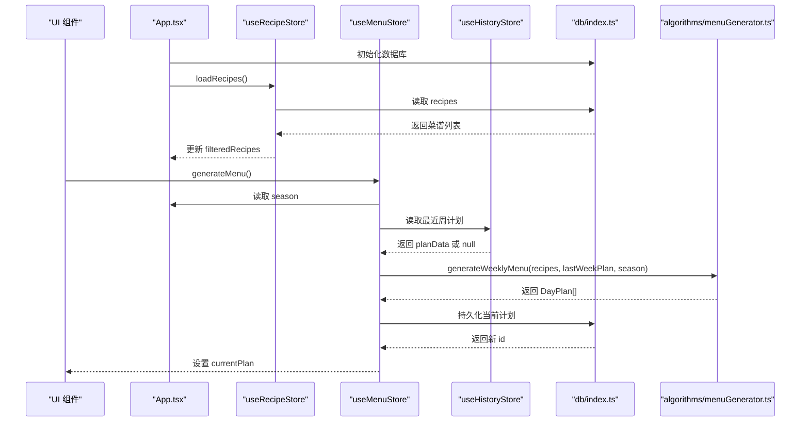
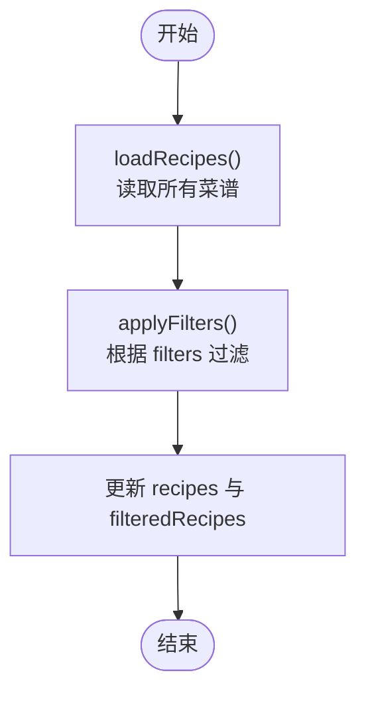
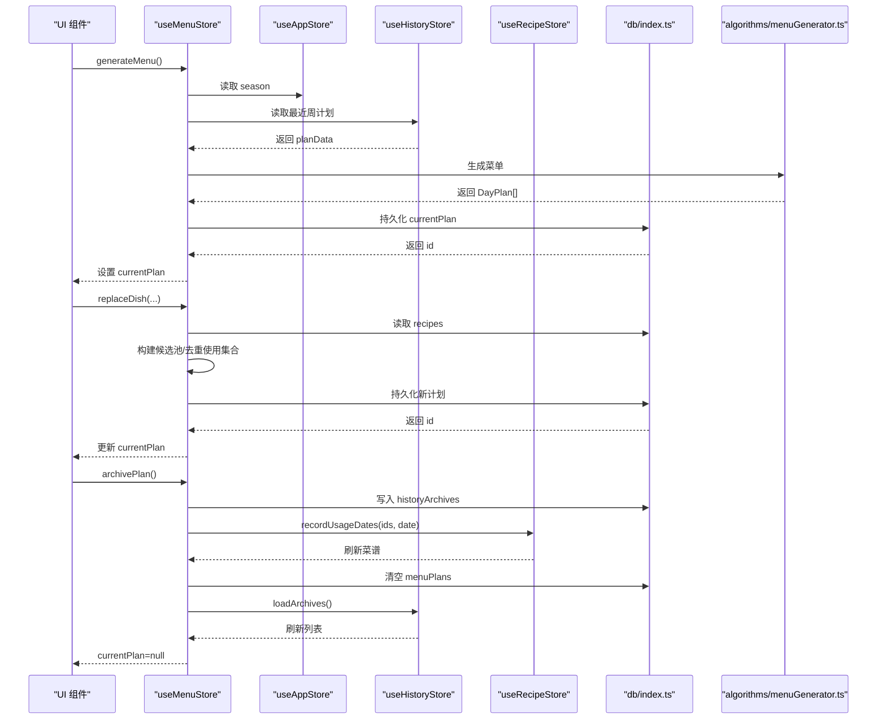
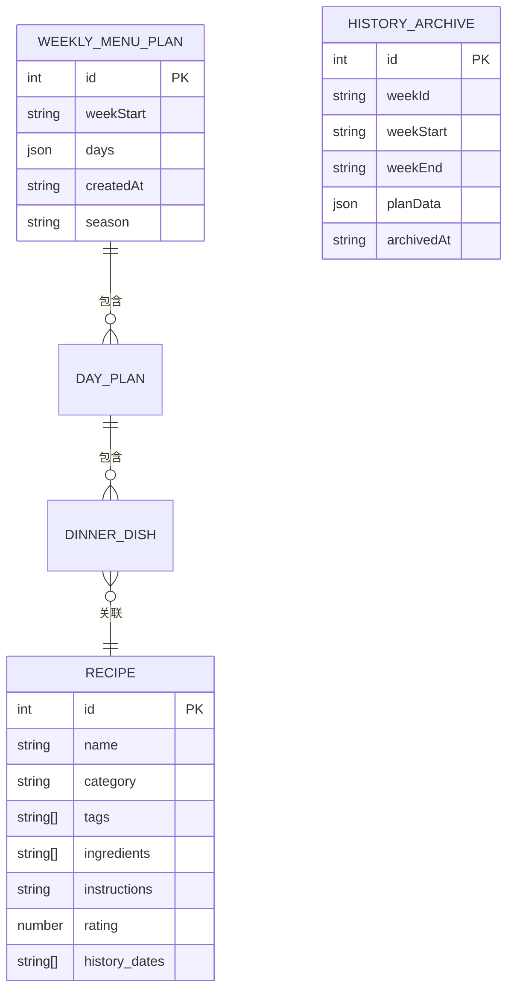
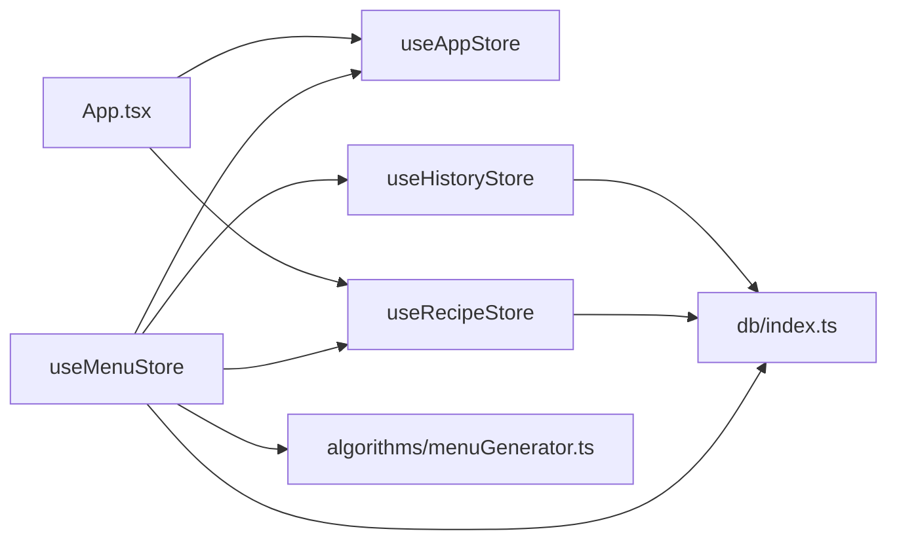

# 状态管理

<cite>
**本文引用的文件**
- [src/store/index.ts](file://src/store/index.ts)
- [src/store/useAppStore.ts](file://src/store/useAppStore.ts)
- [src/store/useRecipeStore.ts](file://src/store/useRecipeStore.ts)
- [src/store/useMenuStore.ts](file://src/store/useMenuStore.ts)
- [src/store/useHistoryStore.ts](file://src/store/useHistoryStore.ts)
- [src/types/index.ts](file://src/types/index.ts)
- [src/types/recipe.ts](file://src/types/recipe.ts)
- [src/types/menu.ts](file://src/types/menu.ts)
- [src/types/history.ts](file://src/types/history.ts)
- [src/config/constants.ts](file://src/config/constants.ts)
- [src/algorithms/index.ts](file://src/algorithms/index.ts)
- [src/algorithms/menuGenerator.ts](file://src/algorithms/menuGenerator.ts)
- [src/db/index.ts](file://src/db/index.ts)
- [src/App.tsx](file://src/App.tsx)
- [src/main.tsx](file://src/main.tsx)
</cite>

## 目录
1. [简介](#简介)
2. [项目结构](#项目结构)
3. [核心组件](#核心组件)
4. [架构总览](#架构总览)
5. [详细组件分析](#详细组件分析)
6. [依赖关系分析](#依赖关系分析)
7. [性能考量](#性能考量)
8. [故障排查指南](#故障排查指南)
9. [结论](#结论)
10. [附录](#附录)

## 简介
本文件系统性梳理 Memu 基于 Zustand 的状态管理架构，覆盖 store 的组织结构、数据流与异步处理、状态持久化策略、跨组件同步机制以及与算法模块和数据库层的集成方式。文档同时提供使用示例、最佳实践与调试技巧，帮助开发者快速理解并高效扩展状态管理能力。

## 项目结构
- 状态管理位于 src/store，采用“按功能域划分”的模块化组织：应用态 useAppStore、菜谱 useRecipeStore、菜单 useMenuStore、历史 useHistoryStore。
- 类型定义集中在 src/types，涵盖菜谱、菜单、历史等核心数据模型。
- 算法模块位于 src/algorithms，提供菜单生成、加权选择、校验与购物清单生成等能力。
- 数据库层使用 Dexie，位于 src/db，负责本地 IndexedDB 的表结构与初始化。
- 应用入口与根组件 src/App.tsx 负责初始化数据库与基础数据，并通过 Tabs 控制主界面切换。

图表来源
- [src/store/index.ts:1-6](file://src/store/index.ts#L1-L6)
- [src/store/useAppStore.ts:1-26](file://src/store/useAppStore.ts#L1-L26)
- [src/store/useRecipeStore.ts:1-121](file://src/store/useRecipeStore.ts#L1-L121)
- [src/store/useMenuStore.ts:1-292](file://src/store/useMenuStore.ts#L1-L292)
- [src/store/useHistoryStore.ts:1-46](file://src/store/useHistoryStore.ts#L1-L46)
- [src/types/recipe.ts:1-21](file://src/types/recipe.ts#L1-L21)
- [src/types/menu.ts:1-45](file://src/types/menu.ts#L1-L45)
- [src/types/history.ts:1-11](file://src/types/history.ts#L1-L11)
- [src/config/constants.ts:1-44](file://src/config/constants.ts#L1-L44)
- [src/algorithms/menuGenerator.ts:1-368](file://src/algorithms/menuGenerator.ts#L1-L368)
- [src/algorithms/index.ts:1-6](file://src/algorithms/index.ts#L1-L6)
- [src/db/index.ts:1-34](file://src/db/index.ts#L1-L34)
- [src/App.tsx:1-83](file://src/App.tsx#L1-L83)
- [src/main.tsx:1-11](file://src/main.tsx#L1-L11)

章节来源
- [src/store/index.ts:1-6](file://src/store/index.ts#L1-L6)
- [src/App.tsx:1-83](file://src/App.tsx#L1-L83)
- [src/main.tsx:1-11](file://src/main.tsx#L1-L11)

## 核心组件
- useAppStore：管理全局应用态，包括活动页签、季节模式、初始化完成标记；提供切换页签、设置季节、标记初始化完成等动作。
- useRecipeStore：管理菜谱数据与过滤器，支持加载、新增、更新、删除、评分、记录使用日期、设置与应用过滤条件等。
- useMenuStore：管理当前周菜单计划，支持生成菜单、加载当前计划、换菜、移除菜品、保存、归档至历史；内部调用算法模块与数据库层。
- useHistoryStore：管理历史归档列表，支持加载归档、选中归档、删除归档、获取最近周计划等。

章节来源
- [src/store/useAppStore.ts:1-26](file://src/store/useAppStore.ts#L1-L26)
- [src/store/useRecipeStore.ts:1-121](file://src/store/useRecipeStore.ts#L1-L121)
- [src/store/useMenuStore.ts:1-292](file://src/store/useMenuStore.ts#L1-L292)
- [src/store/useHistoryStore.ts:1-46](file://src/store/useHistoryStore.ts#L1-L46)

## 架构总览
Zustand store 通过 create 函数声明状态与动作，动作可同步或异步；store 之间通过 getState 或直接 import 其他 store 的静态状态进行协作。数据库层使用 Dexie 对 IndexedDB 进行封装，提供 recipes、menuPlans、historyArchives 三张表；应用启动时初始化数据库并注入种子数据。

图表来源
- [src/App.tsx:11-22](file://src/App.tsx#L11-L22)
- [src/store/useRecipeStore.ts:58-64](file://src/store/useRecipeStore.ts#L58-L64)
- [src/store/useMenuStore.ts:131-152](file://src/store/useMenuStore.ts#L131-L152)
- [src/store/useHistoryStore.ts:39-44](file://src/store/useHistoryStore.ts#L39-L44)
- [src/db/index.ts:27-33](file://src/db/index.ts#L27-L33)
- [src/algorithms/menuGenerator.ts:128-132](file://src/algorithms/menuGenerator.ts#L128-L132)

## 详细组件分析

### useAppStore（应用态）
- 职责范围
  - 维护活动页签、季节模式、初始化完成标记。
  - 提供切换页签、设置季节、标记初始化的动作。
- 状态结构
  - activeTab: TabKey
  - season: SeasonMode
  - isInitialized: boolean
- 动作定义
  - setActiveTab(tab: TabKey)
  - setSeason(season: SeasonMode)
  - setInitialized(v: boolean)
- 使用示例
  - 在根组件中初始化数据库与基础数据后，设置 isInitialized 为 true，驱动 UI 渲染。
- 最佳实践
  - 将与 UI 导航、主题/季节相关的轻量状态集中于此，避免分散在多个 store。
  - 通过 setInitialized 防止 UI 在数据未就绪时渲染。

章节来源
- [src/store/useAppStore.ts:1-26](file://src/store/useAppStore.ts#L1-L26)
- [src/App.tsx:11-22](file://src/App.tsx#L11-L22)

### useRecipeStore（菜谱）
- 职责范围
  - 管理菜谱列表与过滤器，支持关键词、分类、标签过滤。
  - 提供增删改查、评分、记录使用日期等动作。
- 状态结构
  - recipes: Recipe[]
  - filteredRecipes: Recipe[]
  - filters: { category, searchText, tags }
- 动作定义
  - loadRecipes(): Promise<void>
  - addRecipe(recipe): Promise<void>
  - updateRecipe(id, updates): Promise<void>
  - deleteRecipe(id): Promise<void>
  - rateRecipe(id, rating): Promise<void>
  - recordUsageDates(recipeIds, date): Promise<void>
  - setFilters(partial): void
  - applyFilters(): void
- 过滤逻辑
  - 关键词在 name、ingredients、tags 的拼接字符串中匹配。
  - 分类与标签需满足精确匹配（标签为全量包含）。
- 异步处理
  - 所有 CRUD 操作均通过 db 实例异步执行，完成后重新加载并刷新 filteredRecipes。
- 性能优化
  - 过滤计算在内存中进行，建议控制单次过滤范围与关键词长度。
  - recordUsageDates 使用事务批量更新，减少多次写入开销。

图表来源
- [src/store/useRecipeStore.ts:58-64](file://src/store/useRecipeStore.ts#L58-L64)
- [src/store/useRecipeStore.ts:117-119](file://src/store/useRecipeStore.ts#L117-L119)

章节来源
- [src/store/useRecipeStore.ts:1-121](file://src/store/useRecipeStore.ts#L1-L121)
- [src/types/recipe.ts:1-21](file://src/types/recipe.ts#L1-L21)

### useMenuStore（菜单）
- 职责范围
  - 生成、加载、保存当前周菜单计划；支持换菜、移除菜品；归档至历史并同步菜谱使用日期。
- 状态结构
  - currentPlan: WeeklyMenuPlan | null
  - isGenerating: boolean
- 动作定义
  - generateMenu(): Promise<void>
  - loadCurrentPlan(): Promise<void>
  - replaceDish(dayIndex, mealType, dishIndex, role?): Promise<void>
  - removeDish(dayIndex, mealType, dishIndex): void
  - savePlan(): Promise<void>
  - archivePlan(): Promise<void>
- 与算法模块集成
  - generateMenu 调用 generateWeeklyMenu，传入 recipes、lastWeekPlan、season。
  - 依据配置常量与加权随机选择策略生成每日菜单。
- 与数据库交互
  - 通过 db.menuPlans 存储/读取当前计划；通过 db.historyArchives 归档。
- 与历史/菜谱协作
  - 归档时调用 useHistoryStore.loadArchives 刷新历史列表；调用 useRecipeStore.recordUsageDates 记录使用日期。
- 异步流程
  - generateMenu：读取 season 与 lastWeekPlan -> 生成计划 -> 持久化 -> 更新 currentPlan。
  - replaceDish：按早餐槽位或晚餐角色构建候选池 -> 基于使用情况与评分权重挑选 -> 持久化新计划。
  - archivePlan：写入历史归档 -> 同步菜谱使用日期 -> 清空当前计划 -> 刷新历史。

图表来源
- [src/store/useMenuStore.ts:131-152](file://src/store/useMenuStore.ts#L131-L152)
- [src/store/useMenuStore.ts:167-224](file://src/store/useMenuStore.ts#L167-L224)
- [src/store/useMenuStore.ts:250-290](file://src/store/useMenuStore.ts#L250-L290)
- [src/store/useHistoryStore.ts:39-44](file://src/store/useHistoryStore.ts#L39-L44)
- [src/store/useRecipeStore.ts:92-107](file://src/store/useRecipeStore.ts#L92-L107)
- [src/algorithms/menuGenerator.ts:128-132](file://src/algorithms/menuGenerator.ts#L128-L132)

章节来源
- [src/store/useMenuStore.ts:1-292](file://src/store/useMenuStore.ts#L1-L292)
- [src/types/menu.ts:1-45](file://src/types/menu.ts#L1-L45)
- [src/config/constants.ts:1-44](file://src/config/constants.ts#L1-L44)
- [src/algorithms/menuGenerator.ts:1-368](file://src/algorithms/menuGenerator.ts#L1-L368)

### useHistoryStore（历史）
- 职责范围
  - 维护历史归档列表，支持加载、选中、删除、获取最近周计划。
- 状态结构
  - archives: HistoryArchive[]
  - selectedArchive: HistoryArchive | null
- 动作定义
  - loadArchives(): Promise<void>
  - selectArchive(archive: HistoryArchive | null): void
  - deleteArchive(id: number): Promise<void>
  - getLastWeekPlan(): Promise<WeeklyMenuPlan | null>
- 异步处理
  - 所有操作基于 db.historyArchives 表进行，删除后自动刷新列表并清空选中项（若被删除）。

章节来源
- [src/store/useHistoryStore.ts:1-46](file://src/store/useHistoryStore.ts#L1-L46)
- [src/types/history.ts:1-11](file://src/types/history.ts#L1-L11)

### 数据模型与类型
- 菜谱 Recipe
  - 字段：id、name、category、tags、ingredients、instructions、rating、history_dates
- 菜单 WeeklyMenuPlan
  - 字段：id、weekStart、days、createdAt、season
- 日计划 DayPlan
  - 字段：day、dayLabel、breakfast、dinner
- 晚餐菜品 DinnerDish
  - 字段：recipe、role
- 历史归档 HistoryArchive
  - 字段：id、weekId、weekStart、weekEnd、planData、archivedAt

图表来源
- [src/types/recipe.ts:11-20](file://src/types/recipe.ts#L11-L20)
- [src/types/menu.ts:19-34](file://src/types/menu.ts#L19-L34)
- [src/types/history.ts:3-10](file://src/types/history.ts#L3-L10)

章节来源
- [src/types/index.ts:1-4](file://src/types/index.ts#L1-L4)
- [src/types/recipe.ts:1-21](file://src/types/recipe.ts#L1-L21)
- [src/types/menu.ts:1-45](file://src/types/menu.ts#L1-L45)
- [src/types/history.ts:1-11](file://src/types/history.ts#L1-L11)

## 依赖关系分析
- 组件耦合
  - App.tsx 依赖 useAppStore 与 useRecipeStore，负责初始化与页签切换。
  - useMenuStore 依赖 useAppStore（读取 season）、useHistoryStore（读取最近计划）、useRecipeStore（记录使用日期）。
  - useHistoryStore 与 useRecipeStore 独立，通过 db 间接耦合。
- 外部依赖
  - Zustand：提供 create API 与状态/动作定义。
  - Dexie：提供 IndexedDB 封装与事务支持。
  - 算法模块：提供菜单生成与加权随机选择。

图表来源
- [src/App.tsx:11-22](file://src/App.tsx#L11-L22)
- [src/store/useMenuStore.ts:5-7](file://src/store/useMenuStore.ts#L5-L7)
- [src/store/useHistoryStore.ts:1-2](file://src/store/useHistoryStore.ts#L1-L2)
- [src/store/useRecipeStore.ts:1-2](file://src/store/useRecipeStore.ts#L1-L2)
- [src/db/index.ts:1-34](file://src/db/index.ts#L1-L34)
- [src/algorithms/menuGenerator.ts:1-18](file://src/algorithms/menuGenerator.ts#L1-L18)

章节来源
- [src/store/index.ts:1-6](file://src/store/index.ts#L1-L6)
- [src/App.tsx:1-83](file://src/App.tsx#L1-L83)

## 性能考量
- 状态粒度
  - 将轻量 UI 状态放入 useAppStore，避免在业务 store 中混杂 UI 细节。
- 过滤与搜索
  - 优先缩小搜索范围（如先按分类/标签），再做关键词匹配，降低过滤成本。
- 批量写入
  - recordUsageDates 使用事务批量更新，减少多次写入带来的抖动。
- 生成与换菜
  - generateMenu 与 replaceDish 会重建计划并持久化，建议在 UI 上提供加载态与防抖。
- 数据库索引
  - Dexie 已为 recipes、menuPlans、historyArchives 建立索引，注意查询字段与索引命中一致性。

## 故障排查指南
- 初始化失败
  - 确认 initDatabase 是否成功执行，检查浏览器 IndexedDB 权限与存储配额。
  - 在 App.tsx 中监听 setInitialized，确保 UI 在数据就绪后再渲染。
- 生成菜单异常
  - 检查 generateWeeklyMenu 输入参数（recipes、lastWeekPlan、season）是否有效。
  - 若返回空或占位，确认算法配置常量与评分权重是否合理。
- 换菜无效
  - 确认当前计划存在且索引合法；检查候选池构建与使用集合收集逻辑。
- 归档后未更新
  - 确认 archivePlan 后调用了 useHistoryStore.loadArchives；检查历史列表是否刷新。
- 评分报错
  - rateRecipe 仅允许对有使用日期的菜谱评分，检查 history_dates 是否为空。

章节来源
- [src/App.tsx:15-22](file://src/App.tsx#L15-L22)
- [src/store/useMenuStore.ts:131-152](file://src/store/useMenuStore.ts#L131-L152)
- [src/store/useRecipeStore.ts:81-90](file://src/store/useRecipeStore.ts#L81-L90)
- [src/store/useHistoryStore.ts:28-37](file://src/store/useHistoryStore.ts#L28-L37)

## 结论
Memu 的状态管理以 Zustand 为核心，围绕“应用态、菜谱、菜单、历史”四个 store 构建清晰的功能边界。通过与算法模块和数据库层的紧密协作，实现了从菜单生成、换菜、保存到归档的完整闭环。建议在后续迭代中进一步细化错误边界与加载态提示，完善测试用例覆盖关键路径，持续优化过滤与生成性能。

## 附录
- 使用示例（路径参考）
  - 初始化数据库与加载菜谱：[src/App.tsx:15-22](file://src/App.tsx#L15-L22)
  - 切换页签与设置季节：[src/store/useAppStore.ts:17-25](file://src/store/useAppStore.ts#L17-L25)
  - 生成菜单：[src/store/useMenuStore.ts:131-152](file://src/store/useMenuStore.ts#L131-L152)
  - 换菜：[src/store/useMenuStore.ts:167-224](file://src/store/useMenuStore.ts#L167-L224)
  - 删除历史归档：[src/store/useHistoryStore.ts:30-37](file://src/store/useHistoryStore.ts#L30-L37)
  - 记录菜谱使用日期：[src/store/useRecipeStore.ts:92-107](file://src/store/useRecipeStore.ts#L92-L107)
- 最佳实践
  - 将 UI 与业务状态分离，避免在业务 store 中存放 UI 细节。
  - 对耗时操作添加加载态与防抖，提升用户体验。
  - 在动作内部统一错误处理与回滚策略，必要时提供用户提示。
- 调试技巧
  - 使用浏览器 Redux DevTools（Zustand 支持）观察状态变化与动作序列。
  - 在关键动作前后打印状态快照，定位数据流转问题。
  - 对算法输入输出进行断言与日志记录，便于复现与回归。