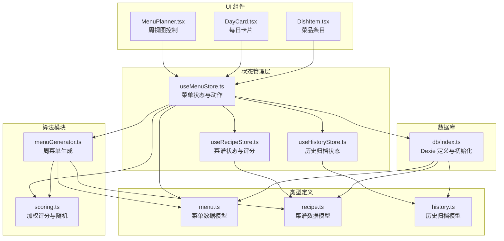
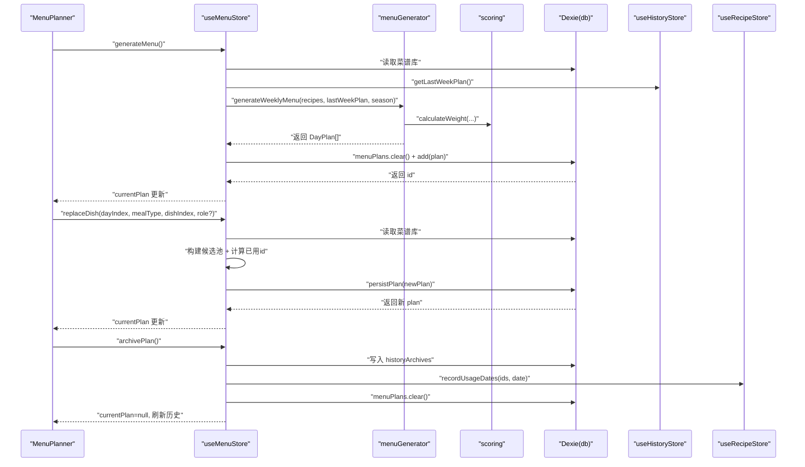
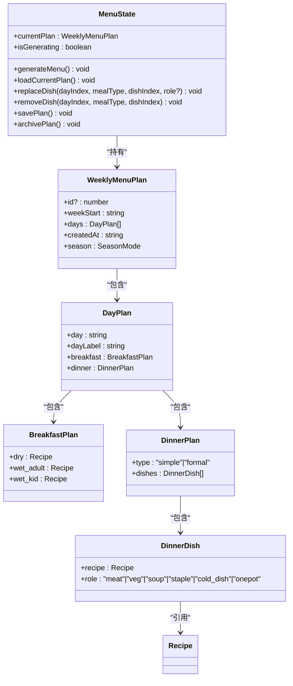
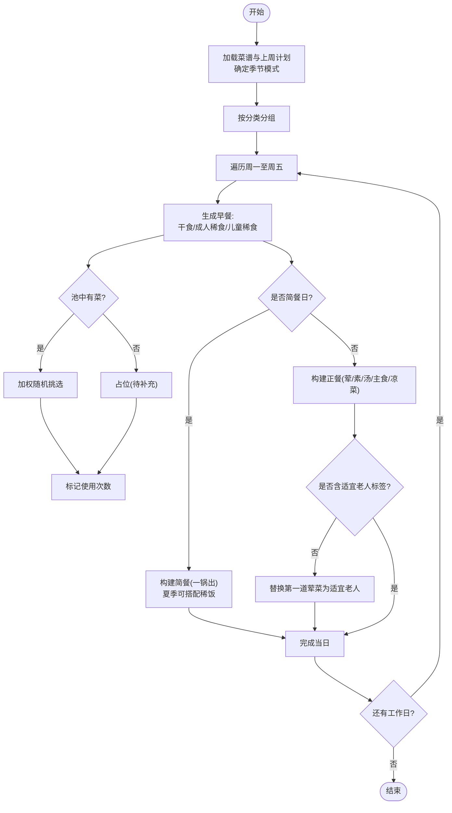
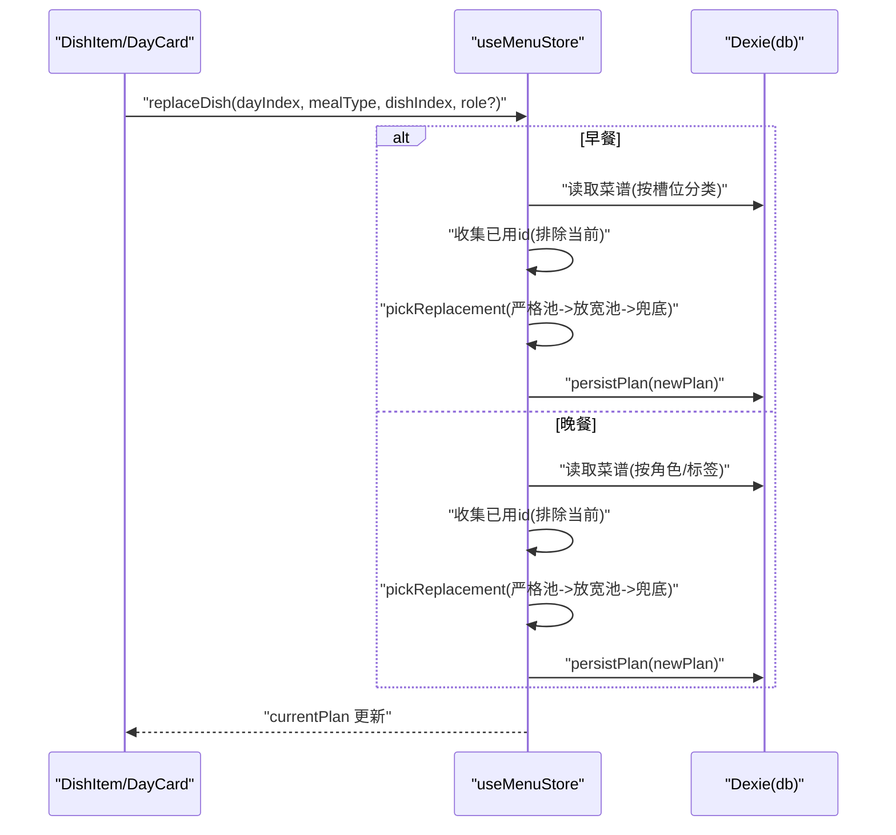
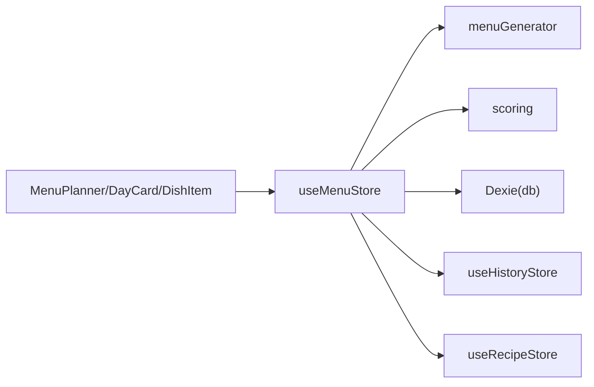

# 菜单状态管理

<cite>
**本文引用的文件**
- [src/store/useMenuStore.ts](file://src/store/useMenuStore.ts)
- [src/algorithms/menuGenerator.ts](file://src/algorithms/menuGenerator.ts)
- [src/algorithms/scoring.ts](file://src/algorithms/scoring.ts)
- [src/db/index.ts](file://src/db/index.ts)
- [src/types/menu.ts](file://src/types/menu.ts)
- [src/types/recipe.ts](file://src/types/recipe.ts)
- [src/types/history.ts](file://src/types/history.ts)
- [src/store/useRecipeStore.ts](file://src/store/useRecipeStore.ts)
- [src/store/useHistoryStore.ts](file://src/store/useHistoryStore.ts)
- [src/utils/date.ts](file://src/utils/date.ts)
- [src/components/Menu/MenuPlanner.tsx](file://src/components/Menu/MenuPlanner.tsx)
- [src/components/Menu/DayCard.tsx](file://src/components/Menu/DayCard.tsx)
- [src/components/Menu/DishItem.tsx](file://src/components/Menu/DishItem.tsx)
- [src/config/constants.ts](file://src/config/constants.ts)
</cite>

## 目录
1. [简介](#简介)
2. [项目结构](#项目结构)
3. [核心组件](#核心组件)
4. [架构总览](#架构总览)
5. [详细组件分析](#详细组件分析)
6. [依赖关系分析](#依赖关系分析)
7. [性能考量](#性能考量)
8. [故障排查指南](#故障排查指南)
9. [结论](#结论)
10. [附录](#附录)

## 简介
本文件围绕“菜单状态管理”主题，系统性阐述 useMenuStore 的设计与实现，覆盖以下方面：
- 菜单数据的状态结构：周计划、每日计划、早餐与晚餐菜品角色划分
- 菜单规划的状态管理：生成、加载、换菜、移除、保存、归档
- 一周菜单生成算法：加权随机抽选、跨周降权、季节性偏好、健康兜底
- 季节性调整与状态维护：夏/冬模式切换、标签驱动的菜品筛选
- 持久化策略：IndexedDB（Dexie）表结构与版本迁移
- 状态更新触发机制：Zustand 状态变更与 UI 响应
- 实操示例与最佳实践：如何生成、换菜、归档与查看历史

## 项目结构
本项目采用“类型定义 → 算法模块 → 状态管理 → 数据库 → UI 组件”的分层组织方式。菜单状态管理的核心位于 store 层，算法模块负责生成与评分，数据库层负责本地持久化。

图表来源
- [src/store/useMenuStore.ts:127-292](file://src/store/useMenuStore.ts#L127-L292)
- [src/algorithms/menuGenerator.ts:134-232](file://src/algorithms/menuGenerator.ts#L134-L232)
- [src/algorithms/scoring.ts:14-63](file://src/algorithms/scoring.ts#L14-L63)
- [src/db/index.ts:7-22](file://src/db/index.ts#L7-L22)
- [src/types/menu.ts:1-45](file://src/types/menu.ts#L1-L45)
- [src/types/recipe.ts:1-21](file://src/types/recipe.ts#L1-L21)
- [src/types/history.ts:1-11](file://src/types/history.ts#L1-L11)
- [src/store/useRecipeStore.ts:49-121](file://src/store/useRecipeStore.ts#L49-L121)
- [src/store/useHistoryStore.ts:17-46](file://src/store/useHistoryStore.ts#L17-L46)
- [src/components/Menu/MenuPlanner.tsx:8-75](file://src/components/Menu/MenuPlanner.tsx#L8-L75)
- [src/components/Menu/DayCard.tsx:13-78](file://src/components/Menu/DayCard.tsx#L13-L78)
- [src/components/Menu/DishItem.tsx:50-124](file://src/components/Menu/DishItem.tsx#L50-L124)

章节来源
- [src/store/useMenuStore.ts:127-292](file://src/store/useMenuStore.ts#L127-L292)
- [src/db/index.ts:7-22](file://src/db/index.ts#L7-L22)

## 核心组件
- useMenuStore：集中管理当前周菜单计划的生成、加载、换菜、移除、保存与归档；与算法模块、数据库、历史与菜谱状态进行交互。
- 菜单数据模型：WeeklyMenuPlan、DayPlan、BreakfastPlan、DinnerPlan、DinnerDish。
- 算法模块：generateWeeklyMenu（生成周菜单）、calculateWeight（评分与权重）、weightedRandomSelect（加权随机）。
- 数据库：Dexie 定义 recipes、menuPlans、historyArchives 三张表，并提供初始化与种子数据版本迁移。
- UI 组件：MenuPlanner、DayCard、DishItem 提供菜单展示与交互入口。

章节来源
- [src/store/useMenuStore.ts:21-37](file://src/store/useMenuStore.ts#L21-L37)
- [src/types/menu.ts:19-34](file://src/types/menu.ts#L19-L34)
- [src/algorithms/menuGenerator.ts:134-232](file://src/algorithms/menuGenerator.ts#L134-L232)
- [src/algorithms/scoring.ts:14-63](file://src/algorithms/scoring.ts#L14-L63)
- [src/db/index.ts:7-22](file://src/db/index.ts#L7-L22)
- [src/components/Menu/MenuPlanner.tsx:8-75](file://src/components/Menu/MenuPlanner.tsx#L8-L75)

## 架构总览
useMenuStore 作为中心枢纽，协调以下流程：
- 生成：读取应用季节、菜谱库、上周计划，调用算法生成周计划，持久化并写入状态。
- 加载：从 menuPlans 表加载最新计划。
- 换菜：根据早餐槽位或晚餐角色构建候选池，基于使用计数与权重随机挑选替代菜品，持久化并更新状态。
- 移除：仅支持晚餐菜品移除。
- 保存：将当前计划持久化（用于手动保存）。
- 归档：将当前计划快照写入 historyArchives，记录菜品使用日期，清空当前计划并刷新历史。

图表来源
- [src/store/useMenuStore.ts:131-290](file://src/store/useMenuStore.ts#L131-L290)
- [src/algorithms/menuGenerator.ts:134-232](file://src/algorithms/menuGenerator.ts#L134-L232)
- [src/algorithms/scoring.ts:14-63](file://src/algorithms/scoring.ts#L14-L63)
- [src/store/useHistoryStore.ts:39-44](file://src/store/useHistoryStore.ts#L39-L44)
- [src/store/useRecipeStore.ts:92-107](file://src/store/useRecipeStore.ts#L92-L107)
- [src/db/index.ts:7-22](file://src/db/index.ts#L7-L22)

## 详细组件分析

### useMenuStore 设计与状态结构
- 状态字段
  - currentPlan：当前周菜单计划（含 weekStart、days、createdAt、season）
  - isGenerating：生成过程中的加载态
- 动作方法
  - generateMenu：生成并持久化当前周计划
  - loadCurrentPlan：加载最新计划
  - replaceDish：换菜（早餐/晚餐）
  - removeDish：移除晚餐菜品
  - savePlan：手动保存当前计划
  - archivePlan：归档当前计划并记录菜品使用日期

图表来源
- [src/store/useMenuStore.ts:21-37](file://src/store/useMenuStore.ts#L21-L37)
- [src/types/menu.ts:19-34](file://src/types/menu.ts#L19-L34)
- [src/types/recipe.ts:11-20](file://src/types/recipe.ts#L11-L20)

章节来源
- [src/store/useMenuStore.ts:21-37](file://src/store/useMenuStore.ts#L21-L37)
- [src/types/menu.ts:19-34](file://src/types/menu.ts#L19-L34)
- [src/types/recipe.ts:11-20](file://src/types/recipe.ts#L11-L20)

### 一周菜单生成：算法模块集成
- 输入：菜谱全集、上周计划、季节模式
- 输出：周一至周五的 DayPlan 数组
- 关键策略
  - 分类分池：按类别分组，独立统计使用次数
  - 加权随机：基于评分、新鲜度（跨周降权）、季节标签
  - 健康兜底：若无“适宜老人”标签，替换第一道荤菜
  - 简餐/正餐：随机一天为简餐（一锅出），其余为正餐（荤/素/汤/主食/凉菜）
  - 特殊规则：强制牛奶燕麦、粥类每周上限、5星菜重复限制

图表来源
- [src/algorithms/menuGenerator.ts:134-232](file://src/algorithms/menuGenerator.ts#L134-L232)
- [src/algorithms/menuGenerator.ts:238-260](file://src/algorithms/menuGenerator.ts#L238-L260)
- [src/algorithms/menuGenerator.ts:266-342](file://src/algorithms/menuGenerator.ts#L266-L342)
- [src/algorithms/menuGenerator.ts:347-373](file://src/algorithms/menuGenerator.ts#L347-L373)
- [src/algorithms/scoring.ts:14-42](file://src/algorithms/scoring.ts#L14-L42)
- [src/config/constants.ts:10-31](file://src/config/constants.ts#L10-L31)

章节来源
- [src/algorithms/menuGenerator.ts:134-232](file://src/algorithms/menuGenerator.ts#L134-L232)
- [src/algorithms/menuGenerator.ts:238-260](file://src/algorithms/menuGenerator.ts#L238-L260)
- [src/algorithms/menuGenerator.ts:266-342](file://src/algorithms/menuGenerator.ts#L266-L342)
- [src/algorithms/menuGenerator.ts:347-373](file://src/algorithms/menuGenerator.ts#L347-L373)
- [src/algorithms/scoring.ts:14-42](file://src/algorithms/scoring.ts#L14-L42)
- [src/config/constants.ts:10-31](file://src/config/constants.ts#L10-L31)

### 换菜与移除：状态更新与持久化
- 换菜规则
  - 早餐：按槽位（干食/湿食成人/湿食儿童）构建候选池，排除已用与当前菜，随机挑选替代
  - 晚餐：按角色（荤/素/汤/主食/凉菜/一锅出）或指定角色构建候选池，遵循使用次数与权重
  - 兜底策略：若严格池为空，放宽条件再挑选；仍为空则返回 null
- 移除：仅支持晚餐菜品移除，更新后立即写回状态（非立即持久化，savePlan 可手动持久化）

图表来源
- [src/store/useMenuStore.ts:167-224](file://src/store/useMenuStore.ts#L167-L224)
- [src/store/useMenuStore.ts:96-117](file://src/store/useMenuStore.ts#L96-L117)
- [src/store/useMenuStore.ts:119-125](file://src/store/useMenuStore.ts#L119-L125)

章节来源
- [src/store/useMenuStore.ts:167-224](file://src/store/useMenuStore.ts#L167-L224)
- [src/store/useMenuStore.ts:96-117](file://src/store/useMenuStore.ts#L96-L117)
- [src/store/useMenuStore.ts:119-125](file://src/store/useMenuStore.ts#L119-L125)

### 季节性调整与状态维护
- 季节模式：default/summer/winter
- 夏季偏好：汤与凉菜增加；简餐日可额外搭配稀饭
- 冬季偏好：占位与默认相同，可扩展
- 标签驱动：依据“适宜老人”“夏季推荐”“冬季推荐”“凉菜”等标签进行筛选与加分

章节来源
- [src/algorithms/menuGenerator.ts:266-342](file://src/algorithms/menuGenerator.ts#L266-L342)
- [src/config/constants.ts:23-31](file://src/config/constants.ts#L23-L31)

### 持久化策略与版本迁移
- 表结构
  - recipes：菜谱表（自增 id，索引 name/category/rating）
  - menuPlans：当前周计划表（自增 id，索引 weekStart）
  - historyArchives：历史归档表（自增 id，索引 weekId/weekStart）
- 初始化与种子数据
  - 首次启动：直接导入种子数据
  - 版本升级：比较本地版本号，低于当前版本则清空并重新导入
- 数据一致性
  - 归档前先深拷贝 currentPlan 作为快照，确保历史记录的稳定性
  - 归档后清空 menuPlans 表，避免脏数据

章节来源
- [src/db/index.ts:7-22](file://src/db/index.ts#L7-L22)
- [src/db/index.ts:37-57](file://src/db/index.ts#L37-L57)
- [src/store/useMenuStore.ts:250-290](file://src/store/useMenuStore.ts#L250-L290)

### 状态更新触发机制与 UI 响应
- Zustand 状态变更：所有持久化后的写操作均通过 set 更新 currentPlan，触发订阅组件重渲染
- UI 响应
  - MenuPlanner：首次挂载自动加载计划；提供生成与归档按钮
  - DayCard：展示每日早餐与晚餐菜品，支持换菜与移除
  - DishItem：展示菜品详情与操作入口（换菜/删除）

章节来源
- [src/components/Menu/MenuPlanner.tsx:8-75](file://src/components/Menu/MenuPlanner.tsx#L8-L75)
- [src/components/Menu/DayCard.tsx:13-78](file://src/components/Menu/DayCard.tsx#L13-L78)
- [src/components/Menu/DishItem.tsx:50-124](file://src/components/Menu/DishItem.tsx#L50-L124)

## 依赖关系分析
- 组件耦合
  - useMenuStore 依赖算法模块（生成与评分）、数据库（Dexie）、历史与菜谱状态
  - UI 组件仅依赖 useMenuStore，解耦良好
- 外部依赖
  - Dexie：IndexedDB 封装，提供事务与批量操作
  - Lucide 图标：用于按钮与交互
- 潜在循环依赖
  - 通过 store 导出统一入口避免直接相互引用

图表来源
- [src/store/useMenuStore.ts:127-292](file://src/store/useMenuStore.ts#L127-L292)
- [src/components/Menu/MenuPlanner.tsx:8-75](file://src/components/Menu/MenuPlanner.tsx#L8-L75)
- [src/components/Menu/DayCard.tsx:13-78](file://src/components/Menu/DayCard.tsx#L13-L78)
- [src/components/Menu/DishItem.tsx:50-124](file://src/components/Menu/DishItem.tsx#L50-L124)

章节来源
- [src/store/useMenuStore.ts:127-292](file://src/store/useMenuStore.ts#L127-L292)
- [src/db/index.ts:7-22](file://src/db/index.ts#L7-L22)

## 性能考量
- 生成阶段
  - 分类分池与使用计数 Map 操作为 O(n)，整体线性复杂度
  - 加权随机选择在严格池为空时退化为均匀随机，避免阻塞
- 查询与筛选
  - Dexie 基于索引的查询（按 weekStart、weekId）具备较好性能
- 内存占用
  - currentPlan 仅保留最新计划，归档后清空，避免长期累积
- I/O 优化
  - 批量写入与事务（如 recordUsageDates）减少多次往返

## 故障排查指南
- 生成失败或为空
  - 检查菜谱库是否为空或版本未正确迁移
  - 确认算法池筛选条件（如粥类上限、5星重复限制）导致候选不足
- 换菜无效
  - 确认已用 id 收集逻辑排除了当前菜
  - 检查角色/槽位对应的分类是否正确
- 归档后计划未清空
  - 确认 archivePlan 是否执行成功，检查 menuPlans.clear() 与历史写入顺序
- 评分异常
  - 确保菜品已有使用日期（history_dates 非空）方可评分

章节来源
- [src/store/useMenuStore.ts:131-152](file://src/store/useMenuStore.ts#L131-L152)
- [src/store/useMenuStore.ts:167-224](file://src/store/useMenuStore.ts#L167-L224)
- [src/store/useMenuStore.ts:250-290](file://src/store/useMenuStore.ts#L250-L290)
- [src/store/useRecipeStore.ts:81-90](file://src/store/useRecipeStore.ts#L81-L90)

## 结论
useMenuStore 通过清晰的状态结构与动作接口，结合算法模块的加权随机与健康兜底策略，实现了可配置、可扩展且易维护的菜单状态管理。配合 Dexie 的本地持久化与 UI 的直观交互，形成完整的“生成—编辑—归档”闭环。建议后续在换菜兜底策略与历史检索方面进一步增强，以提升用户体验与可追溯性。

## 附录

### 数据模型设计要点
- WeeklyMenuPlan：周计划主体，包含周起始、菜品集合、创建时间与季节模式
- DayPlan：每日计划，区分早餐与晚餐
- DinnerDish：晚餐菜品与角色，角色涵盖荤/素/汤/主食/凉菜/一锅出
- Recipe：菜谱实体，包含分类、标签、评分与历史日期

章节来源
- [src/types/menu.ts:19-34](file://src/types/menu.ts#L19-L34)
- [src/types/recipe.ts:11-20](file://src/types/recipe.ts#L11-L20)

### 业务逻辑处理方案
- 生成流程：读取应用状态与菜谱库 → 调用算法 → 写入数据库 → 更新状态
- 换菜流程：构建候选池 → 过滤已用与当前菜 → 加权随机挑选 → 持久化 → 更新状态
- 归档流程：写入历史表 → 记录菜品使用日期 → 清空当前计划 → 刷新历史

章节来源
- [src/store/useMenuStore.ts:131-152](file://src/store/useMenuStore.ts#L131-L152)
- [src/store/useMenuStore.ts:167-224](file://src/store/useMenuStore.ts#L167-L224)
- [src/store/useMenuStore.ts:250-290](file://src/store/useMenuStore.ts#L250-L290)