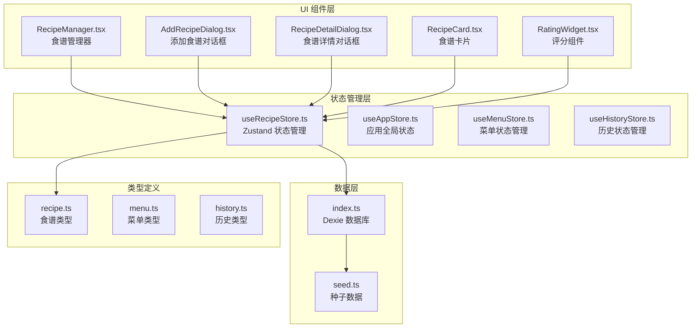
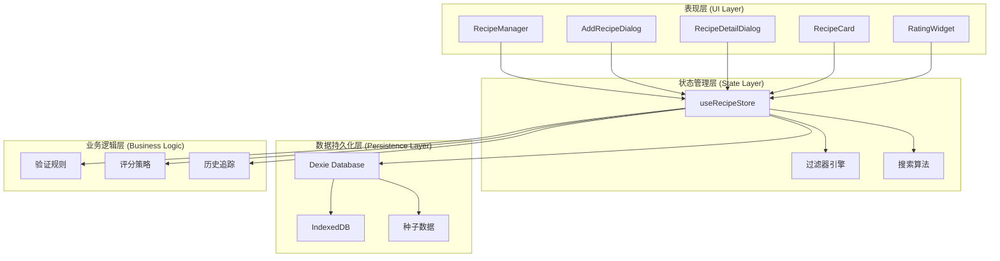
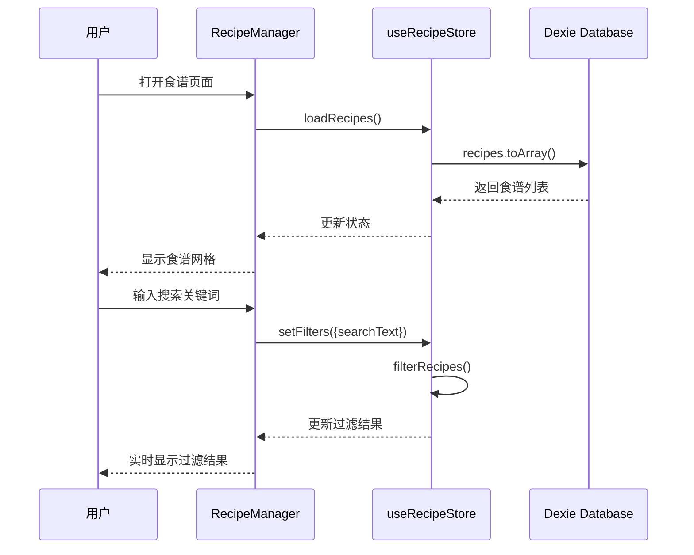
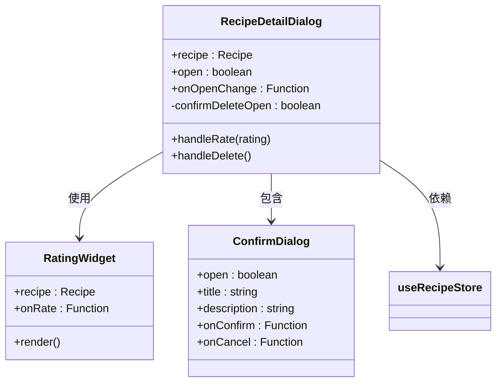
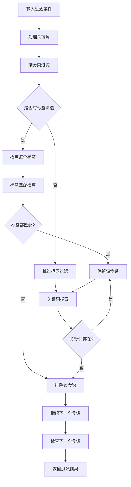
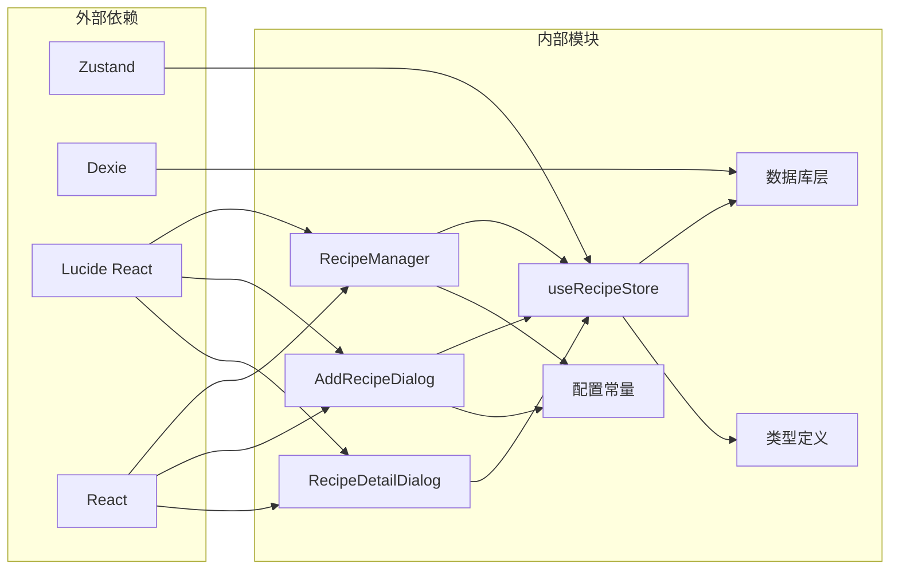

# 食谱状态管理

<cite>
**本文档引用的文件**
- [useRecipeStore.ts](file://src/store/useRecipeStore.ts)
- [recipe.ts](file://src/types/recipe.ts)
- [RecipeManager.tsx](file://src/components/Recipe/RecipeManager.tsx)
- [index.ts](file://src/db/index.ts)
- [seed.ts](file://src/db/seed.ts)
- [constants.ts](file://src/config/constants.ts)
- [AddRecipeDialog.tsx](file://src/components/Recipe/AddRecipeDialog.tsx)
- [RecipeDetailDialog.tsx](file://src/components/Recipe/RecipeDetailDialog.tsx)
- [validation.ts](file://src/algorithms/validation.ts)
- [RecipeCard.tsx](file://src/components/Recipe/RecipeCard.tsx)
- [RatingWidget.tsx](file://src/components/Recipe/RatingWidget.tsx)
</cite>

## 目录
1. [简介](#简介)
2. [项目结构](#项目结构)
3. [核心组件](#核心组件)
4. [架构概览](#架构概览)
5. [详细组件分析](#详细组件分析)
6. [依赖关系分析](#依赖关系分析)
7. [性能考虑](#性能考虑)
8. [故障排除指南](#故障排除指南)
9. [结论](#结论)

## 简介

食谱状态管理系统是 Memu 应用的核心模块之一，负责管理用户的食谱数据、状态和相关操作。该系统基于 Zustand 状态管理库构建，结合 Dexie IndexedDB 数据库，实现了完整的食谱 CRUD 操作、搜索过滤、评分管理和历史记录跟踪功能。

系统采用模块化设计，将状态管理、数据持久化、UI 组件和业务逻辑清晰分离，提供了良好的可维护性和扩展性。

## 项目结构

食谱状态管理相关的文件组织结构如下：



**图表来源**
- [useRecipeStore.ts:1-121](file://src/store/useRecipeStore.ts#L1-L121)
- [index.ts:1-68](file://src/db/index.ts#L1-L68)
- [recipe.ts:1-21](file://src/types/recipe.ts#L1-L21)

**章节来源**
- [useRecipeStore.ts:1-121](file://src/store/useRecipeStore.ts#L1-L121)
- [index.ts:1-68](file://src/db/index.ts#L1-L68)
- [recipe.ts:1-21](file://src/types/recipe.ts#L1-L21)

## 核心组件

### 状态存储器 (useRecipeStore)

useRecipeStore 是整个食谱状态管理的核心，基于 Zustand 创建了一个专门的状态管理容器。它包含了完整的食谱 CRUD 操作、搜索过滤功能和数据同步机制。

#### 状态结构

系统维护三个主要状态：
- `recipes`: 完整的食谱列表
- `filteredRecipes`: 当前筛选后的食谱列表
- `filters`: 搜索和过滤条件

#### 过滤器接口

```typescript
interface RecipeFilters {
  category: RecipeCategory | 'all';
  searchText: string;
  tags: string[];
}
```

#### 主要操作方法

1. **数据加载**: `loadRecipes()` - 从数据库获取所有食谱
2. **添加食谱**: `addRecipe(recipe)` - 新增食谱记录
3. **更新食谱**: `updateRecipe(id, updates)` - 修改食谱信息
4. **删除食谱**: `deleteRecipe(id)` - 移除食谱记录
5. **评分管理**: `rateRecipe(id, rating)` - 为已使用的食谱评分
6. **使用记录**: `recordUsageDates(recipeIds, date)` - 记录食谱使用历史
7. **过滤管理**: `setFilters()` 和 `applyFilters()` - 管理搜索过滤条件

**章节来源**
- [useRecipeStore.ts:11-25](file://src/store/useRecipeStore.ts#L11-L25)
- [useRecipeStore.ts:49-120](file://src/store/useRecipeStore.ts#L49-L120)

### 数据模型 (Recipe)

食谱数据模型定义了完整的食谱结构：

```typescript
interface Recipe {
  id?: number;
  name: string;
  category: RecipeCategory;
  tags: string[];
  ingredients: string[];
  instructions: string;
  rating: number | null;
  history_dates: string[];
}
```

支持的分类包括：荤菜、素菜、汤品、各类早餐、主食和简餐等。

**章节来源**
- [recipe.ts:11-21](file://src/types/recipe.ts#L11-L21)

### 数据库层

系统使用 Dexie 作为 IndexedDB 的封装层，提供类型安全的数据访问接口：

```typescript
class MemuDatabase extends Dexie {
  recipes!: Table<Recipe, number>;
  menuPlans!: Table<WeeklyMenuPlan, number>;
  historyArchives!: Table<HistoryArchive, number>;
}
```

数据库初始化时会设置适当的索引以优化查询性能。

**章节来源**
- [index.ts:7-22](file://src/db/index.ts#L7-L22)

## 架构概览

食谱状态管理采用分层架构设计，各层职责明确：



**图表来源**
- [useRecipeStore.ts:1-121](file://src/store/useRecipeStore.ts#L1-L121)
- [index.ts:1-68](file://src/db/index.ts#L1-L68)
- [validation.ts:27-141](file://src/algorithms/validation.ts#L27-L141)

## 详细组件分析

### 食谱管理器 (RecipeManager)

RecipeManager 是食谱功能的主要入口组件，负责协调所有食谱相关的操作：



**图表来源**
- [RecipeManager.tsx:26-34](file://src/components/Recipe/RecipeManager.tsx#L26-L34)
- [useRecipeStore.ts:109-119](file://src/store/useRecipeStore.ts#L109-L119)

#### 功能特性

1. **实时搜索**: 支持按名称、食材和标签进行全文搜索
2. **分类筛选**: 提供多种分类选项进行精确筛选
3. **响应式布局**: 自适应不同屏幕尺寸的网格显示
4. **交互式详情**: 点击食谱卡片查看详细信息

**章节来源**
- [RecipeManager.tsx:26-109](file://src/components/Recipe/RecipeManager.tsx#L26-L109)

### 添加食谱对话框 (AddRecipeDialog)

AddRecipeDialog 提供了完整的食谱录入界面，包含表单验证和数据处理：

```mermaid
flowchart TD
A[用户点击"录入新菜品"] --> B[打开对话框]
B --> C[输入菜名]
C --> D[选择分类]
D --> E[输入食材]
E --> F[输入做法]
F --> G[选择标签]
G --> H[点击保存]
H --> I{验证必填项}
I --> |失败| J[显示错误提示]
I --> |成功| K[调用 addRecipe]
K --> L[重置表单]
L --> M[关闭对话框]
J --> B
```

**图表来源**
- [AddRecipeDialog.tsx:32-86](file://src/components/Recipe/AddRecipeDialog.tsx#L32-L86)

#### 数据处理流程

1. **表单验证**: 确保菜名等必填字段不为空
2. **标签处理**: 将复选框状态转换为标签数组
3. **食材解析**: 支持多种分隔符的食材输入格式
4. **状态更新**: 调用状态管理器完成数据持久化

**章节来源**
- [AddRecipeDialog.tsx:32-86](file://src/components/Recipe/AddRecipeDialog.tsx#L32-L86)

### 食谱详情对话框 (RecipeDetailDialog)

RecipeDetailDialog 展示食谱的完整信息，并提供评分和删除功能：



**图表来源**
- [RecipeDetailDialog.tsx:19-43](file://src/components/Recipe/RecipeDetailDialog.tsx#L19-L43)
- [RatingWidget.tsx:6-14](file://src/components/Recipe/RatingWidget.tsx#L6-L14)

#### 评分机制

系统实现了智能的评分控制机制：
- 仅对有使用历史的食谱开放评分功能
- 支持星级评分 (1-5星) 和拉黑功能
- 评分状态通过视觉反馈直观展示

**章节来源**
- [RecipeDetailDialog.tsx:25-43](file://src/components/Recipe/RecipeDetailDialog.tsx#L25-L43)
- [RatingWidget.tsx:11-62](file://src/components/Recipe/RatingWidget.tsx#L11-L62)

### 过滤和搜索算法

过滤系统采用多条件组合的搜索策略：



**图表来源**
- [useRecipeStore.ts:27-47](file://src/store/useRecipeStore.ts#L27-L47)

#### 搜索范围

搜索算法会在以下字段中查找关键词：
- 菜名
- 食材列表
- 标签列表

**章节来源**
- [useRecipeStore.ts:27-47](file://src/store/useRecipeStore.ts#L27-L47)

## 依赖关系分析

系统采用模块化的依赖设计，各组件之间的耦合度较低：



**图表来源**
- [useRecipeStore.ts:1-3](file://src/store/useRecipeStore.ts#L1-L3)
- [index.ts:1-2](file://src/db/index.ts#L1-L2)
- [constants.ts:1-44](file://src/config/constants.ts#L1-L44)

### 关键依赖关系

1. **状态管理依赖**: 所有 UI 组件都依赖 useRecipeStore 获取和更新状态
2. **数据库依赖**: 状态管理器直接依赖 Dexie 数据库实例
3. **类型安全**: 通过 TypeScript 类型定义确保数据一致性
4. **配置依赖**: UI 组件依赖配置常量进行本地化显示

**章节来源**
- [useRecipeStore.ts:1-3](file://src/store/useRecipeStore.ts#L1-L3)
- [RecipeManager.tsx:12-16](file://src/components/Recipe/RecipeManager.tsx#L12-L16)

## 性能考虑

### 数据库优化

1. **索引策略**: 数据库为 recipes 表设置了复合索引 (`name`, `category`, `rating`)
2. **批量操作**: 使用事务处理批量更新操作
3. **缓存机制**: 在内存中维护完整的食谱列表，避免频繁数据库访问

### 状态管理优化

1. **局部状态**: 使用 Zustand 的局部状态更新，减少不必要的重渲染
2. **计算属性**: 过滤结果作为派生状态，只在依赖变化时重新计算
3. **异步操作**: 所有数据库操作都是异步的，不影响 UI 响应性

### 搜索性能

1. **预处理**: 关键词在搜索前进行预处理和标准化
2. **短路求值**: 过滤条件按效率排序，优先排除明显不匹配的食谱
3. **内存优化**: 使用字符串连接而非正则表达式，减少内存分配

**章节来源**
- [index.ts:14-18](file://src/db/index.ts#L14-L18)
- [useRecipeStore.ts:27-47](file://src/store/useRecipeStore.ts#L27-L47)

## 故障排除指南

### 常见问题及解决方案

#### 数据库初始化失败

**症状**: 应用启动时食谱数据为空
**原因**: IndexedDB 初始化异常或种子数据导入失败
**解决**: 
1. 检查浏览器的 IndexedDB 支持
2. 清除浏览器缓存和 IndexedDB 数据
3. 重新加载应用

#### 过滤功能异常

**症状**: 搜索结果不准确或过滤无效
**原因**: 过滤算法错误或状态更新问题
**解决**:
1. 检查过滤器状态是否正确更新
2. 验证搜索关键词的大小写处理
3. 确认标签匹配逻辑正常工作

#### 评分功能失效

**症状**: 无法对食谱进行评分
**原因**: 食谱没有使用历史记录
**解决**:
1. 确保食谱至少有一次使用记录
2. 检查历史日期数组是否正确更新
3. 验证评分权限检查逻辑

### 错误处理机制

系统实现了多层次的错误处理：

1. **数据库错误**: 通过 try-catch 捕获数据库操作异常
2. **网络错误**: IndexedDB 操作失败时提供降级处理
3. **用户输入错误**: 表单验证失败时显示友好的错误提示
4. **状态同步错误**: 数据库变更后自动重新加载状态

**章节来源**
- [useRecipeStore.ts:81-89](file://src/store/useRecipeStore.ts#L81-L89)
- [AddRecipeDialog.tsx:56-86](file://src/components/Recipe/AddRecipeDialog.tsx#L56-L86)

## 结论

食谱状态管理系统展现了现代前端应用的最佳实践：

1. **架构清晰**: 分层设计使得各模块职责明确，易于维护和扩展
2. **性能优秀**: 通过合理的缓存策略和数据库优化保证了良好的用户体验
3. **功能完整**: 覆盖了食谱管理的所有核心需求，包括 CRUD、搜索、过滤和评分
4. **用户体验**: 直观的界面设计和流畅的交互体验

该系统为 Memu 应用提供了坚实的数据基础，支持更复杂的菜单规划和营养分析功能。未来可以考虑添加更多高级功能，如食谱分享、批量操作和更精细的搜索过滤选项。