# UI 原子组件库

<cite>
**本文引用的文件**
- [accordion.tsx](file://src/components/ui/accordion.tsx)
- [badge.tsx](file://src/components/ui/badge.tsx)
- [button.tsx](file://src/components/ui/button.tsx)
- [card.tsx](file://src/components/ui/card.tsx)
- [checkbox.tsx](file://src/components/ui/checkbox.tsx)
- [dialog.tsx](file://src/components/ui/dialog.tsx)
- [select.tsx](file://src/components/ui/select.tsx)
- [tabs.tsx](file://src/components/ui/tabs.tsx)
- [utils.ts](file://src/lib/utils.ts)
- [constants.ts](file://src/config/constants.ts)
- [package.json](file://package.json)
- [DayCard.tsx](file://src/components/Menu/DayCard.tsx)
- [TagBadge.tsx](file://src/components/Common/TagBadge.tsx)
- [RecipeCard.tsx](file://src/components/Recipe/RecipeCard.tsx)
</cite>

## 目录
1. [简介](#简介)
2. [项目结构](#项目结构)
3. [核心组件](#核心组件)
4. [架构总览](#架构总览)
5. [详细组件分析](#详细组件分析)
6. [依赖分析](#依赖分析)
7. [性能考虑](#性能考虑)
8. [故障排除指南](#故障排除指南)
9. [结论](#结论)
10. [附录](#附录)

## 简介
本文件为 UI 原子组件库的综合技术文档，覆盖手风琴、徽章、按钮、卡片、复选框、对话框、选择器与标签页等组件的设计理念、接口定义、样式定制、主题支持与可访问性特性，并提供使用示例、组合模式与最佳实践。

## 项目结构
UI 原子组件集中位于 src/components/ui 下，采用“按组件拆分”的模块化组织方式；通用工具函数位于 src/lib/utils.ts；主题与语义化变量通过 Tailwind CSS 与 class-variance-authority（cva）进行统一管理；部分组件在业务组件中被广泛复用，如 DayCard、TagBadge、RecipeCard 等。

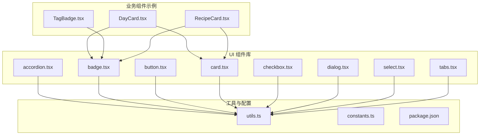

图表来源
- [accordion.tsx:1-51](file://src/components/ui/accordion.tsx#L1-L51)
- [badge.tsx:1-35](file://src/components/ui/badge.tsx#L1-L35)
- [button.tsx:1-53](file://src/components/ui/button.tsx#L1-L53)
- [card.tsx:1-51](file://src/components/ui/card.tsx#L1-L51)
- [checkbox.tsx:1-26](file://src/components/ui/checkbox.tsx#L1-L26)
- [dialog.tsx:1-96](file://src/components/ui/dialog.tsx#L1-L96)
- [select.tsx:1-146](file://src/components/ui/select.tsx#L1-L146)
- [tabs.tsx:1-53](file://src/components/ui/tabs.tsx#L1-L53)
- [utils.ts:1-7](file://src/lib/utils.ts#L1-L7)
- [constants.ts:1-44](file://src/config/constants.ts#L1-L44)
- [DayCard.tsx:1-78](file://src/components/Menu/DayCard.tsx#L1-L78)
- [TagBadge.tsx:1-31](file://src/components/Common/TagBadge.tsx#L1-L31)
- [RecipeCard.tsx:1-100](file://src/components/Recipe/RecipeCard.tsx#L1-L100)

章节来源
- [package.json:12-27](file://package.json#L12-L27)

## 核心组件
本节概述各组件的职责与共性设计原则：统一使用 cn 合并样式、cva 提供变体与尺寸、Radix UI 作为无障碍基础、Lucide 图标增强语义表达。组件均导出类型化的 Props 接口，便于 IDE 类型提示与 TSX 使用。

- Accordion：基于 @radix-ui/react-accordion 的可展开/折叠容器，提供 Item/Trigger/Content 三件套，内置动画与图标旋转。
- Badge：语义化徽章，支持多变体（默认/secondary/destructive/outline/meat/veg/soup/staple），通过 cva 驱动。
- Button：按钮基元，支持 asChild 插槽渲染，提供多种变体与尺寸，适配图标与文本组合。
- Card：卡片容器及其子块（Header/Title/Description/Content/Footer），用于信息区块布局。
- Checkbox：基于 @radix-ui/react-checkbox 的复选控件，状态同步到 UI 指示器。
- Dialog：模态对话框，包含 Overlay/Portal/Content/Header/Footer/Title/Description 等，支持键盘与焦点管理。
- Select：下拉选择器，支持滚动按钮、分组、分隔符与受控值，提供完整交互生态。
- Tabs：标签页切换，包含 List/Trigger/Content，状态驱动视觉反馈。

章节来源
- [accordion.tsx:1-51](file://src/components/ui/accordion.tsx#L1-L51)
- [badge.tsx:1-35](file://src/components/ui/badge.tsx#L1-L35)
- [button.tsx:1-53](file://src/components/ui/button.tsx#L1-L53)
- [card.tsx:1-51](file://src/components/ui/card.tsx#L1-L51)
- [checkbox.tsx:1-26](file://src/components/ui/checkbox.tsx#L1-L26)
- [dialog.tsx:1-96](file://src/components/ui/dialog.tsx#L1-L96)
- [select.tsx:1-146](file://src/components/ui/select.tsx#L1-L146)
- [tabs.tsx:1-53](file://src/components/ui/tabs.tsx#L1-L53)
- [utils.ts:1-7](file://src/lib/utils.ts#L1-L7)

## 架构总览
组件层采用“原生 HTML + Radix Primitive + Lucide 图标 + Tailwind/CVA 样式”的组合策略，确保可访问性、可扩展性与一致性。业务组件通过导入 UI 原子组件实现高复用与低耦合。

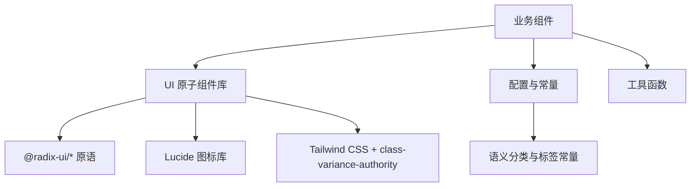

图表来源
- [button.tsx:1-53](file://src/components/ui/button.tsx#L1-L53)
- [dialog.tsx:1-96](file://src/components/ui/dialog.tsx#L1-L96)
- [select.tsx:1-146](file://src/components/ui/select.tsx#L1-L146)
- [tabs.tsx:1-53](file://src/components/ui/tabs.tsx#L1-L53)
- [constants.ts:24-43](file://src/config/constants.ts#L24-L43)
- [utils.ts:1-7](file://src/lib/utils.ts#L1-L7)

## 详细组件分析

### Accordion 手风琴组件
- 设计理念：以最小封装提供可展开/折叠能力，保持语义化结构与无障碍属性。
- 关键点
  - 使用 Radix Accordion Root/Item/Header/Trigger/Content。
  - 触发器内置 ChevronDown 图标，打开时旋转 180°。
  - 内容区使用 data-[state] 动画控制开合过渡。
- Props 接口
  - AccordionItem：继承原生 div 属性，无额外 props。
  - AccordionTrigger：继承原生 button 属性，支持 children。
  - AccordionContent：继承原生 div 属性，无额外 props。
- 可访问性
  - 由 Radix 提供 aria-* 属性与键盘导航。
- 使用建议
  - 将标题与内容分别放入 Trigger 与 Content。
  - 为复杂内容启用动画时注意性能，避免大体量 DOM 在动画中频繁重排。

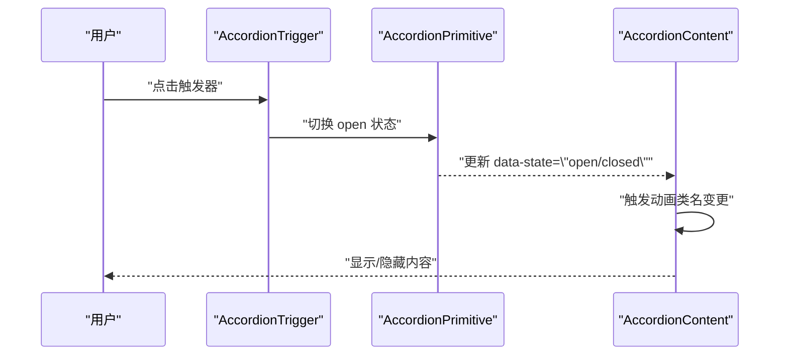

图表来源
- [accordion.tsx:16-48](file://src/components/ui/accordion.tsx#L16-L48)

章节来源
- [accordion.tsx:1-51](file://src/components/ui/accordion.tsx#L1-L51)

### Badge 徽章组件
- 设计理念：为内容或状态提供轻量级语义标记，支持多变体与主题色。
- 关键点
  - 通过 cva 定义 variant 映射，支持 default/secondary/destructive/outline 以及食材分类变体（meat/veg/soup/staple）。
  - 默认聚焦态具备 ring 效果，提升可访问性。
- Props 接口
  - BadgeProps：继承 HTMLDivElement 属性与 VariantProps<typeof badgeVariants>。
- 主题与样式
  - 变体映射至 Tailwind 颜色体系，可结合业务常量进行扩展。
- 使用建议
  - 与 TagBadge 组合展示分类标签，或在卡片中标识状态。

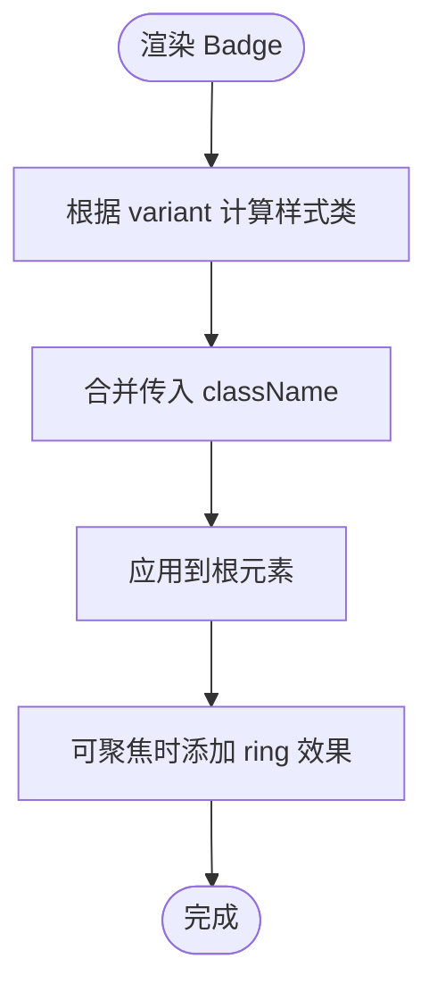

图表来源
- [badge.tsx:5-32](file://src/components/ui/badge.tsx#L5-L32)
- [constants.ts:34-43](file://src/config/constants.ts#L34-L43)

章节来源
- [badge.tsx:1-35](file://src/components/ui/badge.tsx#L1-L35)
- [TagBadge.tsx:1-31](file://src/components/Common/TagBadge.tsx#L1-L31)
- [constants.ts:34-43](file://src/config/constants.ts#L34-L43)

### Button 按钮组件
- 设计理念：统一按钮风格与交互反馈，支持 asChild 渲染为任意元素。
- 关键点
  - 支持 variant（default/secondary/destructive/outline/ghost/link）与 size（default/sm/lg/icon）。
  - asChild 使用 Slot，允许将 Button 渲染为链接或自定义容器。
  - 内置图标尺寸与对齐规则，保证与文字组合的一致性。
- Props 接口
  - ButtonProps：继承 HTMLButtonElement 属性、VariantProps 与 asChild。
- 主题与样式
  - 通过 cva 生成类名，结合 Tailwind 实现颜色与阴影。
- 使用建议
  - 导航类使用 link；强调操作使用 default；危险操作使用 destructive；仅图标使用 icon。

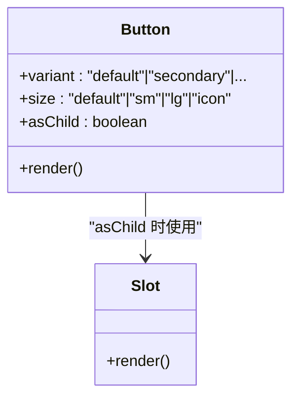

图表来源
- [button.tsx:32-49](file://src/components/ui/button.tsx#L32-L49)

章节来源
- [button.tsx:1-53](file://src/components/ui/button.tsx#L1-L53)

### Card 卡片组件
- 设计理念：提供信息区块的容器与子块，便于分组与层次化展示。
- 关键点
  - Card 为主容器，其余为语义化子块：Header/Title/Description/Content/Footer。
  - 子块通过 cn 合并 className，保持一致间距与排版。
- Props 接口
  - 各子块继承 HTMLDivElement 属性，无额外 props。
- 使用建议
  - 在列表项、详情面板、统计区块中组合使用，提升可读性。

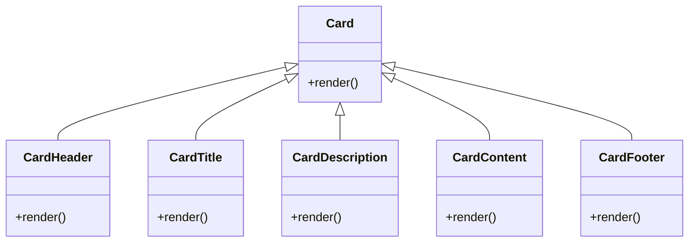

图表来源
- [card.tsx:4-48](file://src/components/ui/card.tsx#L4-L48)

章节来源
- [card.tsx:1-51](file://src/components/ui/card.tsx#L1-L51)
- [DayCard.tsx:1-78](file://src/components/Menu/DayCard.tsx#L1-L78)
- [RecipeCard.tsx:1-100](file://src/components/Recipe/RecipeCard.tsx#L1-L100)

### Checkbox 复选框组件
- 设计理念：提供原生可访问的复选框体验，状态变化即时反馈。
- 关键点
  - 基于 @radix-ui/react-checkbox，内部指示器使用 Check 图标。
  - 数据状态 data-[state=checked] 控制背景色与边框。
- Props 接口
  - 继承原生 input 属性，无额外 props。
- 使用建议
  - 与表单、筛选、批量操作配合使用，保持一致的视觉反馈。

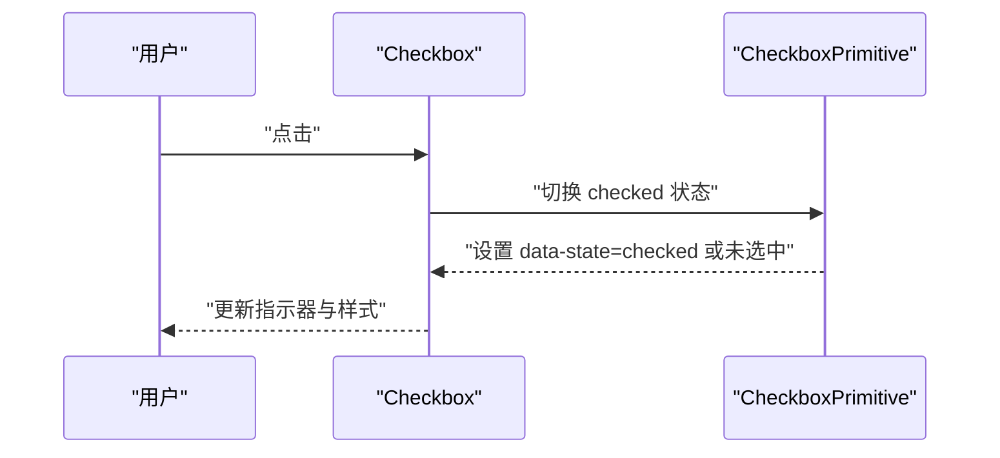

图表来源
- [checkbox.tsx:6-22](file://src/components/ui/checkbox.tsx#L6-L22)

章节来源
- [checkbox.tsx:1-26](file://src/components/ui/checkbox.tsx#L1-L26)

### Dialog 对话框组件
- 设计理念：提供模态交互入口，确保焦点管理与键盘可访问性。
- 关键点
  - Root/Portal/Overlay/Content/Trigger/Close 组合，Overlay 支持淡入淡出动画。
  - Content 居中定位，右上角带关闭按钮与 sr-only 文本。
  - Header/Footer 提供布局辅助。
- Props 接口
  - Overlay/Content/Title/Description 继承对应原生元素属性。
- 可访问性
  - 自动捕获与释放焦点，Esc 关闭，禁用背景滚动。
- 使用建议
  - 重要确认与设置类操作优先使用 Dialog。

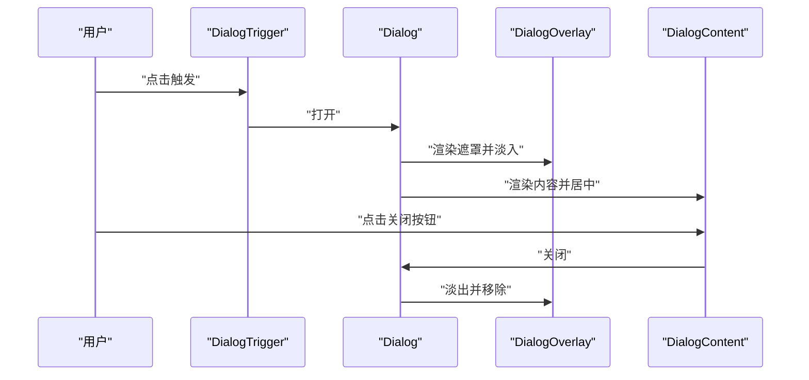

图表来源
- [dialog.tsx:6-48](file://src/components/ui/dialog.tsx#L6-L48)

章节来源
- [dialog.tsx:1-96](file://src/components/ui/dialog.tsx#L1-L96)

### Select 选择器组件
- 设计理念：提供可搜索、可滚动、可分组的选择交互，支持大量选项。
- 关键点
  - Trigger/Content/Viewport/Item/Label/Separator/ScrollUp/ScrollDown 组成完整生态。
  - 支持 popper 位置偏移，滚动按钮提升长列表体验。
  - ItemIndicator 显示当前选中项。
- Props 接口
  - Trigger/Content/Item/Separator 继承对应原生元素属性。
- 使用建议
  - 选项较多时启用 ScrollUp/ScrollDown；需要分组时使用 Group/Label。

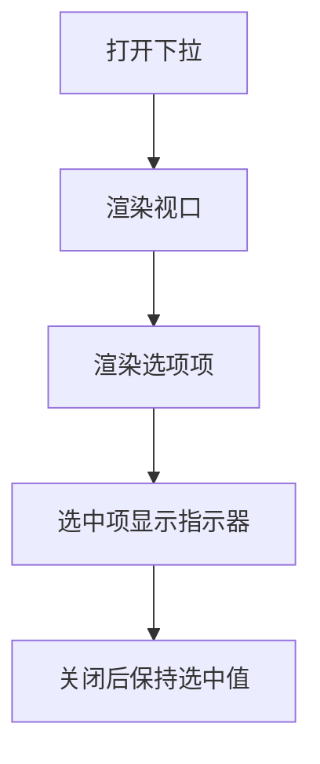

图表来源
- [select.tsx:58-120](file://src/components/ui/select.tsx#L58-L120)

章节来源
- [select.tsx:1-146](file://src/components/ui/select.tsx#L1-L146)

### Tabs 标签页组件
- 设计理念：提供清晰的标签切换与内容区域，强调层级与可发现性。
- 关键点
  - List/Trigger/Content 三件套，Trigger 的激活态通过 data-[state=active] 切换样式。
  - 支持禁用态与聚焦环。
- Props 接口
  - List/Trigger/Content 继承对应原生元素属性。
- 使用建议
  - 将相关性强的内容分组到不同标签页，避免单页过载。

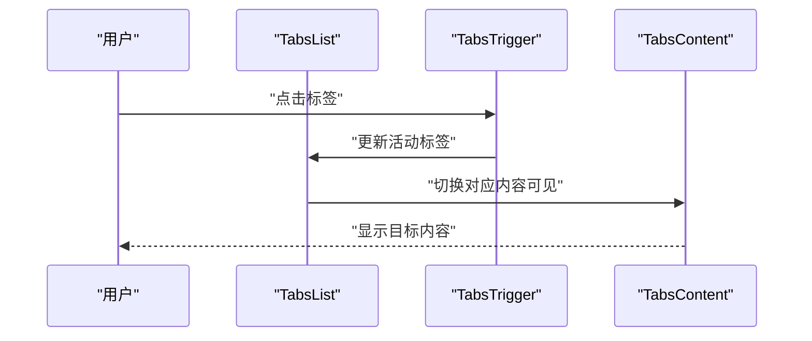

图表来源
- [tabs.tsx:7-49](file://src/components/ui/tabs.tsx#L7-L49)

章节来源
- [tabs.tsx:1-53](file://src/components/ui/tabs.tsx#L1-L53)

## 依赖分析
- 运行时依赖
  - @radix-ui/*：提供无障碍原语（accordion/dialog/select/tabs/checkbox/slot）。
  - lucide-react：提供语义化图标。
  - class-variance-authority：提供变体系统。
  - clsx + tailwind-merge：安全合并与去重 Tailwind 类名。
- 业务依赖
  - constants.ts 中的分类与标签常量被 Badge/TagBadge 使用，形成“语义化标签”闭环。

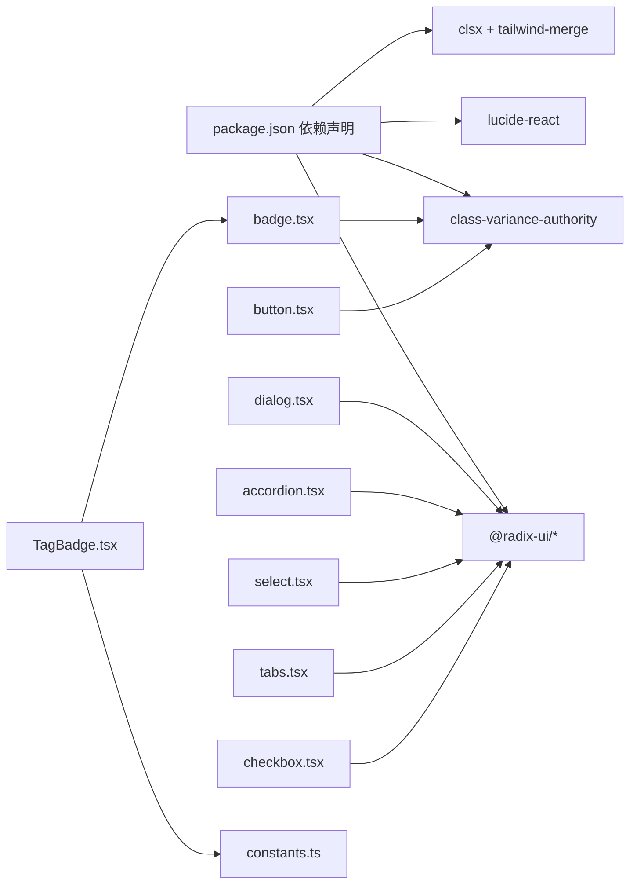

图表来源
- [package.json:12-27](file://package.json#L12-L27)
- [badge.tsx:1-35](file://src/components/ui/badge.tsx#L1-L35)
- [button.tsx:1-53](file://src/components/ui/button.tsx#L1-L53)
- [dialog.tsx:1-96](file://src/components/ui/dialog.tsx#L1-L96)
- [accordion.tsx:1-51](file://src/components/ui/accordion.tsx#L1-L51)
- [select.tsx:1-146](file://src/components/ui/select.tsx#L1-L146)
- [tabs.tsx:1-53](file://src/components/ui/tabs.tsx#L1-L53)
- [checkbox.tsx:1-26](file://src/components/ui/checkbox.tsx#L1-L26)
- [TagBadge.tsx:1-31](file://src/components/Common/TagBadge.tsx#L1-L31)
- [constants.ts:24-43](file://src/config/constants.ts#L24-L43)

章节来源
- [package.json:12-27](file://package.json#L12-L27)

## 性能考虑
- 动画与过渡
  - AccordionContent 与 DialogOverlay 使用 data-state 控制动画，建议避免在动画期间插入超大内容。
- 渲染优化
  - Button 的 asChild 使用 Slot，减少多余包裹节点；Select 的 Portal 将内容挂载到 Portal，降低层级影响。
- 样式合并
  - 通过 utils.ts 的 cn 合并类名，避免重复与冲突，减少样式抖动。
- 大列表
  - Select 使用 viewport 与滚动按钮，避免一次性渲染过多选项导致卡顿。

## 故障排除指南
- 无障碍问题
  - 若发现键盘无法聚焦或无法关闭，检查是否正确使用 Root/Trigger/Portal/Overlay。
- 样式冲突
  - 使用 cn 合并类名，确保传入 className 不会覆盖关键类；必要时使用更具体的选择器或自定义变体。
- 图标不显示
  - 确认 lucide-react 已安装且版本兼容；检查图标尺寸与父容器的对齐。
- 选择器滚动异常
  - 确保 ScrollUp/ScrollDown 与 Viewport 成对使用；检查高度与最小宽度计算。

章节来源
- [dialog.tsx:1-96](file://src/components/ui/dialog.tsx#L1-L96)
- [select.tsx:1-146](file://src/components/ui/select.tsx#L1-L146)
- [utils.ts:1-7](file://src/lib/utils.ts#L1-L7)

## 结论
该 UI 原子组件库以 Radix 原语为基础，结合 cva 与 Tailwind，实现了高可访问性、强一致性与良好扩展性的组件体系。通过 Badge/TagBadge 的语义化标签、Button 的多变体与 asChild、Card 的模块化布局、以及 Accordion/Dialog/Select/Tabs 的完整交互生态，能够满足多样化的业务界面需求。建议在实际项目中遵循 Props 接口与样式约定，结合业务常量与工具函数，实现稳定高效的界面构建。

## 附录
- 使用示例与组合模式
  - DayCard：在卡片中展示早餐/晚餐区域，使用 Badge 标注简餐类型。
  - TagBadge：根据分类映射到 Badge 的变体，统一标签风格。
  - RecipeCard：在卡片内容区组合多个 Badge 与星级评分，体现状态与标签。
- 最佳实践
  - 优先使用 cva 变体而非内联样式；通过 constants.ts 维护语义标签与分类映射。
  - 为交互组件提供明确的键盘与焦点管理；为重要操作提供确认对话框。
  - 对长列表与复杂内容启用懒加载或虚拟化策略，避免阻塞主线程。

章节来源
- [DayCard.tsx:1-78](file://src/components/Menu/DayCard.tsx#L1-L78)
- [TagBadge.tsx:1-31](file://src/components/Common/TagBadge.tsx#L1-L31)
- [RecipeCard.tsx:1-100](file://src/components/Recipe/RecipeCard.tsx#L1-L100)
- [constants.ts:24-43](file://src/config/constants.ts#L24-L43)