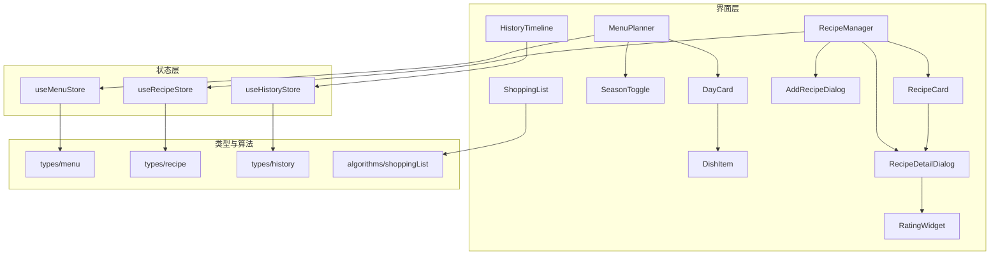
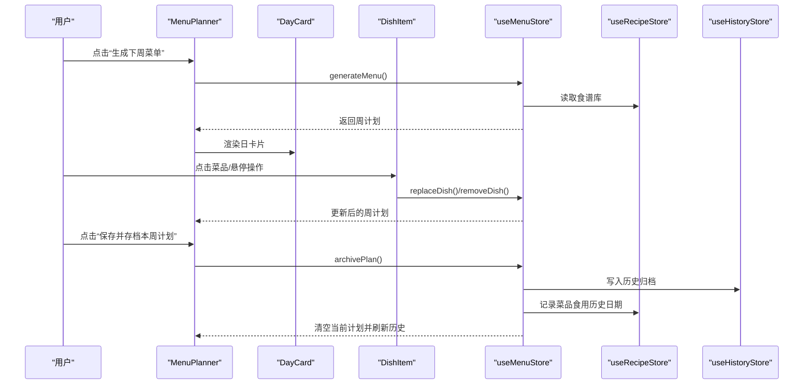
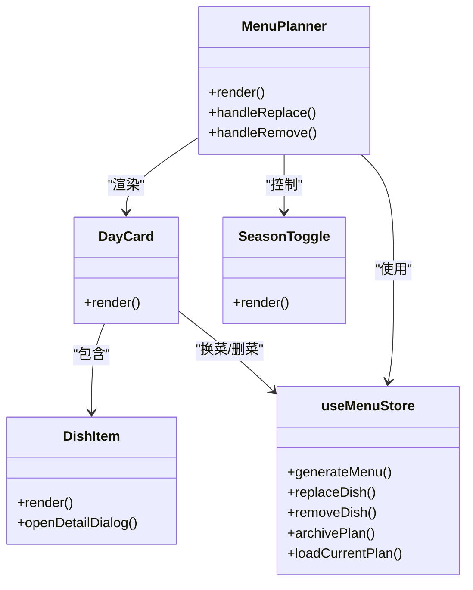
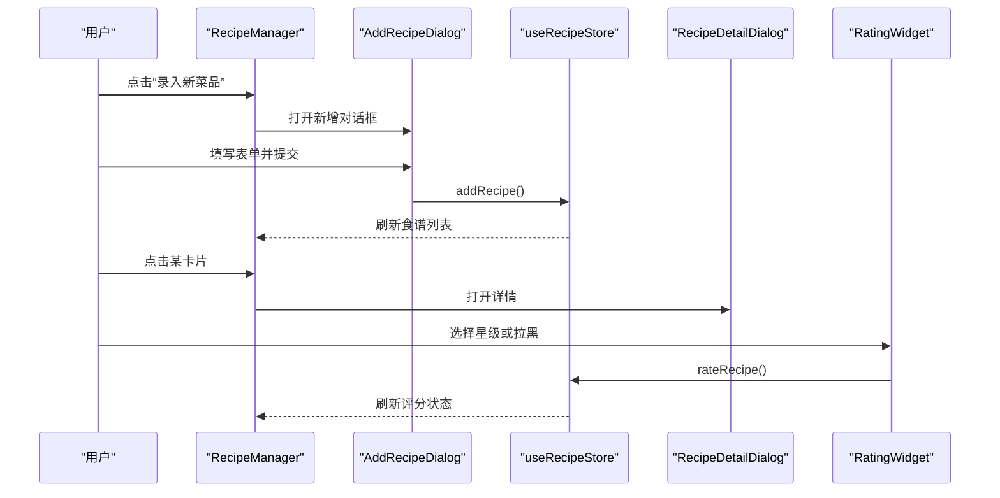
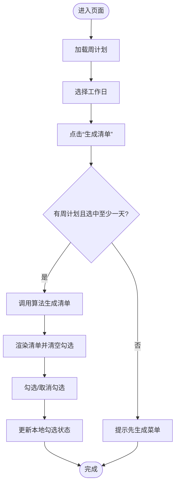
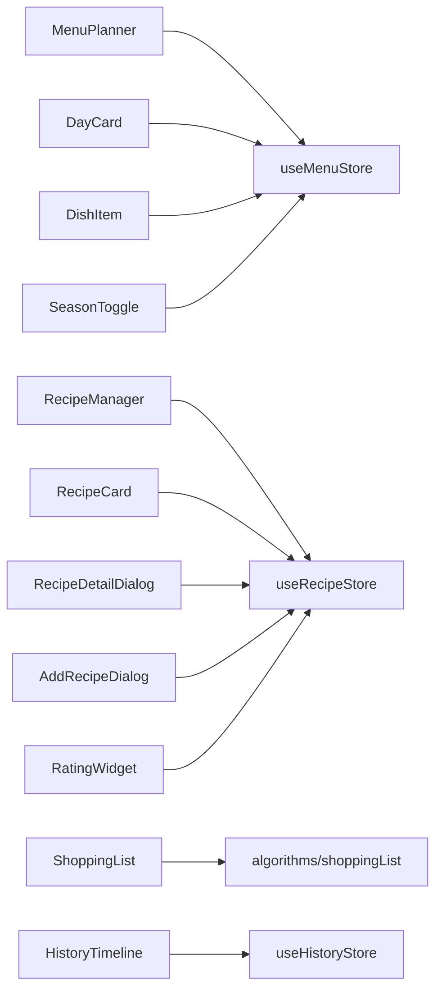
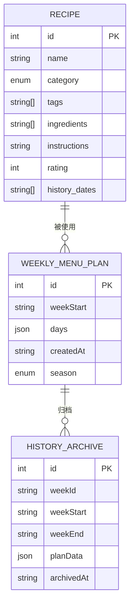

# 功能组件

<cite>
**本文引用的文件**
- [MenuPlanner.tsx](file://src/components/Menu/MenuPlanner.tsx)
- [DayCard.tsx](file://src/components/Menu/DayCard.tsx)
- [DishItem.tsx](file://src/components/Menu/DishItem.tsx)
- [SeasonToggle.tsx](file://src/components/Menu/SeasonToggle.tsx)
- [RecipeManager.tsx](file://src/components/Recipe/RecipeManager.tsx)
- [RecipeCard.tsx](file://src/components/Recipe/RecipeCard.tsx)
- [RecipeDetailDialog.tsx](file://src/components/Recipe/RecipeDetailDialog.tsx)
- [AddRecipeDialog.tsx](file://src/components/Recipe/AddRecipeDialog.tsx)
- [RatingWidget.tsx](file://src/components/Recipe/RatingWidget.tsx)
- [ShoppingList.tsx](file://src/components/Shopping/ShoppingList.tsx)
- [HistoryTimeline.tsx](file://src/components/History/HistoryTimeline.tsx)
- [useMenuStore.ts](file://src/store/useMenuStore.ts)
- [useRecipeStore.ts](file://src/store/useRecipeStore.ts)
- [useHistoryStore.ts](file://src/store/useHistoryStore.ts)
- [menu.ts](file://src/types/menu.ts)
- [recipe.ts](file://src/types/recipe.ts)
- [history.ts](file://src/types/history.ts)
</cite>

## 目录
1. [简介](#简介)
2. [项目结构](#项目结构)
3. [核心组件](#核心组件)
4. [架构总览](#架构总览)
5. [详细组件分析](#详细组件分析)
6. [依赖关系分析](#依赖关系分析)
7. [性能考量](#性能考量)
8. [故障排查指南](#故障排查指南)
9. [结论](#结论)
10. [附录](#附录)

## 简介
本文件系统性梳理“功能组件模块”的设计与实现，覆盖菜单规划、食谱管理、购物清单与历史追踪四大领域。重点解析以下组件：
- 菜单规划：MenuPlanner、DayCard、DishItem、SeasonToggle
- 食谱管理：RecipeManager、RecipeCard、RecipeDetailDialog、AddRecipeDialog、RatingWidget
- 购物清单：ShoppingList
- 历史追踪：HistoryTimeline

文档从架构、数据流、状态同步、交互逻辑与错误处理等维度进行深入说明，并辅以可视化图示帮助理解。

## 项目结构
功能组件主要位于 src/components 下，按功能域划分为 Menu、Recipe、Shopping、History 四个子目录；状态管理集中在 src/store，类型定义位于 src/types，算法逻辑位于 src/algorithms。

图表来源
- [MenuPlanner.tsx:1-75](file://src/components/Menu/MenuPlanner.tsx#L1-L75)
- [DayCard.tsx:1-78](file://src/components/Menu/DayCard.tsx#L1-L78)
- [DishItem.tsx:1-124](file://src/components/Menu/DishItem.tsx#L1-L124)
- [SeasonToggle.tsx:1-27](file://src/components/Menu/SeasonToggle.tsx#L1-L27)
- [RecipeManager.tsx:1-110](file://src/components/Recipe/RecipeManager.tsx#L1-L110)
- [RecipeCard.tsx:1-100](file://src/components/Recipe/RecipeCard.tsx#L1-L100)
- [RecipeDetailDialog.tsx:1-159](file://src/components/Recipe/RecipeDetailDialog.tsx#L1-L159)
- [AddRecipeDialog.tsx:1-200](file://src/components/Recipe/AddRecipeDialog.tsx#L1-L200)
- [RatingWidget.tsx:1-63](file://src/components/Recipe/RatingWidget.tsx#L1-L63)
- [ShoppingList.tsx:1-130](file://src/components/Shopping/ShoppingList.tsx#L1-L130)
- [HistoryTimeline.tsx:1-107](file://src/components/History/HistoryTimeline.tsx#L1-L107)
- [useMenuStore.ts:1-292](file://src/store/useMenuStore.ts#L1-L292)
- [useRecipeStore.ts:1-121](file://src/store/useRecipeStore.ts#L1-L121)
- [useHistoryStore.ts:1-46](file://src/store/useHistoryStore.ts#L1-L46)
- [menu.ts:1-45](file://src/types/menu.ts#L1-L45)
- [recipe.ts:1-21](file://src/types/recipe.ts#L1-L21)
- [history.ts:1-11](file://src/types/history.ts#L1-L11)

章节来源
- [MenuPlanner.tsx:1-75](file://src/components/Menu/MenuPlanner.tsx#L1-L75)
- [RecipeManager.tsx:1-110](file://src/components/Recipe/RecipeManager.tsx#L1-L110)
- [ShoppingList.tsx:1-130](file://src/components/Shopping/ShoppingList.tsx#L1-L130)
- [HistoryTimeline.tsx:1-107](file://src/components/History/HistoryTimeline.tsx#L1-L107)

## 核心组件
本节概述各组件职责与关键行为：
- MenuPlanner：负责加载/生成周菜单、渲染日卡片、触发换菜/删菜、归档计划
- DayCard：展示单日早餐与晚餐构成，提供换菜/删菜入口
- DishItem：展示菜品名称与角色标签，支持查看详情与换菜/删除
- SeasonToggle：切换季节模式，影响菜单生成策略
- RecipeManager：管理食谱列表、筛选、新增与详情查看
- RecipeCard：展示食谱卡片与评分状态
- RecipeDetailDialog：展示食谱详情、历史足迹与评分控件
- AddRecipeDialog：录入新菜品，支持标签与食材输入
- RatingWidget：对已食用菜品进行星级评分或拉黑
- ShoppingList：根据选中工作日生成食材清单，支持勾选完成
- HistoryTimeline：展示历史存档时间线，支持删除与展开查看

章节来源
- [MenuPlanner.tsx:8-75](file://src/components/Menu/MenuPlanner.tsx#L8-L75)
- [DayCard.tsx:13-78](file://src/components/Menu/DayCard.tsx#L13-L78)
- [DishItem.tsx:50-124](file://src/components/Menu/DishItem.tsx#L50-L124)
- [SeasonToggle.tsx:11-27](file://src/components/Menu/SeasonToggle.tsx#L11-L27)
- [RecipeManager.tsx:26-110](file://src/components/Recipe/RecipeManager.tsx#L26-L110)
- [RecipeCard.tsx:45-100](file://src/components/Recipe/RecipeCard.tsx#L45-L100)
- [RecipeDetailDialog.tsx:25-159](file://src/components/Recipe/RecipeDetailDialog.tsx#L25-L159)
- [AddRecipeDialog.tsx:32-200](file://src/components/Recipe/AddRecipeDialog.tsx#L32-L200)
- [RatingWidget.tsx:11-63](file://src/components/Recipe/RatingWidget.tsx#L11-L63)
- [ShoppingList.tsx:11-130](file://src/components/Shopping/ShoppingList.tsx#L11-L130)
- [HistoryTimeline.tsx:27-107](file://src/components/History/HistoryTimeline.tsx#L27-L107)

## 架构总览
组件间通过 Zustand 状态仓库进行解耦协作，类型定义确保数据一致性，算法模块提供菜单生成与购物清单聚合能力。

图表来源
- [MenuPlanner.tsx:27-63](file://src/components/Menu/MenuPlanner.tsx#L27-L63)
- [useMenuStore.ts:131-291](file://src/store/useMenuStore.ts#L131-L291)
- [useRecipeStore.ts:92-107](file://src/store/useRecipeStore.ts#L92-L107)
- [useHistoryStore.ts:39-44](file://src/store/useHistoryStore.ts#L39-L44)

## 详细组件分析

### 菜单规划组件

#### MenuPlanner（菜单规划器）
- 职责：加载当前周计划、触发生成、渲染日卡片、提供换菜/删菜与归档入口
- 关键交互：
  - 生成菜单：调用 store 的 generateMenu，期间禁用按钮
  - 归档计划：调用 store 的 archivePlan，同时为每道菜记录历史日期
  - 事件回调：向 DayCard 传递 onReplaceDish/onRemoveDish
- 数据来源：useMenuStore.currentPlan、isGenerating

章节来源
- [MenuPlanner.tsx:8-75](file://src/components/Menu/MenuPlanner.tsx#L8-L75)
- [useMenuStore.ts:131-165](file://src/store/useMenuStore.ts#L131-L165)

#### DayCard（日卡片）
- 职责：展示单日早餐三槽位与晚餐多菜品，支持换菜/删菜
- 设计要点：
  - 早餐三槽位分别映射到不同类别食谱
  - 晚餐支持角色标签（荤、素、汤、主食、凉菜、一锅出），并可删除菜品
- 事件传播：通过 props 向上回调至 MenuPlanner

章节来源
- [DayCard.tsx:13-78](file://src/components/Menu/DayCard.tsx#L13-L78)

#### DishItem（菜品项）
- 职责：展示菜品名称与角色标签，悬浮显示换菜/删除按钮，弹窗展示详情
- 交互细节：
  - 点击名称打开详情对话框
  - 悬停显示操作按钮，阻止事件冒泡
  - 角色到变体映射用于 Badge 样式区分
- 依赖：Recipe 类型、UI 对话框组件

章节来源
- [DishItem.tsx:50-124](file://src/components/Menu/DishItem.tsx#L50-L124)
- [recipe.ts:11-21](file://src/types/recipe.ts#L11-L21)

#### SeasonToggle（季节切换）
- 职责：切换季节模式（默认/夏季/冬季），影响菜单生成策略
- 实现：Select 组件绑定 useAppStore 的 season/setSeason

章节来源
- [SeasonToggle.tsx:11-27](file://src/components/Menu/SeasonToggle.tsx#L11-L27)
- [useMenuStore.ts:134-138](file://src/store/useMenuStore.ts#L134-L138)

#### 类图：菜单相关组件关系

图表来源
- [MenuPlanner.tsx:8-75](file://src/components/Menu/MenuPlanner.tsx#L8-L75)
- [DayCard.tsx:13-78](file://src/components/Menu/DayCard.tsx#L13-L78)
- [DishItem.tsx:50-124](file://src/components/Menu/DishItem.tsx#L50-L124)
- [SeasonToggle.tsx:11-27](file://src/components/Menu/SeasonToggle.tsx#L11-L27)
- [useMenuStore.ts:127-291](file://src/store/useMenuStore.ts#L127-L291)

### 食谱管理组件

#### RecipeManager（食谱管理器）
- 职责：加载食谱、应用分类/关键词筛选、展示卡片、打开新增与详情对话框
- 关键流程：
  - 初始化加载：useEffect 调用 loadRecipes
  - 筛选：Select 分类 + 文本搜索
  - 新增：打开 AddRecipeDialog
  - 查看：点击卡片打开 RecipeDetailDialog

章节来源
- [RecipeManager.tsx:26-110](file://src/components/Recipe/RecipeManager.tsx#L26-L110)
- [useRecipeStore.ts:58-64](file://src/store/useRecipeStore.ts#L58-L64)

#### RecipeCard（食谱卡片）
- 职责：展示菜品名称、分类徽章、标签徽章与评分状态
- 评分状态逻辑：未品尝、点击评分、已拉黑、星级评分

章节来源
- [RecipeCard.tsx:45-100](file://src/components/Recipe/RecipeCard.tsx#L45-L100)

#### RecipeDetailDialog（食谱详情对话框）
- 职责：展示食材、做法、历史足迹与评分控件；支持删除
- 关键点：
  - 历史足迹按日期排序展示
  - 评分通过 RatingWidget 完成
  - 删除前二次确认

章节来源
- [RecipeDetailDialog.tsx:25-159](file://src/components/Recipe/RecipeDetailDialog.tsx#L25-L159)
- [RatingWidget.tsx:11-63](file://src/components/Recipe/RatingWidget.tsx#L11-L63)

#### AddRecipeDialog（添加食谱对话框）
- 职责：录入菜品名称、分类、食材（逗号/顿号/斜杠分隔）、做法与标签
- 表单校验：名称必填；提交时异步写入数据库并关闭对话框

章节来源
- [AddRecipeDialog.tsx:32-200](file://src/components/Recipe/AddRecipeDialog.tsx#L32-L200)
- [useRecipeStore.ts:66-74](file://src/store/useRecipeStore.ts#L66-L74)

#### RatingWidget（评分组件）
- 职责：对已食用菜品进行 1~5 星评分或拉黑
- 交互约束：仅当存在历史食用日期时允许评分

章节来源
- [RatingWidget.tsx:11-63](file://src/components/Recipe/RatingWidget.tsx#L11-L63)
- [useRecipeStore.ts:81-90](file://src/store/useRecipeStore.ts#L81-L90)

#### 序列图：新增与评分流程

图表来源
- [RecipeManager.tsx:26-110](file://src/components/Recipe/RecipeManager.tsx#L26-L110)
- [AddRecipeDialog.tsx:56-86](file://src/components/Recipe/AddRecipeDialog.tsx#L56-L86)
- [useRecipeStore.ts:66-90](file://src/store/useRecipeStore.ts#L66-L90)
- [RecipeDetailDialog.tsx:31-43](file://src/components/Recipe/RecipeDetailDialog.tsx#L31-L43)
- [RatingWidget.tsx:31-58](file://src/components/Recipe/RatingWidget.tsx#L31-L58)

### 购物清单组件

#### ShoppingList（购物清单）
- 职责：选择工作日，基于周菜单生成食材清单，支持勾选完成
- 关键逻辑：
  - 选中天数与勾选项本地状态维护
  - 调用算法模块生成清单并清空勾选集合
  - 勾选变更更新本地状态并实时反映样式

章节来源
- [ShoppingList.tsx:11-130](file://src/components/Shopping/ShoppingList.tsx#L11-L130)

#### 流程图：生成与勾选流程

图表来源
- [ShoppingList.tsx:21-43](file://src/components/Shopping/ShoppingList.tsx#L21-L43)

### 历史追踪组件

#### HistoryTimeline（历史时间线）
- 职责：展示历史归档列表，支持删除与展开查看周计划
- 关键点：
  - 使用手风琴组件逐条展开
  - 删除前二次确认
  - 展开时嵌入 WeekDetail（由历史存档中的 planData 渲染）

章节来源
- [HistoryTimeline.tsx:27-107](file://src/components/History/HistoryTimeline.tsx#L27-L107)
- [useHistoryStore.ts:21-44](file://src/store/useHistoryStore.ts#L21-L44)

## 依赖关系分析
- 组件依赖：MenuPlanner 依赖 DayCard、SeasonToggle；RecipeManager 依赖 RecipeCard、RecipeDetailDialog、AddRecipeDialog；ShoppingList 依赖算法模块；HistoryTimeline 依赖历史存档
- 状态依赖：useMenuStore 提供菜单生成/换菜/删菜/归档；useRecipeStore 提供食谱 CRUD、评分、记录食用历史；useHistoryStore 提供历史归档读取与删除
- 类型依赖：types/menu、types/recipe、types/history 约束数据结构

图表来源
- [useMenuStore.ts:1-292](file://src/store/useMenuStore.ts#L1-L292)
- [useRecipeStore.ts:1-121](file://src/store/useRecipeStore.ts#L1-L121)
- [useHistoryStore.ts:1-46](file://src/store/useHistoryStore.ts#L1-L46)

章节来源
- [useMenuStore.ts:1-292](file://src/store/useMenuStore.ts#L1-L292)
- [useRecipeStore.ts:1-121](file://src/store/useRecipeStore.ts#L1-L121)
- [useHistoryStore.ts:1-46](file://src/store/useHistoryStore.ts#L1-L46)

## 性能考量
- 菜单生成：生成过程异步且禁用按钮，避免重复触发；生成完成后一次性持久化当前计划
- 换菜/删菜：仅更新受影响的天与菜品，避免全量重渲染
- 食谱筛选：前端过滤函数按关键字与标签组合匹配，建议保持关键词简洁
- 历史读取：按周起始倒序排列，减少渲染压力
- 购物清单：勾选状态本地化，避免频繁写库；生成时批量计算并一次性渲染

## 故障排查指南
- 无法评分
  - 症状：评分组件提示“需要先品尝才能评分”
  - 原因：食谱 history_dates 为空
  - 处理：先在菜单中使用该菜品，归档后再次尝试评分
  - 章节来源
    - [RatingWidget.tsx:15-22](file://src/components/Recipe/RatingWidget.tsx#L15-L22)
    - [useRecipeStore.ts:84-87](file://src/store/useRecipeStore.ts#L84-L87)
- 生成菜单失败
  - 症状：按钮禁用但无响应
  - 原因：数据库或网络异常导致 generateMenu 未完成
  - 处理：检查数据库连接与网络；重新点击生成
  - 章节来源
    - [useMenuStore.ts:131-152](file://src/store/useMenuStore.ts#L131-L152)
- 无法删除历史记录
  - 症状：删除按钮无效或无提示
  - 原因：删除目标为空或权限不足
  - 处理：确认已选择目标并再次点击删除
  - 章节来源
    - [HistoryTimeline.tsx:35-40](file://src/components/History/HistoryTimeline.tsx#L35-L40)
- 购物清单为空
  - 症状：点击生成后无清单
  - 原因：未生成周计划或未选择任何工作日
  - 处理：先生成周计划并勾选至少一个工作日
  - 章节来源
    - [ShoppingList.tsx:72-80](file://src/components/Shopping/ShoppingList.tsx#L72-L80)

## 结论
本模块通过清晰的组件边界与状态管理，实现了菜单规划、食谱管理、购物清单与历史追踪的完整闭环。组件间通过 Store 解耦，类型定义保障一致性，算法模块提供可扩展的生成与聚合能力。建议后续在以下方面持续优化：
- 将评分与历史记录联动改为更直观的“首次食用即登记”流程
- 在菜单生成中引入更多个性化偏好参数
- 为购物清单增加“批量标记完成”与“按类别分组”功能

## 附录

### 数据模型图

图表来源
- [recipe.ts:11-21](file://src/types/recipe.ts#L11-L21)
- [menu.ts:28-34](file://src/types/menu.ts#L28-L34)
- [history.ts:3-11](file://src/types/history.ts#L3-L11)