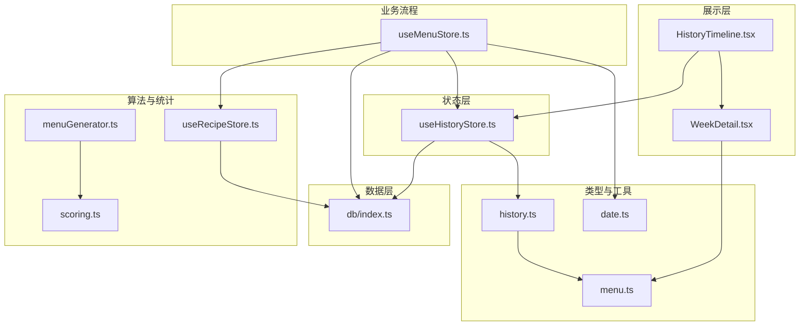
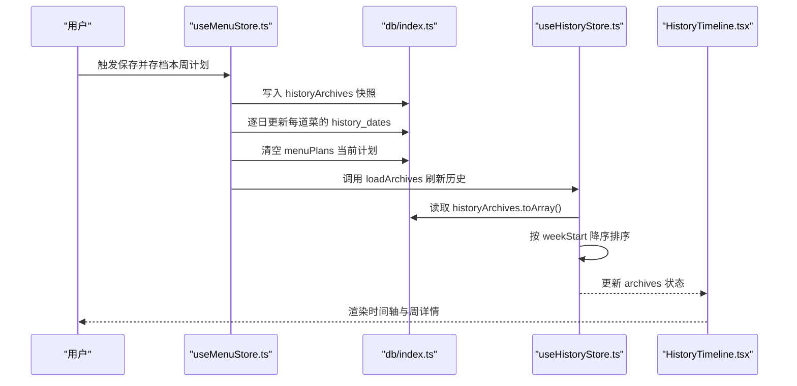
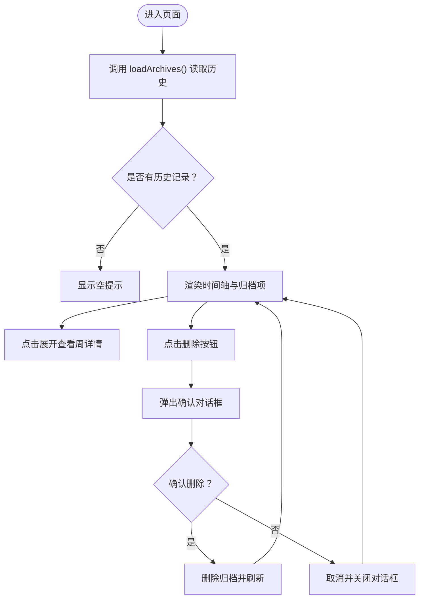
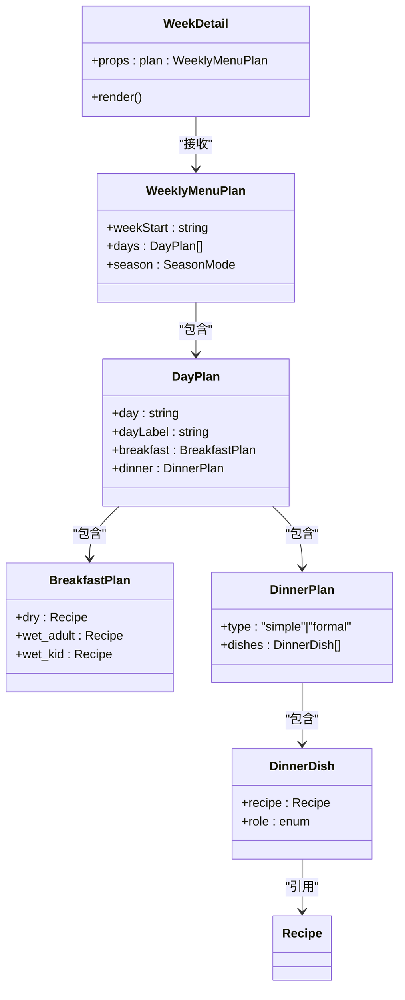
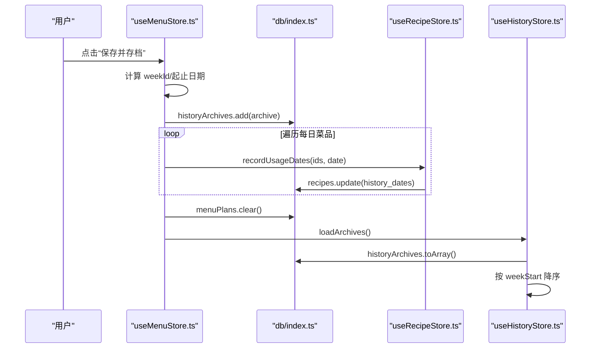
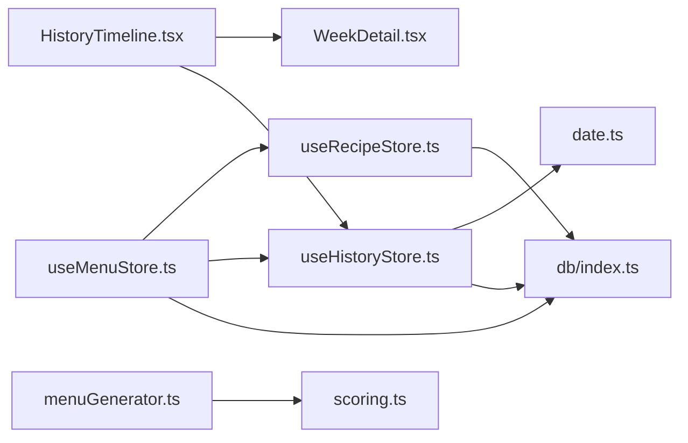

# 历史追踪组件

<cite>
**本文引用的文件**
- [HistoryTimeline.tsx](file://src/components/History/HistoryTimeline.tsx)
- [WeekDetail.tsx](file://src/components/History/WeekDetail.tsx)
- [useHistoryStore.ts](file://src/store/useHistoryStore.ts)
- [index.ts（数据库）](file://src/db/index.ts)
- [history.ts（类型）](file://src/types/history.ts)
- [menu.ts（类型）](file://src/types/menu.ts)
- [date.ts（工具）](file://src/utils/date.ts)
- [useMenuStore.ts](file://src/store/useMenuStore.ts)
- [scoring.ts（算法）](file://src/algorithms/scoring.ts)
- [menuGenerator.ts（算法）](file://src/algorithms/menuGenerator.ts)
- [useRecipeStore.ts](file://src/store/useRecipeStore.ts)
</cite>

## 目录
1. [简介](#简介)
2. [项目结构](#项目结构)
3. [核心组件](#核心组件)
4. [架构总览](#架构总览)
5. [组件详解](#组件详解)
6. [依赖关系分析](#依赖关系分析)
7. [性能与存储优化](#性能与存储优化)
8. [筛选、排序与导出](#筛选排序与导出)
9. [最佳实践与使用建议](#最佳实践与使用建议)
10. [故障排查指南](#故障排查指南)
11. [结论](#结论)

## 简介
本文件系统性解析“历史追踪组件”体系，覆盖历史时间线组件的历史时间轴展示逻辑、数据分组与滚动交互优化；周详情视图的周度统计、趋势分析与可视化呈现；历史数据的存储结构、查询与性能考量；以及筛选条件、排序规则与数据导出能力。同时给出基于历史数据优化烹饪习惯与营养摄入的实践建议。

## 项目结构
历史追踪相关模块围绕以下文件组织：
- 展示层：HistoryTimeline.tsx（时间轴）、WeekDetail.tsx（周详情）
- 状态层：useHistoryStore.ts（历史归档读取/删除/最近一次计划）
- 类型层：history.ts（历史归档）、menu.ts（周计划）
- 工具层：date.ts（周起始/周标识/日期格式化）
- 数据层：db/index.ts（IndexedDB/Dexie 定义与初始化）
- 业务流程：useMenuStore.ts（生成/归档周计划时写入历史）
- 算法层：scoring.ts、menuGenerator.ts（权重计算与菜单生成，间接影响历史统计）
- 菜谱使用记录：useRecipeStore.ts（记录菜品使用日期）

图表来源
- [HistoryTimeline.tsx:1-107](file://src/components/History/HistoryTimeline.tsx#L1-L107)
- [WeekDetail.tsx:1-56](file://src/components/History/WeekDetail.tsx#L1-L56)
- [useHistoryStore.ts:1-46](file://src/store/useHistoryStore.ts#L1-L46)
- [index.ts（数据库）:1-68](file://src/db/index.ts#L1-L68)
- [history.ts（类型）:1-11](file://src/types/history.ts#L1-L11)
- [menu.ts（类型）:1-45](file://src/types/menu.ts#L1-L45)
- [date.ts（工具）:1-49](file://src/utils/date.ts#L1-L49)
- [useMenuStore.ts:250-291](file://src/store/useMenuStore.ts#L250-L291)
- [scoring.ts（算法）:1-42](file://src/algorithms/scoring.ts#L1-L42)
- [menuGenerator.ts（算法）:1-143](file://src/algorithms/menuGenerator.ts#L1-L143)
- [useRecipeStore.ts:92-120](file://src/store/useRecipeStore.ts#L92-L120)

章节来源
- [HistoryTimeline.tsx:1-107](file://src/components/History/HistoryTimeline.tsx#L1-L107)
- [WeekDetail.tsx:1-56](file://src/components/History/WeekDetail.tsx#L1-L56)
- [useHistoryStore.ts:1-46](file://src/store/useHistoryStore.ts#L1-L46)
- [index.ts（数据库）:1-68](file://src/db/index.ts#L1-L68)
- [history.ts（类型）:1-11](file://src/types/history.ts#L1-L11)
- [menu.ts（类型）:1-45](file://src/types/menu.ts#L1-L45)
- [date.ts（工具）:1-49](file://src/utils/date.ts#L1-L49)
- [useMenuStore.ts:250-291](file://src/store/useMenuStore.ts#L250-L291)
- [scoring.ts（算法）:1-42](file://src/algorithms/scoring.ts#L1-L42)
- [menuGenerator.ts（算法）:1-143](file://src/algorithms/menuGenerator.ts#L1-L143)
- [useRecipeStore.ts:92-120](file://src/store/useRecipeStore.ts#L92-L120)

## 核心组件
- 历史时间线组件（HistoryTimeline）
  - 负责渲染历史归档列表，采用时间轴样式展示，支持展开/折叠查看周详情，支持删除单个归档。
  - 使用本地 IndexedDB 中的 historyArchives 表进行读写。
- 周详情视图（WeekDetail）
  - 展示某一周的早餐与晚餐构成，标注季节模式，按日分段展示菜品与标签。
- 历史状态管理（useHistoryStore）
  - 提供加载历史、选择归档、删除归档、获取最近一周计划等方法。
  - 默认按周起始日期降序排列，最近的在前。
- 数据库与索引（db/index.ts）
  - 定义 Dexie 数据库及表结构，包含 recipes、menuPlans、historyArchives。
  - 为 historyArchives 建立 weekId 与 weekStart 索引以支持高效查询与排序。
- 类型定义（history.ts、menu.ts）
  - HistoryArchive：包含周标识、起止日期、周计划快照与归档时间。
  - WeeklyMenuPlan/DayPlan/BreakfastPlan/DinnerPlan：描述周计划的数据模型。
- 日期工具（date.ts）
  - 提供周起始日期、周标识、日期格式化、下周一、周五推算等工具函数。

章节来源
- [HistoryTimeline.tsx:27-106](file://src/components/History/HistoryTimeline.tsx#L27-L106)
- [WeekDetail.tsx:44-55](file://src/components/History/WeekDetail.tsx#L44-L55)
- [useHistoryStore.ts:17-45](file://src/store/useHistoryStore.ts#L17-L45)
- [index.ts（数据库）:7-22](file://src/db/index.ts#L7-L22)
- [history.ts（类型）:3-10](file://src/types/history.ts#L3-L10)
- [menu.ts（类型）:19-34](file://src/types/menu.ts#L19-L34)
- [date.ts（工具）:4-48](file://src/utils/date.ts#L4-L48)

## 架构总览
历史追踪贯穿“生成/归档—存储—展示—交互”的闭环：
- 生成与归档：useMenuStore 在用户确认保存时，将当前周计划快照写入 historyArchives，并同步更新每道菜的使用日期记录。
- 存储与索引：Dexie 对 historyArchives 建立复合索引，便于按周起始日期排序与检索。
- 展示与交互：HistoryTimeline 读取归档并渲染时间轴，WeekDetail 展示周计划细节；支持删除与确认对话框。
- 统计与趋势：通过 useRecipeStore 记录菜品使用日期，结合算法层权重计算，形成可追溯的使用频次与偏好数据。

图表来源
- [useMenuStore.ts:250-291](file://src/store/useMenuStore.ts#L250-L291)
- [index.ts（数据库）:7-22](file://src/db/index.ts#L7-L22)
- [useHistoryStore.ts:21-26](file://src/store/useHistoryStore.ts#L21-L26)
- [HistoryTimeline.tsx:27-33](file://src/components/History/HistoryTimeline.tsx#L27-L33)

## 组件详解

### 历史时间线组件（HistoryTimeline）
- 时间轴展示逻辑
  - 使用 Accordion 实现每个归档的展开/折叠，左侧绘制垂直时间轴线与时间点标记。
  - 归档标题由 weekId（如“2024-W41”）与起止日期组合生成，便于识别周范围。
- 数据分组与排序
  - 从 historyArchives 读取全部归档，按 weekStart 降序排列，最近的在前。
- 滚动交互优化
  - 采用 Accordion 单项展开，避免一次性渲染过多内容；垂直时间轴线与点状标记提升可读性。
- 删除交互
  - 点击删除按钮弹出确认对话框，确认后删除对应归档并刷新列表。

图表来源
- [HistoryTimeline.tsx:27-106](file://src/components/History/HistoryTimeline.tsx#L27-L106)
- [useHistoryStore.ts:21-37](file://src/store/useHistoryStore.ts#L21-L37)

章节来源
- [HistoryTimeline.tsx:15-25](file://src/components/History/HistoryTimeline.tsx#L15-L25)
- [HistoryTimeline.tsx:27-106](file://src/components/History/HistoryTimeline.tsx#L27-L106)
- [useHistoryStore.ts:21-26](file://src/store/useHistoryStore.ts#L21-L26)

### 周详情视图（WeekDetail）
- 功能概述
  - 展示某一周的每日早餐与晚餐构成，标注季节模式（默认/夏季/冬季）。
  - 每日包含“干食/稀食（成人/小孩）”早餐组合与晚餐菜品列表，菜品旁附带分类标签。
- 可视化与布局
  - 使用语义化的标题与分隔线，突出每日结构；菜品标签使用 TagBadge 进行分类标识。
- 与历史数据的关系
  - 接收 WeeklyMenuPlan 作为 props，直接展示归档快照中的 planData，不进行二次计算。

图表来源
- [WeekDetail.tsx:4-6](file://src/components/History/WeekDetail.tsx#L4-L6)
- [menu.ts（类型）:3-34](file://src/types/menu.ts#L3-L34)

章节来源
- [WeekDetail.tsx:44-55](file://src/components/History/WeekDetail.tsx#L44-L55)
- [menu.ts（类型）:19-34](file://src/types/menu.ts#L19-L34)

### 历史数据存储结构与查询优化
- 存储结构
  - 表：historyArchives（自增主键、weekId、weekStart、planData、archivedAt）
  - 索引：historyArchives(weekId, weekStart)，用于快速按周范围检索与按周起始排序。
- 查询与排序
  - 读取：toArray() 返回全部归档
  - 排序：按 weekStart 降序，最近的在前
- 性能考量
  - 仅在需要时加载全部归档；通过索引 weekStart 实现高效排序与范围查询。
  - 删除后立即刷新列表，确保 UI 与数据一致性。

章节来源
- [index.ts（数据库）:14-18](file://src/db/index.ts#L14-L18)
- [useHistoryStore.ts:21-26](file://src/store/useHistoryStore.ts#L21-L26)

### 历史记录的归档流程与数据联动
- 归档时机
  - 用户点击“保存并存档本周计划”，触发归档流程。
- 归档步骤
  - 生成 weekId 与起止日期，对当前周计划做快照，写入 historyArchives。
  - 遍历每日菜品，调用 useRecipeStore.recordUsageDates 为每道菜添加使用日期。
  - 清空 menuPlans 当前计划，刷新历史列表。
- 数据联动
  - 周计划快照与历史归档一一对应；菜品使用日期随归档写入，形成可追溯的使用轨迹。

图表来源
- [useMenuStore.ts:250-291](file://src/store/useMenuStore.ts#L250-L291)
- [useRecipeStore.ts:92-107](file://src/store/useRecipeStore.ts#L92-L107)
- [useHistoryStore.ts:21-26](file://src/store/useHistoryStore.ts#L21-L26)

章节来源
- [useMenuStore.ts:250-291](file://src/store/useMenuStore.ts#L250-L291)
- [useRecipeStore.ts:92-107](file://src/store/useRecipeStore.ts#L92-L107)
- [useHistoryStore.ts:21-26](file://src/store/useHistoryStore.ts#L21-L26)

## 依赖关系分析
- 组件依赖
  - HistoryTimeline 依赖 useHistoryStore 读取与删除归档；依赖 WeekDetail 展示周详情。
  - WeekDetail 依赖 WeeklyMenuPlan 类型，直接渲染 planData。
- 状态与数据依赖
  - useHistoryStore 依赖 db.historyArchives 进行读写；依赖 date 工具生成周标识与日期。
  - useMenuStore 在归档时写入历史并更新菜品使用日期，再刷新历史列表。
- 算法与统计依赖
  - 菜谱权重计算与菜单生成算法影响“最近使用”集合，从而间接影响历史统计的权重分布。

图表来源
- [HistoryTimeline.tsx:1-14](file://src/components/History/HistoryTimeline.tsx#L1-L14)
- [WeekDetail.tsx:1-6](file://src/components/History/WeekDetail.tsx#L1-L6)
- [useHistoryStore.ts:1-15](file://src/store/useHistoryStore.ts#L1-L15)
- [index.ts（数据库）:1-22](file://src/db/index.ts#L1-L22)
- [date.ts（工具）:1-49](file://src/utils/date.ts#L1-L49)
- [useMenuStore.ts:1-15](file://src/store/useMenuStore.ts#L1-L15)
- [useRecipeStore.ts:92-107](file://src/store/useRecipeStore.ts#L92-L107)
- [menuGenerator.ts（算法）:1-143](file://src/algorithms/menuGenerator.ts#L1-L143)
- [scoring.ts（算法）:1-42](file://src/algorithms/scoring.ts#L1-L42)

章节来源
- [HistoryTimeline.tsx:1-14](file://src/components/History/HistoryTimeline.tsx#L1-L14)
- [WeekDetail.tsx:1-6](file://src/components/History/WeekDetail.tsx#L1-L6)
- [useHistoryStore.ts:1-15](file://src/store/useHistoryStore.ts#L1-L15)
- [index.ts（数据库）:1-22](file://src/db/index.ts#L1-L22)
- [date.ts（工具）:1-49](file://src/utils/date.ts#L1-L49)
- [useMenuStore.ts:1-15](file://src/store/useMenuStore.ts#L1-L15)
- [useRecipeStore.ts:92-107](file://src/store/useRecipeStore.ts#L92-L107)
- [menuGenerator.ts（算法）:1-143](file://src/algorithms/menuGenerator.ts#L1-L143)
- [scoring.ts（算法）:1-42](file://src/algorithms/scoring.ts#L1-L42)

## 性能与存储优化
- 索引策略
  - historyArchives 建立 weekId 与 weekStart 索引，支持按周范围检索与按周起始排序。
- 读写路径
  - 读取：toArray() 后在内存中按 weekStart 降序排序，适合中小规模历史数据。
  - 写入：归档时批量写入，随后刷新列表，避免频繁多次 IO。
- 交互优化
  - 使用 Accordion 控制展开/折叠，减少 DOM 节点数量，提升滚动性能。
- 数据量增长建议
  - 若历史归档数量显著增长，可考虑：
    - 分页加载或虚拟滚动（需引入额外 UI 库）
    - 增加 weekId 范围过滤查询
    - 将周详情内容延迟加载（仅在展开时渲染）

章节来源
- [index.ts（数据库）:14-18](file://src/db/index.ts#L14-L18)
- [useHistoryStore.ts:21-26](file://src/store/useHistoryStore.ts#L21-L26)
- [HistoryTimeline.tsx:63-93](file://src/components/History/HistoryTimeline.tsx#L63-L93)

## 筛选、排序与导出
- 筛选条件
  - 当前实现未提供 UI 筛选项；可通过扩展在 useMenuStore 或 useRecipeStore 中增加过滤逻辑（如按周范围、菜品类别、日期区间等），并在归档阶段或查询阶段应用。
- 排序规则
  - 默认按 weekStart 降序排列，最近的在前。
- 导出功能
  - 当前未实现导出；可在 HistoryTimeline 中新增导出按钮，将 archives 序列化为 JSON/CSV 并下载，便于用户备份或进一步分析。

章节来源
- [useHistoryStore.ts:21-26](file://src/store/useHistoryStore.ts#L21-L26)
- [HistoryTimeline.tsx:27-106](file://src/components/History/HistoryTimeline.tsx#L27-L106)

## 最佳实践与使用建议
- 利用历史数据优化烹饪习惯
  - 通过菜品使用日期（history_dates）观察高频/低频菜品，调整菜单生成策略，避免过度重复。
  - 结合评分算法（calculateWeight）与权重因子，控制跨周重复频率，提升新鲜感。
- 营养与口味平衡
  - 在周详情中关注每日菜品角色分布（肉、菜、汤、主食、凉拌、一锅），结合季节模式（summer/winter/default）进行搭配优化。
- 周期性回顾
  - 定期查看历史时间轴，识别重复模式与偏好变化，动态调整菜谱库与权重参数。

章节来源
- [useRecipeStore.ts:92-107](file://src/store/useRecipeStore.ts#L92-L107)
- [scoring.ts（算法）:14-42](file://src/algorithms/scoring.ts#L14-L42)
- [WeekDetail.tsx:44-55](file://src/components/History/WeekDetail.tsx#L44-L55)

## 故障排查指南
- 历史记录为空
  - 确认是否已完成“保存并存档本周计划”，归档成功后会刷新历史列表。
- 删除后未生效
  - 检查删除确认流程是否完成；确认 loadArchives 是否被调用刷新。
- 排序异常
  - 确保 weekStart 字段格式正确（ISO 日期字符串），否则排序可能异常。
- 数据库版本问题
  - 若种子数据版本升级导致异常，检查 SEED_VERSION 与本地存储版本号，必要时重置种子数据。

章节来源
- [HistoryTimeline.tsx:35-40](file://src/components/History/HistoryTimeline.tsx#L35-L40)
- [useHistoryStore.ts:30-37](file://src/store/useHistoryStore.ts#L30-L37)
- [index.ts（数据库）:37-57](file://src/db/index.ts#L37-L57)

## 结论
历史追踪组件通过清晰的展示层、稳定的状态层与高效的本地存储，实现了从“生成/归档—存储—展示—交互”的完整闭环。结合菜品使用日期与权重算法，用户可以基于历史数据持续优化烹饪习惯与营养搭配。未来可在筛选、排序与导出方面进一步增强，以满足更复杂的分析需求。