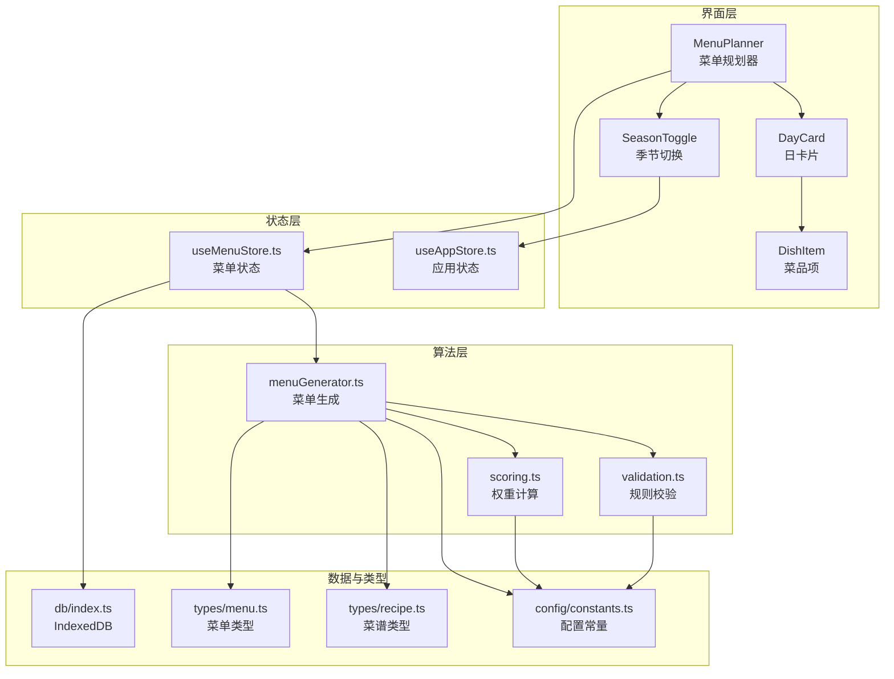
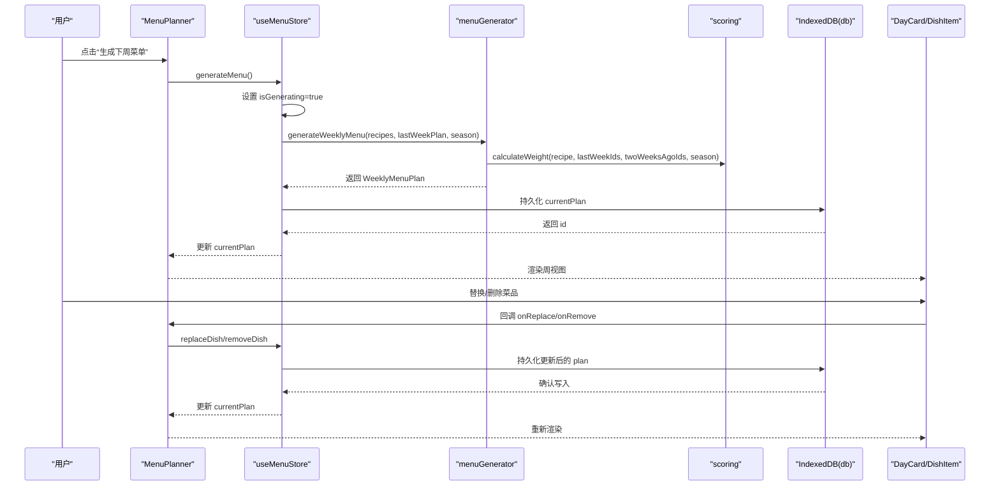
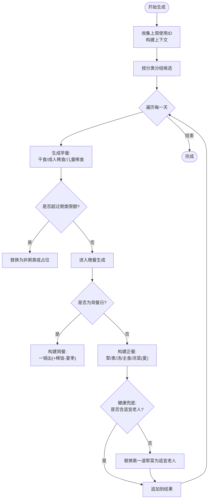
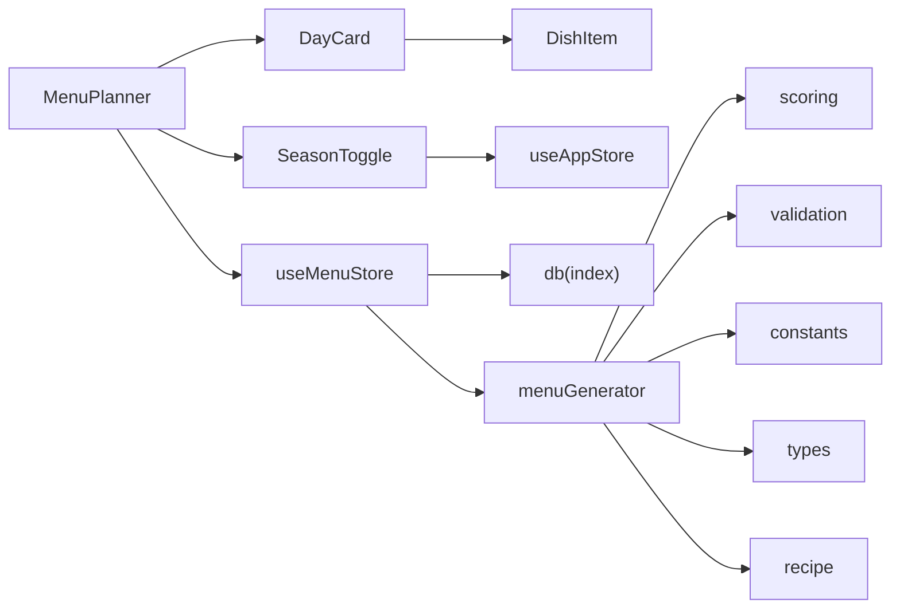

# 菜单组件

<cite>
**本文引用的文件**
- [MenuPlanner.tsx](file://src/components/Menu/MenuPlanner.tsx)
- [DayCard.tsx](file://src/components/Menu/DayCard.tsx)
- [DishItem.tsx](file://src/components/Menu/DishItem.tsx)
- [SeasonToggle.tsx](file://src/components/Menu/SeasonToggle.tsx)
- [menuGenerator.ts](file://src/algorithms/menuGenerator.ts)
- [scoring.ts](file://src/algorithms/scoring.ts)
- [validation.ts](file://src/algorithms/validation.ts)
- [useMenuStore.ts](file://src/store/useMenuStore.ts)
- [useAppStore.ts](file://src/store/useAppStore.ts)
- [constants.ts](file://src/config/constants.ts)
- [menu.ts](file://src/types/menu.ts)
- [recipe.ts](file://src/types/recipe.ts)
- [index.ts](file://src/db/index.ts)
</cite>

## 目录
1. [简介](#简介)
2. [项目结构](#项目结构)
3. [核心组件](#核心组件)
4. [架构总览](#架构总览)
5. [详细组件分析](#详细组件分析)
6. [依赖关系分析](#依赖关系分析)
7. [性能考量](#性能考量)
8. [故障排查指南](#故障排查指南)
9. [结论](#结论)
10. [附录](#附录)

## 简介
本文件面向“菜单组件系统”的使用者与维护者，系统性阐述 MenuPlanner 菜单规划器的智能生成算法、冲突避免机制与季节性调整策略；详解 DayCard 日卡片组件的日程展示逻辑、DishItem 菜品项组件的菜品管理与交互模式；解释 SeasonToggle 季节切换组件的季节性食材推荐算法；并给出组件间的数据传递机制、状态管理与用户交互流程。文末提供可扩展与自定义建议及常见问题排查方法。

## 项目结构
菜单组件位于 src/components/Menu 下，配合算法层（src/algorithms）、状态层（src/store）、类型定义（src/types）与数据库（src/db）协同工作。整体采用“组件-算法-状态-数据”分层设计，职责清晰、耦合度低。

图表来源
- [MenuPlanner.tsx:1-75](file://src/components/Menu/MenuPlanner.tsx#L1-L75)
- [DayCard.tsx:1-78](file://src/components/Menu/DayCard.tsx#L1-L78)
- [DishItem.tsx:1-124](file://src/components/Menu/DishItem.tsx#L1-L124)
- [SeasonToggle.tsx:1-27](file://src/components/Menu/SeasonToggle.tsx#L1-L27)
- [menuGenerator.ts:1-374](file://src/algorithms/menuGenerator.ts#L1-L374)
- [scoring.ts:1-64](file://src/algorithms/scoring.ts#L1-L64)
- [validation.ts:1-142](file://src/algorithms/validation.ts#L1-L142)
- [useMenuStore.ts:1-292](file://src/store/useMenuStore.ts#L1-L292)
- [useAppStore.ts:1-26](file://src/store/useAppStore.ts#L1-L26)
- [index.ts:1-68](file://src/db/index.ts#L1-L68)
- [menu.ts:1-45](file://src/types/menu.ts#L1-L45)
- [recipe.ts:1-21](file://src/types/recipe.ts#L1-L21)
- [constants.ts:1-44](file://src/config/constants.ts#L1-L44)

章节来源
- [MenuPlanner.tsx:1-75](file://src/components/Menu/MenuPlanner.tsx#L1-L75)
- [DayCard.tsx:1-78](file://src/components/Menu/DayCard.tsx#L1-L78)
- [DishItem.tsx:1-124](file://src/components/Menu/DishItem.tsx#L1-L124)
- [SeasonToggle.tsx:1-27](file://src/components/Menu/SeasonToggle.tsx#L1-L27)
- [menuGenerator.ts:1-374](file://src/algorithms/menuGenerator.ts#L1-L374)
- [scoring.ts:1-64](file://src/algorithms/scoring.ts#L1-L64)
- [validation.ts:1-142](file://src/algorithms/validation.ts#L1-L142)
- [useMenuStore.ts:1-292](file://src/store/useMenuStore.ts#L1-L292)
- [useAppStore.ts:1-26](file://src/store/useAppStore.ts#L1-L26)
- [index.ts:1-68](file://src/db/index.ts#L1-L68)
- [menu.ts:1-45](file://src/types/menu.ts#L1-L45)
- [recipe.ts:1-21](file://src/types/recipe.ts#L1-L21)
- [constants.ts:1-44](file://src/config/constants.ts#L1-L44)

## 核心组件
- MenuPlanner：菜单规划器，负责加载/生成/保存/归档菜单计划，渲染周视图与控制区，并协调 SeasonToggle 与 DayCard。
- DayCard：日卡片，展示单日早餐与晚餐结构，组织 DishItem 列表。
- DishItem：菜品项，承载菜品详情弹窗、角色徽标、悬停操作按钮（替换/删除）。
- SeasonToggle：季节切换，提供默认/夏季/冬季三种模式，影响生成与权重计算。
- useMenuStore：菜单状态管理，封装生成、替换、删除、归档等动作，持久化至 IndexedDB。
- useAppStore：应用状态，维护当前季节模式。
- 算法模块：menuGenerator 负责智能生成与季节调整；scoring 负责权重计算；validation 提供规则校验。
- 类型与配置：types 定义数据模型；constants 提供规则与权重参数。

章节来源
- [MenuPlanner.tsx:1-75](file://src/components/Menu/MenuPlanner.tsx#L1-L75)
- [DayCard.tsx:1-78](file://src/components/Menu/DayCard.tsx#L1-L78)
- [DishItem.tsx:1-124](file://src/components/Menu/DishItem.tsx#L1-L124)
- [SeasonToggle.tsx:1-27](file://src/components/Menu/SeasonToggle.tsx#L1-L27)
- [useMenuStore.ts:1-292](file://src/store/useMenuStore.ts#L1-L292)
- [useAppStore.ts:1-26](file://src/store/useAppStore.ts#L1-L26)
- [menuGenerator.ts:1-374](file://src/algorithms/menuGenerator.ts#L1-L374)
- [scoring.ts:1-64](file://src/algorithms/scoring.ts#L1-L64)
- [validation.ts:1-142](file://src/algorithms/validation.ts#L1-L142)
- [menu.ts:1-45](file://src/types/menu.ts#L1-L45)
- [recipe.ts:1-21](file://src/types/recipe.ts#L1-L21)
- [constants.ts:1-44](file://src/config/constants.ts#L1-L44)

## 架构总览
下图展示从用户交互到数据落盘的端到端流程：用户点击生成按钮触发算法层，算法层根据季节模式与权重策略生成菜单，状态层持久化并回填界面；用户在日卡片中进行替换/删除操作，状态层更新后同步到数据库。

图表来源
- [MenuPlanner.tsx:1-75](file://src/components/Menu/MenuPlanner.tsx#L1-L75)
- [useMenuStore.ts:1-292](file://src/store/useMenuStore.ts#L1-L292)
- [menuGenerator.ts:1-374](file://src/algorithms/menuGenerator.ts#L1-L374)
- [scoring.ts:1-64](file://src/algorithms/scoring.ts#L1-L64)
- [index.ts:1-68](file://src/db/index.ts#L1-L68)

## 详细组件分析

### MenuPlanner 菜单规划器
- 职责
  - 初始化加载当前计划
  - 触发菜单生成（受 isGenerating 控制）
  - 渲染周视图（DayCard 列表）
  - 提供“保存并存档本周计划”入口
  - 与 SeasonToggle 协作，读取当前季节模式
- 关键交互
  - 通过 useMenuStore 的 generateMenu/loadCurrentPlan/archivePlan 管理生命周期
  - 将 onReplace/onRemove 事件透传给 DayCard
- 设计要点
  - 生成按钮禁用期间提示“生成中...”，提升用户体验
  - 无计划时显示引导文案与图标，降低认知负担

章节来源
- [MenuPlanner.tsx:1-75](file://src/components/Menu/MenuPlanner.tsx#L1-L75)
- [useMenuStore.ts:1-292](file://src/store/useMenuStore.ts#L1-L292)

### DayCard 日卡片
- 职责
  - 展示单日的早餐与晚餐结构
  - 组织多组 DishItem，分别对应不同角色/槽位
- 结构
  - 早餐区域：干食、成人稀食、儿童稀食
  - 晚餐区域：简餐/正餐标识，菜品列表
- 交互
  - 通过 onReplace/onRemove 将操作回调给父组件
  - 简餐标识通过 Badge 展示

章节来源
- [DayCard.tsx:1-78](file://src/components/Menu/DayCard.tsx#L1-L78)
- [menu.ts:1-45](file://src/types/menu.ts#L1-L45)

### DishItem 菜品项
- 职责
  - 展示菜品名称与角色徽标
  - 提供菜品详情对话框（名称、标签、食材、做法）
  - 悬停显示替换/删除按钮（条件可见）
- 交互模式
  - 点击名称打开详情对话框
  - 悬停显示操作按钮，点击替换/删除
  - 角色映射到不同徽标变体，便于识别
- 扩展点
  - 可增加收藏、评分、加入购物清单等按钮
  - 可扩展为可拖拽排序的容器

章节来源
- [DishItem.tsx:1-124](file://src/components/Menu/DishItem.tsx#L1-L124)
- [menu.ts:1-45](file://src/types/menu.ts#L1-L45)
- [recipe.ts:1-21](file://src/types/recipe.ts#L1-L21)

### SeasonToggle 季节切换
- 职责
  - 在默认/夏季/冬季之间切换
  - 将选择写入 useAppStore，供算法层读取
- 影响范围
  - 影响权重计算（夏季/冬季推荐标签加成）
  - 影响晚餐配置（夏季增加凉菜数量）

章节来源
- [SeasonToggle.tsx:1-27](file://src/components/Menu/SeasonToggle.tsx#L1-L27)
- [useAppStore.ts:1-26](file://src/store/useAppStore.ts#L1-L26)
- [constants.ts:1-44](file://src/config/constants.ts#L1-L44)

### 菜单生成算法（menuGenerator）
- 生成目标
  - 生成周一至周五的每日计划（10顿：早餐+晚餐）
- 关键机制
  - 权重选择：基于评分、新鲜度（跨周降权）、季节匹配
  - 使用计数：按分类维护使用次数，避免过度重复
  - 冲突避免：
    - 严格候选池（权重>0且未超限）
    - 软候选池（未超限但权重趋近0.001）
    - 兜底池（允许重复，仅在池枯竭时启用）
  - 季节性调整：
    - 正餐配置随季节变化（夏季增加凉菜）
    - 汤与推荐标签按季节筛选
    - 简餐：夏季可搭配稀饭（带粥类标签）
  - 健康兜底：至少包含一道“适宜老人”标签菜品，否则替换第一道荤菜
- 早餐特殊规则
  - 周一、三、五成人稀食强制为“牛奶燕麦片”
  - 粥类每周最多出现一次
- 输出
  - 返回 WeeklyMenuPlan，包含周起始日期、星期标签、每日计划与季节模式

图表来源
- [menuGenerator.ts:134-232](file://src/algorithms/menuGenerator.ts#L134-L232)
- [menuGenerator.ts:238-342](file://src/algorithms/menuGenerator.ts#L238-L342)
- [menuGenerator.ts:347-374](file://src/algorithms/menuGenerator.ts#L347-L374)

章节来源
- [menuGenerator.ts:1-374](file://src/algorithms/menuGenerator.ts#L1-L374)
- [scoring.ts:1-64](file://src/algorithms/scoring.ts#L1-L64)
- [validation.ts:1-142](file://src/algorithms/validation.ts#L1-L142)
- [constants.ts:1-44](file://src/config/constants.ts#L1-L44)

### 权重计算与随机选择（scoring）
- 权重构成
  - 基础分：评分归一化（null 视为3）
  - 新鲜度权重：上周0.1、两周前0.5、更早1.0
  - 季节加成：与当前季节匹配的推荐标签加成1.2
  - 拉黑：直接返回0
- 随机选择
  - 总权重为0时退化为均匀随机
  - 否则按权重比例抽样

章节来源
- [scoring.ts:1-64](file://src/algorithms/scoring.ts#L1-L64)
- [constants.ts:1-44](file://src/config/constants.ts#L1-L44)

### 规则校验（validation）
- 校验内容
  - 早餐结构完整性
  - 周一/三/五成人稀食强制为“牛奶燕麦片”
  - 粥类周限额
  - 简餐天数
  - 正餐配菜数量与季节配置一致性
  - “适宜老人”兜底
  - 分类+菜品重复次数（5星菜例外）
- 返回值
  - valid、errors、warnings

章节来源
- [validation.ts:1-142](file://src/algorithms/validation.ts#L1-L142)
- [constants.ts:1-44](file://src/config/constants.ts#L1-L44)

### 状态管理（useMenuStore）
- 状态
  - currentPlan：当前周菜单计划
  - isGenerating：生成中标志
- 动作
  - generateMenu：拉取菜谱与上周计划，调用算法生成，持久化并设置状态
  - loadCurrentPlan：从数据库加载最新计划
  - replaceDish：按槽位/角色筛选候选池，避免重复与拉黑，替换后持久化
  - removeDish：仅支持晚餐菜品移除
  - savePlan/archivePlan：保存/归档当前计划
- 数据流
  - 与 useAppStore（季节）与 useRecipeStore（历史记录）协作
  - 与 db（IndexedDB）交互

章节来源
- [useMenuStore.ts:1-292](file://src/store/useMenuStore.ts#L1-L292)
- [index.ts:1-68](file://src/db/index.ts#L1-L68)

### 应用状态（useAppStore）
- 状态
  - activeTab：当前激活的导航标签
  - season：当前季节模式
  - isInitialized：初始化标志
- 作用
  - 为 SeasonToggle 与算法层提供 season 读取入口

章节来源
- [useAppStore.ts:1-26](file://src/store/useAppStore.ts#L1-L26)

### 类型与配置
- 类型
  - 菜单类型：Daily/Breakfast/Dinner/Dish/WeeklyPlan
  - 菜谱类型：Recipe、RecipeCategory、Tags
- 配置
  - 强制早餐、粥类限额、简餐次数
  - 正餐配置（按季节）
  - 跨周权重因子、5星重复上限
  - 标签常量（适宜老人、夏季/冬季推荐、凉菜、粥类、辣）

章节来源
- [menu.ts:1-45](file://src/types/menu.ts#L1-L45)
- [recipe.ts:1-21](file://src/types/recipe.ts#L1-L21)
- [constants.ts:1-44](file://src/config/constants.ts#L1-L44)

## 依赖关系分析
- 组件依赖
  - MenuPlanner 依赖 useMenuStore、SeasonToggle、DayCard
  - DayCard 依赖 DishItem
  - SeasonToggle 依赖 useAppStore
- 算法依赖
  - menuGenerator 依赖 scoring、validation、constants、types、recipe
- 状态依赖
  - useMenuStore 依赖 db、useAppStore、useRecipeStore、useHistoryStore
- 数据依赖
  - db 提供 IndexedDB 访问，包含 recipes、menuPlans、historyArchives

图表来源
- [MenuPlanner.tsx:1-75](file://src/components/Menu/MenuPlanner.tsx#L1-L75)
- [DayCard.tsx:1-78](file://src/components/Menu/DayCard.tsx#L1-L78)
- [DishItem.tsx:1-124](file://src/components/Menu/DishItem.tsx#L1-L124)
- [SeasonToggle.tsx:1-27](file://src/components/Menu/SeasonToggle.tsx#L1-L27)
- [useMenuStore.ts:1-292](file://src/store/useMenuStore.ts#L1-L292)
- [useAppStore.ts:1-26](file://src/store/useAppStore.ts#L1-L26)
- [menuGenerator.ts:1-374](file://src/algorithms/menuGenerator.ts#L1-L374)
- [scoring.ts:1-64](file://src/algorithms/scoring.ts#L1-L64)
- [validation.ts:1-142](file://src/algorithms/validation.ts#L1-L142)
- [index.ts:1-68](file://src/db/index.ts#L1-L68)
- [menu.ts:1-45](file://src/types/menu.ts#L1-L45)
- [recipe.ts:1-21](file://src/types/recipe.ts#L1-L21)
- [constants.ts:1-44](file://src/config/constants.ts#L1-L44)

章节来源
- [useMenuStore.ts:1-292](file://src/store/useMenuStore.ts#L1-L292)
- [menuGenerator.ts:1-374](file://src/algorithms/menuGenerator.ts#L1-L374)
- [index.ts:1-68](file://src/db/index.ts#L1-L68)

## 性能考量
- 生成复杂度
  - 每日按分类遍历候选池，权重计算与随机选择均为线性复杂度
  - 使用 Map/Set 进行使用计数与ID集合查询，查找/插入均摊 O(1)
- I/O 优化
  - 一次性批量读取菜谱与历史计划，减少多次查询
  - 生成完成后统一持久化，避免频繁写入
- 用户体验
  - 生成期间禁用按钮，避免并发请求
  - 替换/删除操作即时反馈，减少等待

## 故障排查指南
- 生成失败或为空
  - 检查 IndexedDB 是否存在菜谱数据（首次启动会自动导入种子数据）
  - 确认 useMenuStore.generateMenu 是否正确读取 season 与 lastWeekPlan
- 菜品重复过多
  - 检查分类使用计数逻辑与 pickRecipe 的严格/软候选池分支
  - 确认 5星菜重复上限配置
- 季节推荐未生效
  - 确认 SeasonToggle 已切换到对应模式
  - 检查算法层对推荐标签的筛选与加成逻辑
- 替换/删除无效
  - 确认 DishItem 的 onReplace/onRemove 回调是否正确传递
  - 检查 useMenuStore.replaceDish/removeDish 的索引与池过滤逻辑

章节来源
- [index.ts:1-68](file://src/db/index.ts#L1-L68)
- [useMenuStore.ts:1-292](file://src/store/useMenuStore.ts#L1-L292)
- [menuGenerator.ts:1-374](file://src/algorithms/menuGenerator.ts#L1-L374)
- [scoring.ts:1-64](file://src/algorithms/scoring.ts#L1-L64)

## 结论
菜单组件系统通过清晰的分层设计与完善的算法策略，实现了高可用的智能菜单生成与管理。其关键优势在于：
- 智能权重与跨周降权避免重复，结合严格/软候选池与兜底策略确保多样性
- 季节性调整与健康兜底保障营养均衡与口味变化
- 状态与数据分离，易于扩展与维护
建议后续可在 DishItem 中增加更多交互能力，并考虑引入缓存与预计算以进一步提升性能。

## 附录
- 扩展建议
  - 在 DishItem 中增加“收藏/评分/加入购物清单”按钮
  - 在 SeasonToggle 中增加“自定义标签”选项，动态影响权重
  - 在 useMenuStore 中增加“批量替换/批量删除”能力
  - 在算法层增加“偏好权重”参数，允许用户微调权重分布
- 自定义步骤
  - 修改 constants.ts 中的配置常量，如正餐配置、重复上限、标签常量
  - 在 menuGenerator.ts 中扩展 pickRecipe 的候选池过滤逻辑
  - 在 DishItem 中扩展对话框内容或新增操作按钮
  - 在 useMenuStore 中扩展 replaceDish 的池过滤与兜底策略