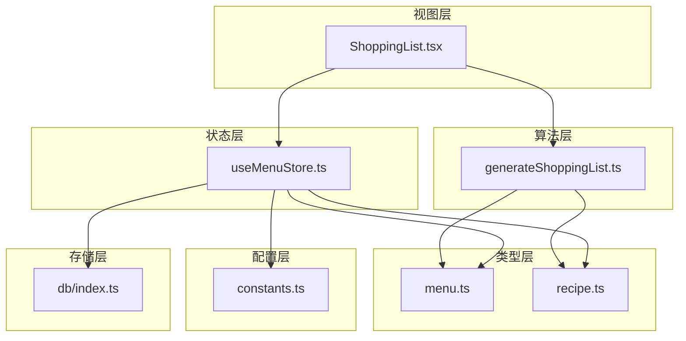
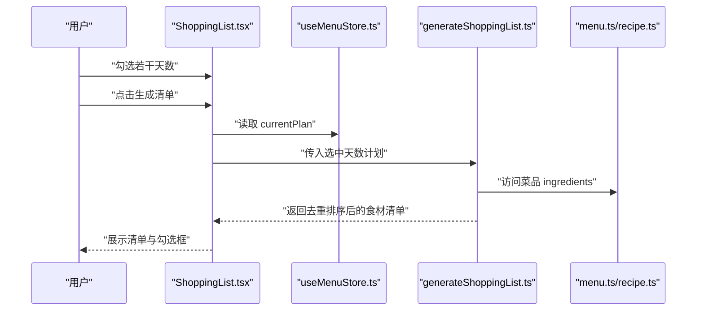
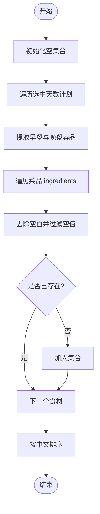
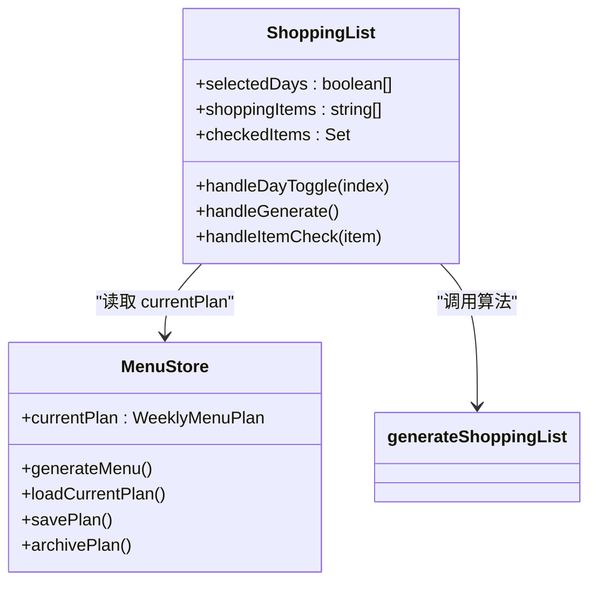
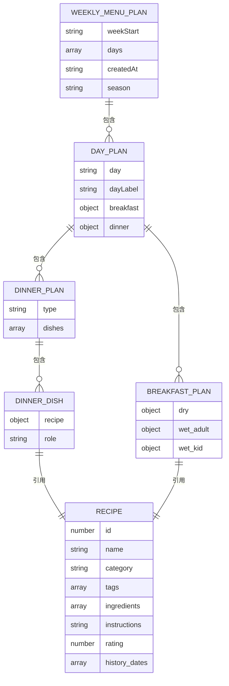
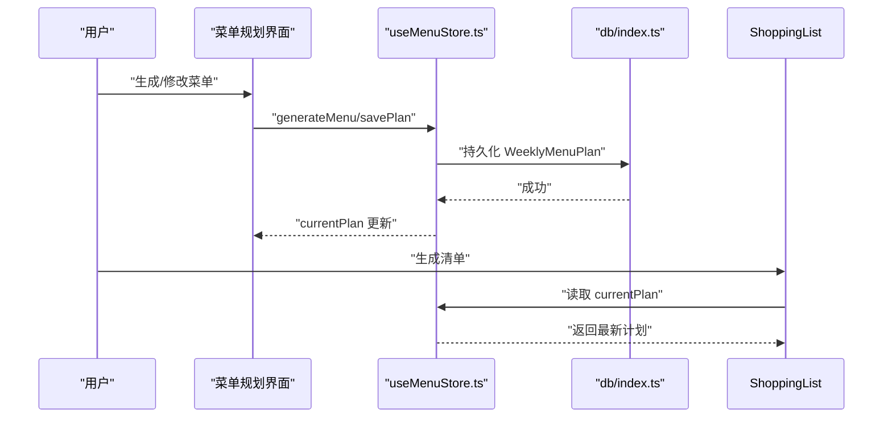
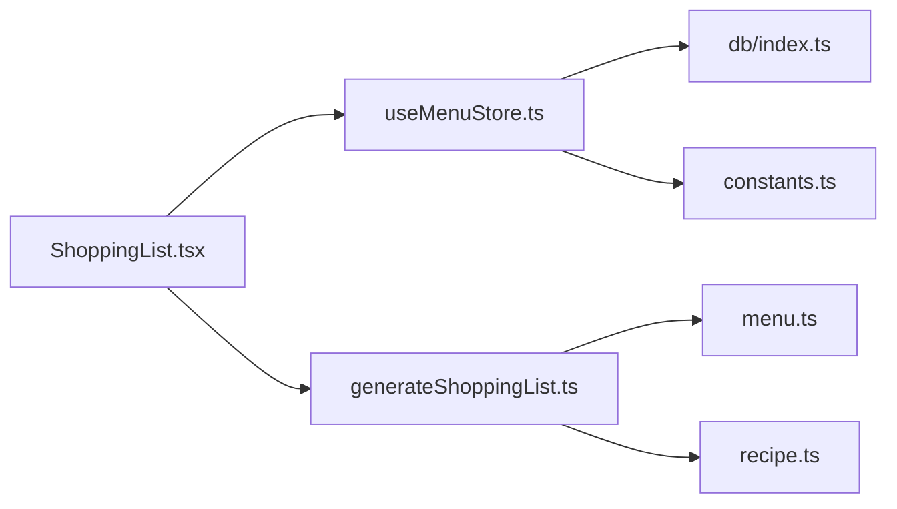

# 购物清单组件

<cite>
**本文引用的文件**
- [src/components/Shopping/ShoppingList.tsx](file://src/components/Shopping/ShoppingList.tsx)
- [src/algorithms/shoppingList.ts](file://src/algorithms/shoppingList.ts)
- [src/store/useMenuStore.ts](file://src/store/useMenuStore.ts)
- [src/types/menu.ts](file://src/types/menu.ts)
- [src/types/recipe.ts](file://src/types/recipe.ts)
- [src/config/constants.ts](file://src/config/constants.ts)
- [src/db/index.ts](file://src/db/index.ts)
- [src/lib/utils.ts](file://src/lib/utils.ts)
- [src/utils/date.ts](file://src/utils/date.ts)
</cite>

## 目录
1. [简介](#简介)
2. [项目结构](#项目结构)
3. [核心组件](#核心组件)
4. [架构总览](#架构总览)
5. [详细组件分析](#详细组件分析)
6. [依赖关系分析](#依赖关系分析)
7. [性能考量](#性能考量)
8. [故障排查指南](#故障排查指南)
9. [结论](#结论)
10. [附录](#附录)

## 简介
本文件系统性阐述“购物清单”组件的设计与实现，重点覆盖以下方面：
- 自动化生成算法：食材需求提取、去重与排序策略
- 数据结构设计：菜单计划、菜品与食材的类型模型
- 动态更新机制：与菜单规划系统的联动与状态管理
- 用户交互：可勾选的购物清单、天数筛选与进度提示
- 集成与扩展：与数据库、标签与分类常量的协作
- 导出与打印：当前实现与可扩展建议
- 使用场景与优化：常见工作流与效率提升建议

## 项目结构
购物清单功能横跨多个层次：
- 视图层：ShoppingList 组件负责渲染与交互（天数选择、生成按钮、清单列表、勾选状态）
- 算法层：generateShoppingList 负责从菜单计划中抽取食材并去重排序
- 状态层：useMenuStore 提供菜单计划的生成、加载、替换与归档能力
- 类型层：menu.ts 与 recipe.ts 定义了菜单计划、菜品与食材的数据模型
- 配置层：constants.ts 提供标签与分类映射等常量
- 存储层：db/index.ts 基于 Dexie 的 IndexedDB 封装，提供本地持久化

图表来源
- [src/components/Shopping/ShoppingList.tsx:1-130](file://src/components/Shopping/ShoppingList.tsx#L1-L130)
- [src/algorithms/shoppingList.ts:1-32](file://src/algorithms/shoppingList.ts#L1-L32)
- [src/store/useMenuStore.ts:1-292](file://src/store/useMenuStore.ts#L1-L292)
- [src/types/menu.ts:1-45](file://src/types/menu.ts#L1-L45)
- [src/types/recipe.ts:1-21](file://src/types/recipe.ts#L1-L21)
- [src/config/constants.ts:1-44](file://src/config/constants.ts#L1-L44)
- [src/db/index.ts:1-68](file://src/db/index.ts#L1-L68)

章节来源
- [src/components/Shopping/ShoppingList.tsx:1-130](file://src/components/Shopping/ShoppingList.tsx#L1-L130)
- [src/algorithms/shoppingList.ts:1-32](file://src/algorithms/shoppingList.ts#L1-L32)
- [src/store/useMenuStore.ts:1-292](file://src/store/useMenuStore.ts#L1-L292)
- [src/types/menu.ts:1-45](file://src/types/menu.ts#L1-L45)
- [src/types/recipe.ts:1-21](file://src/types/recipe.ts#L1-L21)
- [src/config/constants.ts:1-44](file://src/config/constants.ts#L1-L44)
- [src/db/index.ts:1-68](file://src/db/index.ts#L1-L68)

## 核心组件
- ShoppingList 组件
  - 负责渲染天数选择区与生成按钮，并展示生成的食材清单
  - 维护勾选状态集合，用于统计已完成数量
  - 通过 useMenuStore.currentPlan 获取当前菜单计划
- generateShoppingList 算法
  - 从选中的天数计划中提取早餐与晚餐菜品
  - 遍历菜品的 ingredients 数组，进行字符串级去重与排序
- useMenuStore
  - 提供 generateMenu/loadCurrentPlan/savePlan/archivePlan 等动作
  - 与数据库交互，保存与读取菜单计划
- 类型模型
  - WeeklyMenuPlan/DayPlan/BreakfastPlan/DinnerPlan/DinnerDish
  - Recipe 及其 ingredients 数组
- 配置与工具
  - TAGS/CATEGORY_LABELS 常量
  - 日期工具函数（周一、周标识、格式化）

章节来源
- [src/components/Shopping/ShoppingList.tsx:11-129](file://src/components/Shopping/ShoppingList.tsx#L11-L129)
- [src/algorithms/shoppingList.ts:11-31](file://src/algorithms/shoppingList.ts#L11-L31)
- [src/store/useMenuStore.ts:127-291](file://src/store/useMenuStore.ts#L127-L291)
- [src/types/menu.ts:3-34](file://src/types/menu.ts#L3-L34)
- [src/types/recipe.ts:11-20](file://src/types/recipe.ts#L11-L20)
- [src/config/constants.ts:24-43](file://src/config/constants.ts#L24-L43)
- [src/utils/date.ts:4-48](file://src/utils/date.ts#L4-L48)

## 架构总览
购物清单的端到端流程如下：

图表来源
- [src/components/Shopping/ShoppingList.tsx:21-27](file://src/components/Shopping/ShoppingList.tsx#L21-L27)
- [src/store/useMenuStore.ts:127-165](file://src/store/useMenuStore.ts#L127-L165)
- [src/algorithms/shoppingList.ts:11-31](file://src/algorithms/shoppingList.ts#L11-L31)
- [src/types/menu.ts:19-34](file://src/types/menu.ts#L19-L34)
- [src/types/recipe.ts:11-20](file://src/types/recipe.ts#L11-L20)

## 详细组件分析

### 1) 生成算法：generateShoppingList
- 输入：选中的 DayPlan[]（来自菜单计划）
- 处理步骤
  - 展开每个 DayPlan 的早餐与晚餐菜品，收集 Recipe
  - 遍历每个 Recipe 的 ingredients 数组
  - 对每个条目执行 trim 并去空，使用 Set 去重
  - 使用 localeCompare 按中文排序
- 输出：string[]（已去重且排序的食材名列表）
- 复杂度
  - 时间复杂度：O(N + M log M)，N 为食材总数，M 为去重后数量
  - 空间复杂度：O(M) 用于去重集合与结果数组

图表来源
- [src/algorithms/shoppingList.ts:11-31](file://src/algorithms/shoppingList.ts#L11-L31)

章节来源
- [src/algorithms/shoppingList.ts:4-31](file://src/algorithms/shoppingList.ts#L4-L31)

### 2) 视图组件：ShoppingList
- 状态管理
  - selectedDays：布尔数组，表示每天是否被选中
  - shoppingItems：生成的食材清单
  - checkedItems：Set，记录已勾选的食材
- 交互逻辑
  - handleDayToggle：切换某一天的选中状态
  - handleGenerate：根据选中天数过滤 currentPlan，调用算法生成清单
  - handleItemCheck：切换某食材的勾选状态，影响样式与进度显示
- 渲染逻辑
  - 天数选择区：基于 DAYS_OF_WEEK 渲染复选框
  - 生成按钮：禁用条件为无 currentPlan 或全部未选中
  - 清单卡片：网格布局展示食材，勾选后添加删除线样式
  - 进度提示：已购/总数

图表来源
- [src/components/Shopping/ShoppingList.tsx:11-129](file://src/components/Shopping/ShoppingList.tsx#L11-L129)
- [src/store/useMenuStore.ts:127-165](file://src/store/useMenuStore.ts#L127-L165)
- [src/algorithms/shoppingList.ts:11-31](file://src/algorithms/shoppingList.ts#L11-L31)

章节来源
- [src/components/Shopping/ShoppingList.tsx:11-129](file://src/components/Shopping/ShoppingList.tsx#L11-L129)

### 3) 数据结构设计
- 菜单计划
  - WeeklyMenuPlan：包含 weekStart、days、createdAt、season
  - DayPlan：包含 breakfast、dinner、day、dayLabel
  - BreakfastPlan：包含 dry、wet_adult、wet_kid
  - DinnerPlan：包含 type 与 dishes；DinnerDish 包含 recipe 与 role
- 菜品与食材
  - Recipe：包含 id、name、category、tags、ingredients、instructions、rating、history_dates
- 常量与映射
  - TAGS：如 COLD_DISH 等标签
  - CATEGORY_LABELS：分类中文映射

图表来源
- [src/types/menu.ts:3-34](file://src/types/menu.ts#L3-L34)
- [src/types/recipe.ts:11-20](file://src/types/recipe.ts#L11-L20)

章节来源
- [src/types/menu.ts:3-34](file://src/types/menu.ts#L3-L34)
- [src/types/recipe.ts:11-20](file://src/types/recipe.ts#L11-L20)
- [src/config/constants.ts:24-43](file://src/config/constants.ts#L24-L43)

### 4) 与菜单规划系统的集成
- 数据来源：useMenuStore.currentPlan 提供 WeeklyMenuPlan
- 实时同步：当用户在“本周排餐”中生成/修改菜单后，ShoppingList 通过重新选择天数并点击“生成清单”即可获取最新数据
- 冲突处理：算法仅读取 ingredients，不涉及写操作；若某菜品缺失 ingredients，会被安全跳过
- 归档与持久化：useMenuStore.savePlan/archivePlan 保障计划的持久化，确保 ShoppingList 读取到最新数据

图表来源
- [src/store/useMenuStore.ts:127-165](file://src/store/useMenuStore.ts#L127-L165)
- [src/db/index.ts:12-22](file://src/db/index.ts#L12-L22)
- [src/components/Shopping/ShoppingList.tsx:15-27](file://src/components/Shopping/ShoppingList.tsx#L15-L27)

章节来源
- [src/store/useMenuStore.ts:127-291](file://src/store/useMenuStore.ts#L127-L291)
- [src/db/index.ts:12-22](file://src/db/index.ts#L12-L22)

### 5) 用户编辑与动态更新
- 天数筛选：用户可按需勾选周一至周五，仅对选中天数生成清单
- 勾选反馈：勾选后文本带删除线，进度条实时更新
- 交互约束：当无菜单计划或未选择任何天数时，生成按钮禁用

章节来源
- [src/components/Shopping/ShoppingList.tsx:17-42](file://src/components/Shopping/ShoppingList.tsx#L17-L42)

### 6) 导出与打印支持
- 当前实现
  - 未内置导出为 PDF/Excel 的功能
  - 未内置打印专用样式或打印对话框
- 可扩展建议
  - 在 UI 中增加“导出清单”按钮，调用浏览器打印 API 或生成 CSV/HTML
  - 为打印场景提供独立样式类，隐藏非必要控件
  - 保持与现有 checkedItems 状态解耦，避免打印时误删数据

章节来源
- [src/components/Shopping/ShoppingList.tsx:70-81](file://src/components/Shopping/ShoppingList.tsx#L70-L81)

### 7) 多平台兼容性
- 浏览器环境：依赖 IndexedDB（Dexie），适用于现代浏览器
- 移动端适配：Grid 布局与响应式断点（sm:2列、lg:3列）提升移动端体验
- 字体与图标：使用 lucide-react 图标库，无需额外资源引入

章节来源
- [src/components/Shopping/ShoppingList.tsx:96-123](file://src/components/Shopping/ShoppingList.tsx#L96-L123)
- [src/lib/utils.ts:4-6](file://src/lib/utils.ts#L4-L6)

## 依赖关系分析
- 组件耦合
  - ShoppingList 依赖 useMenuStore（读取 currentPlan）、generateShoppingList（算法）、DAYS_OF_WEEK（渲染）
  - generateShoppingList 依赖 DayPlan/Recipe 的类型定义
- 外部依赖
  - Dexie：IndexedDB 封装，提供 recipes/menuPlans/historyArchives 表
  - TAGS/CATEGORY_LABELS：用于标签与分类映射
- 潜在循环依赖
  - 未发现直接循环依赖；算法与组件通过类型接口解耦

图表来源
- [src/components/Shopping/ShoppingList.tsx:6-15](file://src/components/Shopping/ShoppingList.tsx#L6-L15)
- [src/algorithms/shoppingList.ts:1-3](file://src/algorithms/shoppingList.ts#L1-L3)
- [src/store/useMenuStore.ts:1-16](file://src/store/useMenuStore.ts#L1-L16)
- [src/db/index.ts:1-22](file://src/db/index.ts#L1-L22)
- [src/config/constants.ts:24-43](file://src/config/constants.ts#L24-L43)

章节来源
- [src/components/Shopping/ShoppingList.tsx:6-15](file://src/components/Shopping/ShoppingList.tsx#L6-L15)
- [src/algorithms/shoppingList.ts:1-3](file://src/algorithms/shoppingList.ts#L1-L3)
- [src/store/useMenuStore.ts:1-16](file://src/store/useMenuStore.ts#L1-L16)
- [src/db/index.ts:1-22](file://src/db/index.ts#L1-L22)
- [src/config/constants.ts:24-43](file://src/config/constants.ts#L24-L43)

## 性能考量
- 算法性能
  - 去重使用 Set，时间复杂度近似 O(N)
  - 排序使用 localeCompare，按中文排序，时间复杂度 O(M log M)
- 渲染性能
  - Grid 布局在小规模清单（几十项）下渲染流畅
  - 勾选状态以 Set 管理，查找/插入均为均摊 O(1)
- 存储与IO
  - 菜单计划与菜品数据存于 IndexedDB，读写受设备性能影响
  - 建议在生成清单前确保 currentPlan 已持久化

## 故障排查指南
- 无法生成清单
  - 检查是否存在 currentPlan；若为空，提示“请先在‘本周排餐’中生成菜单”
  - 确认至少勾选了一天；否则生成按钮禁用
- 食材缺失
  - 若某菜品 ingredients 为空或不存在，会被安全跳过
  - 检查该菜品是否正确设置 ingredients
- 排序异常
  - 确保食材名称为非空字符串；空值会被过滤
- 数据不同步
  - 在“本周排餐”中完成生成/保存后再回到购物清单生成
  - 如需强制刷新，可在菜单页执行保存动作

章节来源
- [src/components/Shopping/ShoppingList.tsx:78-81](file://src/components/Shopping/ShoppingList.tsx#L78-L81)
- [src/algorithms/shoppingList.ts:21-27](file://src/algorithms/shoppingList.ts#L21-L27)
- [src/store/useMenuStore.ts:243-248](file://src/store/useMenuStore.ts#L243-L248)

## 结论
购物清单组件以简洁高效的算法为核心，结合菜单计划的状态管理与类型模型，实现了从“菜单到清单”的自动化转换。组件具备良好的可维护性与扩展性，未来可在导出、打印与多平台适配上进一步增强用户体验。

## 附录
- 使用场景示例
  - 场景A：周末批量采购
    - 步骤：在“本周排餐”生成菜单 → 返回购物清单 → 勾选已购买食材 → 周末再次生成对比差异
  - 场景B：临时调整菜单
    - 步骤：在菜单中替换某一道菜 → 回到购物清单重新生成 → 查看新增/减少的食材
  - 场景C：多人家庭
    - 步骤：分别勾选不同天数（如仅工作日） → 生成对应清单 → 分批采购
- 优化建议
  - 生成前缓存 checkedItems，避免重复勾选丢失
  - 为长清单提供分页或搜索功能
  - 增加“一键复制”或“导出为 CSV/HTML”的便捷入口
  - 在移动端提供横向滚动或折叠展示选项