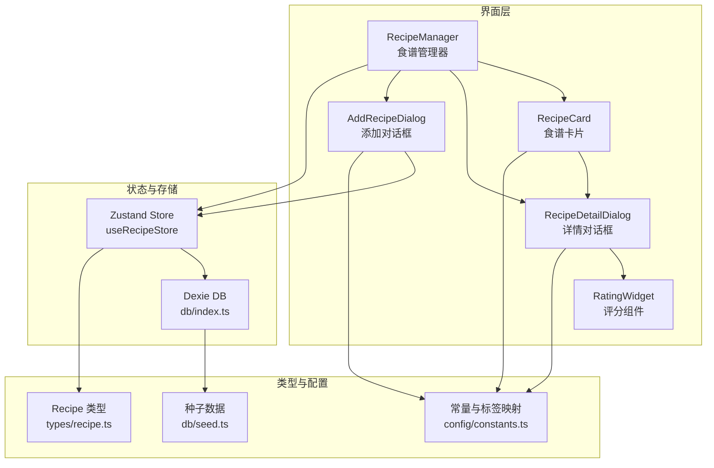
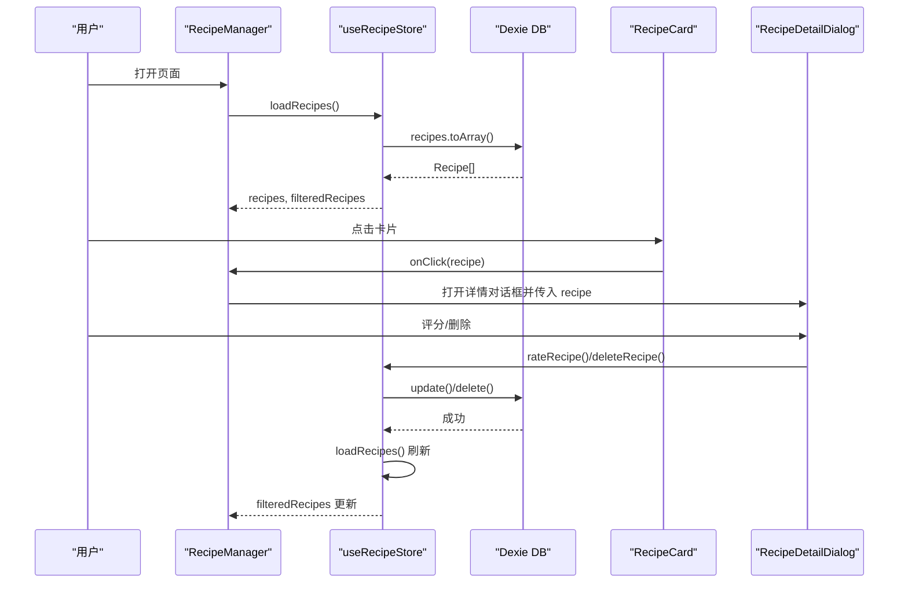
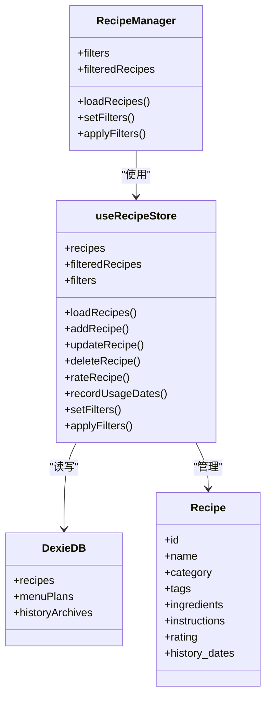

# 食谱组件

<cite>
**本文引用的文件**
- [RecipeManager.tsx](file://src/components/Recipe/RecipeManager.tsx)
- [RecipeCard.tsx](file://src/components/Recipe/RecipeCard.tsx)
- [RecipeDetailDialog.tsx](file://src/components/Recipe/RecipeDetailDialog.tsx)
- [AddRecipeDialog.tsx](file://src/components/Recipe/AddRecipeDialog.tsx)
- [RatingWidget.tsx](file://src/components/Recipe/RatingWidget.tsx)
- [useRecipeStore.ts](file://src/store/useRecipeStore.ts)
- [constants.ts](file://src/config/constants.ts)
- [index.ts](file://src/db/index.ts)
- [seed.ts](file://src/db/seed.ts)
- [recipe.ts](file://src/types/recipe.ts)
- [TagBadge.tsx](file://src/components/Common/TagBadge.tsx)
- [ConfirmDialog.tsx](file://src/components/Common/ConfirmDialog.tsx)
</cite>

## 目录
1. [简介](#简介)
2. [项目结构](#项目结构)
3. [核心组件](#核心组件)
4. [架构总览](#架构总览)
5. [组件详解](#组件详解)
6. [依赖关系分析](#依赖关系分析)
7. [性能考量](#性能考量)
8. [故障排查指南](#故障排查指南)
9. [结论](#结论)

## 简介
本文件面向“食谱组件系统”的使用者与维护者，系统性阐述以下内容：
- RecipeManager 食谱管理器的 CRUD 操作实现、数据持久化策略与搜索过滤功能
- RecipeCard 食谱卡片组件的信息展示格式、点击交互与批量操作支持
- RecipeDetailDialog 食谱详情对话框的内容渲染、图片加载与响应式布局
- AddRecipeDialog 添加食谱对话框的表单验证、字段映射与提交流程
- RatingWidget 评分组件的星级评分逻辑、用户反馈收集与评分统计功能
- 组件间通信机制、状态同步与错误处理策略

## 项目结构
食谱相关组件位于 src/components/Recipe，状态管理位于 src/store/useRecipeStore.ts，数据持久化基于 Dexie/IndexedDB，类型定义位于 src/types/recipe.ts，配置常量位于 src/config/constants.ts，数据库初始化与种子数据位于 src/db/index.ts 与 src/db/seed.ts。

图表来源
- [RecipeManager.tsx:26-109](file://src/components/Recipe/RecipeManager.tsx#L26-L109)
- [RecipeCard.tsx:45-99](file://src/components/Recipe/RecipeCard.tsx#L45-L99)
- [RecipeDetailDialog.tsx:25-158](file://src/components/Recipe/RecipeDetailDialog.tsx#L25-L158)
- [AddRecipeDialog.tsx:32-199](file://src/components/Recipe/AddRecipeDialog.tsx#L32-L199)
- [RatingWidget.tsx:11-62](file://src/components/Recipe/RatingWidget.tsx#L11-L62)
- [useRecipeStore.ts:49-120](file://src/store/useRecipeStore.ts#L49-L120)
- [index.ts:7-22](file://src/db/index.ts#L7-L22)
- [recipe.ts:11-20](file://src/types/recipe.ts#L11-L20)
- [constants.ts:34-43](file://src/config/constants.ts#L34-L43)
- [seed.ts:8-708](file://src/db/seed.ts#L8-L708)

章节来源
- [RecipeManager.tsx:1-110](file://src/components/Recipe/RecipeManager.tsx#L1-L110)
- [useRecipeStore.ts:1-121](file://src/store/useRecipeStore.ts#L1-L121)
- [index.ts:1-68](file://src/db/index.ts#L1-L68)
- [recipe.ts:1-21](file://src/types/recipe.ts#L1-L21)
- [constants.ts:1-44](file://src/config/constants.ts#L1-L44)
- [seed.ts:1-709](file://src/db/seed.ts#L1-L709)

## 核心组件
- RecipeManager：提供筛选栏（分类、关键词）、网格展示、新增与详情弹窗入口，负责加载与刷新数据。
- RecipeCard：展示单个食谱的名称、分类标签、标签徽章、历史与评分状态。
- RecipeDetailDialog：展示食材、做法、历史足迹与评分区域，并提供删除确认。
- AddRecipeDialog：表单输入（名称、分类、食材、做法、标签），提交时进行基础校验与字段映射。
- RatingWidget：星级评分与“拉黑”操作，受历史记录约束。
- useRecipeStore：Zustand 状态管理，封装 CRUD、评分、使用日期记录与过滤应用。
- 数据持久化：Dexie + IndexedDB，带种子数据与版本迁移。

章节来源
- [RecipeManager.tsx:26-109](file://src/components/Recipe/RecipeManager.tsx#L26-L109)
- [RecipeCard.tsx:45-99](file://src/components/Recipe/RecipeCard.tsx#L45-L99)
- [RecipeDetailDialog.tsx:25-158](file://src/components/Recipe/RecipeDetailDialog.tsx#L25-L158)
- [AddRecipeDialog.tsx:32-199](file://src/components/Recipe/AddRecipeDialog.tsx#L32-L199)
- [RatingWidget.tsx:11-62](file://src/components/Recipe/RatingWidget.tsx#L11-L62)
- [useRecipeStore.ts:49-120](file://src/store/useRecipeStore.ts#L49-L120)

## 架构总览
系统采用“组件驱动 + 状态集中 + 本地持久化”的架构：
- 组件层：负责 UI 展示与用户交互
- 状态层：Zustand 管理 recipes、filteredRecipes、filters 与动作
- 存储层：Dexie 定义表结构与索引，提供 CRUD 与事务
- 类型层：Recipe 接口与分类枚举统一数据契约
- 配置层：分类标签映射、标签常量、种子数据版本控制

图表来源
- [RecipeManager.tsx:32-40](file://src/components/Recipe/RecipeManager.tsx#L32-L40)
- [useRecipeStore.ts:58-79](file://src/store/useRecipeStore.ts#L58-L79)
- [index.ts:7-22](file://src/db/index.ts#L7-L22)
- [RecipeDetailDialog.tsx:31-43](file://src/components/Recipe/RecipeDetailDialog.tsx#L31-L43)

## 组件详解

### RecipeManager 食谱管理器
职责与行为
- 初始化加载：组件挂载时调用 store 的 loadRecipes，从 IndexedDB 读取并设置 recipes 与 filteredRecipes
- 筛选栏：分类下拉与文本搜索框，通过 setFilters 动态更新 filters，并即时应用过滤
- 网格展示：遍历 filteredRecipes 渲染 RecipeCard，卡片点击触发详情弹窗
- 新增入口：右上角“录入新菜品”按钮打开 AddRecipeDialog
- 对话框：AddRecipeDialog 与 RecipeDetailDialog 在同一容器内管理 open/onOpenChange 状态

关键实现要点
- 分类选项由 CATEGORY_LABELS 映射生成，支持“全部分类”
- 文本搜索对 name、ingredients、tags 进行拼接后匹配
- 过滤器变更后立即调用 applyFilters 或 setFilters 触发重新计算

章节来源
- [RecipeManager.tsx:26-109](file://src/components/Recipe/RecipeManager.tsx#L26-L109)
- [constants.ts:34-43](file://src/config/constants.ts#L34-L43)
- [useRecipeStore.ts:27-47](file://src/store/useRecipeStore.ts#L27-L47)
- [useRecipeStore.ts:109-119](file://src/store/useRecipeStore.ts#L109-L119)

### RecipeCard 食谱卡片
职责与行为
- 展示：名称、分类徽章、标签徽章集合、评分状态
- 点击交互：onClick 回调用于上层打开详情对话框
- 评分状态显示规则：
  - 无历史记录：提示“未品尝”
  - rating 为 null：提示“点击评分”，可点击
  - rating 为 0：显示“已拉黑”徽章
  - rating 为 1-5：渲染对应数量的实心星

标签徽章
- 支持“适宜老人”“夏季推荐”“凉菜”“辣”等标签，分别渲染不同样式

章节来源
- [RecipeCard.tsx:45-99](file://src/components/Recipe/RecipeCard.tsx#L45-L99)
- [TagBadge.tsx:21-30](file://src/components/Common/TagBadge.tsx#L21-L30)

### RecipeDetailDialog 食谱详情对话框
职责与行为
- 内容渲染：分类徽章、食材列表、做法文本、历史足迹（按日期排序展示）
- 评分区域：嵌套 RatingWidget，仅在有历史记录时允许评分
- 删除操作：通过 ConfirmDialog 弹窗确认，确认后调用 store 的 deleteRecipe 并关闭对话框

交互流程
- 打开：接收 recipe、open、onOpenChange
- 评分：onRate 回调调用 store.rateRecipe
- 删除：onConfirm 调用 store.deleteRecipe 并关闭

章节来源
- [RecipeDetailDialog.tsx:25-158](file://src/components/Recipe/RecipeDetailDialog.tsx#L25-L158)
- [ConfirmDialog.tsx:22-55](file://src/components/Common/ConfirmDialog.tsx#L22-L55)
- [RatingWidget.tsx:11-62](file://src/components/Recipe/RatingWidget.tsx#L11-L62)

### AddRecipeDialog 添加食谱对话框
职责与行为
- 表单字段：名称（必填）、分类、食材（逗号/中文逗号/顿号分隔）、做法、标签复选框
- 提交流程：
  - 基础校验：名称非空
  - 字段映射：标签数组、食材数组（按多种分隔符拆分并去空白）
  - 调用 store.addRecipe，成功后重置表单并关闭对话框
- 禁用条件：名称为空或正在提交时禁用“保存菜品”

章节来源
- [AddRecipeDialog.tsx:32-199](file://src/components/Recipe/AddRecipeDialog.tsx#L32-L199)

### RatingWidget 评分组件
职责与行为
- 可用性：仅当 recipe.history_dates 非空时允许评分
- 显示：渲染 1-5 星，当前评分及以上为实心，其余为空心；若已有评分则显示分数
- 操作：点击 1-5 星设置对应评分；点击“拉黑”切换到 0 分
- 状态同步：通过 onRate 回调通知上层更新

章节来源
- [RatingWidget.tsx:11-62](file://src/components/Recipe/RatingWidget.tsx#L11-L62)

### 数据持久化与搜索过滤

#### 数据模型与索引
- 表结构：recipes 表，主键自增 id，索引 name、category、rating
- 类型契约：Recipe 接口定义字段与可空性
- 种子数据：首次安装或版本升级时导入，版本号通过 localStorage 控制

章节来源
- [index.ts:7-22](file://src/db/index.ts#L7-L22)
- [recipe.ts:11-20](file://src/types/recipe.ts#L11-L20)
- [seed.ts:8-708](file://src/db/seed.ts#L8-L708)

#### 过滤与搜索
- 过滤器：category、searchText、tags
- 过滤算法：
  - 分类精确匹配（“全部分类”跳过）
  - 标签需满足 filters.tags 的每个标签均存在于 recipe.tags
  - 关键词对 name、ingredients、tags 拼接后的字符串进行包含匹配
- 实时应用：setFilters 同步更新 filteredRecipes；applyFilters 重新应用当前 recipes

章节来源
- [useRecipeStore.ts:27-47](file://src/store/useRecipeStore.ts#L27-L47)
- [useRecipeStore.ts:109-119](file://src/store/useRecipeStore.ts#L109-L119)

#### CRUD 与事务
- loadRecipes：从 db.recipes.toArray 获取并设置 recipes 与 filteredRecipes
- addRecipe：插入新食谱后重新加载
- updateRecipe：按 id 更新部分字段后重新加载
- deleteRecipe：按 id 删除后重新加载
- rateRecipe：仅当历史记录存在时允许评分，否则抛错；更新后重新加载
- recordUsageDates：批量记录使用日期，去重后逐条更新，事务保证一致性；更新后重新加载

章节来源
- [useRecipeStore.ts:58-107](file://src/store/useRecipeStore.ts#L58-L107)

## 依赖关系分析

图表来源
- [RecipeManager.tsx:26-109](file://src/components/Recipe/RecipeManager.tsx#L26-L109)
- [useRecipeStore.ts:49-120](file://src/store/useRecipeStore.ts#L49-L120)
- [index.ts:7-22](file://src/db/index.ts#L7-L22)
- [recipe.ts:11-20](file://src/types/recipe.ts#L11-L20)

章节来源
- [RecipeManager.tsx:1-110](file://src/components/Recipe/RecipeManager.tsx#L1-L110)
- [useRecipeStore.ts:1-121](file://src/store/useRecipeStore.ts#L1-L121)
- [index.ts:1-68](file://src/db/index.ts#L1-L68)
- [recipe.ts:1-21](file://src/types/recipe.ts#L1-L21)

## 性能考量
- 过滤性能：过滤函数对每个 recipe 做一次包含匹配，时间复杂度 O(N*(1+M))，其中 N 为 recipe 数量，M 为关键词长度。建议：
  - 保持 searchText 简洁
  - 限制 tags 过滤数量
  - 避免频繁触发 setFilters，可在输入框使用防抖
- 渲染性能：RecipeCard 使用轻量 UI 组件，网格渲染在大数据量时可考虑虚拟滚动
- 数据访问：loadRecipes 一次性读取全量数据，适合中小型数据集；如数据增长显著，可考虑分页或服务端过滤
- 事务优化：recordUsageDates 使用事务逐条更新，避免重复日期写入；可进一步合并请求减少 IO

## 故障排查指南
- 无法评分
  - 现象：评分区显示“需要先品尝才能评分”
  - 原因：recipe.history_dates 为空
  - 处理：先在菜单或历史模块记录使用日期，再回到详情评分
- 删除失败或未生效
  - 现象：删除后仍可见
  - 原因：未触发 loadRecipes 刷新
  - 处理：确认 store.deleteRecipe 后是否调用 loadRecipes；检查 onOpenChange 是否正确关闭对话框
- 搜索无结果
  - 现象：输入关键词后无匹配
  - 原因：关键词未包含在 name/ingredients/tags 拼接串中
  - 处理：确认关键词覆盖了目标字段；检查过滤器是否同时设置了分类或标签
- 表单提交失败
  - 现象：点击保存无反应或报错
  - 原因：名称为空；食材分隔符不规范；网络异常导致 Dexie 写入失败
  - 处理：确保名称非空；使用英文/中文逗号/顿号分隔食材；检查 IndexedDB 是否可用

章节来源
- [RatingWidget.tsx:15-22](file://src/components/Recipe/RatingWidget.tsx#L15-L22)
- [useRecipeStore.ts:81-90](file://src/store/useRecipeStore.ts#L81-L90)
- [AddRecipeDialog.tsx:56-86](file://src/components/Recipe/AddRecipeDialog.tsx#L56-L86)

## 结论
本食谱组件系统以清晰的职责划分与稳定的本地持久化为基础，实现了完整的 CRUD、搜索过滤与评分闭环。通过 Zustand 管理状态、Dexie 提供可靠的数据存取，配合直观的 UI 组件与完善的错误处理，能够满足日常家庭食谱管理需求。后续可针对大数据量场景引入虚拟滚动、分页与服务端过滤，以进一步提升性能与可扩展性。