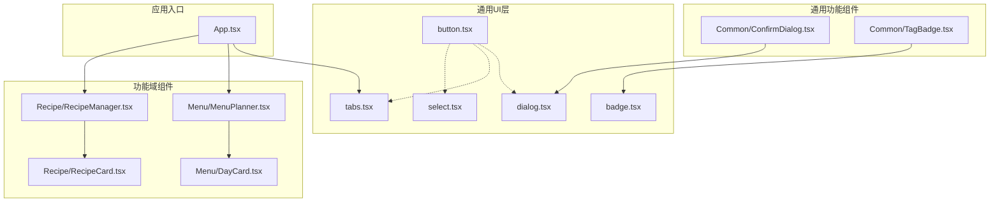
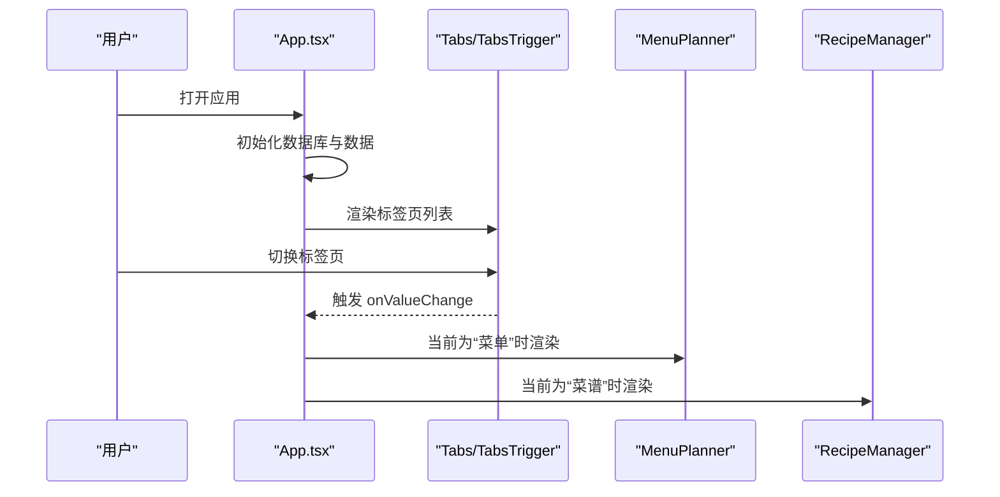
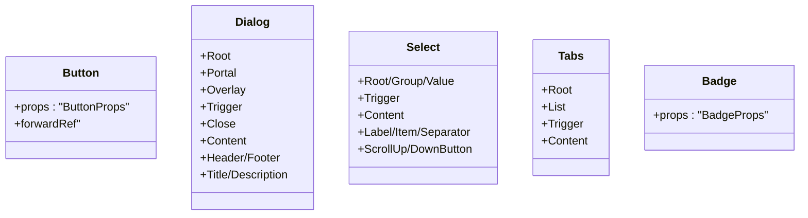
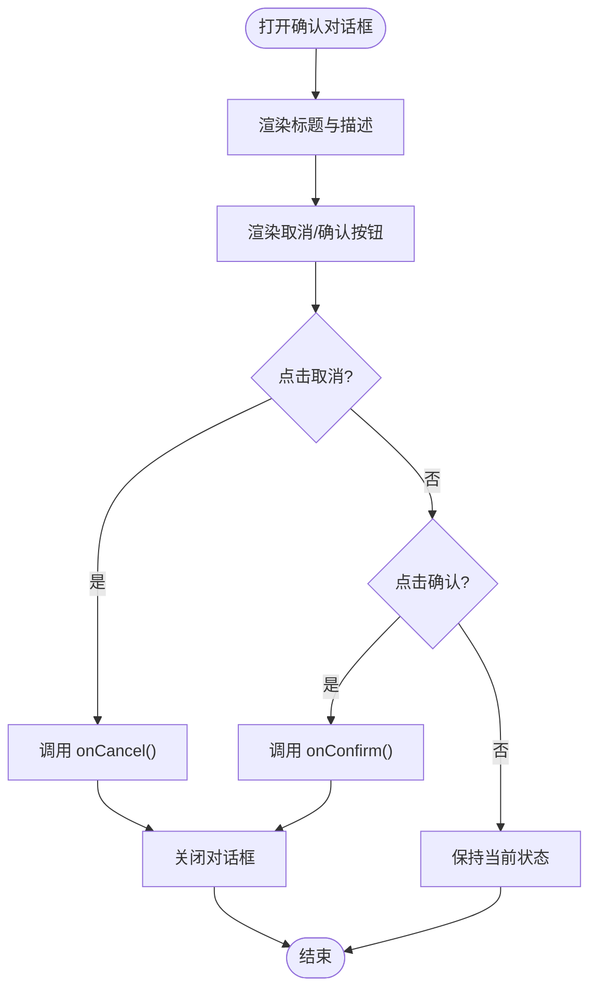
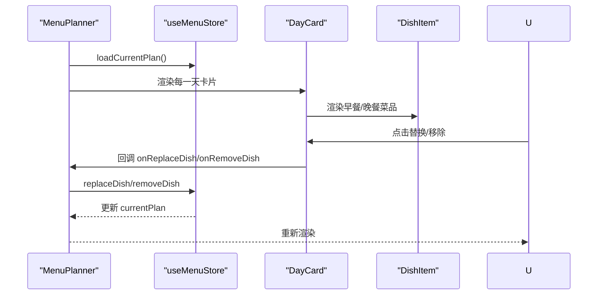
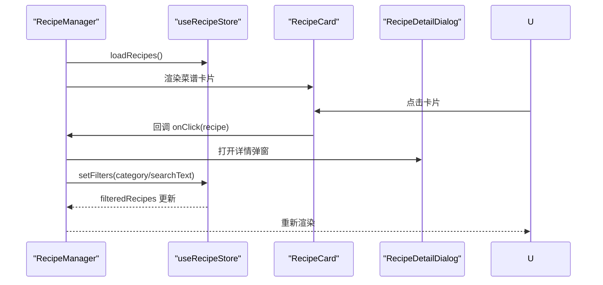
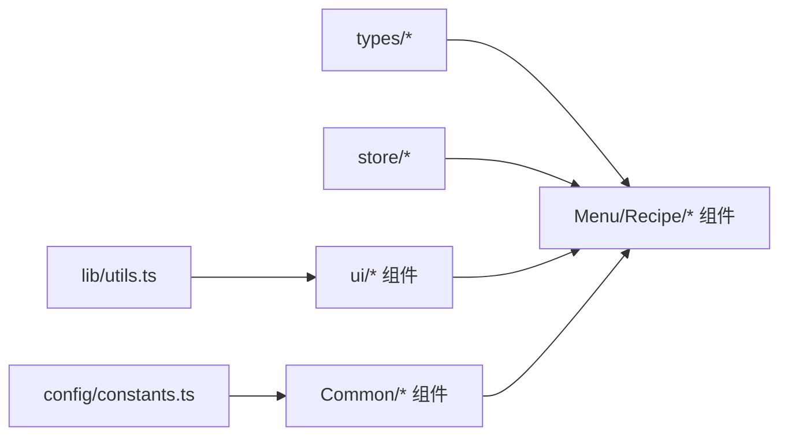

# 组件系统

<cite>
**本文引用的文件**
- [README.md](file://README.md)
- [package.json](file://package.json)
- [src/App.tsx](file://src/App.tsx)
- [src/lib/utils.ts](file://src/lib/utils.ts)
- [src/config/constants.ts](file://src/config/constants.ts)
- [src/types/index.ts](file://src/types/index.ts)
- [src/store/index.ts](file://src/store/index.ts)
- [src/components/ui/button.tsx](file://src/components/ui/button.tsx)
- [src/components/ui/dialog.tsx](file://src/components/ui/dialog.tsx)
- [src/components/ui/select.tsx](file://src/components/ui/select.tsx)
- [src/components/ui/tabs.tsx](file://src/components/ui/tabs.tsx)
- [src/components/ui/badge.tsx](file://src/components/ui/badge.tsx)
- [src/components/Common/ConfirmDialog.tsx](file://src/components/Common/ConfirmDialog.tsx)
- [src/components/Common/TagBadge.tsx](file://src/components/Common/TagBadge.tsx)
- [src/components/Menu/MenuPlanner.tsx](file://src/components/Menu/MenuPlanner.tsx)
- [src/components/Menu/DayCard.tsx](file://src/components/Menu/DayCard.tsx)
- [src/components/Recipe/RecipeManager.tsx](file://src/components/Recipe/RecipeManager.tsx)
- [src/components/Recipe/RecipeCard.tsx](file://src/components/Recipe/RecipeCard.tsx)
</cite>

## 目录
1. [简介](#简介)
2. [项目结构](#项目结构)
3. [核心组件](#核心组件)
4. [架构总览](#架构总览)
5. [详细组件分析](#详细组件分析)
6. [依赖分析](#依赖分析)
7. [性能考虑](#性能考虑)
8. [故障排查指南](#故障排查指南)
9. [结论](#结论)
10. [附录](#附录)

## 简介
本文件系统化梳理 Memu 的组件体系：从通用 UI 原子组件到功能域组件（菜单、菜谱、历史等），阐述组件层次结构、通用组件库的设计理念与实现模式，解释组件间通信机制、props 接口设计与事件处理模式，并提供 UI 原子组件使用指南、自定义组件扩展方法、组件组合最佳实践、样式定制与响应式支持、可访问性实现、性能优化技巧以及测试策略建议。

## 项目结构
项目采用按“功能域 + 通用 UI 原子层”的分层组织方式：
- 顶层应用入口负责页面布局、标签页切换与全局状态初始化
- 通用 UI 层提供可变体（variants）与尺寸（sizes）的原子组件，统一风格与交互
- 功能域组件围绕业务场景构建复合组件，如菜单规划、菜谱管理、历史记录等
- 配置与类型定义集中于 config 与 types 目录，确保跨组件一致性
- 状态管理通过 zustand store 进行模块化拆分，便于复用与维护

图表来源
- [src/App.tsx:11-83](file://src/App.tsx#L11-L83)
- [src/components/ui/button.tsx:1-53](file://src/components/ui/button.tsx#L1-L53)
- [src/components/ui/dialog.tsx:1-96](file://src/components/ui/dialog.tsx#L1-L96)
- [src/components/ui/select.tsx:1-146](file://src/components/ui/select.tsx#L1-L146)
- [src/components/ui/tabs.tsx:1-53](file://src/components/ui/tabs.tsx#L1-L53)
- [src/components/ui/badge.tsx:1-35](file://src/components/ui/badge.tsx#L1-L35)
- [src/components/Common/ConfirmDialog.tsx:1-56](file://src/components/Common/ConfirmDialog.tsx#L1-L56)
- [src/components/Common/TagBadge.tsx:1-31](file://src/components/Common/TagBadge.tsx#L1-L31)
- [src/components/Menu/MenuPlanner.tsx:1-75](file://src/components/Menu/MenuPlanner.tsx#L1-L75)
- [src/components/Menu/DayCard.tsx:1-78](file://src/components/Menu/DayCard.tsx#L1-L78)
- [src/components/Recipe/RecipeManager.tsx:1-110](file://src/components/Recipe/RecipeManager.tsx#L1-L110)
- [src/components/Recipe/RecipeCard.tsx:1-100](file://src/components/Recipe/RecipeCard.tsx#L1-L100)

章节来源
- [src/App.tsx:11-83](file://src/App.tsx#L11-L83)
- [src/store/index.ts:1-6](file://src/store/index.ts#L1-L6)

## 核心组件
- 通用 UI 原子组件：基于 class-variance-authority 提供变体与尺寸，结合 tailwind-merge 实现样式合并，确保一致的视觉与交互体验
- 功能域组件：以业务为中心的复合组件，封装状态、逻辑与 UI，对外暴露清晰的 props 与事件回调
- 通用功能组件：在多个域复用的功能型组件，如确认对话框、标签徽章等

章节来源
- [src/components/ui/button.tsx:1-53](file://src/components/ui/button.tsx#L1-L53)
- [src/components/ui/dialog.tsx:1-96](file://src/components/ui/dialog.tsx#L1-L96)
- [src/components/ui/select.tsx:1-146](file://src/components/ui/select.tsx#L1-L146)
- [src/components/ui/tabs.tsx:1-53](file://src/components/ui/tabs.tsx#L1-L53)
- [src/components/ui/badge.tsx:1-35](file://src/components/ui/badge.tsx#L1-L35)
- [src/components/Common/ConfirmDialog.tsx:1-56](file://src/components/Common/ConfirmDialog.tsx#L1-L56)
- [src/components/Common/TagBadge.tsx:1-31](file://src/components/Common/TagBadge.tsx#L1-L31)

## 架构总览
应用通过标签页容器进行功能域切换，每个功能域由独立组件承载；通用 UI 组件贯穿各域，保证一致的交互与视觉语言；状态管理通过 zustand store 模块化，避免跨域耦合。

图表来源
- [src/App.tsx:48-76](file://src/App.tsx#L48-L76)
- [src/components/ui/tabs.tsx:1-53](file://src/components/ui/tabs.tsx#L1-L53)

章节来源
- [src/App.tsx:11-83](file://src/App.tsx#L11-L83)

## 详细组件分析

### 通用 UI 原子组件
- Button：支持多种变体与尺寸，通过 asChild 支持语义化渲染，结合 cn 合并样式
- Dialog：基于 Radix UI 对话框，提供覆盖层、内容区、标题、描述与底部操作区
- Select：下拉选择器，支持滚动按钮、分组、标签与项
- Tabs：标签页容器，提供列表、触发器与内容区
- Badge：标签徽章，支持多色变体用于分类与状态标识

图表来源
- [src/components/ui/button.tsx:32-50](file://src/components/ui/button.tsx#L32-L50)
- [src/components/ui/dialog.tsx:6-47](file://src/components/ui/dialog.tsx#L6-L47)
- [src/components/ui/select.tsx:6-85](file://src/components/ui/select.tsx#L6-L85)
- [src/components/ui/tabs.tsx:5-50](file://src/components/ui/tabs.tsx#L5-L50)
- [src/components/ui/badge.tsx:26-32](file://src/components/ui/badge.tsx#L26-L32)

章节来源
- [src/components/ui/button.tsx:1-53](file://src/components/ui/button.tsx#L1-L53)
- [src/components/ui/dialog.tsx:1-96](file://src/components/ui/dialog.tsx#L1-L96)
- [src/components/ui/select.tsx:1-146](file://src/components/ui/select.tsx#L1-L146)
- [src/components/ui/tabs.tsx:1-53](file://src/components/ui/tabs.tsx#L1-L53)
- [src/components/ui/badge.tsx:1-35](file://src/components/ui/badge.tsx#L1-L35)

### 通用功能组件
- ConfirmDialog：封装通用确认对话框，支持危险与默认两种变体，通过 onConfirm/onCancel 回调处理结果
- TagBadge：根据分类映射到不同徽章变体，支持自定义显示文本

图表来源
- [src/components/Common/ConfirmDialog.tsx:22-54](file://src/components/Common/ConfirmDialog.tsx#L22-L54)

章节来源
- [src/components/Common/ConfirmDialog.tsx:1-56](file://src/components/Common/ConfirmDialog.tsx#L1-L56)
- [src/components/Common/TagBadge.tsx:1-31](file://src/components/Common/TagBadge.tsx#L1-L31)
- [src/config/constants.ts:34-44](file://src/config/constants.ts#L34-L44)

### 功能域组件

#### 菜单域：MenuPlanner 与 DayCard
- MenuPlanner：加载当前周计划，提供生成菜单与保存归档能力；控制栏包含生成按钮与季节切换
- DayCard：展示某一天的早餐与晚餐构成，支持替换与移除菜品；根据晚餐类型显示“简餐”徽章

图表来源
- [src/components/Menu/MenuPlanner.tsx:8-74](file://src/components/Menu/MenuPlanner.tsx#L8-L74)
- [src/components/Menu/DayCard.tsx:13-77](file://src/components/Menu/DayCard.tsx#L13-L77)

章节来源
- [src/components/Menu/MenuPlanner.tsx:1-75](file://src/components/Menu/MenuPlanner.tsx#L1-L75)
- [src/components/Menu/DayCard.tsx:1-78](file://src/components/Menu/DayCard.tsx#L1-L78)

#### 菜谱域：RecipeManager 与 RecipeCard
- RecipeManager：提供分类筛选与关键词搜索，展示菜谱网格；支持新增与详情弹窗
- RecipeCard：展示菜谱名称、分类徽章、标签与评分状态；根据评分显示星级或提示

图表来源
- [src/components/Recipe/RecipeManager.tsx:26-109](file://src/components/Recipe/RecipeManager.tsx#L26-L109)
- [src/components/Recipe/RecipeCard.tsx:45-99](file://src/components/Recipe/RecipeCard.tsx#L45-L99)

章节来源
- [src/components/Recipe/RecipeManager.tsx:1-110](file://src/components/Recipe/RecipeManager.tsx#L1-L110)
- [src/components/Recipe/RecipeCard.tsx:1-100](file://src/components/Recipe/RecipeCard.tsx#L1-L100)

## 依赖分析
- 组件样式与工具：通过 cn 工具函数合并类名，确保样式冲突最小化
- 变体与尺寸：统一使用 class-variance-authority 定义变体与默认值，降低重复样式代码
- 可访问性：对话框组件包含隐藏文本与键盘焦点环，提升可访问性
- 状态管理：store 模块化导出，避免跨域直接依赖，降低耦合度

图表来源
- [src/lib/utils.ts:1-7](file://src/lib/utils.ts#L1-L7)
- [src/config/constants.ts:1-44](file://src/config/constants.ts#L1-L44)
- [src/types/index.ts:1-4](file://src/types/index.ts#L1-L4)
- [src/store/index.ts:1-6](file://src/store/index.ts#L1-L6)

章节来源
- [src/lib/utils.ts:1-7](file://src/lib/utils.ts#L1-L7)
- [src/config/constants.ts:1-44](file://src/config/constants.ts#L1-L44)
- [src/types/index.ts:1-4](file://src/types/index.ts#L1-L4)
- [src/store/index.ts:1-6](file://src/store/index.ts#L1-L6)

## 性能考虑
- 组件渲染优化
  - 使用 forwardRef 与 asChild 降低不必要 DOM 包裹，减少层级
  - 将样式合并逻辑集中在 cn，避免重复计算
- 数据流优化
  - store 按域拆分，仅在需要时订阅相关状态，减少重渲染
  - 列表渲染时使用稳定 key（如日期或 ID），提升 diff 效率
- 交互与可访问性
  - 对话框与下拉组件内置焦点环与隐藏文本，改善键盘导航与屏幕阅读器体验
- 图标与资源
  - lucide-react 图标按需引入，避免打包冗余

章节来源
- [src/components/ui/button.tsx:38-50](file://src/components/ui/button.tsx#L38-L50)
- [src/components/ui/dialog.tsx:11-47](file://src/components/ui/dialog.tsx#L11-L47)
- [src/components/ui/select.tsx:10-85](file://src/components/ui/select.tsx#L10-L85)
- [src/components/ui/tabs.tsx:7-50](file://src/components/ui/tabs.tsx#L7-L50)

## 故障排查指南
- 对话框无法关闭或点击遮罩无效
  - 确认 onOpenChange 是否正确传递给根组件，且未被内部逻辑覆盖
  - 检查 Portal 渲染目标是否正确
- 下拉选择器选项不显示或滚动异常
  - 确保 SelectTrigger 与 SelectContent 的尺寸与宽度一致
  - 检查 ScrollUp/DownButton 是否正确渲染
- 标签徽章颜色不生效
  - 确认变体名称与定义一致，Tailwind 颜色类是否正确合并
- 菜单替换/移除无效
  - 检查父组件回调是否传入，store 中对应 action 是否存在
  - 确认 props 类型与枚举值匹配（如 breakfast/dinner）

章节来源
- [src/components/ui/dialog.tsx:6-47](file://src/components/ui/dialog.tsx#L6-L47)
- [src/components/ui/select.tsx:6-85](file://src/components/ui/select.tsx#L6-L85)
- [src/components/ui/badge.tsx:5-24](file://src/components/ui/badge.tsx#L5-L24)
- [src/components/Menu/MenuPlanner.tsx:15-21](file://src/components/Menu/MenuPlanner.tsx#L15-L21)

## 结论
Memu 的组件系统以通用 UI 原子组件为基础，通过明确的 props 接口与事件回调模式，将复杂业务拆分为高内聚、低耦合的功能域组件。借助 zustand store 的模块化状态管理与统一的样式工具，系统在可维护性、可扩展性与可访问性方面均具备良好基础。后续可在测试覆盖率、主题系统与无障碍审计方面进一步完善。

## 附录

### Props 接口设计与事件处理模式
- 通用接口
  - Button：支持 variant、size、asChild 等变体与尺寸属性
  - Dialog：提供 Root、Trigger、Portal、Overlay、Content、Header/Footer、Title/Description 等子组件
  - Select：提供 Trigger、Content、Label、Item、Separator、ScrollUp/DownButton 等子组件
  - Tabs：提供 List、Trigger、Content 等子组件
  - Badge：支持 variant 等变体属性
- 业务接口
  - ConfirmDialog：open、title、description、confirmText、cancelText、onConfirm、onCancel、variant
  - TagBadge：category、label
  - MenuPlanner：当前周计划、生成/保存动作、替换/移除回调
  - DayCard：day、dayIndex、onReplaceDish、onRemoveDish
  - RecipeManager：filters、setFilters、open/close 回调、详情 recipe
  - RecipeCard：recipe、onClick

章节来源
- [src/components/ui/button.tsx:32-36](file://src/components/ui/button.tsx#L32-L36)
- [src/components/ui/dialog.tsx:6-95](file://src/components/ui/dialog.tsx#L6-L95)
- [src/components/ui/select.tsx:6-145](file://src/components/ui/select.tsx#L6-L145)
- [src/components/ui/tabs.tsx:5-52](file://src/components/ui/tabs.tsx#L5-L52)
- [src/components/ui/badge.tsx:26-28](file://src/components/ui/badge.tsx#L26-L28)
- [src/components/Common/ConfirmDialog.tsx:11-20](file://src/components/Common/ConfirmDialog.tsx#L11-L20)
- [src/components/Common/TagBadge.tsx:5-8](file://src/components/Common/TagBadge.tsx#L5-L8)
- [src/components/Menu/MenuPlanner.tsx:8-9](file://src/components/Menu/MenuPlanner.tsx#L8-L9)
- [src/components/Menu/DayCard.tsx:6-11](file://src/components/Menu/DayCard.tsx#L6-L11)
- [src/components/Recipe/RecipeManager.tsx:26-30](file://src/components/Recipe/RecipeManager.tsx#L26-L30)
- [src/components/Recipe/RecipeCard.tsx:8-11](file://src/components/Recipe/RecipeCard.tsx#L8-L11)

### 样式定制与响应式支持
- 样式工具
  - 使用 cn 合并类名，确保变体与自定义类叠加正确
- 响应式
  - 通过 Tailwind 断点类实现移动端优先的栅格布局与间距调整
- 可访问性
  - 对话框组件包含隐藏文本与焦点环，提升键盘与读屏体验

章节来源
- [src/lib/utils.ts:4-6](file://src/lib/utils.ts#L4-L6)
- [src/components/ui/dialog.tsx:40-44](file://src/components/ui/dialog.tsx#L40-L44)
- [src/App.tsx:48-76](file://src/App.tsx#L48-L76)

### 测试策略建议
- 单元测试
  - 针对 props 输入与变体渲染输出进行断言
  - 针对事件回调（如 onConfirm/onCancel、onReplaceDish/onRemoveDish）进行行为验证
- 集成测试
  - 在菜单与菜谱域中模拟 store 行为，验证组件渲染与交互链路
- 可访问性测试
  - 使用自动化工具检查焦点顺序、隐藏文本与键盘可达性
- 性能测试
  - 对长列表渲染与频繁状态更新进行基准测试，识别重渲染热点

章节来源
- [src/components/Common/ConfirmDialog.tsx:33-53](file://src/components/Common/ConfirmDialog.tsx#L33-L53)
- [src/components/Menu/MenuPlanner.tsx:15-21](file://src/components/Menu/MenuPlanner.tsx#L15-L21)
- [src/components/Recipe/RecipeManager.tsx:36-39](file://src/components/Recipe/RecipeManager.tsx#L36-L39)