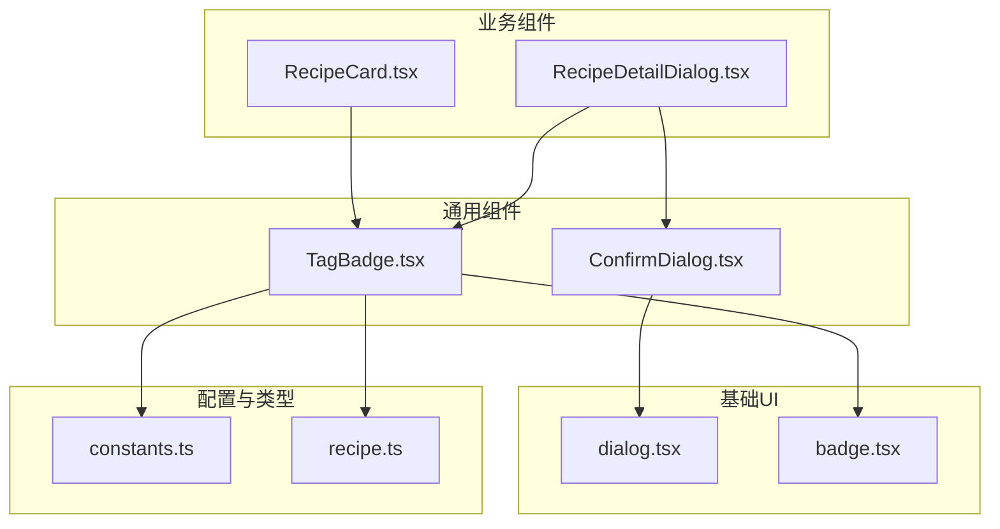
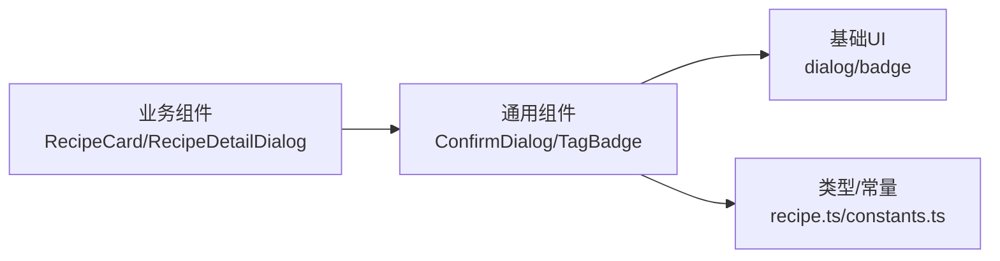
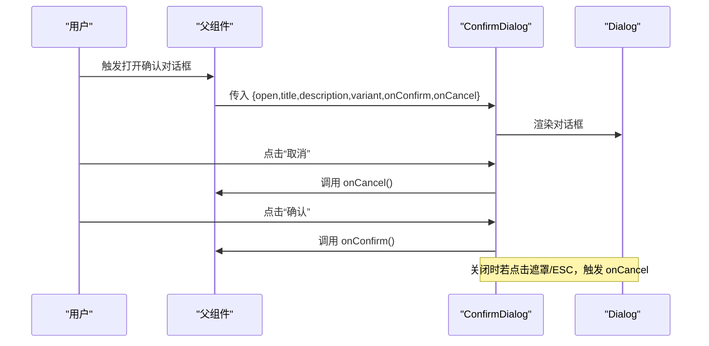
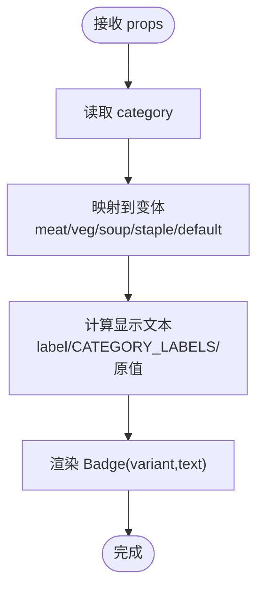
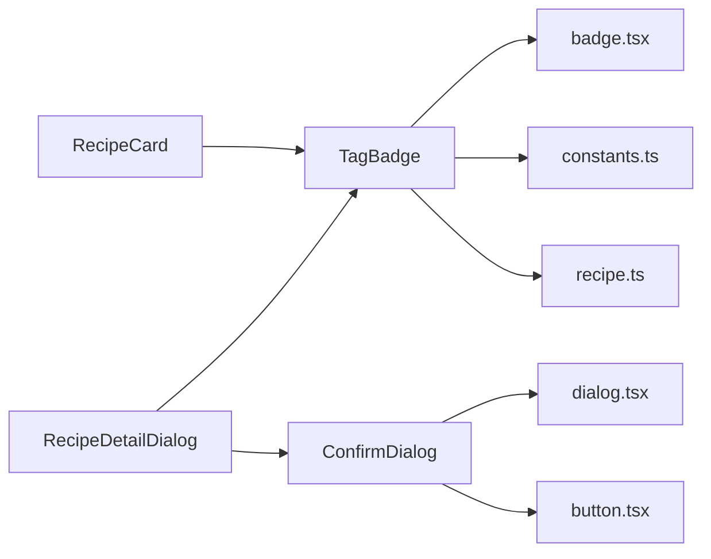

# 通用组件

<cite>
**本文引用的文件**
- [ConfirmDialog.tsx](file://src/components/Common/ConfirmDialog.tsx)
- [TagBadge.tsx](file://src/components/Common/TagBadge.tsx)
- [dialog.tsx](file://src/components/ui/dialog.tsx)
- [badge.tsx](file://src/components/ui/badge.tsx)
- [constants.ts](file://src/config/constants.ts)
- [recipe.ts](file://src/types/recipe.ts)
- [RecipeCard.tsx](file://src/components/Recipe/RecipeCard.tsx)
- [RecipeDetailDialog.tsx](file://src/components/Recipe/RecipeDetailDialog.tsx)
</cite>

## 目录
1. [简介](#简介)
2. [项目结构](#项目结构)
3. [核心组件](#核心组件)
4. [架构总览](#架构总览)
5. [详细组件分析](#详细组件分析)
6. [依赖关系分析](#依赖关系分析)
7. [性能与可维护性考量](#性能与可维护性考量)
8. [故障排查指南](#故障排查指南)
9. [结论](#结论)
10. [附录：使用示例与最佳实践](#附录使用示例与最佳实践)

## 简介
本文件聚焦于通用组件模块中的两个关键组件：ConfirmDialog（确认对话框）与 TagBadge（标签徽章）。前者用于统一处理用户确认/取消流程，后者用于展示菜品分类标签并支持语义化样式。文档从设计模式、接口定义、事件回调、状态管理、样式定制、复用策略与最佳实践等维度进行系统阐述，并通过真实项目中的使用场景加深理解。

## 项目结构
通用组件位于 src/components/Common 下，分别封装了 ConfirmDialog 与 TagBadge；它们依赖 src/components/ui 提供的基础 UI 组件（如 dialog、badge），并通过 src/config/constants.ts 与 src/types/recipe.ts 的类型/常量实现解耦。

图表来源
- [ConfirmDialog.tsx:1-56](file://src/components/Common/ConfirmDialog.tsx#L1-L56)
- [TagBadge.tsx:1-31](file://src/components/Common/TagBadge.tsx#L1-L31)
- [dialog.tsx:1-96](file://src/components/ui/dialog.tsx#L1-L96)
- [badge.tsx:1-35](file://src/components/ui/badge.tsx#L1-L35)
- [constants.ts:1-44](file://src/config/constants.ts#L1-L44)
- [recipe.ts:1-21](file://src/types/recipe.ts#L1-L21)
- [RecipeCard.tsx:70-75](file://src/components/Recipe/RecipeCard.tsx#L70-L75)
- [RecipeDetailDialog.tsx:65-75](file://src/components/Recipe/RecipeDetailDialog.tsx#L65-L75)

章节来源
- [ConfirmDialog.tsx:1-56](file://src/components/Common/ConfirmDialog.tsx#L1-L56)
- [TagBadge.tsx:1-31](file://src/components/Common/TagBadge.tsx#L1-L31)
- [dialog.tsx:1-96](file://src/components/ui/dialog.tsx#L1-L96)
- [badge.tsx:1-35](file://src/components/ui/badge.tsx#L1-L35)
- [constants.ts:1-44](file://src/config/constants.ts#L1-L44)
- [recipe.ts:1-21](file://src/types/recipe.ts#L1-L21)
- [RecipeCard.tsx:70-75](file://src/components/Recipe/RecipeCard.tsx#L70-L75)
- [RecipeDetailDialog.tsx:65-75](file://src/components/Recipe/RecipeDetailDialog.tsx#L65-L75)

## 核心组件
- ConfirmDialog：基于 Radix UI 对话框封装，提供标题、描述、确认/取消文案、危险样式变体以及回调事件，适合统一处理删除、提交等高风险操作。
- TagBadge：基于 Badge 封装，根据菜品分类映射到语义化样式变体，并支持自定义显示文本，用于卡片与详情页中直观展示分类信息。

章节来源
- [ConfirmDialog.tsx:11-20](file://src/components/Common/ConfirmDialog.tsx#L11-L20)
- [TagBadge.tsx:5-8](file://src/components/Common/TagBadge.tsx#L5-L8)

## 架构总览
ConfirmDialog 与 TagBadge 均采用“组合优于继承”的设计，通过 props 注入行为与数据，避免硬编码逻辑，便于在多处业务场景复用。二者均依赖基础 UI 组件，形成“通用组件层 → 基础UI层 → 类型/配置层”的清晰分层。

图表来源
- [RecipeCard.tsx:70-75](file://src/components/Recipe/RecipeCard.tsx#L70-L75)
- [RecipeDetailDialog.tsx:65-75](file://src/components/Recipe/RecipeDetailDialog.tsx#L65-L75)
- [ConfirmDialog.tsx:1-9](file://src/components/Common/ConfirmDialog.tsx#L1-L9)
- [TagBadge.tsx:1-3](file://src/components/Common/TagBadge.tsx#L1-L3)
- [dialog.tsx:1-96](file://src/components/ui/dialog.tsx#L1-L96)
- [badge.tsx:1-35](file://src/components/ui/badge.tsx#L1-L35)
- [recipe.ts:1-21](file://src/types/recipe.ts#L1-L21)
- [constants.ts:34-43](file://src/config/constants.ts#L34-L43)

## 详细组件分析

### ConfirmDialog 对话框组件
- 设计模式
  - 组合式封装：通过 props 注入 open、title、description、confirmText、cancelText、variant 与回调 onConfirm/onCancel，实现“行为注入”。
  - 受控组件：由父组件控制 open 状态，内部仅响应 onOpenChange 关闭时触发 onCancel，保证状态一致性。
  - 变体控制：variant 支持 default/danger，danger 映射为 destructive 样式，统一危险操作视觉反馈。
- Props 接口
  - open: boolean（受控开关）
  - title: string（标题）
  - description: string（描述）
  - confirmText?: string（默认“确认”）
  - cancelText?: string（默认“取消”）
  - variant?: 'danger' | 'default'
  - onConfirm: () => void（确认回调）
  - onCancel: () => void（取消回调）
- 事件与状态
  - onOpenChange: 当用户点击遮罩或按 ESC 关闭时，内部调用 onCancel，确保外部状态同步。
  - 确认按钮：点击后调用 onConfirm。
  - 取消按钮：点击后调用 onCancel。
- 使用场景
  - 删除确认：在 RecipeDetailDialog 中用于删除菜品。
  - 提交确认：可扩展用于保存草稿、批量操作等。
- 最佳实践
  - 保持 open 由父组件严格控制，避免子组件自行切换。
  - 危险操作统一使用 danger 变体，提升视觉警示。
  - 描述文案应明确后果，避免歧义。
  - 在 onConfirm 中执行副作用前，先进行前端校验，失败时阻止关闭。

图表来源
- [ConfirmDialog.tsx:33-33](file://src/components/Common/ConfirmDialog.tsx#L33-L33)
- [ConfirmDialog.tsx:42-44](file://src/components/Common/ConfirmDialog.tsx#L42-L44)
- [ConfirmDialog.tsx:45-50](file://src/components/Common/ConfirmDialog.tsx#L45-L50)
- [dialog.tsx:11-23](file://src/components/ui/dialog.tsx#L11-L23)

章节来源
- [ConfirmDialog.tsx:11-20](file://src/components/Common/ConfirmDialog.tsx#L11-L20)
- [ConfirmDialog.tsx:22-31](file://src/components/Common/ConfirmDialog.tsx#L22-L31)
- [ConfirmDialog.tsx:32-54](file://src/components/Common/ConfirmDialog.tsx#L32-L54)
- [dialog.tsx:11-23](file://src/components/ui/dialog.tsx#L11-L23)

### TagBadge 标签徽章组件
- 功能特性
  - 分类映射：根据 RecipeCategory 映射到语义化变体（meat/veg/soup/staple/default）。
  - 文案优先级：优先使用传入 label，其次使用 CATEGORY_LABELS 中的中文映射，最后回退到原始分类值。
  - 语义化样式：不同分类对应不同颜色，便于快速识别。
- Props 接口
  - category: RecipeCategory（必填）
  - label?: string（可选，覆盖默认文案）
- 样式定制
  - 基于 Badge 的变体系统，支持 default/secondary/destructive/outline/meat/veg/soup/staple。
  - 默认字体大小为 text-xs，适配卡片与列表紧凑布局。
- 交互行为
  - 作为纯展示组件，不直接绑定交互事件；可在父组件中为其包裹点击/跳转等交互。
- 使用场景
  - RecipeCard：在卡片右上角展示菜品分类。
  - RecipeDetailDialog：在详情页顶部展示分类与动态标签。
- 最佳实践
  - 保持分类枚举与 CATEGORY_LABELS 同步，避免文案缺失。
  - 对于非常见分类，建议提供 label 以改善可读性。
  - 与业务标签（如“适宜老人”、“辣”）搭配使用时，注意区分语义层级。

图表来源
- [TagBadge.tsx:10-19](file://src/components/Common/TagBadge.tsx#L10-L19)
- [TagBadge.tsx:21-29](file://src/components/Common/TagBadge.tsx#L21-L29)
- [constants.ts:34-43](file://src/config/constants.ts#L34-L43)
- [recipe.ts:1-9](file://src/types/recipe.ts#L1-L9)

章节来源
- [TagBadge.tsx:5-8](file://src/components/Common/TagBadge.tsx#L5-L8)
- [TagBadge.tsx:10-19](file://src/components/Common/TagBadge.tsx#L10-L19)
- [TagBadge.tsx:21-29](file://src/components/Common/TagBadge.tsx#L21-L29)
- [constants.ts:34-43](file://src/config/constants.ts#L34-L43)
- [recipe.ts:1-9](file://src/types/recipe.ts#L1-L9)

## 依赖关系分析
- ConfirmDialog 依赖
  - dialog.tsx：使用 Dialog/DialogContent/DialogHeader/DialogFooter/DialogTitle/DialogDescription。
  - button.tsx：使用 Button 组件承载确认/取消动作。
- TagBadge 依赖
  - badge.tsx：使用 Badge 组件承载展示。
  - constants.ts：使用 CATEGORY_LABELS 进行中文映射。
  - recipe.ts：使用 RecipeCategory 类型约束输入。
- 复用点
  - RecipeCard 与 RecipeDetailDialog 均引入 TagBadge，体现跨页面复用。
  - RecipeDetailDialog 引入 ConfirmDialog，用于删除确认，体现通用组件在业务流程中的串联。

图表来源
- [ConfirmDialog.tsx:1-9](file://src/components/Common/ConfirmDialog.tsx#L1-L9)
- [TagBadge.tsx:1-3](file://src/components/Common/TagBadge.tsx#L1-L3)
- [dialog.tsx:1-96](file://src/components/ui/dialog.tsx#L1-L96)
- [badge.tsx:1-35](file://src/components/ui/badge.tsx#L1-L35)
- [constants.ts:34-43](file://src/config/constants.ts#L34-L43)
- [recipe.ts:1-21](file://src/types/recipe.ts#L1-L21)
- [RecipeCard.tsx:70-75](file://src/components/Recipe/RecipeCard.tsx#L70-L75)
- [RecipeDetailDialog.tsx:65-75](file://src/components/Recipe/RecipeDetailDialog.tsx#L65-L75)

章节来源
- [ConfirmDialog.tsx:1-9](file://src/components/Common/ConfirmDialog.tsx#L1-L9)
- [TagBadge.tsx:1-3](file://src/components/Common/TagBadge.tsx#L1-L3)
- [RecipeCard.tsx:70-75](file://src/components/Recipe/RecipeCard.tsx#L70-L75)
- [RecipeDetailDialog.tsx:65-75](file://src/components/Recipe/RecipeDetailDialog.tsx#L65-L75)

## 性能与可维护性考量
- 性能
  - ConfirmDialog 为轻量展示组件，渲染开销极低；建议在需要时再挂载，减少不必要的 DOM。
  - TagBadge 为纯函数组件，无副作用，渲染成本低；建议在大量列表中复用，避免重复计算。
- 可维护性
  - Props 接口清晰，职责单一，便于测试与替换。
  - 通过变体系统与常量映射，降低硬编码风险，提升一致性。
  - 与业务标签并存时，建议在父组件统一管理标签集合，避免重复渲染。

## 故障排查指南
- ConfirmDialog 无法关闭
  - 检查父组件是否正确传递 open 并在 onCancel 中更新状态。
  - 确认 onOpenChange 是否被意外覆盖导致关闭逻辑失效。
- TagBadge 文案为空或显示异常
  - 检查传入的 category 是否在枚举范围内，以及 CATEGORY_LABELS 是否包含该键。
  - 若需自定义文案，请提供 label。
- 样式不符合预期
  - 确认使用的变体是否在 Badge 的变体系统中存在。
  - 检查父容器的样式是否覆盖了 Badge 的默认类名。

章节来源
- [ConfirmDialog.tsx:33-33](file://src/components/Common/ConfirmDialog.tsx#L33-L33)
- [TagBadge.tsx:21-29](file://src/components/Common/TagBadge.tsx#L21-L29)
- [constants.ts:34-43](file://src/config/constants.ts#L34-L43)

## 结论
ConfirmDialog 与 TagBadge 通过简洁的 props 接口与稳定的变体系统，实现了高复用与强一致性的通用能力。前者统一了确认流程，后者统一了分类展示，二者共同提升了业务组件的一致性与开发效率。建议在新功能中优先复用这两个组件，并遵循本文的最佳实践与扩展建议。

## 附录：使用示例与最佳实践

- ConfirmDialog 使用要点
  - 打开/关闭：由父组件控制 open；关闭时调用 onCancel。
  - 危险操作：使用 variant="danger" 提升警示。
  - 回调顺序：onConfirm 应在副作用完成后才关闭对话框。
  - 示例参考路径：
    - [RecipeDetailDialog.tsx:147-155](file://src/components/Recipe/RecipeDetailDialog.tsx#L147-L155)

- TagBadge 使用要点
  - 文案优先级：label > CATEGORY_LABELS > 原值。
  - 变体映射：确保分类在映射表中，否则回退到 default。
  - 与业务标签搭配：在卡片/详情页中同时展示分类与业务标签，注意间距与对齐。
  - 示例参考路径：
    - [RecipeCard.tsx:70-75](file://src/components/Recipe/RecipeCard.tsx#L70-L75)
    - [RecipeDetailDialog.tsx:70-71](file://src/components/Recipe/RecipeDetailDialog.tsx#L70-L71)

- 扩展建议
  - ConfirmDialog：可增加 loading 状态、二次确认、快捷键支持。
  - TagBadge：可增加点击回调、禁用态、图标前缀等增强交互。
  - 通用原则：保持 props 稳定、避免在组件内做复杂状态管理、通过变体与常量统一风格。