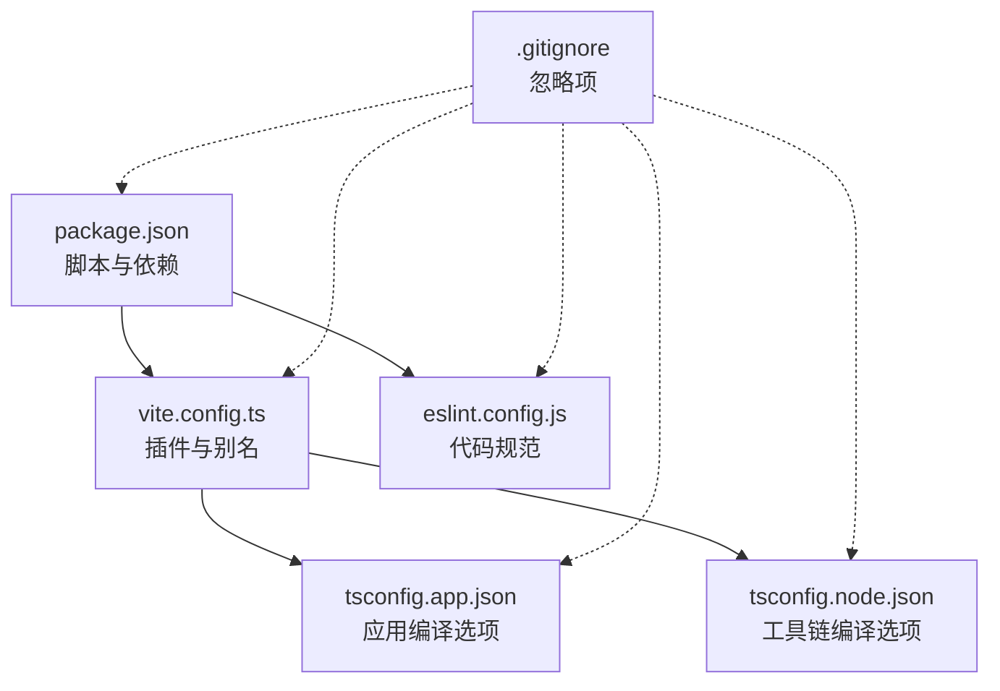
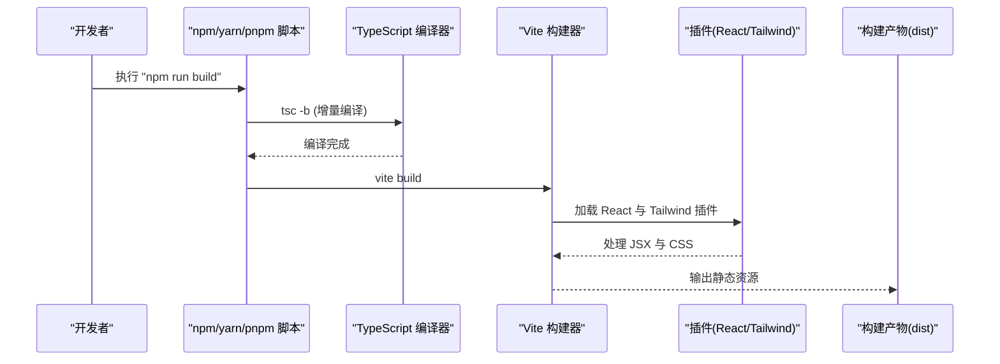
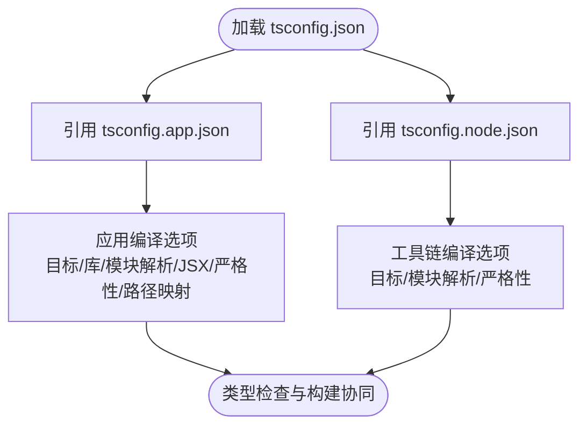
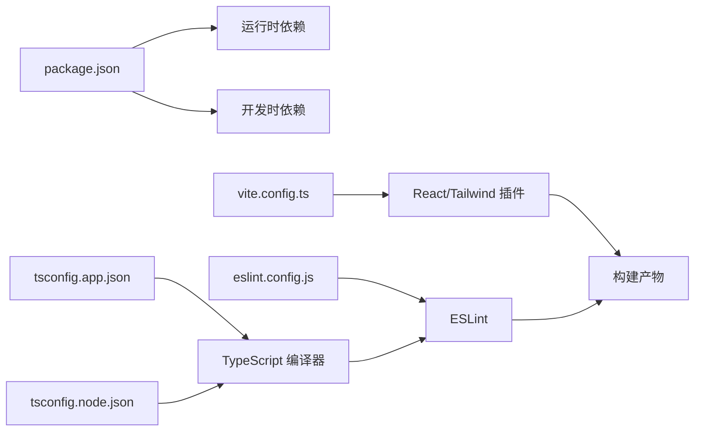

# 配置与部署

<cite>
**本文引用的文件**
- [vite.config.ts](file://vite.config.ts)
- [package.json](file://package.json)
- [eslint.config.js](file://eslint.config.js)
- [tsconfig.json](file://tsconfig.json)
- [tsconfig.app.json](file://tsconfig.app.json)
- [tsconfig.node.json](file://tsconfig.node.json)
- [README.md](file://README.md)
- [.gitignore](file://.gitignore)
</cite>

## 目录
1. [简介](#简介)
2. [项目结构](#项目结构)
3. [核心组件](#核心组件)
4. [架构总览](#架构总览)
5. [详细组件分析](#详细组件分析)
6. [依赖分析](#依赖分析)
7. [性能考虑](#性能考虑)
8. [故障排除指南](#故障排除指南)
9. [结论](#结论)
10. [附录](#附录)

## 简介
本指南面向运维人员与高级开发者，围绕 Memu 项目的配置与部署展开，重点覆盖以下方面：
- Vite 构建配置：插件、别名解析与构建行为
- TypeScript 编译配置：应用与 Node 工具链双配置、严格性与 Bundler 模式
- ESLint 代码规范配置：推荐规则与可选增强方案
- 环境变量与脚本：开发、构建、预览与代码检查流程
- 开发与生产优化：构建产物分析与性能建议
- 部署策略：静态站点部署要点（结合现有配置）
- Docker 容器化与 CI/CD：通用实践与注意事项
- 安全与监控：安全基线与告警建议
- 故障排除：常见问题定位与修复路径

## 项目结构
Memu 是基于 React + TypeScript + Vite 的前端项目，采用多配置分层设计（应用与工具链分离），并使用 TailwindCSS 进行样式处理。关键配置文件如下：
- 构建与打包：vite.config.ts、package.json 脚本
- 类型系统：tsconfig.json、tsconfig.app.json、tsconfig.node.json
- 代码规范：eslint.config.js
- 其他：README.md、.gitignore

图示来源
- [package.json:1-46](file://package.json#L1-L46)
- [vite.config.ts:1-14](file://vite.config.ts#L1-L14)
- [tsconfig.json:1-8](file://tsconfig.json#L1-L8)
- [tsconfig.app.json:1-29](file://tsconfig.app.json#L1-L29)
- [tsconfig.node.json:1-25](file://tsconfig.node.json#L1-L25)
- [eslint.config.js:1-23](file://eslint.config.js#L1-L23)
- [.gitignore](file://.gitignore)

章节来源
- [package.json:1-46](file://package.json#L1-L46)
- [vite.config.ts:1-14](file://vite.config.ts#L1-L14)
- [tsconfig.json:1-8](file://tsconfig.json#L1-L8)
- [tsconfig.app.json:1-29](file://tsconfig.app.json#L1-L29)
- [tsconfig.node.json:1-25](file://tsconfig.node.json#L1-L25)
- [eslint.config.js:1-23](file://eslint.config.js#L1-L23)
- [.gitignore](file://.gitignore)

## 核心组件
- Vite 构建配置
  - 插件：React 与 TailwindCSS 插件启用，支持热更新与原子化 CSS
  - 别名：@ 指向 src，便于统一导入路径
  - 参考路径：[vite.config.ts:6-13](file://vite.config.ts#L6-L13)
- TypeScript 编译配置
  - 应用配置：目标 ES2023、模块解析为 bundler、JSX 使用 react-jsx、严格未使用检测
  - 工具链配置：目标 ES2023、仅用于 Vite/TS 工具链
  - 参考路径：[tsconfig.app.json:2-29](file://tsconfig.app.json#L2-L29)、[tsconfig.node.json:2-25](file://tsconfig.node.json#L2-L25)
- ESLint 规范配置
  - 推荐规则：基础 JS、TypeScript、React Hooks、React Refresh
  - 语言选项：浏览器全局
  - 参考路径：[eslint.config.js:8-22](file://eslint.config.js#L8-L22)
- 包管理与脚本
  - 开发：vite
  - 构建：先执行 tsc -b，再执行 vite build
  - 预览：vite preview
  - 代码检查：eslint .
  - 参考路径：[package.json:6-11](file://package.json#L6-L11)

章节来源
- [vite.config.ts:1-14](file://vite.config.ts#L1-L14)
- [tsconfig.app.json:1-29](file://tsconfig.app.json#L1-L29)
- [tsconfig.node.json:1-25](file://tsconfig.node.json#L1-L25)
- [eslint.config.js:1-23](file://eslint.config.js#L1-L23)
- [package.json:1-46](file://package.json#L1-L46)

## 架构总览
下图展示从开发到构建的关键流程与配置交互。

图示来源
- [package.json:8](file://package.json#L8)
- [vite.config.ts:7](file://vite.config.ts#L7)
- [tsconfig.app.json:18](file://tsconfig.app.json#L18)

章节来源
- [package.json:6-11](file://package.json#L6-L11)
- [vite.config.ts:6-13](file://vite.config.ts#L6-L13)
- [tsconfig.app.json:13-29](file://tsconfig.app.json#L13-L29)

## 详细组件分析

### Vite 构建配置分析
- 插件体系
  - @vitejs/plugin-react：启用 React HMR 与 JSX 转换
  - @tailwindcss/vite：集成 Tailwind 原子化 CSS
- 路径别名
  - @ 指向 src，简化导入路径，提升可维护性
- 生产优化建议
  - 结合现有插件与 bundler 模式，可进一步引入压缩、资源拆分与缓存策略（见“性能考虑”）

章节来源
- [vite.config.ts:6-13](file://vite.config.ts#L6-L13)

### TypeScript 编译配置分析
- 应用配置（tsconfig.app.json）
  - 目标与库：ES2023 + DOM
  - 模块解析：bundler，支持现代打包器特性
  - JSX：react-jsx
  - 严格性：开启未使用局部变量/参数、switch 无 fallthrough 检查
  - 路径映射：@/* -> ./src/*
- 工具链配置（tsconfig.node.json）
  - 仅用于 Vite/TS 工具链，目标 ES2023
  - 严格性与模块解析同上
- 双配置协同
  - tsconfig.json 通过 references 引入 app 与 node 配置，实现分层管理

图示来源
- [tsconfig.json:3-6](file://tsconfig.json#L3-L6)
- [tsconfig.app.json:2-29](file://tsconfig.app.json#L2-L29)
- [tsconfig.node.json:2-25](file://tsconfig.node.json#L2-L25)

章节来源
- [tsconfig.json:1-8](file://tsconfig.json#L1-L8)
- [tsconfig.app.json:1-29](file://tsconfig.app.json#L1-L29)
- [tsconfig.node.json:1-25](file://tsconfig.node.json#L1-L25)

### ESLint 代码规范配置分析
- 继承规则集
  - 基础 JS 推荐、TypeScript 推荐、React Hooks 推荐、React Refresh（Vite 场景）
- 语言选项
  - 浏览器全局可用
- 可选增强
  - README 提供了类型感知规则与 React 特定规则的启用方式，可根据团队需求选择更严格的规则集

章节来源
- [eslint.config.js:8-22](file://eslint.config.js#L8-L22)
- [README.md:14-73](file://README.md#L14-L73)

### 包管理与脚本
- 开发：vite 启动本地服务
- 构建：先 tsc -b 增量编译，再 vite build 产出静态资源
- 预览：vite preview 本地预览构建结果
- 代码检查：eslint .

章节来源
- [package.json:6-11](file://package.json#L6-L11)

## 依赖分析
- 运行时依赖
  - React 19、Radix UI 组件库、Tailwind Merge、Zustand 状态管理、Dexie IndexedDB 封装等
- 开发时依赖
  - Vite、React 插件、TailwindCSS、TypeScript、ESLint 及相关插件
- 关键耦合点
  - Vite 与 React/Tailwind 插件紧密耦合
  - TypeScript 通过 references 协同 app 与 node 配置
  - ESLint 与 TypeScript 配置共同保障类型安全与风格一致性

图示来源
- [package.json:12-44](file://package.json#L12-L44)
- [vite.config.ts:7](file://vite.config.ts#L7)
- [tsconfig.app.json:2-29](file://tsconfig.app.json#L2-L29)
- [tsconfig.node.json:2-25](file://tsconfig.node.json#L2-L25)
- [eslint.config.js:8-22](file://eslint.config.js#L8-L22)

章节来源
- [package.json:12-44](file://package.json#L12-L44)
- [vite.config.ts:7](file://vite.config.ts#L7)
- [tsconfig.app.json:2-29](file://tsconfig.app.json#L2-L29)
- [tsconfig.node.json:2-25](file://tsconfig.node.json#L2-L25)
- [eslint.config.js:8-22](file://eslint.config.js#L8-L22)

## 性能考虑
- 构建阶段
  - 使用 tsc -b 进行增量编译，缩短二次构建时间
  - 在生产构建中启用资源压缩与按需打包，减少首屏体积
- 运行时
  - 合理拆分第三方包与业务代码，利用浏览器缓存
  - Tailwind 原子类应配合 purge/摇树策略，避免冗余 CSS
- 开发体验
  - 保持 React 插件与 HMR 开启，提升迭代效率
  - 严格 TypeScript 与 ESLint 规则，降低运行时错误

## 故障排除指南
- 构建失败或类型错误
  - 确认 tsconfig.app.json 与 tsconfig.node.json 的引用关系正确
  - 清理构建缓存后重试（如删除 dist 与临时 tsbuildinfo）
- 路径别名无效
  - 检查 vite.config.ts 中 @ 到 src 的别名是否生效
  - 确保 IDE 与编辑器的 TypeScript 设置与项目一致
- ESLint 报错
  - 若需要类型感知规则，参考 README 中的增强配置进行切换
  - 确保项目根目录存在正确的 tsconfig 引用
- 依赖冲突
  - 检查 .gitignore 是否包含 node_modules 与 dist
  - 使用包管理器清理锁文件并重新安装

章节来源
- [tsconfig.json:3-6](file://tsconfig.json#L3-L6)
- [vite.config.ts:9-12](file://vite.config.ts#L9-L12)
- [eslint.config.js:8-22](file://eslint.config.js#L8-L22)
- [.gitignore](file://.gitignore)

## 结论
Memu 的配置体系以 Vite 为核心，结合 TypeScript 与 ESLint 形成高效、可维护的前端工程化基础。通过合理的别名、严格编译选项与推荐规则，可在开发与生产环境中获得稳定体验。建议在生产部署前完善构建产物分析与缓存策略，并根据团队需求启用更严格的 ESLint 规则集。

## 附录
- 静态站点部署要点
  - 将 dist 目录作为静态站点根目录部署
  - 确保服务器正确处理 SPA 路由回退（history 模式）
- Docker 容器化与 CI/CD（通用实践）
  - 使用多阶段构建镜像，最小化运行时体积
  - 在 CI 中分别执行类型检查、代码检查与构建测试
  - 配置容器健康检查与日志采集
- 安全与监控
  - 启用 HTTPS 与安全响应头
  - 对外暴露端口与环境变量进行最小化授权
  - 集成指标与日志监控，设置告警阈值